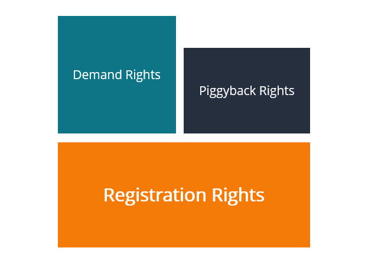

## Table of Contents

## What are piggyback registration rights?

Piggyback registration rights are a type of agreement that lets certain shareholders tag along when a company decides to go public or sell its shares to the public. These rights are usually given to investors who helped the company grow, like early investors or key employees. When the company plans a big sale of its shares, these shareholders can join in and sell their own shares at the same time.

This can be helpful for these shareholders because it gives them a chance to sell their shares more easily. They don't have to wait for another opportunity to sell, and they can benefit from the same good conditions that the company is getting. However, there's a catch: the company might limit how many shares these shareholders can sell, to make sure the main sale goes smoothly. So, while piggyback registration rights are useful, they come with some rules that shareholders need to follow.

## How do piggyback registration rights differ from demand registration rights?

Piggyback registration rights and demand registration rights are two different ways shareholders can sell their shares when a company goes public or sells shares to the public. With piggyback registration rights, shareholders can join in and sell their shares whenever the company decides to do a big sale of its shares. These rights are usually given to early investors or key employees as a way to let them benefit from the company's growth. However, the company can limit how many shares these shareholders can sell, to make sure their main sale goes smoothly.

On the other hand, demand registration rights give shareholders more control. With these rights, shareholders can actually ask the company to go public or sell shares to the public at a time that works best for them. This means they don't have to wait for the company to decide to do a big sale; they can make it happen themselves. These rights are often given to major investors who have a lot of power in the company. So, while piggyback rights let shareholders tag along, demand rights let them take the lead.

## Who typically benefits from piggyback registration rights?

Early investors and key employees usually benefit from piggyback registration rights. These rights let them sell their shares when the company decides to go public or do a big sale of its shares. This can be a big help for them because it gives them a chance to turn their shares into cash without having to wait for another opportunity.

However, the company can put limits on how many shares these shareholders can sell. This is to make sure the company's main sale goes smoothly. So, while piggyback registration rights are useful, they come with some rules that shareholders need to follow.

## What is the process for exercising piggyback registration rights?

When a company decides to go public or do a big sale of its shares, shareholders with piggyback registration rights can join in and sell their own shares at the same time. To do this, they need to let the company know they want to use their rights. This usually means sending a written notice to the company within a certain time after the company announces its plans. The company will then include these shareholders' shares in the registration process, which is the official way of preparing to sell shares to the public.

However, the company might limit how many shares these shareholders can sell. This is to make sure the main sale goes smoothly and doesn't get messed up by too many shares being sold at once. So, shareholders need to be ready to follow the company's rules about how many shares they can sell. Even with these limits, piggyback registration rights can be a big help for early investors and key employees, giving them a chance to turn their shares into cash when the company goes public.

## Can piggyback registration rights be limited or restricted?

Yes, piggyback registration rights can be limited or restricted. Companies often set rules on how many shares shareholders with these rights can sell. This is to make sure the company's main sale of shares goes smoothly and isn't messed up by too many shares being sold at once. So, even though shareholders can join in and sell their shares, they might not be able to sell as many as they want.

These limits are usually written into the agreement that gives shareholders their piggyback registration rights. The company might say that shareholders can only sell a certain percentage of their shares, or that the company can decide how many shares get sold. This helps the company control the sale and make sure it goes well. Even with these limits, piggyback registration rights can still be a big help for early investors and key employees, giving them a chance to turn their shares into cash when the company goes public.

## What are the key terms and conditions usually included in piggyback registration rights agreements?

Piggyback registration rights agreements usually include a few key terms and conditions. One important term is the notice period, which is how long shareholders have to tell the company they want to use their rights. This is usually a set number of days after the company announces its plans to go public or do a big sale of shares. Another key term is the priority of shares, which means the company might decide that some shareholders get to sell their shares before others. This helps the company control how many shares are sold and make sure the main sale goes smoothly.

Another common condition is the cutback provision, which lets the company limit how many shares shareholders can sell. This is to make sure the company's main sale isn't messed up by too many shares being sold at once. The agreement might also include rules about expenses, saying who pays for the costs of registering and selling the shares. Sometimes, the company might even have the right to delay the sale if it thinks it's not a good time. All these terms and conditions help the company manage the sale while still giving shareholders a chance to benefit from their piggyback registration rights.

## How do piggyback registration rights affect the timing of a company's IPO?

Piggyback registration rights can affect the timing of a company's IPO because they let certain shareholders sell their shares at the same time as the company. When a company plans to go public, it has to think about how many shares these shareholders want to sell. If too many shareholders want to use their piggyback rights, it might make the IPO harder to manage. The company might need to delay the IPO to figure out how to handle all the extra shares, or it might decide to go ahead but limit how many shares these shareholders can sell.

Even though piggyback registration rights can complicate things, they don't usually stop a company from going public. Companies often plan for these rights and include them in their IPO strategy. They might set rules on how many shares can be sold or decide when shareholders can use their rights. This way, the company can still go public on time, but it has to be careful and make sure everything is ready before moving forward with the IPO.

## What are the potential drawbacks of piggyback registration rights for a company?

Piggyback registration rights can make things harder for a company when it wants to go public. When shareholders use these rights, they can sell their shares at the same time as the company. This means the company has to deal with more shares being sold, which can make the IPO more complicated. The company might have to delay the IPO to figure out how to handle all the extra shares, or it might need to limit how many shares these shareholders can sell. This can slow down the whole process and make it harder for the company to go public on time.

Another problem is that piggyback registration rights can make the IPO less successful. If too many shareholders want to sell their shares, it can make the market think there are too many shares available. This can lower the price of the shares and make the IPO less attractive to new investors. The company has to be careful and plan for these rights, setting rules on how many shares can be sold and when shareholders can use their rights. This way, the company can try to make sure the IPO goes well, but it still has to deal with the extra work and planning that comes with piggyback registration rights.

## How can piggyback registration rights be negotiated in a shareholders' agreement?

When negotiating piggyback registration rights in a shareholders' agreement, it's important to talk about how many shares shareholders can sell. The company might want to limit this to make sure their main sale goes smoothly. Shareholders, on the other hand, might want to sell as many shares as possible. They can try to negotiate for a higher limit or even no limit at all. It's also good to discuss the notice period, which is how long shareholders have to tell the company they want to use their rights. A longer notice period gives the company more time to plan, but shareholders might want a shorter one so they can act quickly.

Another thing to negotiate is the priority of shares. This means deciding who gets to sell their shares first if there are too many shareholders wanting to use their rights. The company might want to give priority to certain investors or employees, while shareholders might want equal treatment for everyone. It's also important to talk about expenses, like who pays for the costs of registering and selling the shares. Shareholders might want the company to cover these costs, while the company might want to share them. By discussing these points, both sides can come to an agreement that works for everyone.

## What are the legal implications of piggyback registration rights in different jurisdictions?

Piggyback registration rights can have different legal implications depending on where a company is based. In the United States, these rights are often governed by the Securities Act of 1933 and the rules set by the Securities and Exchange Commission (SEC). Companies and shareholders need to follow these rules carefully when they use piggyback registration rights. For example, the company has to make sure all the required documents are filed correctly, and shareholders need to follow the notice periods and limits set in their agreements. If they don't, they could face legal problems or fines.

In other countries, the rules can be different. In the European Union, for example, companies might have to follow the Prospectus Regulation, which sets out how companies can offer securities to the public. This can affect how piggyback registration rights work, including how shares are registered and sold. Shareholders and companies need to understand the local laws and make sure they follow them. Not doing so can lead to legal issues or delays in going public. So, it's important for everyone involved to know the legal rules in their jurisdiction and plan accordingly.

## How do piggyback registration rights impact the valuation and marketability of a company?

Piggyback registration rights can affect how much a company is worth and how easy it is to sell its shares. When shareholders use these rights to sell their shares during an IPO, it can make the market think there are too many shares available. This can lower the price of the shares and make the company seem less valuable. Investors might be less interested in buying the company's shares if they think the price will go down because of all the extra shares being sold.

On the other hand, piggyback registration rights can also make a company's shares more attractive to some investors. Early investors and key employees might see these rights as a good reason to invest in the company. They know they'll have a chance to sell their shares easily when the company goes public. This can make the company more marketable to these kinds of investors, even if it means the company has to deal with more shares being sold during the IPO.

## What are some real-world examples of piggyback registration rights being exercised successfully?

One real-world example of piggyback registration rights being used successfully happened with a company called Uber. When Uber went public in 2019, some of its early investors and employees had piggyback registration rights. They were able to sell their shares at the same time as Uber, which helped them make money from their investment. Uber managed the process well by setting limits on how many shares these shareholders could sell, so the IPO went smoothly and everyone was happy.

Another example is with the company Airbnb. When Airbnb went public in 2020, its early investors and key employees also used their piggyback registration rights. They joined in the IPO and sold their shares alongside Airbnb. This was a big help for them because it gave them a chance to cash out their shares during a time when the company was doing well. Airbnb made sure the IPO was successful by carefully managing how many shares were sold, so the market stayed stable and the company's value stayed strong.

## References & Further Reading

[1]: Lopez de Prado, M. (2018). ["Advances in Financial Machine Learning."](https://www.amazon.com/Advances-Financial-Machine-Learning-Marcos/dp/1119482089) Wiley.

[2]: Chan, E. P. (2009). ["Quantitative Trading: How to Build Your Own Algorithmic Trading Business."](https://github.com/ftvision/quant_trading_echan_book) Wiley.

[3]: Aronson, D. R. (2006). ["Evidence-Based Technical Analysis: Applying the Scientific Method and Statistical Inference to Trading Signals."](https://www.amazon.com/Evidence-Based-Technical-Analysis-Scientific-Statistical/dp/0470008741) Wiley.

[4]: Jansen, S. (2020). ["Machine Learning for Algorithmic Trading."](https://github.com/stefan-jansen/machine-learning-for-trading) Packt Publishing.

[5]: Bergstra, J., Bardenet, R., Bengio, Y., & Kégl, B. (2011). ["Algorithms for Hyper-Parameter Optimization."](https://dl.acm.org/doi/10.5555/2986459.2986743) Advances in Neural Information Processing Systems 24.