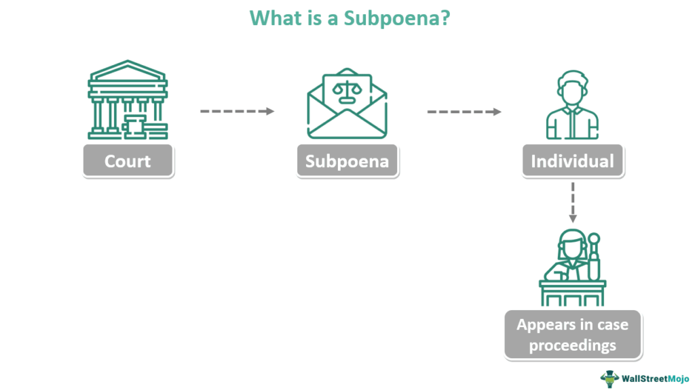

## Table of Contents

## What are piggyback warrants?

Piggyback warrants are a type of financial instrument that companies can attach to their bonds or stocks. They give the holder the right to buy more shares of the company's stock at a set price, usually lower than the market price. This can be attractive to investors because it gives them the chance to buy more shares in the future at a discount.

These warrants are called "piggyback" because they are added on top of the main investment, like a rider on a bond or stock. They are often used by companies to make their securities more appealing to investors. By offering piggyback warrants, a company can encourage more people to buy their bonds or stocks, hoping that the potential for future gains will outweigh the initial cost.

## How do piggyback warrants differ from traditional warrants?

Piggyback warrants and traditional warrants both give the holder the right to buy more shares of a company's stock at a set price. The main difference is how they are issued. Traditional warrants are usually issued on their own, separate from other securities. They are often used by companies to raise more money or as a sweetener in mergers and acquisitions. On the other hand, piggyback warrants are attached to other securities, like bonds or stocks. This means when you buy the main security, you also get the piggyback warrant.

The way piggyback warrants work can make them more attractive to investors. Because they come with another investment, they can make the overall package more appealing. For example, if a company issues a bond with a piggyback warrant, investors might be more likely to buy the bond because they also get the chance to buy more stock at a discount later. Traditional warrants, since they are standalone, don't have this added benefit of being bundled with another investment. This bundling can help companies attract more investors and raise more capital.

## What is the purpose of issuing piggyback warrants?

The main purpose of issuing piggyback warrants is to make a company's securities more attractive to investors. When a company attaches piggyback warrants to their bonds or stocks, it gives investors an extra perk. This perk is the right to buy more shares of the company's stock at a lower price in the future. This can be a big draw for investors because it offers them a chance to make more money if the stock price goes up.

By offering piggyback warrants, companies hope to encourage more people to buy their securities. This can help the company raise more money, which they can use to grow their business or pay off debts. The piggyback warrant acts like a bonus that makes the investment more appealing, even if the initial cost of the bond or stock might be higher. In this way, piggyback warrants serve as a tool for companies to attract investment and support their financial goals.

## Who typically issues piggyback warrants?

Companies that want to raise money often issue piggyback warrants. These companies might be looking to grow their business, pay off debts, or fund new projects. By adding piggyback warrants to their bonds or stocks, they make their securities more appealing to investors. This can help them attract more people to buy their securities and raise the money they need.

Piggyback warrants are especially useful for smaller or newer companies that might have a harder time attracting investors. These companies can use piggyback warrants to sweeten the deal for investors, offering them a chance to buy more shares at a lower price in the future. This can make their securities more competitive in the market and help them stand out to potential investors.

## What are the benefits of piggyback warrants for investors?

Piggyback warrants give investors a chance to buy more shares of a company at a lower price later on. This can be a big benefit if the company's stock price goes up. If an investor buys a bond or stock with a piggyback warrant, they can use the warrant to buy more shares at the set price, which might be lower than the market price at that time. This means they could make more money if they sell those shares at the higher market price.

Another benefit is that piggyback warrants can make the initial investment more attractive. When a company adds a piggyback warrant to a bond or stock, it gives investors an extra reason to buy it. Even if the bond or stock might be a bit more expensive at first, the chance to buy more shares at a discount in the future can make it worth it. This can help investors feel more confident about their investment and potentially earn more money over time.

## What are the risks associated with piggyback warrants?

One risk of piggyback warrants is that the stock price might not go up. If the stock price stays the same or goes down, the warrant won't be worth much. Investors might end up paying more for the bond or stock with the warrant, but they won't get the chance to make more money by buying more shares at a lower price. This means they could lose money or not make as much as they hoped.

Another risk is that piggyback warrants have an expiration date. If the stock price doesn't go up before the warrant expires, the investor won't be able to use it. They will miss out on the chance to buy more shares at a discount. This can be frustrating if the stock price goes up right after the warrant expires, because then the investor won't be able to take advantage of the higher price.

## How are piggyback warrants priced?

Piggyback warrants are priced based on a few things. One is the price of the stock they give you the right to buy. If the stock is worth a lot, the warrant will be worth more too. Another thing that affects the price is how long you have to use the warrant. If you have a long time to use it, the warrant might be worth more because you have more time for the stock price to go up. The difference between the stock's current price and the price you can buy it at with the warrant also matters. The bigger the difference, the more valuable the warrant.

Sometimes, the price of piggyback warrants can also be affected by how risky the company is. If the company is not doing well or is in a risky business, the warrant might not be worth as much. People might not want to buy the warrant if they think the company's stock price won't go up. So, the price of piggyback warrants can change a lot based on what's happening with the company and the stock market.

## Can piggyback warrants be traded separately from the underlying security?

Piggyback warrants are usually attached to the underlying security, like a bond or stock, when they are first issued. This means that when you buy the bond or stock, you also get the piggyback warrant. They are not meant to be traded on their own right away. The idea is to make the bond or stock more attractive by adding the warrant as a bonus.

However, sometimes after they are issued, piggyback warrants can be separated from the underlying security. This means they can be traded by themselves on the market. But this doesn't always happen and depends on the rules set by the company issuing the warrants. If they can be traded separately, their value will depend on things like the stock price, how long until they expire, and how risky the company is.

## What are the tax implications of exercising piggyback warrants?

When you exercise piggyback warrants, you need to think about taxes. If you use the warrant to buy more stock, you might have to pay taxes on the difference between the price you paid for the stock and what it's worth now. This is called capital gains tax. The tax you pay depends on how long you hold onto the stock after you buy it with the warrant. If you hold it for more than a year, you might pay a lower long-term capital gains tax rate. If you sell it sooner, you could pay a higher short-term capital gains tax rate.

Another thing to think about is if the company gives you the piggyback warrant for free when you buy their bond or stock. The value of the warrant might be seen as income by the tax people. This means you might have to pay income tax on the value of the warrant when you get it. It's a good idea to talk to a tax advisor to understand all the tax rules that could apply to you when you exercise piggyback warrants.

## How do regulatory requirements affect the issuance of piggyback warrants?

Regulatory requirements play a big role in how companies can issue piggyback warrants. Different countries have different rules about what companies need to do before they can offer these warrants to investors. For example, in the United States, the Securities and Exchange Commission (SEC) has rules that companies must follow. They need to give investors a lot of information about the warrants, like how they work and what risks are involved. This is to make sure investors know what they are buying and can make good choices.

These rules can make it harder for companies to issue piggyback warrants because they have to spend time and money to follow them. But the rules also help protect investors. They make sure that companies are honest about what they are offering and that investors have all the information they need. This can make investors feel more confident about buying piggyback warrants, even though it might take longer for companies to get them out to the market.

## What are some real-world examples of piggyback warrants in use?

One real-world example of piggyback warrants in use happened with Tesla in 2014. Tesla issued convertible bonds with piggyback warrants attached to them. This meant that when investors bought the bonds, they also got the right to buy more Tesla stock at a set price in the future. This made the bonds more attractive to investors because they could potentially make more money if Tesla's stock price went up. It helped Tesla raise money to grow their business and work on new projects.

Another example is from a smaller company called Rocket Lab in 2021. They issued stock with piggyback warrants to help them raise money for their space technology projects. Investors who bought the stock got the chance to buy more shares at a lower price later on. This was appealing to investors because it gave them a chance to invest more in Rocket Lab if the company did well. It also helped Rocket Lab attract more investment to fund their work in the competitive space industry.

## How can an investor evaluate the potential value of piggyback warrants?

To figure out how much piggyback warrants might be worth, an investor needs to look at a few things. First, they should check the current price of the company's stock and compare it to the price they can buy it at with the warrant. If the stock price is much higher than the warrant price, the warrant could be worth a lot because it lets them buy the stock at a discount. They also need to think about how long they have until the warrant expires. If there's a long time left, there's more chance for the stock price to go up, making the warrant more valuable. 

Another important thing to consider is how well the company is doing. If the company is growing and making more money, there's a better chance the stock price will go up, which makes the warrant more valuable. But if the company is struggling, the stock price might not go up, and the warrant might not be worth much. Investors also need to think about how risky the company is. If it's in a risky business, the warrant might be less valuable because there's more chance the stock price won't go up. By looking at all these things, an investor can get a good idea of how much the piggyback warrant might be worth.

## How do you set up an algorithmic trading system?

Selecting the right trading platform is a fundamental decision that affects the overall success of algorithmic trading systems, especially when dealing with financial derivatives like warrants. Modern platforms such as QuantConnect or MetaTrader offer comprehensive tools for developing, testing, and deploying algorithmic trading strategies. These platforms provide access to historical data, a crucial component for [backtesting](/wiki/backtesting) algorithms to ensure their robustness under different market conditions.

Designing effective trading strategies requires a precise definition of entry and [exit](/wiki/exit-strategy) points. This involves determining the conditions under which an asset should be bought or sold. For instance, a simple moving average (SMA) crossover strategy could be implemented to define these points. The strategy might involve buying a security when a short-term moving average crosses above a long-term moving average and selling it when the opposite occurs. 

```python
# Example of an SMA Crossover Strategy in Python
import pandas as pd

def sma_crossover_strategy(data, short_window=40, long_window=100):
    signals = pd.DataFrame(index=data.index)
    signals['price'] = data['price']
    signals['short_mavg'] = data['price'].rolling(window=short_window, min_periods=1, center=False).mean()
    signals['long_mavg'] = data['price'].rolling(window=long_window, min_periods=1, center=False).mean()
    signals['signal'] = 0.0
    signals['signal'][short_window:] = np.where(
        signals['short_mavg'][short_window:] > signals['long_mavg'][short_window:], 1.0, 0.0
    )   
    signals['positions'] = signals['signal'].diff()
    return signals

# Example usage with price data
data = pd.read_csv('price_data.csv') # assuming price_data.csv contains a 'price' column
signals = sma_crossover_strategy(data)
print(signals)
```

Backtesting involves applying your strategy to historical data to evaluate its performance. Key metrics to analyze during backtesting include the Sharpe ratio, maximum drawdown, and annualized return. These metrics help in assessing the risk-adjusted returns of the strategy, providing insights into both potential profitability and risk exposure.

Risk management cannot be overstated, particularly in markets characterized by high volatility and leveraged instruments like warrants. Risk management techniques include setting stop-loss limits to cap potential losses and defining position size according to risk tolerance and portfolio size. The position sizing formula, often based on the Kelly Criterion, can be employed to optimize bet size:

$$
f^* = \frac{bp - q}{b}
$$

where $f^*$ is the fraction of the capital to stake, $b$ is the odds received on the wager, $p$ is the probability of winning, and $q$ is the probability of losing (i.e., $1 - p$).

In conclusion, a successful algorithmic trading system for warrants demands a rigorous approach to platform selection, strategy design, thorough backtesting, and robust risk management. By adhering to these practices, traders can enhance their ability to navigate the challenging landscape of trading warrants algorithmically.

## References & Further Reading

[1]: Bergstra, J., Bardenet, R., Bengio, Y., & Kégl, B. (2011). ["Algorithms for Hyper-Parameter Optimization."](https://dl.acm.org/doi/10.5555/2986459.2986743) Advances in Neural Information Processing Systems 24.

[2]: ["Advances in Financial Machine Learning"](https://www.amazon.com/Advances-Financial-Machine-Learning-Marcos/dp/1119482089) by Marcos Lopez de Prado

[3]: ["Evidence-Based Technical Analysis: Applying the Scientific Method and Statistical Inference to Trading Signals"](https://www.amazon.com/Evidence-Based-Technical-Analysis-Scientific-Statistical/dp/0470008741) by David Aronson

[4]: ["Machine Learning for Algorithmic Trading"](https://github.com/stefan-jansen/machine-learning-for-trading) by Stefan Jansen

[5]: ["Quantitative Trading: How to Build Your Own Algorithmic Trading Business"](https://github.com/LucindaYa/quant-resources/blob/master/Quantitative%20Trading%20How%20to%20Build%20Your%20Own%20Algorithmic%20Trading%20Business.pdf) by Ernest P. Chan