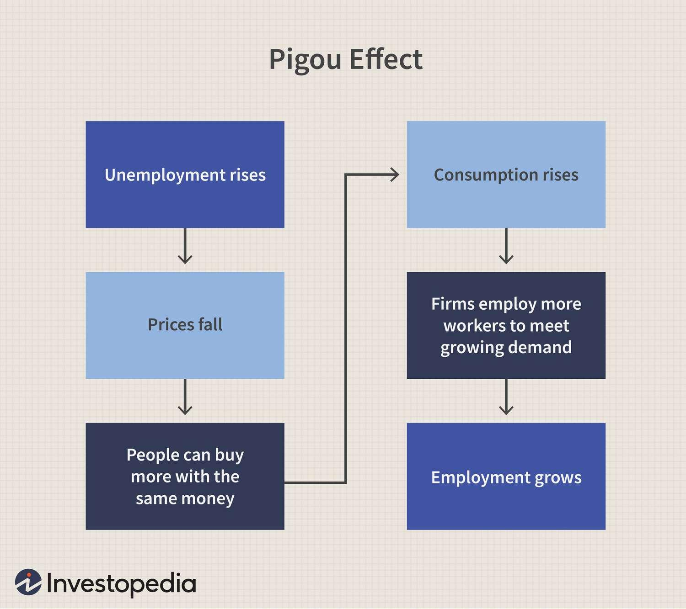

## Table of Contents

## What is the Pigou Effect?

The Pigou Effect is an economic theory that says when prices go down, people feel richer because their money can buy more things. This idea was named after Arthur Cecil Pigou, who came up with it. When prices fall, the value of money goes up. So, if you have savings, those savings can now buy more goods than before. This makes people feel wealthier, and they might start spending more money.

When people spend more because they feel richer, it can help the economy grow. This is because more spending can lead to more demand for goods and services, which can encourage businesses to produce more and hire more workers. The Pigou Effect suggests that lower prices can actually help pull an economy out of a recession by boosting consumer spending. However, this effect depends a lot on people's confidence and their willingness to spend their savings.

## Who was Arthur Cecil Pigou and why is the effect named after him?

Arthur Cecil Pigou was an economist from England who lived from 1877 to 1959. He worked at the University of Cambridge and was a student of the famous economist Alfred Marshall. Pigou is well-known for his work in welfare economics, which looks at how economic policies can improve people's well-being. He wrote many books, and one of his most famous ones is called "The Economics of Welfare."

The Pigou Effect is named after him because he was the one who first talked about this idea in his book. In simple terms, the Pigou Effect says that when prices fall, people feel richer because their money can buy more stuff. This can make them spend more, which can help the economy grow. Pigou's idea was important because it showed how changes in prices could affect how much people spend and how the economy works.

## How does the Pigou Effect differ from the Keynesian theory?

The Pigou Effect and Keynesian theory have different ideas about how to fix an economy that's not doing well. The Pigou Effect says that if prices go down, people will feel richer because their money can buy more things. This might make them spend more money, which can help the economy grow. Pigou believed that this could happen even during a recession, and it could help pull the economy out of a slump.

On the other hand, Keynesian theory, named after the economist John Maynard Keynes, says that when the economy is in a recession, people might not spend more money even if prices go down. Keynes thought that during tough times, people might be too worried about the future to spend their savings. Instead, he believed that the government should step in and spend more money to boost the economy. This is called fiscal policy, and it's different from the Pigou Effect, which relies on people spending more on their own.

## Can you explain the basic mechanism of the Pigou Effect?

The Pigou Effect is a simple idea about how the economy works. It says that when prices of things go down, the money you have can buy more stuff. So, if you have savings, those savings become more valuable because you can get more for them. This makes people feel richer, and when people feel richer, they might start spending more money.

When people spend more money because they feel richer, it can help the economy grow. More spending means more demand for goods and services. This can make businesses produce more and hire more workers. The Pigou Effect suggests that lower prices can help pull an economy out of a recession by encouraging people to spend more of their savings.

## What role does wealth play in the Pigou Effect?

Wealth is really important in the Pigou Effect. The idea is that when prices go down, the money you have saved up can buy more things. This makes you feel like you have more wealth, even if you haven't actually gotten more money. So, if prices fall, your savings become more valuable because you can get more stuff with them.

When people feel wealthier because of this, they might start spending more of their savings. This extra spending can help the economy grow because more people buying things means more demand for goods and services. Businesses might then make more products and hire more workers. The Pigou Effect says that feeling richer because of lower prices can help pull an economy out of a tough spot.

## How does the Pigou Effect propose to combat deflation?

The Pigou Effect suggests a way to fight deflation by making people feel richer when prices go down. Deflation means prices are falling, and this can make people hold onto their money instead of spending it. But according to the Pigou Effect, when prices drop, the money you have saved up can buy more things. This makes you feel like you have more wealth, even though you haven't actually gotten more money. Feeling richer might encourage you to spend more of your savings.

When people start spending more because they feel wealthier, it can help the economy. More spending means more demand for goods and services, which can make businesses produce more and hire more workers. The Pigou Effect says that this increase in spending can help stop deflation and even pull the economy out of a recession. It's all about how feeling richer can lead to more spending, which can help the economy grow.

## What are some historical economic conditions that led to the development of the Pigou Effect?

The Pigou Effect was developed during a time when the world was dealing with big economic problems. In the early 20th century, many countries were hit hard by economic downturns, like the Great Depression in the 1930s. During these times, prices were falling, and people were not spending much money. Economists were trying to figure out how to fix these problems and get the economy moving again. Arthur Cecil Pigou, who came up with the Pigou Effect, was thinking about how to help the economy during these tough times.

Pigou noticed that when prices go down, people's money can buy more things. He thought that if people felt richer because their savings could buy more, they might start spending more money. This idea was important because it offered a way to fight deflation, which is when prices keep falling. The Pigou Effect was Pigou's way of saying that lower prices could actually help the economy by making people feel wealthier and encouraging them to spend more. This was a new way of thinking about how to help the economy during hard times.

## Can you provide a simple example of how the Pigou Effect might work in a modern economy?

Imagine there's a big sale happening all over the country. Prices for everything from food to clothes to electronics are going down. You have some money saved up in your bank account. Because prices are lower, your savings can now buy more things than before. This makes you feel richer, even though you haven't actually gotten more money. Feeling richer might make you decide to go out and buy that new TV you've been wanting or treat your family to a nice dinner.

When lots of people start spending more because they feel wealthier, it can help the whole economy. More people buying things means more demand for goods and services. Stores and businesses see this and start making more products and hiring more workers to keep up with the demand. This can help the economy grow and even pull it out of a tough spot. The Pigou Effect is all about how feeling richer because of lower prices can lead to more spending and help the economy.

## What criticisms have been leveled against the Pigou Effect?

Some economists don't think the Pigou Effect works well in real life. They say that when prices go down, people might not spend more money. Instead, people might be worried about the future and hold onto their savings. This is especially true during a recession when people are scared about losing their jobs or not having enough money. So, even if prices fall and people's money can buy more things, they might not feel rich enough to spend more.

Another criticism is that the Pigou Effect might not be strong enough to fix big economic problems. If prices fall a little bit, it might not make a big difference in how much people spend. Also, if people have a lot of debt, lower prices might not make them feel richer. They might still need to pay off their debts instead of spending more money. So, some economists think that other ways, like the government spending more money, might be better at helping the economy during tough times.

## Are there any empirical studies that support or refute the Pigou Effect?

Some studies have looked into the Pigou Effect, but the results are mixed. One study by Robert Barro and Herschel Grossman in the 1970s tried to see if the Pigou Effect could help explain how the economy works. They found some evidence that when prices go down, people might spend more money, but it's not a big effect. This means the Pigou Effect might help a little bit, but it's not strong enough to fix big economic problems on its own.

Other studies have not found much support for the Pigou Effect. For example, research by Milton Friedman and Anna Schwartz looked at how money and prices affect the economy. They found that when prices fall, people often hold onto their money instead of spending more. This is because people might be worried about the future and want to keep their savings safe. So, these studies suggest that the Pigou Effect might not work well in real life, especially during tough economic times.

## How has the Pigou Effect been integrated into modern economic policy?

The Pigou Effect has not been a big part of modern economic policy. This is because many economists think it doesn't work well in real life. They believe that when prices go down, people might not spend more money. Instead, people might be worried about the future and hold onto their savings. This is especially true during a recession when people are scared about losing their jobs or not having enough money. So, even if prices fall and people's money can buy more things, they might not feel rich enough to spend more.

Instead of relying on the Pigou Effect, modern economic policy often uses other ways to help the economy. One common way is for the government to spend more money on things like building roads or helping people who are out of work. This is called fiscal policy. Another way is for the central bank to lower interest rates, which can make it cheaper for people to borrow money and spend more. These methods are thought to be more effective at helping the economy during tough times than waiting for the Pigou Effect to kick in.

## What are the implications of the Pigou Effect for central banking and monetary policy?

The Pigou Effect suggests that when prices go down, people might feel richer and spend more money. This could mean that central banks, which control things like interest rates and the money supply, might not need to do much during times of falling prices. If the Pigou Effect works well, central banks could just wait for people to start spending more on their own as prices drop. But many economists think the Pigou Effect doesn't work well in real life, so central banks usually don't rely on it.

Instead, central banks use other tools to help the economy when prices are falling. They might lower interest rates to make it cheaper for people to borrow money and spend more. Or they might increase the money supply to encourage spending. These actions are part of what's called monetary policy. Because the Pigou Effect is not seen as a strong way to help the economy, central banks focus more on these other methods to fight deflation and help the economy grow.

## References & Further Reading

[1]: Pigou, A. C. (1949). "The Classical Stationary State." Economic Journal, 59(236), 343-351.

[2]: Patinkin, D. (1965). "Money, Interest, and Prices: An Integration of Monetary and Value Theory." 2nd ed. Harper & Row.

[3]: Keynes, J. M. (1936). "The General Theory of Employment, Interest, and Money." Macmillan.

[4]: Lopez de Prado, M. (2018). ["Advances in Financial Machine Learning."](https://www.amazon.com/Advances-Financial-Machine-Learning-Marcos/dp/1119482089) Wiley.

[5]: Chan, E. (2009). ["Quantitative Trading: How to Build Your Own Algorithmic Trading Business."](https://github.com/ftvision/quant_trading_echan_book) Wiley.

[6]: Aronson, D. R. (2006). ["Evidence-Based Technical Analysis: Applying the Scientific Method and Statistical Inference to Trading Signals."](https://www.amazon.com/Evidence-Based-Technical-Analysis-Scientific-Statistical/dp/0470008741) Wiley.

[7]: Jansen, S. (2020). ["Machine Learning for Algorithmic Trading: Predictive models to extract signals from market and alternative data for systematic trading strategies with Python," 2nd Edition.](https://github.com/stefan-jansen/machine-learning-for-trading) Packt Publishing.