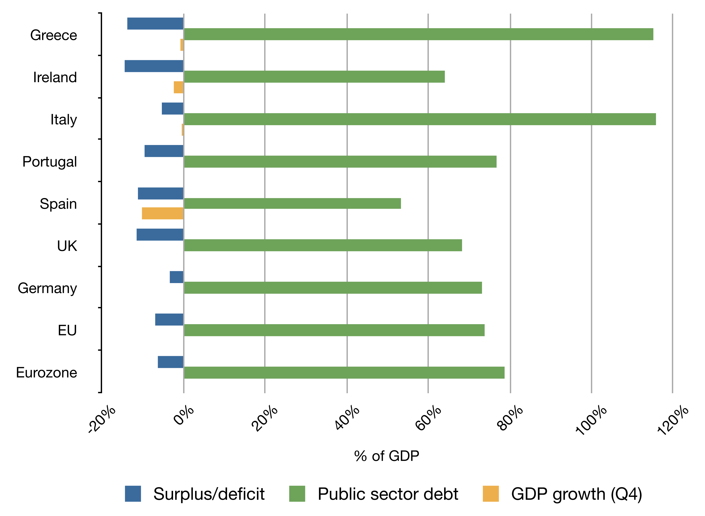

## Table of Contents

## What does the acronym PIIGS stand for in the context of the European economy?

PIIGS is an acronym used to refer to a group of five European countries that faced significant economic challenges during the European debt crisis. The countries are Portugal, Italy, Ireland, Greece, and Spain. These nations were grouped together because they all experienced high levels of public debt, economic instability, and difficulties in managing their finances.

The term PIIGS became popular in the media and among economists as a way to discuss the common problems these countries were facing. However, the acronym has been criticized for being derogatory and oversimplifying the complex economic situations of each country. Despite the criticism, it remains a widely recognized term when discussing the European economic landscape during the crisis.

## What is the European Debt Crisis and when did it begin?

The European Debt Crisis, also known as the Eurozone Crisis, is a financial problem that started in 2009. It happened because some countries in Europe had borrowed too much money and couldn't pay it back. These countries were part of the Eurozone, which means they used the euro as their currency. The crisis caused a lot of worry because it made people think that the whole euro system might fail.

The crisis began with Greece, where the government revealed that its budget deficit was much larger than it had previously reported. This news shocked everyone and made investors very nervous. They started to worry about other countries like Portugal, Ireland, Italy, and Spain, which also had big debts. As a result, these countries had to pay more to borrow money, making their financial problems even worse. Governments and the European Union had to work together to find ways to help these countries and stop the crisis from spreading.

## How did the PIIGS countries contribute to the European Debt Crisis?

The PIIGS countries, which are Portugal, Italy, Ireland, Greece, and Spain, played a big role in the European Debt Crisis because they all had a lot of debt. These countries borrowed a lot of money, and when the global economy got worse, they found it hard to pay it back. Greece was the first to have big problems. In 2009, Greece said its budget deficit was much bigger than they had told everyone before. This made people very worried and scared that other countries might have the same problem.

Because of this, investors started to think that Portugal, Italy, Ireland, and Spain might also have trouble paying their debts. This made it harder and more expensive for these countries to borrow money. The crisis spread from one country to another, making the whole Eurozone worried. Governments and the European Union had to work together to help these countries and stop the crisis from getting worse.

## What were the main economic challenges faced by the PIIGS countries during the crisis?

The PIIGS countries faced several big problems during the European Debt Crisis. They all had a lot of debt, which means they had borrowed a lot of money and were having trouble paying it back. This made it hard for them to borrow more money because people and banks were worried they might not get their money back. This problem was made worse because these countries were not growing their economies fast enough to pay off their debts. They also had high unemployment, which means many people couldn't find jobs, making it even harder for the economy to get better.

Another big challenge was that these countries had to make tough choices to fix their economies. They had to cut spending on things like schools and hospitals, which made people unhappy. They also had to raise taxes, which made life harder for many families. The European Union and other countries tried to help by giving them money, but they had to follow strict rules to get this help. These rules made it hard for them to make their own decisions about how to fix their economies. All these problems together made the crisis last for a long time and made it very hard for the PIIGS countries to recover.

## What measures were taken by the European Union to address the debt crisis in the PIIGS countries?

The European Union took several steps to help the PIIGS countries during the debt crisis. They created a big fund called the European Financial Stability Facility (EFSF) to lend money to countries that were in trouble. This money helped countries like Greece, Portugal, and Ireland to keep going and pay their bills. The EU also made a new group called the European Stability Mechanism (ESM) to keep helping countries in the future. These funds came with strict rules, though. Countries had to agree to make big changes to their economies, like cutting spending and raising taxes, to get the money.

Another important thing the EU did was to work together with the International Monetary Fund (IMF). The IMF also gave money to the PIIGS countries, but they had to follow even more rules. The EU and the IMF worked together to make sure the countries were doing what they promised. The European Central Bank (ECB) also helped by buying government bonds from these countries. This made it easier for them to borrow money because it showed that the ECB believed in them. All these steps were meant to stop the crisis from getting worse and to help the PIIGS countries get back on their feet.

## How did austerity measures affect the PIIGS countries?

Austerity measures had a big impact on the PIIGS countries. These measures meant that governments had to cut spending on things like schools, hospitals, and social programs. They also had to raise taxes. This made life harder for many people because they had less money and fewer services to help them. Unemployment went up because businesses had less money to spend, and it was harder for them to grow or hire new workers. People were unhappy because they felt the government was not helping them enough during tough times.

Even though the goal of austerity was to fix the economy and reduce debt, it often made things worse in the short term. In some countries like Greece, the economy shrank a lot, and it took a long time to start growing again. People protested in the streets because they were angry about the cuts and the lack of jobs. On the other hand, some countries like Ireland managed to recover faster, but it was still a difficult time for everyone. Overall, austerity measures were a painful part of the solution to the debt crisis, and they left a lasting mark on the PIIGS countries.

## What role did the International Monetary Fund (IMF) play in the European Debt Crisis?

The International Monetary Fund (IMF) played a big role in helping the PIIGS countries during the European Debt Crisis. The IMF worked together with the European Union to give money to countries like Greece, Portugal, and Ireland. This money was important because it helped these countries pay their bills and keep their economies going. But, the IMF had strict rules that these countries had to follow to get the money. They had to make big changes to their economies, like cutting spending and raising taxes.

These rules were meant to help the countries fix their problems and pay back their debts. But, the changes were hard for people to live with. Many people lost their jobs, and the government had less money to spend on things like schools and hospitals. Even though the IMF's help was important, it also made life harder for many people in the PIIGS countries. The IMF's role was to provide money and advice, but the tough conditions they set were a big part of the story of the European Debt Crisis.

## How did the European Central Bank's policies impact the PIIGS during the crisis?

The European Central Bank (ECB) helped the PIIGS countries a lot during the European Debt Crisis. One big thing the ECB did was buy government bonds from these countries. This made it easier for them to borrow money because it showed that the ECB believed in them. When the ECB bought these bonds, it lowered the interest rates that the PIIGS countries had to pay. This helped them a lot because it made their debts cheaper to manage.

But, the ECB's policies also had some tough parts. They told the PIIGS countries to make big changes to their economies, like cutting spending and raising taxes. These changes were hard for people to live with. Many people lost their jobs, and the government had less money to spend on things like schools and hospitals. Even though the ECB's help was important, it also made life harder for many people in the PIIGS countries during the crisis.

## What were the social and political consequences of the European Debt Crisis in the PIIGS countries?

The European Debt Crisis had big social and political effects on the PIIGS countries. People were very unhappy because the government had to cut spending on things like schools and hospitals. This made life harder for many families, and a lot of people lost their jobs. Unemployment went up, and many young people had to leave their countries to find work somewhere else. This made people feel angry and frustrated, and they started to protest in the streets. They were upset about the cuts and the lack of jobs, and they wanted the government to do something to help them.

Politically, the crisis caused a lot of changes in the PIIGS countries. Many people lost trust in their governments because they felt the leaders were not doing enough to help them. This led to big changes in elections, with new parties and leaders coming to power. Some of these new leaders promised to fight against the tough rules set by the European Union and the International Monetary Fund. The crisis also made people question whether being part of the Eurozone was a good idea. They started to think more about their own country's needs and less about working together with other European countries.

## How did the economic performance of the PIIGS countries evolve post-crisis?

After the European Debt Crisis, the PIIGS countries started to recover, but it took a long time and was different for each country. Greece had a very hard time because its economy shrank a lot during the crisis. It took many years for Greece to start growing again, and even then, it was slow. Portugal and Ireland did better. They made big changes to their economies and started to grow again faster than Greece. Ireland, in particular, saw its economy get stronger and unemployment go down. Spain also started to recover, but it had a lot of people without jobs for a long time. Italy had a harder time because it had a lot of debt and its economy did not grow as fast as the others.

The recovery was not just about numbers. People in the PIIGS countries felt the effects of the crisis for a long time. Many were still unhappy about the cuts to schools and hospitals, and some were angry at the government for not helping them enough. But slowly, things started to get better. More people found jobs, and the economies started to grow again. The PIIGS countries learned a lot from the crisis and made changes to make sure it would not happen again. They worked hard to pay back their debts and to make their economies stronger. Even though it was a tough time, the PIIGS countries showed that they could recover and move forward.

## What lessons can be learned from the PIIGS experience during the European Debt Crisis?

The PIIGS experience during the European Debt Crisis teaches us a lot about how important it is to manage money carefully. These countries borrowed too much and spent too much, which made it hard for them to pay back their debts when the economy got worse. They learned that having a lot of debt can be very dangerous, especially when things go wrong. It's important for countries to keep their budgets under control and to save money for tough times. The crisis also showed that working together with other countries and organizations like the European Union and the International Monetary Fund can help, but it comes with tough rules that can make life harder for people.

Another big lesson from the PIIGS countries is about the social and political effects of economic problems. When people lose their jobs and the government cuts spending on things like schools and hospitals, they get very unhappy. This can lead to protests and big changes in who is in charge of the country. It's important for leaders to think about how their decisions affect people's lives and to try to find ways to help them during hard times. The crisis also made people question whether being part of the Eurozone was a good idea, showing that economic problems can change how people feel about working together with other countries.

## What are the long-term implications for the Eurozone based on the PIIGS crisis?

The PIIGS crisis showed that the Eurozone needs to be careful about how much money countries borrow. When countries like Greece, Portugal, Ireland, Italy, and Spain had too much debt, it made the whole Eurozone worried. This crisis made the European Union and the European Central Bank create new rules to help countries manage their money better. They set up funds like the European Stability Mechanism to help countries in trouble, but with strict rules. This means that in the future, countries in the Eurozone will have to be more careful with their budgets and make sure they can pay back their debts.

The crisis also changed how people in the Eurozone feel about working together. When the PIIGS countries had to cut spending and raise taxes, many people got angry and started to question if being part of the Eurozone was a good idea. This led to big changes in politics, with new leaders and parties coming to power. The crisis showed that economic problems can cause a lot of social and political trouble. In the long run, the Eurozone will need to find ways to help countries in trouble without making life too hard for people, and to keep people believing in the idea of working together.

## References & Further Reading

[1]: Lane, P. R. (2012). ["The European Sovereign Debt Crisis."](https://www.jstor.org/stable/41581131) Journal of Economic Perspectives, 26(3), 49-67.

[2]: Lopez de Prado, M. (2018). ["Advances in Financial Machine Learning."](https://www.amazon.com/Advances-Financial-Machine-Learning-Marcos/dp/1119482089) Wiley.

[3]: Malkiel, B. G. (2019). ["A Random Walk Down Wall Street."](https://www.amazon.com/Random-Walk-Down-Wall-Street/dp/1324002182) W.W. Norton & Company.

[4]: Singh, M., & Zamora-Pérez, A. (2020). ["A Primer on Algorithmic Trading."](https://onlinelibrary.wiley.com/doi/full/10.1002/mar.22156) European Central Bank Occasional Paper Series No 242.

[5]: Tsatsaronis, K. (2012). ["The Anatomy of the Sovereign Debt Crisis."](https://academic.oup.com/jfec/article-abstract/21/5/1728/6617218) Bank for International Settlements Quarterly Review.