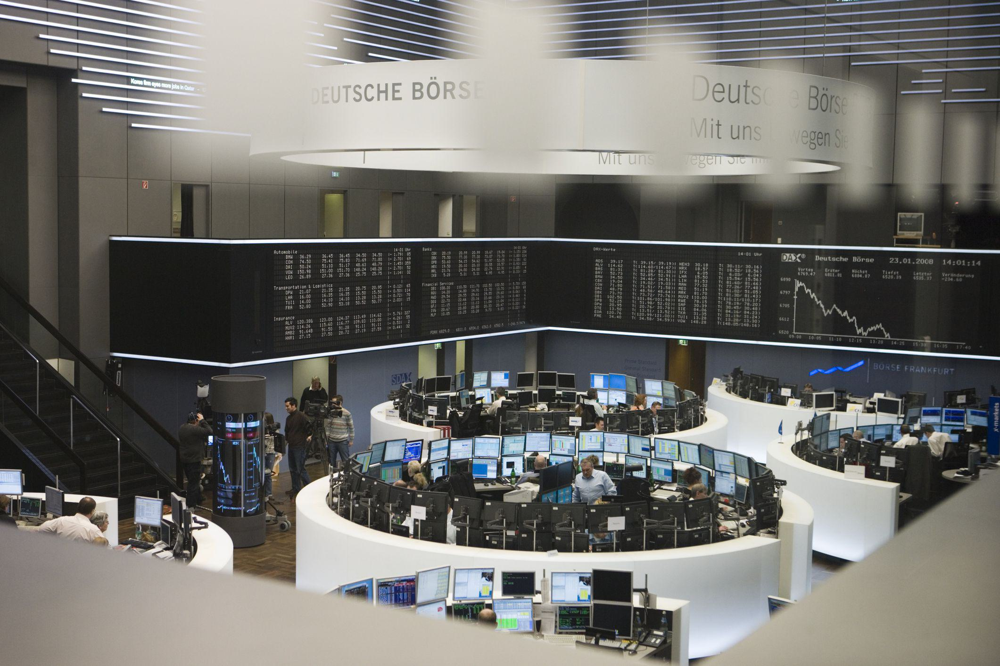

In the world of trading, there exists a lexicon replete with jargon that can confound even seasoned investors. One such term that emerges from this intricate web of terminology is 'piker.' While at first glance it may appear benign, within financial circles, it carries significant weight and connotations. Its usage often reflects perceptions about trading behavior and market participation.

This article embarks on a detailed exploration of the term 'piker,' offering insights into its definition, tracing its historical origins, and examining its relevance in contemporary contexts, particularly in algorithmic trading. A comprehensive understanding of such terms is indispensable for investors aiming to enhance their knowledge of market dynamics and refine their trading strategies. By demystifying the term 'piker,' this article seeks to provide clarity and enrich the reader's perspective on the array of attitudes and strategies that exist within the financial sector.

## Table of Contents

## Defining 'Piker'

A 'piker' is a term used in the financial sector to describe a broker or investor who engages in relatively small trades, often carrying a negative connotation. This term suggests a lack of significant influence on market movements, as these individuals tend to partake in low-stakes transactions. The actions of pikers are often seen as amateurish and overly cautious, depicting a trading style characterized by minimal engagement with the inherent risks and opportunities of the market.

The label of 'piker' traditionally implies a risk-averse approach, where individuals opt for smaller, less aggressive market positions and, consequently, experience limited financial returns. This cautious trading behavior may be a deliberate strategy to avoid substantial losses or may stem from a lack of expertise or confidence in dealing with larger, more volatile market positions. As a result, pikers often achieve minimal profits, reinforcing the perception of their limited impact within the financial sector.

## Origins of the Term 'Piker'

The origins of the term "piker" can be traced to multiple sources, with one prominent connection to Pike County, Missouri, during the Gold Rush era of the mid-19th century. Residents of Pike County, known as "Pikers," migrated westward in search of fortune. They were characterized by their frugality, particularly in avoiding substantial expenditures on gambling and alcohol. This behavior of cautious spending and reluctance to take financial risks gradually led to the association of the term "piker" with individuals who engage in small-scale, risk-averse financial activities.

Additionally, the word "piker" also embodies the notion of a "timid gambler." In this context, a "piker" is someone who places small bets and consciously avoids taking significant risks—behavior deemed overly cautious in gambling circles. This aspect of the term highlights its pejorative nature, as it implies a lack of boldness or willingness to commit to potentially lucrative risks.

The dual origins underscore the historical evolution of "piker" from a literal reference to people from a specific region to a metaphorical representation of a particular trading or gambling demeanor. Understanding these roots provides insight into how linguistic usage can shift over time, shaping the perception of individuals who prefer small stakes and low-risk strategies. This context is essential in comprehending how the term "piker" characterizes various attitudes within trading and financial discussions.

## Piker in the Context of Trading

Within trading circles, the term 'piker' is often used to demean those who don't take substantial positions in the market. Professional traders may view individuals who execute small trades as lacking commitment or expertise. This perspective can lead to a dismissive attitude toward traders who are perceived as overly cautious or inexperienced.

However, understanding the dynamics of small-scale trading can highlight both its challenges and potential merits. Traders characterized as 'pikers' often engage in smaller trades due to limited capital, risk aversion, or a preference for conservative strategies. Such traders may employ careful analysis and strategic planning to capitalize on modest market movements, emphasizing steady gains over time rather than substantial profits from high-risk bets.

Despite the negative connotations, 'piker' trading approaches can offer valuable insights into risk management and disciplined trading. For instance, adopting a conservative trading strategy may help individuals preserve capital during volatile market conditions, reducing exposure to significant losses. Additionally, small-scale trading can be an effective way to gain experience and build confidence, particularly for novice traders learning the nuances of market dynamics.

Moreover, the small trades executed by pikers can cumulatively contribute [liquidity](/wiki/liquidity-risk-premium) to the market, aiding price discovery and increasing market depth. Although these contributions are minimal when compared to large-scale institutional trades, their cumulative effect can still have beneficial impacts on market efficiency.

In this context, understanding the role of 'pikers' challenges the stereotype that equates trade size with trading acumen. By recognizing the diverse strategies employed by different market participants, the complexities and varied approaches present within financial markets become more apparent, illustrating that small traders too play an integral role in the trading ecosystem.

## Piker and Algorithmic Trading

Algorithmic trading represents a sophisticated approach to the financial markets, leveraging algorithms based on mathematical models to determine the timing, pricing, and quantity of orders. This method is characterized by the utilization of large data sets and the rapid execution of trades, often associated with high-frequency trading ([HFT](/wiki/high-frequency-trading-strategies)), which involves making numerous trades in a fraction of a second. In such a fast-paced environment, the conservative trades typical of 'pikers' are frequently overlooked.

Pikers in the context of [algorithmic trading](/wiki/algorithmic-trading) are often investors who employ straightforward algorithms for executing minimal trades. Their approach contrasts sharply with high-frequency traders who seek to capitalize on tiny price discrepancies through a multitude of transactions. While high-frequency trading aims at maximizing profits through [volume](/wiki/volume-trading-strategy), pikers approach trading with simplicity and caution, often prioritizing risk management over high returns. Their algorithms might be designed to function under specific, constrained market conditions, focusing on avoiding losses rather than aggressively pursuing gains.

Despite being perceived as lacking ambition, pikers bring distinct insights into trading strategies. They embody a risk-averse approach that can be crucial during periods of market [volatility](/wiki/volatility-trading-strategies), where other traders may face significant losses. Moreover, their cautious strategies can contribute to market stability by providing liquidity and supporting longer-term market trends.

Analyzing the presence of pikers within algorithmic trading elucidates the diversity of trading strategies. By understanding how these small-scale, algorithm-driven trades coexist with high-frequency trades, investors can appreciate the complexity of the trading ecosystem. This awareness allows for a more comprehensive view of market behaviors and the various strategies employed by different market participants, from the smallest pikers to the largest institutional traders.

## Conclusion

The term 'piker,' although often used derisively, sheds light on different attitudes and strategies within the investment community. Typically, 'piker' denotes someone who engages in small-scale trades, often regarded as amateurish or overly cautious. Despite this negative connotation, understanding the term aids in appreciating the varied spectrum of trading behaviors present in the market. 

The differentiation provided by terms like 'piker' enhances the comprehension of market participation dynamics. It underscores the diversity of strategies employed by investors, ranging from aggressive, high-risk trading to conservative, low-stake activities. Such diversity is essential for a robust financial market, as it allows for a wide range of investment approaches that cater to different risk appetites and financial goals.

Whether perceived as cautious or amateurish, pikers contribute to the complexity and diversity of financial markets. They embody a strategic choice that emphasizes risk aversion, reflecting a segment of the market that values steady, albeit smaller, returns over potential high-risk, high-reward scenarios. This cautious approach can serve as a counterbalance to more aggressive strategies, playing a role in market stabilization by potentially reducing volatility through conservative trading actions. 

Ultimately, the presence of pikers within the trading ecosystem highlights the varied landscape of investment strategies, enriching the overall market tapestry with their unique perspectives and approaches.

## References & Further Reading

[1]: ["Algorithmic Trading: Winning Strategies and Their Rationale"](https://books.google.com/books/about/Algorithmic_Trading.html?id=WAlFDwAAQBAJ) by Ernest P. Chan

[2]: ["Advances in Financial Machine Learning"](https://www.amazon.com/Advances-Financial-Machine-Learning-Marcos/dp/1119482089) by Marcos Lopez de Prado

[3]: ["Evidence-Based Technical Analysis: Applying the Scientific Method and Statistical Inference to Trading Signals"](https://www.amazon.com/Evidence-Based-Technical-Analysis-Scientific-Statistical/dp/0470008741) by David Aronson

[4]: ["Quantitative Trading: How to Build Your Own Algorithmic Trading Business"](https://www.amazon.com/Quantitative-Trading-Build-Algorithmic-Business/dp/1119800064) by Ernest P. Chan

[5]: Pardo, R. (2008). ["The Evaluation and Optimization of Trading Strategies"](https://onlinelibrary.wiley.com/doi/book/10.1002/9781119196969). Wiley Trading.