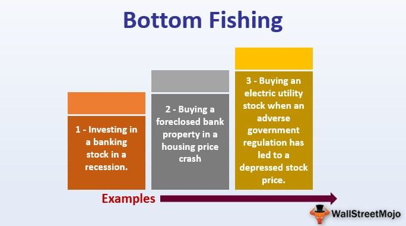

Fishing strategies and algorithmic trading may seem worlds apart, yet they share underlying principles of patience, precision, and data analysis. Both fields require strategic planning and an acute awareness of environmental or market conditions to ensure success. With increasing advancements in technology, blending traditional fishing methods with modern trading techniques has become not only possible but also advantageous. Traditional fishing strategies, such as using specific bait and timing to enhance catch rates, can be likened to the meticulous data analysis and strategic entry points in trading. Similarly, in trading, identifying patterns and timing the market is akin to predicting fish movements based on tides and weather in fishing.

This article explores pilot fishing, a tactic used in initial public offerings (IPOs) to gauge market interest and pricing. It also covers various fishing methods, from the ancient art of fly fishing to contemporary techniques like lure fishing, examining how these methods can improve sustainability and catch rates. Furthermore, algorithmic trading, often seen as the modern fisherman's rod, offers speed and precision, much like how technology has revolutionized fishing with sonar and GPS.

The synergy between fishing strategies and trading lies in their methodological similarities. Both employ systematic approaches to optimize outcomes, whether it’s capturing a plentiful haul or securing profitable trades. This intersection provides opportunities for innovation, where techniques from one field can offer fresh insights into the other. Recognizing such parallels encourages an exploration of interdisciplinary strategies that enhance efficiency and outcomes in varied environments. Embracing this blend of time-tested methods with cutting-edge advancements can provide a competitive edge, adapting to the ever-evolving landscapes of both fishing and trading.

## Table of Contents

## Understanding Pilot Fishing in Trading

Pilot fishing, within the context of Initial Public Offerings (IPOs), refers to a pre-marketing strategy utilized by companies planning to enter the public market. This process involves engaging with a select group of institutional investors to gauge their interest and secure preliminary commitments before the formal IPO roadshow begins. The primary objective of pilot fishing is to assess the market’s appetite for a new offering, thereby enabling issuers to tailor their proposals to align with investor expectations and optimize pricing strategies.

Pilot fishing plays a critical role in pre-marketing IPOs. It allows companies to gather essential intelligence concerning potential demand and pricing from seasoned investors who offer informed feedback about the company's market positioning and competitive landscape. This information is invaluable in setting an optimal price range, which enhances the success likelihood of the public offering. Additionally, pilot fishing enables issuers to identify and resolve potential challenges or objections early, making the transition smoother when the IPO is formally launched.

However, pilot fishing is not without its controversies. Critics argue that this practice can lead to information asymmetry where certain investors receive privileged insights ahead of the market, potentially undermining the fair disclosure principles fundamental to financial markets. Concerns also arise over whether pilot fishing contravenes regulations intended to maintain a level playing field for all market participants. These issues highlight the delicate balance between beneficial market preparation and the risks of creating unfair advantages.

The execution and regulation of pilot fishing differ significantly across financial markets. In jurisdictions with stringent securities laws, regulators closely monitor this process to ensure compliance with fair disclosure regulations. For example, the U.S. Securities and Exchange Commission (SEC) mandates specific guidelines for information dissemination to ensure no group of investors gains an unfair advantage. Similarly, European markets oversee pilot fishing to safeguard market integrity and transparency, often requiring issuers to disclose participation in pilot fishing activities to the relevant authorities.

Overall, while pilot fishing can serve as a powerful tool for IPO success, it demands careful consideration and adherence to regulatory standards to maintain the integrity and fairness of financial markets. Understanding and navigating the complexities of pilot fishing are crucial for companies aiming to transition smoothly from private to public entities.

## Diverse Fishing Methods and Techniques

Traditional fishing methods have been honed over centuries and continue to be popular due to their efficiency and simplicity. Fly fishing, for instance, involves using a light-weight lure or "fly" to catch fish, often in freshwater environments. This technique requires skill in casting to mimic the natural movements of fish prey, thus enticing the target species. Trolling, another traditional method, entails dragging baited lines or lures behind a boat at varying speeds, optimizing the depth and distance to attract the intended catch. These methods provide insight into fish behavior and environmental conditions, offering a deep connection with nature.

Modernized fishing techniques have evolved with advancements in technology and innovation. Lure fishing now frequently incorporates sophisticated artificial baits designed to resemble natural prey both visually and through movement, enhancing their appeal to fish. The choice of lures depends on factors such as water conditions and the species being targeted. Additionally, the use of live bait, which remains a preferred approach for many anglers, allows for a more dynamic interaction, as live bait can attract fish through natural scent and movement.

Studies across various regions have examined the effectiveness of these techniques. For example, in the North Atlantic, comparative analyses showed that trolling with artificial lures could result in higher catch rates of pelagic species such as mackerel, compared to traditional bait methods. Similarly, in freshwater ecosystems, fly fishing has been shown to be highly effective in sustainably targeting trout, due to its minimal environmental impact and the selectivity it affords anglers. These case studies underscore the adaptability and efficacy of different fishing methods in achieving specific goals.

Sustainability is a significant consideration in modern fishing practices. Techniques such as catch and release in fly fishing promote conservation, ensuring fish populations remain robust. Furthermore, selective fishing methods like lure fishing reduce bycatch—non-target species caught unintentionally. By refining these techniques, anglers can contribute to sustainable fishing and environmental conservation.

In conclusion, both traditional and modern fishing techniques have their place in sustainable and efficient angling practices. Understanding their nuances and applications can help improve catch rates and promote sustainability, ensuring that future generations can continue to enjoy fishing as both a livelihood and leisure activity.

## Fishing Strategy: From Waters to Markets

Fishing strategies and trading strategies, while seemingly disparate, share underlying principles that revolve around patience, analysis, and optimal timing. The essence of successful fishing lies in understanding aquatic environments, identifying the best times to fish, and choosing appropriate tools and techniques. Similarly, trading strategies require an understanding of market trends, timing the entry and [exit](/wiki/exit-strategy) of trades, and utilizing various financial instruments for maximum gain.

In both fishing and trading, data manipulation and trend analysis are paramount. Fishers rely on environmental and biological data, such as water temperature, moon phases, and seasonal fish behavior, to dictate their fishing expeditions. They may use this data to identify the best locations and times for fishing, thereby maximizing their catch. In the world of trading, investors and traders analyze financial data, including historical prices, [volume](/wiki/volume-trading-strategy), and economic indicators, to predict market movements and identify profitable trading opportunities.

A notable strategy used in both fields is bottom fishing. In traditional fishing, bottom fishing involves targeting fish species that dwell near the seafloor, often requiring specialized equipment and techniques to reach these depths. The goal is to capitalize on the abundance of fish that congregate in these regions. In financial markets, bottom fishing refers to the practice of buying undervalued stocks or other securities believed to be at their lowest price due to temporary setbacks, with the anticipation that their value will increase over time. This strategy requires rigorous analysis and a strong understanding of the factors influencing asset depreciation.

Both fishing and trading demand a disciplined and long-term perspective for sustained success. Fishers must often endure prolonged periods of patience and observation, adhering to sustainable practices to ensure future abundance. Similarly, traders benefit from a long-term investment outlook, recognizing that market [volatility](/wiki/volatility-trading-strategies) can present opportunities that require patience and strategic planning. This disciplined approach mitigates the risk of impulsive decisions and promotes a consistent, methodical strategy.

In summary, the parallels between fishing strategies and trading strategies underscore the importance of data-driven decision-making, strategic timing, and a disciplined approach. Both activities require a keen understanding of their respective environments, a willingness to adapt to changing conditions, and a focus on sustainability and long-term success. Through these shared principles, fishers and traders can refine their techniques and optimize their outcomes in an ever-evolving landscape.

## Algo Trading: The Modern Fishing Rod

Algorithmic trading, commonly referred to as algo trading, has fundamentally transformed financial markets, akin to how modern fishing rods have revolutionized fishing practices. As a systematic approach to trading, it employs computer algorithms to execute orders, leveraging speed, precision, and data-driven insights. These algorithms follow predefined instructions, considering variables such as timing, price, and volume, to execute trades more efficiently than traditional human methods.

One of the foremost benefits of algo trading is speed. Computers can analyze vast datasets and execute trades in fractions of a second, a feat impossible for human traders. This speed allows traders to capitalize on minute price discrepancies that occur within milliseconds. Precision is another significant advantage; algorithms can execute orders at exact amounts and times, minimizing human error. Additionally, algorithms use complex analytical models and data analysis to support decisions, enabling traders to handle extensive and multifaceted data. This data-driven approach ensures that trading strategies are robust and systematic, reducing emotional and impulsive decision-making.

There is an interesting analogy between [algorithmic trading](/wiki/algorithmic-trading) and traditional fishing techniques. Just as fishermen use specific techniques such as fly fishing or trolling to catch different types of fish, traders employ various algorithms to harvest opportunities from financial markets. For example, a [momentum](/wiki/momentum)-based trading algorithm might be comparable to fly fishing, where timing and technique are critical. In contrast, a mean-reversion algorithm can be likened to a seine net cast, where the focus is on capturing deviations and returning them to a norm, much like enclosing a school of fish in a net.

Risk management and strategy optimization are critical components of algo trading. Algorithms can include risk management parameters—such as stop-loss and take-profit levels—that automatically limit potential losses and lock in profits. This automated risk management allows traders to define their risk appetite precisely and ensures consistent application across trades. Furthermore, continuous optimization of trading strategies is achievable using [backtesting](/wiki/backtesting) techniques, where strategies are evaluated against historical data to ascertain their effectiveness. This process helps traders refine their algorithms and adapt to changing market conditions.

In conclusion, algorithmic trading serves as a modern fishing rod, providing traders with tools to enhance their efficiency and effectiveness in financial markets. By leveraging algorithms' speed, precision, and data analysis capabilities, traders can adopt systematic and disciplined approaches, drawing meaningful parallels between advanced trading strategies and traditional fishing methods.

## Integrating Techniques: A New Era of Efficiency

Combining traditional and modern techniques in fishing and trading can vastly enhance efficiency and success rates in both domains. The integration of time-tested methods with contemporary technological advancements provides a fertile ground for innovation and improved outcomes.

### Insights on Combining Techniques

Traditional fishing methods, like netting or line fishing, require an intimate knowledge of ecosystems and fish behaviors. Similarly, traders who rely on human insight and experience can make informed decisions based on historical trends and patterns. Blending these traditional approaches with modern data analytics and algorithmic tools allows practitioners to make decisions backed by extensive data analysis, high-frequency trading algorithms, and automation.

Algorithmic trading serves as an exemplar of this integration. By using modern mathematical models and algorithms, traders can optimize trades with precision and speed that traditional methods cannot match. For fishers, technological advancements such as sonar and GPS can identify fishing spots more effectively, ensuring sustainability and efficiency.

### Success Stories and Examples

The case of a large financial institution integrating predictive analytics with traditional market research techniques reflects this synergy. By employing complex algorithms to predict market movements while not entirely disregarding human judgment, the institution experienced optimized trading strategies that surpassed traditional methods alone.

In the fishing industry, a notable example is the adoption of satellite technology. Fishers using GPS tagging and satellite data have experienced higher catch yields by better understanding fish migration patterns and environmental conditions. This use of technology aided in efficient resource management and reduced bycatch, illustrating the benefits of integration.

### Challenges and Considerations

Despite the potential benefits, merging traditional and modern techniques poses several challenges. The primary challenge is the cultural and skill gap between practitioners of traditional methods and those familiar with modern technologies. Adequate training and a shift in mindset are essential for successful adoption.

Moreover, regulatory issues can arise, especially in trading, where the use of sophisticated algorithms may lead to market manipulation concerns or breaches of fair trading practices. In fishing, the integration of modern technology must align with conservation efforts to prevent overfishing and ensure ecological balance.

### Future Prospects and Innovations

Looking ahead, the fusion of these techniques promises continued evolution in both fields. In trading, advances in [artificial intelligence](/wiki/ai-artificial-intelligence) and [machine learning](/wiki/machine-learning) are anticipated to further reduce human bias, improve risk management, and enhance the precision of trading strategies.

In fishing, the development of eco-friendly technologies and machine learning algorithms to predict oceanic patterns holds promise for improved sustainability and increased productivity. Innovations such as automated fish farming powered by IoT devices signify a potential leap towards efficiency and eco-consciousness.

To foster innovation, collaboration between technologists and traditional practitioners is imperative. Sharing knowledge and expertise across disciplines can pave the way for groundbreaking methodologies that enhance efficiency while maintaining ethical standards and sustainability goals.

## Conclusion

The convergence of fishing techniques and algorithmic trading presents a fertile ground for exploration, revealing how interdisciplinary strategies can yield impressive results across seemingly disparate fields. By drawing parallels between the precision and adaptability required in both fishing and financial markets, practitioners can unlock innovative solutions that cater to the evolving demands of each domain.

Fishing relies on a keen understanding of natural environments, where traditional techniques such as trolling and modern methods like lure fishing are employed to maximize yield. Similarly, algorithmic trading leverages data-driven insights to make precise financial decisions. Both arenas demand a meticulous analysis of patterns and trends to optimize outcomes, suggesting that methodologies from one field can inform practices in the other.

As the global landscape continues to change, the need for adaptable and innovative approaches becomes paramount. Embracing new methods and technologies can lead to enhanced efficiencies and outcomes in both fishing and trading. For instance, integrating traditional, time-tested strategies with cutting-edge algorithmic solutions may offer increased agility and resilience in the face of market volatilities or ecological shifts.

Innovation and collaboration serve as crucial drivers in this interdisciplinary exploration. Building on shared knowledge and skills can lead to breakthroughs that transcend traditional boundaries, fostering progress in sustainable fishing practices and more robust financial strategies. Ultimately, the synergy between these fields underscores the importance of creativity and a willingness to venture into uncharted territories, paving the way for continued growth and success.

## References & Further Reading

[1]: Lopez de Prado, M. (2018). ["Advances in Financial Machine Learning"](https://www.amazon.com/Advances-Financial-Machine-Learning-Marcos/dp/1119482089). Wiley.

[2]: Aronson, D. R. (2006). ["Evidence-Based Technical Analysis: Applying the Scientific Method and Statistical Inference to Trading Signals"](https://www.amazon.com/Evidence-Based-Technical-Analysis-Scientific-Statistical/dp/0470008741). Wiley.

[3]: Chan, E. P. (2009). ["Quantitative Trading: How to Build Your Own Algorithmic Trading Business"](https://github.com/ftvision/quant_trading_echan_book). Wiley.

[4]: Jansen, S. (2020). ["Machine Learning for Algorithmic Trading: Predictive Models to Extract Signals from Market and Alternative Data for Systematic Trading Strategies with Python"](https://github.com/stefan-jansen/machine-learning-for-trading). Packt Publishing.

[5]: O’Higgins, M. J., & Downes, J. (1991). ["Beating the Dow"](https://archive.org/details/beatingdowhighre0000ohig). HarperBusiness.

[6]: U.S. Securities and Exchange Commission. ["Investor Bulletin: Trading Basics."](https://www.sec.gov/investor/alerts/trading101basics.pdf) 

[7]: Babcock, E. "Fly Fishing: A Contribution to the Literature of the Art." New York: Winward House, 1946.

[8]: Sandmo, A. (2012). ["An Evolution of Fishing Gear"](https://www.academia.edu/47279137/Economics_evolving_a_history_of_economic_thought_By_Agnar_Sandmo). European Review of Agricultural Economics, 39(4), 659-678.