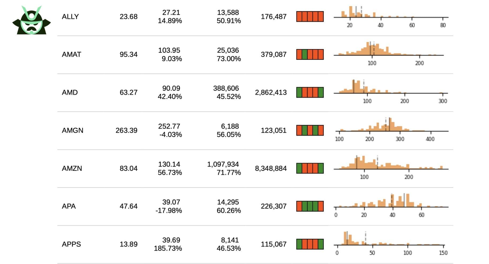

This article explores the multifaceted world of financial derivatives, specifically concentrating on options trading, pin risk, and the role of algorithmic trading in managing these risks. Options trading is a pivotal component of financial markets. It encompasses a variety of strategies that traders employ to hedge positions, speculate on future prices, or enhance portfolio returns. Options are financial instruments that provide the holder the right, but not the obligation, to buy or sell an underlying asset at a specified price before a certain date. This flexibility allows traders to tailor their exposure to market movements, either for risk management or speculative gains.

However, the use of options carries its own set of risks. A notable challenge in options trading is "pin risk," which becomes particularly acute as expiration approaches. Pin risk arises when the underlying asset's price hovers near the option's strike price at expiration, leading to uncertainty about whether the option will be exercised or allowed to expire worthless. This ambiguity poses significant challenges for both options buyers and sellers, potentially resulting in unintended market exposures and financial losses.



In parallel with the rise of complex financial instruments, algorithmic trading has emerged as a crucial tool for managing such risks. Algorithmic trading leverages advanced computational power and sophisticated algorithms to execute trading strategies at high speed and with precision. These algorithms can dynamically adjust traders' positions in response to rapid market fluctuations and have proven invaluable in optimizing trading performance while mitigating risks, including pin risk.

This article will comprehensively cover these elements and analyze their impact on financial markets, offering insights into how traders can navigate the complexities of options trading with greater efficacy.

## Table of Contents

## Understanding Financial Derivatives and Options

Financial derivatives are financial instruments whose value is derived from the performance of an underlying asset. These assets can include stocks, bonds, commodities, currencies, and interest rates. By using derivatives, traders and investors can hedge against risks, speculate on future price movements, or gain exposure to specific asset classes without directly owning the underlying asset.

Options are a specific type of derivative contract that provides the holder with the right, but not the obligation, to buy or sell the underlying asset at a predetermined price on or before a specified expiration date. There are two primary types of options: calls and puts. A call option gives the holder the right to purchase the underlying asset, while a put option gives the holder the right to sell it.

Options are versatile tools used for various purposes, including hedging, speculation, and income generation. For hedging, traders can use options to protect against adverse price movements in the underlying asset. For instance, an investor may purchase put options to safeguard their stock portfolio against potential declines. Conversely, options can be employed for speculative purposes, allowing traders to leverage their positions and potentially amplify returns.

Options trading strategies can be classified into a variety of categories, each with its own risk-reward profile. Some common strategies include:

1. **Calls and Puts**: At the most basic level, buying call options is a bullish strategy, while buying put options is bearish.

2. **Spreads**: These involve buying and selling options of the same class with different strike prices or expiration dates. This approach allows traders to limit their risk while still capitalizing on market movements. Examples include bull spreads, bear spreads, and calendar spreads.

3. **Straddles and Strangles**: These strategies involve buying both a call and a put option with the same expiration date but different strike prices. They are useful when traders anticipate significant market volatility but are uncertain about the direction of the price movement.

Understanding how these strategies work and their associated risks is essential for anyone considering options trading. Familiarity with terms such as moneyness, implied [volatility](/wiki/volatility-trading-strategies), and time decay is crucial. For example, the concept of "moneyness" refers to the intrinsic value of an option relative to the current price of the underlying asset. Options can be in-the-money (ITM), out-of-the-money (OTM), or at-the-money (ATM).

Moreover, options pricing is influenced by factors such as the underlying asset's price, strike price, volatility, time to expiration, and interest rates. Models like the Black-Scholes model or the Binomial options pricing model are frequently used to ascertain the fair value of an option. For instance, the Black-Scholes formula for a call option is:

$$
C = S_0N(d_1) - Xe^{-rt}N(d_2)
$$

where:
- $C$ is the call option price,
- $S_0$ is the current stock price,
- $X$ is the strike price,
- $t$ is the time to expiration,
- $r$ is the risk-free interest rate,
- $N(\cdot)$ is the cumulative distribution function of the standard normal distribution,
- $d_1 = \frac{\ln(S_0 / X) + (r + \sigma^2 / 2)t}{\sigma \sqrt{t}}$,
- $d_2 = d_1 - \sigma \sqrt{t}$,
- $\sigma$ is the volatility of the stock.

Overall, gaining a comprehensive understanding of financial derivatives and options necessitates a grasp of their mechanics and the strategies that utilize them, ensuring informed participation in these complex markets.

## What is Pin Risk in Options Trading?

Pin risk in options trading arises when the market price of the underlying asset hovers near the option’s strike price as the option approaches its expiration date. This situation leads to uncertainty for both option buyers and sellers regarding the likelihood of the options being exercised or assigned.

This form of risk becomes particularly pronounced because it is inherently tied to the behavior of the underlying asset’s price in relation to specific strike prices. When an asset’s price closes at or very near an option’s strike price, it creates ambiguity concerning whether the option will be exercised. This is significant as at-the-money options (options where the strike price is equal or almost equal to the market price of the underlying asset) often see fluctuating probabilities of being exercised. Such uncertainty can leave traders with unintended positions, which can inadvertently affect their market exposure.

For options sellers, the pin risk involves the potential obligation to deliver or purchase the underlying asset based on the exercised option, which might not have been anticipated as the option expiry approached. On the other hand, buyers may be forced to take delivery of the underlying asset when they might have intended to close or roll over their positions before expiry.

To manage pin risk, options traders often engage in hedging strategies as the expiration dates near. For instance, a trader may increase [liquidity](/wiki/liquidity-risk-premium) in their portfolio or adjust their positions to mitigate the risk of ending up with an unwanted position, either long or short. This management might involve using other derivative instruments or adjusting their exposure in the underlying asset.

A simple Python code snippet for calculating the position's delta, which indicates how much the option's price is expected to move with a $1 change in the underlying asset, might be helpful for understanding potential risk exposures:

```python
from scipy.stats import norm
import math

def calculate_delta(S, K, T, r, sigma, option_type='call'):
    d1 = (math.log(S / K) + (r + 0.5 * sigma ** 2) * T) / (sigma * math.sqrt(T))
    if option_type == 'call':
        return norm.cdf(d1)
    elif option_type == 'put':
        return norm.cdf(d1) - 1

# Example usage
S = 50  # Current stock price
K = 50  # Strike price
T = 0.01  # Time to expiration in years (e.g., 0.01 for approximately 3.65 days)
r = 0.01  # Risk-free interest rate
sigma = 0.25  # Volatility
delta = calculate_delta(S, K, T, r, sigma, 'call')
print("Delta of the option:", delta)
```

This code utilizes the Black-Scholes model to estimate the delta of an option, which can inform traders how their positions might be affected by market shifts, especially under conditions of pin risk. Adopting such analytical approaches helps traders reduce the unwanted exposures associated with pin risk, aligning their portfolios more closely with their strategic objectives.

## Algorithmic Trading in Managing Pin Risk

Algorithmic trading leverages advanced computational algorithms and electronic trading platforms to execute complex trading strategies at high speed. This capability is particularly beneficial in managing pin risk, which arises when the underlying asset's price hovers near the option's strike price as expiration approaches. By implementing [algorithmic trading](/wiki/algorithmic-trading) strategies, traders can rapidly adjust their positions in response to price movements, minimizing their exposure to unwanted potential outcomes that pin risk presents.

Key to effective algorithmic trading is the utilization of historical data and predictive analytics. Algorithms analyze vast amounts of historical trading data to identify patterns and predict future scenarios where pin risk might occur. Machine learning models can be trained to forecast the likelihood of price movements that would pin the asset's value near a specific options strike price. For instance, given a large dataset of past stock prices and option strikes, algorithms can calculate the probability of the prices converging at these critical points as expiration nears.

Python, with its powerful libraries like Pandas for data manipulation, Scikit-learn for [machine learning](/wiki/machine-learning), and Numpy for numerical operations, is often employed for these tasks. Below is a simplified example of how one might use Python to analyze stock prices and predict pin scenarios:

```python
import pandas as pd
import numpy as np
from sklearn.ensemble import RandomForestClassifier
from sklearn.model_selection import train_test_split

# Load historical stock data
data = pd.read_csv('stock_data.csv')
X = data[['price', '[volume](/wiki/volume-trading-strategy)', 'volatility']]  # Feature columns
y = data['pin_risk']  # Binary target variable indicating pin scenario

# Train-test split
X_train, X_test, y_train, y_test = train_test_split(X, y, test_size=0.2, random_state=42)

# Build Random Forest model
model = RandomForestClassifier()
model.fit(X_train, y_train)

# Predict pin risk
predictions = model.predict(X_test)
```

Algorithms also facilitate the implementation of hedging strategies, such as the delta-neutral strategy. This particular strategy aims to neutralize the directional risk associated with price movements of the underlying asset. By dynamically adjusting the position's 'delta'—a measure of the sensitivity of the option's price to changes in the price of the underlying asset—algorithms help maintain a balanced positioning against adverse price movements.

The introduction of big data and advancements in AI have significantly bolstered the effectiveness of algorithmic trading in handling complex scenarios, including pin risk. AI models can process and learn from extensive datasets not only to predict potential pin risks but also to craft strategies that can be executed with precision and speed. These advances ensure that traders can better manage their portfolios, reduce exposure to risks like pin risk, and ultimately enhance trading performance.

## Examples and Case Studies of Pin Risk

Consider a scenario involving an options contract for XYZ stock, which has a strike price of $50. If the stock concludes trading at precisely $50 as expiration approaches, it creates an ambiguous situation regarding which options will be exercised or assigned, thus introducing pin risk. This uncertainty requires traders to anticipate potential scenarios and adjust strategies accordingly.

For instance, a trader who is short on 75 put contracts may face considerable exposure if the underlying stock remains near the strike price. Even a marginal fluctuation in the stock price, leading to an exercise or non-exercise of options, could substantially affect their contractual obligations. As expiration approaches, maintaining a hedge becomes crucial to mitigate any unwelcome surprises in the trader's market position.

Case studies have demonstrated the impact of sudden stock price changes on options payoff structures. For example, if a stock price jumps or drops unexpectedly, the intrinsic value of options may dramatically alter the outcome for traders, especially if significant volume is involved. These conditions highlight the necessity of constant vigilance and responsiveness in modifying strategies to manage pin risk effectively.

Institutional investors are sometimes known to employ pinning strategies, which aim to influence the closing price of stocks to converge with specific option strike prices. This could be advantageous in terms of achieving favorable settlements for large positions. However, this technique involves inherent risks and invites regulatory scrutiny, as it borders on market manipulation. These scenarios underscore the critical importance of understanding both the opportunities and the limitations associated with pin risk, emphasizing why robust trading strategies and risk management protocols are vital in options trading.

## Conclusion

Options trading offers lucrative opportunities by allowing traders to hedge positions, speculate on future prices, and enhance portfolio returns. However, it also presents various risks, notably pin risk, which arises when the underlying asset's price is near the option's strike price as expiration approaches. Effectively managing pin risk is essential to avoid unintended market exposure and potential financial loss.

Algorithmic trading has become increasingly important in addressing these challenges. It provides automated and efficient solutions to complex trading scenarios, such as pin risk. With algorithms capable of executing strategies at high speed, traders can quickly adjust their positions in response to market changes, thereby minimizing unwanted price movement exposure. By utilizing historical data and predictive analytics, algorithms can forecast potential pin scenarios and respond with precision.

The impact of continuous improvements in financial technology further enhances these capabilities. Developments in big data analytics and [artificial intelligence](/wiki/ai-artificial-intelligence) contribute to more sophisticated tools for traders, supporting better risk management and strategic decision-making. These technologies enable traders to implement advanced hedging strategies, such as delta neutral, effectively reducing the risk of price movements in the underlying asset.

While derivatives like options can significantly enhance a portfolio, traders must remain cognizant of the potential pitfalls. Having the right tools and knowledge is crucial for managing associated risks effectively. Education and adaptability to market changes are indispensable for anyone looking to successfully navigate the world of financial derivatives. Staying informed and leveraging technological advancements will allow traders to optimize their performance and mitigate risks in the dynamic landscape of options trading.

## References & Further Reading

[1]: Black, F., & Scholes, M. (1973). ["The Pricing of Options and Corporate Liabilities."](https://www.cs.princeton.edu/courses/archive/fall09/cos323/papers/black_scholes73.pdf) Journal of Political Economy, 81(3), 637-654.

[2]: Hull, J. C. (2018). ["Options, Futures, and Other Derivatives."](https://www.semanticscholar.org/paper/Options%2C-Futures%2C-and-Other-Derivatives-Hull/89bdee500c8623864fc9eb7a471546aa713acc44) Pearson Education.

[3]: Espen Gaarder Haug. (2007). ["The Complete Guide to Option Pricing Formulas"](https://www.amazon.com/Complete-Guide-Option-Pricing-Formulas/dp/0071389970). McGraw-Hill.

[4]: Natenberg, S. (1994). ["Option Volatility and Pricing: Advanced Trading Strategies and Techniques."](https://www.amazon.com/Option-Volatility-Pricing-Strategies-Techniques/dp/0071818774) McGraw-Hill.

[5]: Chan, E. (2009). ["Quantitative Trading: How to Build Your Own Algorithmic Trading Business."](https://github.com/ftvision/quant_trading_echan_book) Wiley.

[6]: Cartea, Á., Jaimungal, S., & Penalva, J. (2015). ["Algorithmic and High-Frequency Trading."](https://assets.cambridge.org/97811070/91146/frontmatter/9781107091146_frontmatter.pdf) Cambridge University Press.

[7]: Lopez de Prado, M. (2018). ["Advances in Financial Machine Learning."](https://www.amazon.com/Advances-Financial-Machine-Learning-Marcos/dp/1119482089) Wiley.

[8]: Lhabitant, F.S. (2004). ["The Handbook of Hedge Funds."](https://www.amazon.com/Handbook-Hedge-Funds-Fran%C3%A7ois-Serge-Lhabitant/dp/0470026634) Wiley.