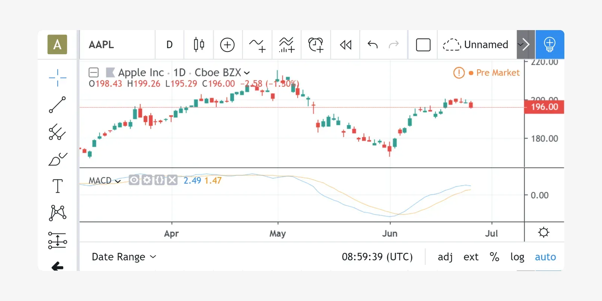

## Table of Contents

## What is Pine Script and why is it used in TradingView?

Pine Script is a programming language created by TradingView, a popular platform for traders and investors. It's designed specifically for creating custom indicators and trading strategies that can be used on TradingView's charts. This means that if you have a unique way of analyzing the market or a special trading rule you want to follow, you can write it in Pine Script and see it in action on your charts.

People use Pine Script in TradingView because it makes it easy to turn their trading ideas into something they can actually use. You don't need to be a professional programmer to start using it, which is great for beginners. Plus, since TradingView has a big community, you can share your scripts with others or use scripts that other people have made. This helps everyone learn and improve their trading strategies.

## How do you start writing your first Pine Script code?

To start writing your first Pine Script code, you need to open TradingView and go to the "Pine Editor." You can find it by clicking on the "Pine Editor" button, usually located at the bottom of the screen. Once you're in the Pine Editor, you'll see a blank space where you can start typing your code. The first thing you should do is write a simple script to get familiar with the basics. A good starting point is to create a simple moving average indicator.

Begin by typing `//@version=5` at the top of your script. This tells TradingView that you're using the latest version of Pine Script. Next, you can define your indicator by typing `indicator("My First Script", overlay=true)`. This line names your indicator and tells TradingView to display it on the chart. Then, you can add a simple moving average by typing `plot(ta.sma(close, 14))`. This line calculates a 14-period simple moving average of the closing prices and plots it on the chart. After you've written these lines, click the "Add to Chart" button to see your moving average on the chart. It's that simple to get started!

## What are the basic syntax rules in Pine Script?

In Pine Script, every script starts with a version declaration, like `//@version=5`, which tells TradingView which version of Pine Script you're using. After that, you need to define what your script does, whether it's an indicator or a strategy. For an indicator, you use `indicator("Name of Indicator", overlay=true)` to name it and decide if it should be shown on top of the chart. For a strategy, you use `strategy("Name of Strategy")` instead. These are the basic building blocks of any Pine Script.

When writing code, you use functions to do things like calculate averages or plot lines on the chart. For example, `plot(ta.sma(close, 14))` calculates and plots a 14-period simple moving average of the closing prices. You can also use variables to store values and use them later in your script. Comments are important too; you can add them with `//` for single-line comments or `/* */` for multi-line comments. This helps you and others understand what your code does.

## How can you plot indicators and overlays using Pine Script?

To plot indicators and overlays using Pine Script, you start by telling TradingView what your script does. If you're making an indicator, you use the `indicator` function at the beginning of your script. This function needs a name for your indicator and whether it should be an overlay, which means it shows on top of the chart. For example, `indicator("My Indicator", overlay=true)` names your indicator and sets it to show on the chart. If you're making a strategy instead, you use `strategy("My Strategy")` to define it.

Once you've set up your indicator or strategy, you can start plotting things on the chart. To plot a line, like a moving average, you use the `plot` function. For example, `plot(ta.sma(close, 14))` calculates a 14-period simple moving average of the closing prices and draws it on the chart. You can plot different types of lines or even shapes by using different functions and settings. This way, you can show your trading ideas visually on the chart, making it easier to see how they work in real time.

## What are the common built-in functions in Pine Script and how are they used?

In Pine Script, there are many built-in functions that help you do things quickly without writing a lot of code. Some common ones are `ta.sma()`, `ta.ema()`, `ta.rsi()`, and `ta.atr()`. These functions calculate things like moving averages, the Relative Strength Index, and the Average True Range. For example, if you want to find a 20-day simple moving average, you just use `ta.sma(close, 20)`. It's easy because you don't need to write all the steps to calculate it yourself. These functions take the hard work out of creating indicators and strategies.

Another set of useful functions are `plot()`, `plotshape()`, and `hline()`. The `plot()` function is used to draw lines on your chart, like the moving average we mentioned before. For example, `plot(ta.sma(close, 20))` will draw a line for the 20-day simple moving average. `plotshape()` lets you put shapes on the chart, which can be useful for marking specific points, like when a price crosses a certain level. And `hline()` draws a horizontal line, which is great for showing support or resistance levels. These functions help you see your trading ideas clearly on the chart.

## How do you create custom functions in Pine Script?

To create a custom function in Pine Script, you start by using the `f_` prefix followed by the name you want to give your function. For example, if you want to make a function that calculates the average of two numbers, you could name it `f_average`. After the name, you write the function's parameters inside parentheses, like `f_average(a, b)`. Then, you use the `=>` symbol to start the function's body, where you write what the function should do. In our example, you would write `f_average(a, b) => (a + b) / 2`. This function takes two numbers, adds them together, and then divides by 2 to find the average.

Once you've defined your custom function, you can use it in your script just like you use built-in functions. For instance, if you want to find the average of the high and low prices of a candle, you could write `f_average(high, low)`. This makes your code easier to read and reuse, especially if you need to do the same calculation in different parts of your script. Custom functions are a powerful way to keep your code organized and make it easier to work with complex ideas.

## What are the strategies for backtesting trading ideas in Pine Script?

Backtesting trading ideas in Pine Script is a way to see how well your trading strategy would have worked in the past. You start by writing your strategy using the `strategy` function at the beginning of your script. Then, you use different functions to set up your entry and exit rules. For example, you might use `strategy.entry` to buy or sell when certain conditions are met, and `strategy.close` to close your positions. After setting up your strategy, you can run the backtest on historical data to see how it would have performed. This helps you understand if your idea is good or if it needs changes.

When you run a backtest, Pine Script shows you results like how much money you would have made or lost, how often you would have traded, and other important numbers. It's a good idea to test your strategy over different time periods and on different markets to make sure it works well in many situations. You can also change the settings of your strategy to see how small changes affect the results. This way, you can keep improving your strategy until you're happy with how it performs. Backtesting is a key part of creating a successful trading strategy because it lets you learn from the past before risking real money.

## How can you optimize your Pine Script code for better performance?

To make your Pine Script code run faster and work better, you need to think about how you write it. One way to do this is by using fewer calculations. If you can do something once and use the result many times, that's better than doing the same calculation over and over. For example, if you need to find a moving average, calculate it once and save it in a variable instead of calculating it every time you need it. Also, try to use built-in functions like `ta.sma()` instead of writing your own because they are made to be fast.

Another way to optimize your code is by keeping it simple and organized. If your code is easy to read, it's easier to find and fix problems. Use comments to explain what your code does, and break big tasks into smaller parts with custom functions. This not only makes your code run faster but also makes it easier to change and improve later. Remember, the simpler and cleaner your code, the better it will perform.

## What are the advanced features of Pine Script, such as alerts and user inputs?

Pine Script has some cool advanced features that can make your trading easier and more fun. One of them is alerts. Alerts let you know when something important happens on your chart, like when a price reaches a certain level or when your indicator gives a signal. You can set them up in your script using the `alertcondition` function. For example, if you want an alert when a moving average crosses above the price, you can write a simple line of code to make it happen. Then, when the condition is met, you get a notification on your phone or computer, so you never miss a trade.

Another great feature is user inputs. These let you change how your script works without having to change the code itself. You use the `input` function to add them to your script. For example, if you have a moving average indicator, you can let users pick the number of periods they want to use. This makes your script more flexible because different people can use it in different ways. Plus, it's easier to test different settings and see how they affect your trading strategy. User inputs and alerts together can make your Pine Script code really powerful and useful for trading.

## How do you debug and troubleshoot errors in Pine Script?

When you're working with Pine Script and something goes wrong, you need to find and fix the problem. This is called debugging. The first thing you can do is look at the error messages that TradingView gives you. These messages tell you where the problem is in your code and what kind of mistake you made. For example, if you forgot to close a parenthesis, the error message will show you exactly where it happened. You can also use the Pine Script Editor's built-in debugger. It lets you go through your code line by line and see what's happening at each step. This can help you spot where things are going wrong.

Another way to troubleshoot is by adding print statements to your code. You can use the `plot` function to show values on the chart or the `label.new` function to display text on the chart. This helps you see what your code is doing and where it might be going wrong. If you're still having trouble, you can ask for help from the TradingView community. There are lots of people who use Pine Script and they might have run into the same problem before. Sharing your code and explaining what's happening can lead to quick solutions. Remember, debugging is a normal part of coding and with practice, you'll get better at finding and fixing errors.

## What are some best practices for writing efficient and readable Pine Script code?

When writing Pine Script code, it's important to keep it simple and easy to understand. Use clear variable names that tell you what they do, like `movingAverage` instead of `ma`. Also, break your code into smaller parts with custom functions. This makes it easier to read and fix if something goes wrong. Don't forget to add comments to explain what your code does. Comments are like notes that help you and others understand your script better. They start with `//` for a single line or `/* */` for multiple lines.

Another good practice is to use built-in functions as much as you can. These functions, like `ta.sma()` for a simple moving average, are made to be fast and work well. If you need to do the same calculation many times, do it once and save the result in a variable. This saves time and makes your code run faster. Also, keep your code organized by grouping similar parts together. This way, it's easier to find and change things later. Remember, the simpler and cleaner your code, the better it will perform and the easier it will be to work with.

## How can you share and publish your Pine Script indicators and strategies on TradingView?

To share and publish your Pine Script indicators and strategies on TradingView, you first need to make sure your script is ready. Once you're happy with it, go to the Pine Editor and click on the "Save" button to save your script. After saving, you can click on the "Publish Script" button. This will open a new window where you can add a title, description, and tags to help others find your script. You can also choose if you want your script to be public or private. If you make it public, anyone can use it, but if you choose private, only you can see it.

After you've filled out all the details, click on the "Publish" button. Your script will then be available on your TradingView profile, and if it's public, other users can find it by searching for it. They can add it to their charts and even give you feedback or suggestions. Sharing your scripts is a great way to help others and learn from the TradingView community. Remember, you can always go back and update your script if you make changes or improvements.

## References & Further Reading

[1]: ["Pine Script Language Tutorial"](https://www.tradingview.com/pine-script-docs/), TradingView

[2]: ["Mastering TradingView Pine Script"](https://www.skillshare.com/en/classes/mastering-tradingview-pine-script-v5/441734558) by Michal Stawicki

[3]: ["Building Winning Algorithmic Trading Systems: A Trader's Journey From Data Mining to Monte Carlo Simulation to Live Trading"](https://www.amazon.com/Building-Winning-Algorithmic-Trading-Systems/dp/1118778987) by Kevin J. Davey

[4]: ["Algorithmic Trading: Winning Strategies and Their Rationale"](https://books.google.com/books/about/Algorithmic_Trading.html?id=CIwCTVqEj4oC) by Ernie Chan

[5]: ["Technical Analysis of the Financial Markets: A Comprehensive Guide to Trading Methods and Applications"](https://www.amazon.com/Technical-Analysis-Financial-Markets-Comprehensive/dp/0735200661) by John J. Murphy