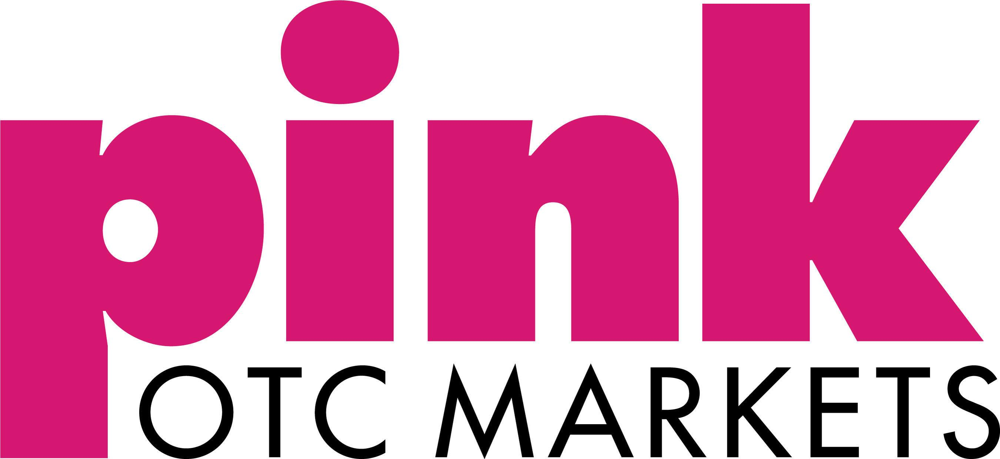

## Table of Contents

## What is Pink: The OTC Open Market?

Pink: The OTC Open Market is a place where people can buy and sell stocks of companies that are not listed on bigger stock exchanges like the New York Stock Exchange or NASDAQ. These companies might be small, new, or from other countries. The Pink Market is run by a company called OTC Markets Group, and it's called "Pink" because it used to be called the "Pink Sheets."

Trading in the Pink Market can be riskier than trading on bigger stock exchanges. This is because the companies in the Pink Market don't have to follow as many rules. They don't have to share as much information about their business, so it can be harder for people to know if the company is doing well or not. Because of this, people need to be careful and do a lot of research before they decide to buy or sell stocks in the Pink Market.

## How does Pink: The OTC Open Market differ from other stock markets?

Pink: The OTC Open Market is different from other stock markets because it focuses on companies that are not listed on major stock exchanges like the New York Stock Exchange or NASDAQ. These companies might be small, starting out, or from other countries. The Pink Market is run by a company called OTC Markets Group, and it got its name from the old "Pink Sheets" that used to list the prices of these stocks.

One big difference is that the companies in the Pink Market don't have to follow as many rules as companies on bigger stock exchanges. They don't have to share as much information about how their business is doing. This can make it harder for people to know if a company is doing well or not. Because of this, trading in the Pink Market can be riskier, and people need to be careful and do a lot of research before they buy or sell stocks there.

In contrast, major stock exchanges have stricter rules that companies must follow. These rules are meant to protect investors by making sure companies share important information about their business. This can make trading on these exchanges feel safer because people have more information to help them make good decisions. So, while the Pink Market offers more choices for trading, it also comes with more risk.

## What types of companies are typically listed on Pink: The OTC Open Market?

The companies you find on Pink: The OTC Open Market are usually ones that are not listed on the big stock exchanges like the New York Stock Exchange or NASDAQ. These companies might be small businesses just starting out, or they could be from other countries. Sometimes, they are companies that used to be on bigger exchanges but got moved to the Pink Market because they didn't meet the rules anymore.

Another type of company you might see on the Pink Market is one that wants to keep a low profile. They might not want to share a lot of information about their business, so they choose the Pink Market because it has fewer rules about what they have to tell people. This can make investing in these companies riskier because you don't get as much information to help you decide if it's a good investment or not.

## How can an investor buy and sell stocks on Pink: The OTC Open Market?

To buy and sell stocks on Pink: The OTC Open Market, an investor needs to use a broker. A broker is someone who helps you buy and sell stocks. Not all brokers let you trade on the Pink Market, so you need to find one that does. Once you have a broker, you can tell them which stocks you want to buy or sell, and they will do the trading for you. You can usually do this online, over the phone, or sometimes in person.

Trading on the Pink Market can be different from trading on bigger stock exchanges. The Pink Market doesn't have as many rules, so it can be harder to find information about the companies you want to invest in. This means you need to do a lot of research before you decide to buy or sell a stock. Also, because the Pink Market is less regulated, there can be more risk involved. So, it's important to be careful and understand the risks before you start trading.

## What are the risks associated with investing in Pink: The OTC Open Market?

Investing in Pink: The OTC Open Market can be riskier than investing in bigger stock exchanges. One big reason is that the companies on the Pink Market don't have to follow as many rules. This means they don't have to share as much information about their business. When companies don't share a lot of information, it can be hard for you to know if they are doing well or not. Without this information, you might make choices based on guesses instead of facts, which can lead to losing money.

Another risk is that the Pink Market can be a place where fraud happens more often. Because it's not watched as closely as bigger markets, some people might try to trick others into buying stocks that are not worth much. This can make it even harder to trust the information you find. So, if you decide to invest in the Pink Market, you need to be extra careful and do a lot of research to make sure you're not falling for a scam.

Overall, the Pink Market can offer more choices for investing, but it comes with higher risks. You might find good opportunities, but you also need to be ready for the chance of losing money. It's important to think carefully and maybe talk to a financial advisor before you start trading on the Pink Market.

## What are the benefits of investing in companies listed on Pink: The OTC Open Market?

One benefit of investing in companies listed on Pink: The OTC Open Market is that you can find opportunities that you might not see on bigger stock exchanges. The Pink Market has a lot of small companies, new businesses, and companies from other countries. This means you can spread your money across different kinds of investments, which can help you grow your money in different ways. If you find a small company that does really well, you could make a lot of money.

Another benefit is that the Pink Market can be a good place to invest in companies that are not on the big stock exchanges but might move there later. Sometimes, a company starts on the Pink Market and then grows big enough to move to a bigger exchange. If you invest in these companies early, you could see your investment grow a lot as the company gets bigger and more well-known. This kind of growth can be exciting and rewarding if you pick the right companies.

## How is the transparency and regulation of Pink: The OTC Open Market compared to major exchanges?

The Pink: The OTC Open Market has less transparency and regulation compared to major stock exchanges like the New York Stock Exchange or NASDAQ. Companies on the Pink Market don't have to follow as many rules about what information they need to share with the public. This means they might not tell you as much about how their business is doing, their finances, or their plans for the future. Because of this, it can be harder for investors to know if a company is doing well or if it's a good investment.

On the other hand, major stock exchanges have stricter rules that companies must follow. These rules are there to protect investors by making sure companies share important information regularly. This includes things like financial reports, updates on their business, and any big changes that could affect their stock price. When companies share this information, it helps investors make better decisions because they have more facts to go on. So, while the Pink Market can offer more investment choices, it also comes with more risk because of the lower level of transparency and regulation.

## What are the different tiers of Pink: The OTC Open Market and what do they signify?

The Pink: The OTC Open Market has different tiers that help investors know how much information a company shares about its business. There are three main tiers: Pink Current Information, Pink Limited Information, and Pink No Information. Each tier tells you something about how much you can trust the information the company gives you. Pink Current Information is the highest tier, where companies share a lot of information, like financial reports and updates about their business. This makes it easier for you to decide if the company is a good investment.

Pink Limited Information is the middle tier, where companies share some information but not as much as the top tier. This can make it harder for you to know if the company is doing well because you don't have all the facts. The lowest tier is Pink No Information, where companies don't share any information at all. This makes it very hard to trust the company and know if it's a good investment. So, the tier a company is in can help you understand how much you can trust the information they give you.

These tiers are important because they help you see the risks involved with investing in a company on the Pink Market. If a company is in the Pink Current Information tier, it might be less risky because you have more information to help you make a good choice. But if a company is in the Pink No Information tier, it's much riskier because you don't know much about the company at all. So, always check the tier of a company before you decide to invest in it on the Pink Market.

## How can one research and evaluate companies listed on Pink: The OTC Open Market?

To research and evaluate companies listed on Pink: The OTC Open Market, start by checking the tier the company is in. The Pink Market has three tiers: Pink Current Information, Pink Limited Information, and Pink No Information. Companies in the Pink Current Information tier share the most information about their business, like financial reports and updates. This makes it easier to understand if they are doing well. Companies in the Pink Limited Information tier share some information, but not as much, so it can be harder to get a full picture. Companies in the Pink No Information tier don't share any information, which makes it very risky to invest in them. Knowing the tier can help you decide how much you can trust the information you find.

Next, look for any news or articles about the company. You can use websites like Google News or financial news sites to find out what people are saying about the company. Sometimes, you can find information on the company's own website or social media pages. Also, talk to other investors or join online forums where people discuss the Pink Market. They might share tips or warn you about companies to avoid. It's important to gather as much information as you can from different places to make a good decision. Remember, the Pink Market can be riskier than bigger stock exchanges because companies don't have to share as much information, so always be careful and do a lot of research before you invest.

## What are some successful case studies of companies that started on Pink: The OTC Open Market?

One successful company that started on Pink: The OTC Open Market is Monster Beverage Corporation. They started out selling energy drinks on the Pink Market. Over time, they grew bigger and shared more information about their business. This helped them move to bigger stock exchanges like NASDAQ. Now, Monster Beverage is a well-known company and their stock price has gone up a lot. People who invested in them early on the Pink Market made a lot of money.

Another example is Tesla, Inc. Before it became famous for electric cars, Tesla was on the Pink Market. They used the Pink Market to raise money and grow their business. As Tesla got bigger and started sharing more information, they moved to the NASDAQ. Today, Tesla is a very successful company and its stock price has grown a lot. Early investors in Tesla on the Pink Market saw big returns on their investment.

## How do market makers function within Pink: The OTC Open Market?

Market makers in the Pink: The OTC Open Market are important because they help people buy and sell stocks. They do this by always being ready to buy or sell certain stocks. When you want to buy a stock, the market maker will sell it to you. When you want to sell a stock, the market maker will buy it from you. This makes it easier for people to trade stocks because there is always someone ready to make a trade. Market makers make money by selling stocks at a slightly higher price than they buy them, which is called the "spread."

The Pink Market can be less busy than bigger stock exchanges, so market makers are even more important here. They help keep the market running smoothly by making sure there are always buyers and sellers. Without market makers, it would be harder for people to trade stocks on the Pink Market because they might not find someone to trade with. So, market makers play a big role in making sure the Pink Market works well for everyone.

## What future trends or regulatory changes might impact Pink: The OTC Open Market?

In the future, there could be more rules for companies on the Pink: The OTC Open Market. Right now, these companies don't have to share as much information as companies on bigger stock exchanges. But if more rules come, companies might have to tell people more about their business, like how much money they are making or losing. This could make the Pink Market safer for people to invest in because they would have more information to help them decide. But it might also make it harder for some small companies to stay on the Pink Market if they can't follow the new rules.

Another trend that could affect the Pink Market is technology. More and more people are using apps and websites to buy and sell stocks. This could make it easier for people to trade on the Pink Market. Also, new technology like blockchain could change how stocks are traded. Blockchain could make trading faster and safer. But it could also bring new risks that people need to watch out for. So, while technology could make the Pink Market better, it could also make it more complicated.

## What are the mechanics of open market trading?

The Pink market is a segment of the Over-the-Counter (OTC) marketplace where trading occurs for securities not listed on major exchanges. The execution of trades within this market follows distinct procedures due to its decentralized nature. Unlike centralized exchanges, the Pink Sheets operate through a network of broker-dealers who play a critical role in facilitating trade execution.

### Role of Broker-Dealers

Broker-dealers in the Pink market act as intermediaries between buyers and sellers. They are integral to the trade execution process, as they quote both bid and ask prices, thereby creating a quasi-auction mechanism. When a potential buyer expresses interest in a Pink Sheet security, the broker-dealer presents the bid-ask spread, allowing the buyer to make an informed decision. The broker-dealer then executes the trade by matching the buyer and seller within their network or accessing another broker-dealer's inventory.

Broker-dealers must be registered with the Financial Industry Regulatory Authority (FINRA), ensuring a basic level of regulatory oversight. Despite this oversight, these securities often have less stringent reporting requirements, leading to potential information asymmetries that investors must navigate.

### Influence of Market Makers

Market makers are specialized broker-dealers who significantly impact liquidity and pricing within the Pink Sheets. They are responsible for maintaining an orderly and efficient market by continuously quoting buy and sell prices for securities. By committing to buy and sell a security at publicly quoted prices, market makers provide liquidity, enabling investors to execute trades without excessive delay.

Market makers profit from the spread between the bid and ask prices. It incentivizes them to maintain competitive spreads, facilitating smoother trading conditions. However, given the low [volume](/wiki/volume-trading-strategy) and higher [volatility](/wiki/volatility-trading-strategies) typical of Pink Sheet securities, these spreads can be wider compared to those on more regulated exchanges.

To optimize their operations, some market makers employ [algorithmic trading](/wiki/algorithmic-trading) strategies, using mathematical models and automated systems to adjust prices swiftly in response to market dynamics. Python, for instance, is often used for such algorithmic trading due to its powerful libraries like NumPy and pandas, which allow for complex data analysis and modeling.

The formula for a simple moving average (SMA), often used in algorithmic trading, is:

$$
\text{SMA} = \frac{\sum_{i=1}^{n} \text{Price}_i}{n}
$$

where $\text{Price}_i$ is the price at time $i$ and $n$ is the number of time periods considered.

This elucidation of the Pink market highlights the significant roles played by broker-dealers and market makers, underscoring the distinct mechanics of trade execution within this unique segment of the OTC marketplace.

## What is Algorithmic Trading in the OTC Markets?

Algorithmic trading, also known as automated trading, employs computer algorithms to execute trades based on predefined criteria and strategies without human intervention. Its prevalence in the Over-the-Counter (OTC) markets, including the Pink Sheets, has increased significantly due to advances in technology and the appeal of streamlined trading operations.

One of the primary benefits of algorithmic trading is its speed. Algorithms can process vast amounts of data and execute trades in milliseconds, far quicker than any human trader. This rapid execution can be crucial in the OTC markets, where price fluctuations can be less predictable than in more regulated environments. Accurate execution of trades is another significant advantage. Algorithms are designed to follow specific instructions that reduce the likelihood of errors that might occur due to human emotion or fatigue, such as data entry mistakes or oversight of critical information.

Moreover, algorithms can handle complex strategies that involve a large number of variables. For example, an algorithm might involve trades based on statistical [arbitrage](/wiki/arbitrage), tracking discrepancies between the prices of different securities to capitalize on market inefficiencies. This method could include formulas like:

$$
\text{Expected Return} = \sum (\text{Probability of Outcome} \times \text{Outcome})
$$

Implementing such strategies manually is not only time-consuming but also error-prone.

However, employing algorithmic trading within the Pink Sheets carries specific challenges and risks. The Pink Sheets segment is characterized by lower liquidity compared to traditional exchanges. This can affect the ability of algorithms to effectively execute trades at desired price points, potentially leading to slippage, where the executed price differs from the expected one. This problem can be exacerbated in the less regulated environment of the Pink Sheets, where information asymmetry is more prevalent.

Another risk is the susceptibility to market manipulation and fraud, given the reduced transparency in Pink Sheets trading. Algorithms relying on historical and real-time data to make decisions might be misled by artificially altered price movements or misleading company reports. 

The architecture of the trading algorithms must also account for the volatility and diverse strategies needed to mitigate these peculiar risks. This may include implementing stop-loss and take-profit levels or dynamically adjusting exposure based on real-time market conditions, coded as:

```python
def adjusted_trade_size(volatility, capital):
    base_trade_size = 100  # example base unit
    risk_multiplier = 0.01  # example risk factor
    return base_trade_size * (1 + risk_multiplier * volatility) * capital

# Example usage
current_volatility = 0.2  # represents 20%
available_capital = 5000  # USD
trade_size = adjusted_trade_size(current_volatility, available_capital)
```

Ultimately, while algorithmic trading offers enhanced speed and accuracy, it requires careful planning and adaptability to the nuances of the OTC markets like the Pink Sheets to effectively mitigate inherent risks.

## References & Further Reading

[1]: SEC. (2021). ["Amendments to Rule 15c2-11 under the Securities Exchange Act of 1934."](https://www.securitieslawyer101.com/2021/what-you-need-to-know-as-the-september-28-amended-rule-15c2-11-date-approaches/)

[2]: OTC Markets Group. ["Guide to OTCQX, OTCQB, and Pink Markets"](https://www.otcmarkets.com/)

[3]: Fabozzi, F. J. (2006). ["Handbook of Financial Markets: Dynamics and Evolution"](https://www.sciencedirect.com/book/9780123742582/handbook-of-financial-markets-dynamics-and-evolution). Elsevier.

[4]: Hasbrouck, J., & Saar, G. (2013). ["Low-latency trading."](https://www.sciencedirect.com/science/article/abs/pii/S1386418113000165) Journal of Financial Markets, 16(4), 646-679.

[5]: Harris, L. (2003). ["Trading and Exchanges: Market Microstructure for Practitioners"](https://academic.oup.com/book/52292). Oxford University Press.