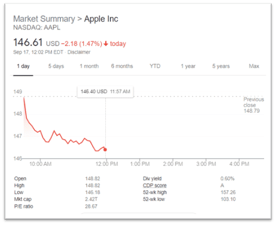

## Table of Contents

## What is 'Pinning the Strike' in options trading?

'Pinning the Strike' is a term used in options trading that describes a situation where the price of an underlying stock stays very close to the strike price of an option as it nears expiration. This happens because many traders and market makers are trying to manage their options positions. They might buy or sell the stock to avoid having their options exercised or assigned, which can cause the stock price to hover around the strike price.

This phenomenon is more likely to occur when there is a large number of options contracts at a particular strike price. The pressure from traders trying to close or adjust their positions can keep the stock price pinned to that strike. It's important for traders to be aware of this because it can affect their trading decisions, especially as options near their expiration date.

## How does 'Pinning the Strike' affect option buyers and sellers?

Pinning the Strike can be tricky for option buyers. If you bought an option and the stock price stays right at the strike price, your option might not make you much money. This is because the option might not go "in the money" enough to be worth exercising. For example, if you bought a call option with a strike price of $50 and the stock stays at $50, your option might not be worth much more than what you paid for it. So, you might lose money or just break even.

For option sellers, Pinning the Strike can be good news. If you sold an option and the stock price stays at the strike price, the option might expire worthless. This means you get to keep all the money you got from selling the option. For example, if you sold a put option with a strike price of $50 and the stock stays at $50, the buyer of the option won't exercise it, and you keep the premium. But, it's not always a win because if the stock moves away from the strike price, you could still lose money.

## What causes the 'Pinning the Strike' phenomenon?

Pinning the Strike happens because a lot of people are trying to manage their options as they get close to expiring. When there are many options at one strike price, traders and market makers start buying and selling the stock to avoid having their options used. They want to make sure they don't lose money, so they do what they can to keep the stock price right at the strike price.

This can make the stock price stay very close to the strike price, even if it would normally move around more. It's like everyone is pushing and pulling on the stock price to keep it in one spot. This can be frustrating for some traders but helpful for others, depending on what options they have bought or sold.

## Can you explain the concept of 'max pain' in relation to 'Pinning the Strike'?

Max pain is a term used in options trading that refers to the price at which the underlying stock would cause the most financial pain to the largest number of option holders at expiration. This is usually the strike price where the total value of all options (both calls and puts) would be the lowest if they expired worthless. When people talk about max pain, they're often talking about how the stock price might move towards this point as options near their expiration date.

The idea of max pain is closely related to Pinning the Strike. When a stock's price gets pinned to a certain strike price, it's often because that's the point of max pain. Traders and market makers might push the stock price towards this point to make as many options as possible expire worthless. This can save them money because they won't have to pay out on those options. So, Pinning the Strike can happen because of the forces trying to reach the max pain point.

## What are some common strategies traders use to take advantage of 'Pinning the Strike'?

Traders often use a strategy called "gamma scalping" to take advantage of Pinning the Strike. This involves buying options and then buying or selling the underlying stock to balance out the position. As the stock price moves towards the strike price, the value of the options changes quickly. Traders can make money by constantly adjusting their stock position to keep it balanced. This can be profitable if the stock stays pinned to the strike price because the options will keep changing in value, allowing the trader to make small profits from these adjustments.

Another strategy is to sell options that are at the strike price where Pinning the Strike is likely to happen. If the stock stays pinned to that strike price, the options will expire worthless, and the trader gets to keep the money they made from selling the options. This can be a good way to make money if the trader thinks the stock will stay at that price. However, it's risky because if the stock moves away from the strike price, the trader could lose money.

Some traders also use a strategy called "straddles" or "strangles" to take advantage of Pinning the Strike. They buy both a call and a put option at the same strike price (straddle) or at different strike prices (strangle). If the stock stays pinned to the strike price, the options might not make much money, but if the stock moves away from the strike price, one of the options could become valuable. This can be a way to bet on the stock moving away from the pinned price, which can be profitable if the trader guesses right.

## How can 'Pinning the Strike' influence the decision to exercise or sell an option?

When a stock is pinned to a strike price, it can make it hard for option buyers to decide what to do. If you bought an option and the stock stays right at the strike price, your option might not be worth much more than what you paid for it. This means you might not make any money if you exercise the option. So, you might choose to sell the option before it expires to get some money back, even if it's less than what you hoped for. Or, you might just let the option expire worthless if selling it won't give you much.

For option sellers, Pinning the Strike can be a good thing. If you sold an option and the stock stays at the strike price, the option might expire worthless. This means you get to keep all the money you got from selling the option. So, you might decide not to do anything and just let the option expire. But, if the stock starts to move away from the strike price, you might need to buy back the option to avoid losing money if it gets exercised.

## What role does market manipulation play in 'Pinning the Strike'?

Market manipulation can play a big role in Pinning the Strike. Some big traders or market makers might try to push the stock price to stay right at the strike price on purpose. They do this because it can make a lot of options expire worthless, and that can save them money. For example, if a lot of people have options at a $50 strike price, these traders might buy and sell the stock to keep it at $50. This is a way to control the market and make sure they don't lose money on the options they sold.

This kind of manipulation is tricky because it's hard to prove. Regulators watch for it, but it can be hidden among all the normal buying and selling that happens in the market. If traders are caught manipulating the market, they can get in big trouble. But because it's hard to catch, some might still try it, especially when a lot of money is on the line with options expiring.

## How does the volume and open interest of options at a particular strike price contribute to 'Pinning the Strike'?

The volume and open interest of options at a particular strike price can make Pinning the Strike more likely to happen. Volume is how many options are being bought and sold, and open interest is how many options are still open and haven't been closed yet. When there are a lot of options at one strike price, it means a lot of people are interested in that price. This can make the stock price stay close to that strike price because traders and market makers are trying to manage their options. They might buy or sell the stock to keep it at that price so their options don't get used.

If there's a high volume and open interest at a certain strike price, it can create a lot of pressure on the stock price. Traders who sold options want them to expire worthless, so they might push the stock price towards that strike price. On the other hand, traders who bought options might try to move the stock price away from the strike price to make their options worth more. All this buying and selling can keep the stock price pinned to the strike price, especially as the options get close to expiring.

## What are the historical examples where 'Pinning the Strike' was observed?

One famous example of Pinning the Strike happened with Apple Inc. (AAPL) stock. In October 2018, as the monthly options were about to expire, Apple's stock price stayed very close to the $215 strike price. A lot of options were at this price, and traders were trying to keep the stock at $215 so their options would expire worthless. This showed how Pinning the Strike can happen when many options are at one price and traders work to keep the stock there.

Another time Pinning the Strike was seen was with Tesla Inc. (TSLA) in December 2020. As the options were expiring, Tesla's stock price stayed right around the $600 strike price. There were a lot of options at this price, and traders were pushing the stock to stay at $600. This example showed how big the effect of Pinning the Strike can be, especially with a stock that a lot of people are watching and trading.

## How can traders predict when 'Pinning the Strike' is likely to occur?

Traders can predict when Pinning the Strike might happen by looking at how many options are at a certain strike price. If there are a lot of options at one price, it's more likely that the stock will stay close to that price as the options get close to expiring. Traders can check the volume and open interest of options to see where the big numbers are. If they see a lot of options at one strike price, they might guess that the stock will try to stay at that price.

Another way to predict Pinning the Strike is to watch the stock's price as it gets close to the options' expiration date. If the stock starts to stay very close to a certain strike price, it might be because of Pinning the Strike. Traders can also look at past times when the stock was pinned to a strike price and see if it happens again at similar times or prices. By keeping an eye on these things, traders can make better guesses about when Pinning the Strike might happen.

## What are the psychological factors that contribute to 'Pinning the Strike'?

Pinning the Strike can be influenced a lot by how traders feel and think. When a lot of people have options at one price, they might get worried about losing money if the stock moves away from that price. This worry can make them trade the stock to keep it at the strike price. They want to avoid losing money on their options, so they do what they can to make sure the options expire worthless. This fear and the need to protect their money can make the stock stay pinned to the strike price.

Another psychological factor is the hope that traders have. Some traders might think that if they can just keep the stock at the strike price, they will make money from the options they sold. This hope can make them trade a lot to keep the stock at that price. When a lot of traders are hoping for the same thing, their actions can add up and make the stock stay pinned to the strike price. So, both fear and hope can play a big role in making Pinning the Strike happen.

## How does 'Pinning the Strike' impact the overall market dynamics on expiration day?

On expiration day, Pinning the Strike can make the stock market act a little strange. When a lot of options are about to expire at one price, traders and market makers might try to keep the stock at that price. They do this because it can save them money if the options expire worthless. This can make the stock price stay very close to the strike price, even if it would normally move around more. It's like everyone is pushing and pulling on the stock to keep it in one spot.

This can make the market feel more tense on expiration day. Traders might be more nervous because they're trying to guess what the stock will do. If a lot of people are trying to keep the stock at one price, it can make other traders think twice before buying or selling. This can make the market a bit unpredictable, but it's all because of how everyone is trying to manage their options and avoid losing money.

## References & Further Reading

[1]: Buehler, H., Gsell, M., & Horvath, P. (2015). ["Algorithmic Trading and Market Microstructure."](https://papers.ssrn.com/sol3/papers.cfm?abstract_id=3657366) Quantitative Finance.

[2]: Hull, J. C. (2009). ["Options, Futures, and Other Derivatives."](https://www.amazon.com/Options-Futures-Other-Derivatives-9th/dp/0133456315) Pearson Education.

[3]: Carr, P., & Wu, L. (2009). ["Variance Risk Premia."](https://academic.oup.com/rfs/article-abstract/22/3/1311/1581057) The Review of Financial Studies, 22(3), 1311-1341.

[4]: Harris, J. (2003). ["Trading and Exchanges: Market Microstructure for Practitioners."](https://www.amazon.com/Trading-Exchanges-Market-Microstructure-Practitioners/dp/0195144708) Oxford University Press.

[5]: Hasbrouck, J. (2007). ["Empirical Market Microstructure: The Institutions, Economics, and Econometrics of Securities Trading."](https://academic.oup.com/book/52241) Oxford University Press.