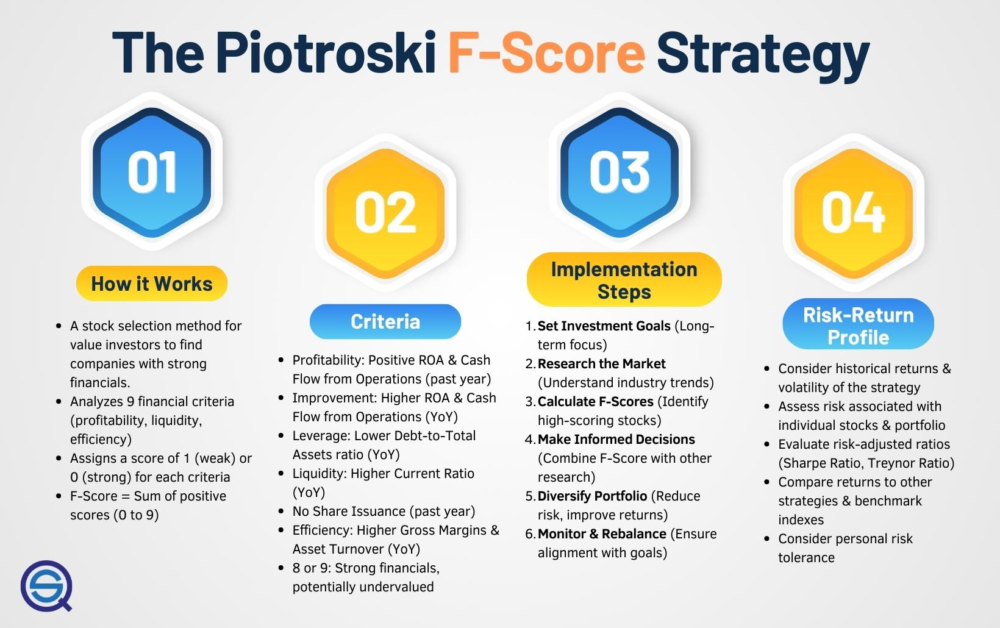

The Piotroski F-Score is a widely recognized financial analysis tool that plays a pivotal role in algorithmic trading, providing traders with a method to evaluate company health and uncover promising investment opportunities. Created by Professor Joseph Piotroski, this scoring system is grounded in a set of fundamental financial criteria that collectively paint a picture of a company's financial well-being. The F-Score is particularly beneficial as it distills complex financial statements into a simple score ranging from 0 to 9, making it accessible for both novice and experienced traders.

This article examines the application of the Piotroski F-Score in the context of algorithmic trading, underlining its relevance and practical uses. By evaluating a company's financial health through profitability, leverage, and operational efficiency metrics, the F-Score aids traders in making more informed investment decisions. We will explore how traders can leverage the F-Score to refine their strategies, providing insights into its straightforward application and potential benefits, such as improved risk management and investment returns.



Moreover, the incorporation of historical backtesting results serves to validate the effectiveness of the Piotroski F-Score as a reliable tool in algo trading environments. These results underscore the practical value of the F-Score in identifying companies with robust financial fundamentals and assessing their potential for sound investment decisions.

Lastly, the discussion will extend to implementing the Piotroski F-Score within an investment portfolio, focusing on its risk-return profile. This encompasses understanding how to maintain a strategically balanced portfolio by integrating high F-Score stocks, thereby optimizing returns while managing risk. As a comprehensive tool, the Piotroski F-Score offers financial analysts and traders a data-driven approach to navigating the complexities of the financial market.

## Table of Contents

## Understanding the Piotroski F-Score

Developed by Professor Joseph Piotroski, the Piotroski F-Score is a nine-point scoring system designed to assess the financial health of a company using a combination of financial ratios. This methodology aims to identify companies with strong financial fundamentals, which are particularly attractive to investors focused on value stocks. By evaluating key financial factors such as profitability, leverage, and operational efficiency, the F-Score assigns an overall score ranging from 0 to 9.

### Components of the Piotroski F-Score

1. **Profitability Factors**: 
   - **Return on Assets (ROA)**: A positive ROA indicates efficient asset use in generating profits.
   - **Operating Cash Flow (OCF)**: Positive cash flow from operations signals good cash generation ability.
   - **Change in ROA**: An improvement in ROA over the previous year suggests enhancing financial health.
   - **Accrual Ratio**: Measured as the difference between net income and cash flow from operations, a lower accrual ratio is generally favorable, indicating higher cash basis profitability.

2. **Leverage, Liquidity, and Source of Funds**:
   - **Change in Leverage (Long-term Debt Ratio)**: A reduction in leverage, or the ratio of total long-term debt to average total assets, is a positive indicator of decreasing financial risk.
   - **Change in Current Ratio**: An increase in the current ratio implies improved short-term liquidity.
   - **Equity Offering**: Companies refraining from equity offerings are viewed positively, as it suggests adequate financing through operations.

3. **Operational Efficiency**:
   - **Change in Gross Margin**: An increasing gross margin indicates improving cost management or growing revenue.
   - **Change in Asset Turnover**: A growing asset turnover ratio signifies better use of company assets to drive sales.

A higher Piotroski F-Score implies stronger corporate fundamentals, supporting algorithmic traders who require reliable, objective financial performance measures to make informed investment decisions. The scoring system's structured approach provides consistent criteria ensuring comparable evaluations across diverse securities. This uniformity is crucial for developing robust [algorithmic trading](/wiki/algorithmic-trading) strategies, enabling investors to systematically filter stocks based on quantifiable financial health metrics.

Python implementation to compute a simple F-Score can start with the following pseudo-code structure, collecting financial ratios from a data service:

```python
def calculate_piotroski_f_score(stock_data):
    f_score = 0

    # Profitability
    if stock_data['roa'] > 0:
        f_score += 1
    if stock_data['ocf'] > 0:
        f_score += 1
    if stock_data['roa'] > stock_data['prev_roa']:
        f_score += 1
    if stock_data['ocf'] > stock_data['net_income']:
        f_score += 1

    # Leverage, Liquidity, and Source of Funds
    if stock_data['leverage'] < stock_data['prev_leverage']:
        f_score += 1
    if stock_data['current_ratio'] > stock_data['prev_current_ratio']:
        f_score += 1
    if not stock_data['equity_offering']:
        f_score += 1

    # Operational Efficiency
    if stock_data['gross_margin'] > stock_data['prev_gross_margin']:
        f_score += 1
    if stock_data['asset_turnover'] > stock_data['prev_asset_turnover']:
        f_score += 1

    return f_score
```

Such methodology enhances the ability to pinpoint robust value stock candidates, paving the way for sophisticated, risk-adjusted portfolio construction.

## Benefits of the Piotroski F-Score in Trading

The Piotroski F-Score is notable for its simplicity and broad applicability as a tool for assessing the financial health of companies. This scoring system stands out due to its ease of application, making it accessible to both individual traders and institutional investors. One of the key benefits of the F-Score is its empirical backing; several studies have demonstrated its potential for outperforming traditional stock selection methods. For example, research has shown that portfolios constructed using high F-Score stocks tend to yield higher returns compared to those selected through conventional approaches (Piotroski, 2000).

A particularly appealing aspect of the F-Score is its requirement for minimal updates. Once calculated, the score generally needs revisions only on an annual basis. This characteristic renders the F-Score low-maintenance, offering a time-efficient solution for investors who may not have the resources to conduct frequent in-depth analyses. 

By focusing only on financially robust companies, the F-Score effectively reduces investment risk. It aims to exclude firms with weak financials, thereby potentially minimizing exposure to adverse market events. This focus on strong fundamentals aids in achieving a more stable portfolio performance over time. Additionally, the F-Score can serve as a diversification tool. By identifying a range of companies across different sectors that exhibit high F-Scores, investors can create a well-diversified portfolio, mitigating sector-specific risks while positioning themselves to capture a variety of growth opportunities.

Overall, the integration of the Piotroski F-Score into investment strategies not only simplifies the decision-making process but also fosters a more prudent approach to stock selection.

## Creating a Robust Trading Strategy with the F-Score

Creating a robust trading strategy utilizing the Piotroski F-Score involves systematic planning and integration with broader market analysis tools. The primary goal is to align investment objectives with the F-Score methodology, ensuring that the strategy is both effective and adaptable in various market conditions.

Clear investment goals are the foundation of a successful strategy. These goals will dictate the selection criteria and risk tolerance for the portfolio. By defining specific objectives, traders can tailor the application of the F-Score to suit their desired outcomes, whether focusing on capital appreciation, income generation, or portfolio growth. Understanding the broader market landscape is also essential. Awareness of economic indicators, sector trends, and macroeconomic conditions allows investors to better interpret F-Score results in a context that reflects market realities.

Regular calculation of F-Scores for a portfolio of stocks is crucial in identifying potential investment opportunities. The F-Score, being a nine-point system evaluating financial health through measures like profitability, financial leverage, and efficiency, requires periodic updates to ensure its applicability. The formula for the F-Score can be expressed as:

$$
F = P + L + E
$$

Where:
- $P$ represents profitability factors,
- $L$ denotes leverage/liquidity factors,
- $E$ includes efficiency factors.

These components are assessed using financial data from companies, typically sourced from financial statements available in databases.

Using the F-Score in combination with other research tools enhances decision-making. Technical analysis, [fundamental analysis](/wiki/fundamental-analysis), and economic forecasts can provide a broader perspective on the potential risks and rewards associated with high F-Score stocks. This integrative approach ensures that decisions are based on a comprehensive understanding of both company-specific and market-wide factors. 

Ensuring diversification is another key element. While F-Score can help identify companies with strong fundamentals, including a mix of growth investments along with high F-Score stocks can optimize returns. Diversification mitigates risk by spreading investment across various industries and sectors, reducing the impact of a downturn in any single market segment.

Implementing a robust trading strategy with the F-Score can be augmented by using programming tools such as Python. For instance, using libraries like pandas and numpy, traders can automate the calculation of F-Scores and [backtesting](/wiki/backtesting) strategies to refine portfolio selections. Here's a simple Python code snippet for calculating the F-Score:

```python
import pandas as pd

# Assuming df is a pandas DataFrame containing financial ratios for companies
def calculate_f_score(df):
    df['profitability'] = df['ROA'] + df['CFO'] + df['ROA_Delta']
    df['leverage'] = df['Leverage_Delta'] + df['liquidity'] + df['equity']
    df['efficiency'] = df['margin'] + df['asset_turnover']

    df['f_score'] = df['profitability'] + df['leverage'] + df['efficiency']
    return df

# Example DataFrame structure
example_data = {'ROA': [1, 2, 3], 'CFO': [1, 0, 1], 'ROA_Delta': [0, 1, 0], 
               'Leverage_Delta': [1, 1, 1], 'liquidity': [1, 1, 0], 'equity': [1, 0, 1],
               'margin': [1, 0, 1], 'asset_turnover': [0, 1, 1]}
df = pd.DataFrame(example_data)

df_with_f_scores = calculate_f_score(df)
print(df_with_f_scores[['f_score']])
```

Incorporating such automated methods streamlines the process, ensuring that the trading strategy is both efficient and scalable. By following these guidelines, investors can craft a strategy that leverages the strength of the Piotroski F-Score to achieve their financial objectives.

## Analyzing Financial Ratios through the F-Score

The Piotroski F-Score leverages financial ratios to provide a comprehensive assessment of a company's financial health. These ratios are categorized into three primary areas: profitability, [liquidity](/wiki/liquidity-risk-premium), and leverage. Understanding these metrics is essential for investors using the F-Score to identify strong investment candidates.

Profitability serves as a fundamental indicator of a company's ability to generate earnings relative to its expenses and other relevant costs. In the context of the F-Score, key profitability ratios include Return on Assets (ROA) and operating cash flow. ROA is calculated as:

$$
\text{ROA} = \frac{\text{Net Income}}{\text{Total Assets}}
$$

A positive ROA suggests efficient asset use, contributing to a higher F-Score.

Liquidity ratios assess a company's ability to meet its short-term obligations. The current ratio and the quick ratio are commonly used to measure liquidity. The current ratio, for instance, is calculated as:

$$
\text{Current Ratio} = \frac{\text{Current Assets}}{\text{Current Liabilities}}
$$

Liquidity analysis within the F-Score framework can highlight companies with sound short-term financial positions.

Leverage ratios evaluate the degree to which a company is using borrowed money. The debt-to-equity ratio, which compares a company’s total liabilities to its shareholder equity, is a key leverage indicator:

$$
\text{Debt-to-Equity Ratio} = \frac{\text{Total Liabilities}}{\text{Shareholder's Equity}}
$$

A lower ratio is generally favorable, indicating less reliance on debt, thus enhancing the F-Score.

To compute these ratios for desired stocks, financial databases such as Bloomberg, Yahoo Finance, or others can be utilized. These platforms allow investors to extract necessary financial figures, facilitating the calculation of the respective ratios.

Once calculated, these ratios should be compared against industry averages and historical trends to evaluate a company's ongoing financial performance. Such comparative analysis helps investors understand whether a company's financial health is above or below industry norms.

By consistently analyzing these financial ratios, investors can effectively identify financially sound stocks. This methodical approach to evaluating potential investments through the Piotroski F-Score enhances the likelihood of incorporating robust companies into an investment portfolio, ultimately contributing to more informed investment decisions.

## Maximizing Returns Using the Piotroski F-Score

The Piotroski F-Score is a potent tool in stock screening that aids in identifying stocks with high growth potential. To maximize returns using this scoring system, the F-Score should be implemented strategically within the stock selection process, providing a basis for identifying high-potential investment opportunities.

Complementing the F-Score with comprehensive market research and taking into account current economic trends is essential. This involves evaluating macroeconomic conditions, industry-specific developments, and consumer behavior patterns that can impact stock performance. Traders should integrate secondary analysis tools such as technical indicators and economic reports to enhance their insights beyond the F-Score's financial health assessment.

Periodically reviewing and updating the F-Score evaluations is vital to ensure they reflect the most recent financial data. Financial performance is dynamic, as companies frequently release quarterly and annual results that can affect their F-Scores. Traders should set regular intervals, such as quarterly, to recalculate F-Scores, thus maintaining alignment with the latest data and adapting their portfolios accordingly.

Strategic diversification across stocks with high F-Scores from both growth and value categories can enhance risk-adjusted returns. Growth stocks typically offer higher returns due to rapid expansion, whereas value stocks provide stability, often being undervalued by the market. By balancing a portfolio with both high F-Score growth and value stocks, traders can achieve desired returns while mitigating risks associated with market fluctuations.

To illustrate the implementation of this strategy, consider the following Python pseudocode which demonstrates periodic F-Score evaluation and diversification:

```python
import pandas as pd

# Sample data: stock F-Scores and categories
data = {'Stock': ['AAPL', 'MSFT', 'GOOGL', 'XOM', 'JNJ'],
        'F_Score': [8, 7, 9, 6, 8],
        'Category': ['Growth', 'Growth', 'Growth', 'Value', 'Value']}

df = pd.DataFrame(data)

# Define threshold for high F-Score
F_SCORE_THRESHOLD = 7

# Function to select high F-Score stocks
def select_high_f_score_stocks(df, f_score_threshold):
    return df[df['F_Score'] >= f_score_threshold]

# Select high F-Score stocks
high_f_score_stocks = select_high_f_score_stocks(df, F_SCORE_THRESHOLD)

# Diversify portfolio
growth_stocks = high_f_score_stocks[high_f_score_stocks['Category'] == 'Growth']
value_stocks = high_f_score_stocks[high_f_score_stocks['Category'] == 'Value']

print("Selected Growth Stocks:")
print(growth_stocks)

print("Selected Value Stocks:")
print(value_stocks)
```

In this example, the code identifies stocks with an F-Score greater than or equal to 7, categorizing them as either growth or value stocks. Such categorization aids traders in diversifying their portfolios effectively.

By continually updating F-Score evaluations and integrating them with other analytical perspectives, traders can make informed decisions, optimize their trading frameworks, and ultimately maximize returns while managing risk.

## Backtesting the Piotroski F-Score Strategy

Backtesting helps in evaluating the effectiveness of the Piotroski F-Score strategy by simulating past trading scenarios to understand potential outcomes. This involves gathering historical financial data for a diverse set of stocks to calculate retrospective F-Scores. Public financial databases such as Compustat or Bloomberg provide comprehensive datasets necessary for this process. The goal is to say how stocks with varying F-Scores have performed historically, offering insights into the strategy's potential future effectiveness.

To design a hypothetical portfolio, one starts by selecting stocks based on their historical F-Scores. High F-Score stocks indicate strong fundamentals, and thus, these are chosen for inclusion in the portfolio. The performance metrics such as return and [volatility](/wiki/volatility-trading-strategies) are then analyzed to determine how effectively the strategy creates value. Mathematically, the annualized return ($R$) of the portfolio can be calculated using the formula:

$$
R = \left( \frac{V_f}{V_i} \right)^{\frac{1}{T}} - 1
$$

where $V_f$ and $V_i$ are the final and initial values of the portfolio, respectively, and $T$ is the time period in years. Volatility, representing portfolio risk, can be measured using the standard deviation of returns.

Refining the strategy is crucial to align better with set investment objectives. Modifications might include adjusting the criteria for stock selection, such as focusing on specific sectors or market capitalizations, or integrating additional financial ratios. This iterative process ensures the strategy remains robust under varying market conditions.

In Python, a simple backtesting simulation can be implemented using the libraries `pandas` for data manipulation and `numpy` for numerical calculations. An example snippet could look like this:

```python
import pandas as pd
import numpy as np

# Load historical data
data = pd.read_csv('historical_stock_data.csv')
# Assume F-Scores are pre-calculated
high_f_score_stocks = data[data['F-Score'] >= 7]

# Calculate returns
high_f_score_stocks['Returns'] = high_f_score_stocks['End_Price'] / high_f_score_stocks['Start_Price'] - 1

# Portfolio metrics
average_return = high_f_score_stocks['Returns'].mean()
volatility = high_f_score_stocks['Returns'].std()

print(f'Average Annual Return: {average_return * 100:.2f}%')
print(f'Portfolio Volatility: {volatility * 100:.2f}%')
```

This framework allows for ongoing evaluation and optimization of the F-Score strategy, ensuring it remains aligned with investor objectives and adaptable to market dynamics.

## Implementing the F-Score in an Investment Portfolio

To effectively implement the Piotroski F-Score in an investment portfolio, it is essential to start by calculating this score for a broad array of stocks. The Piotroski F-Score, which utilizes financial ratios such as return on assets, cash flow from operations, and changes in leverage, provides a comprehensive view of a company's financial health. This process begins by collecting relevant financial data from reliable sources, such as company financial statements or financial databases, and computing each component of the F-Score.

Once calculated, the F-Score offers a systematic approach for shortlisting high-scoring candidates. It is prudent to focus on companies that demonstrate strong financial fundamentals by selecting those with higher scores, typically indicating robust operational efficiency, strong profitability, and balanced financial leverage. For instance, stocks with an F-Score of 8 or 9 are often considered attractive for value-oriented investors.

However, the F-Score should not be the sole criterion for investment decisions. Complementary analysis, including qualitative assessments and due diligence checks, is crucial to understand the broader market context and company-specific risks. This involves evaluating industry dynamics, management quality, and competitive positioning to ensure the chosen stocks align with the investor's strategy and risk appetite.

Once a portfolio of high F-Score stocks is established, continuous monitoring is necessary. This ensures that portfolio holdings consistently meet the criteria of financial health as set by the initial F-Score calculations. Real-time financial data feeds or periodic reviews can assist in tracking changes in company fundamentals or macroeconomic conditions that may affect stock performance.

Periodic rebalancing of the portfolio is an essential strategy for maintaining strategic alignment and effective risk management. Rebalancing involves adjusting the weightings of portfolio components to reflect changes in F-Scores, financial performance, or market conditions. For example, if a stock's F-Score declines due to deteriorating financial health, it might necessitate a reduction in portfolio weight or a complete [exit](/wiki/exit-strategy).

Incorporating the Piotroski F-Score into an investment portfolio provides a structured method for selecting financially sound investments, ensuring robust due diligence, and maintaining strategic balance through regular monitoring and rebalancing. This approach can optimize the portfolio's risk-return profile by focusing on companies with solid financial fundamentals.

## Conclusion

The Piotroski F-Score presents itself as a valuable, data-driven approach for stock selection, offering substantial utility in enhancing algorithmic trading strategies. It systematically evaluates a company's financial health by assessing key metrics such as profitability, leverage, and operational efficiency, leading to the identification of firms with robust core fundamentals. Consequently, the F-Score serves as a vital asset in reducing investment risk and potentially improving overall investment returns.

Despite its strengths, the F-Score should not exist in isolation within an investor's toolkit. Complementing it with other analytical tools and comprehensive market research can lead to more robust decision-making processes. This holistic approach ensures that investors gain a well-rounded perspective of potential investment opportunities, accounting for external economic factors and market conditions.

Implementing and consistently monitoring the F-Score in trading strategies can facilitate more informed investment decisions. Regularly updating F-Scores with current financial data ensures that trading strategies remain aligned with market realities, minimizing risks associated with outdated information. Leveraging the insights gleaned from the F-Score, investors can develop nuanced, effective trading strategies, potentially optimizing returns while maintaining a balanced risk profile. Adhering to this informed approach enhances the likelihood of achieving long-term investment success.

## References & Further Reading

[1]: Piotroski, J. D. (2000). ["Value Investing: The Use of Historical Financial Statement Information to Separate Winners from Losers."](https://www.ivey.uwo.ca/media/3775523/value_investing_the_use_of_historical_financial_statement_information.pdf) Journal of Accounting Research, 38, 1-41.

[2]: Lakonishok, J., Shleifer, A., & Vishny, R. W. (1994). ["Contrarian Investment, Extrapolation, and Risk."](https://onlinelibrary.wiley.com/doi/full/10.1111/j.1540-6261.1994.tb04772.x) The Journal of Finance, 49(5), 1541-1578.

[3]: Penman, S. H. (2009). ["Financial Statement Analysis and Security Valuation."](https://www.mheducation.com/highered/product/financial-statement-analysis-security-valuation-penman/M9780078025310.html) McGraw-Hill Education.

[4]: Greenblatt, J. (2006). ["The Little Book That Beats the Market."](https://www.wiley.com/en-us/The+Little+Book+That+Beats+the+Market-p-9780470893661) Wiley.

[5]: Fama, E. F. (1990). ["Efficient Capital Markets: II."](https://onlinelibrary.wiley.com/doi/full/10.1111/j.1540-6261.1991.tb04636.x) The Journal of Finance, 46(5), 1575-1617.

[6]: ["Security Analysis: Sixth Edition, Foreword by Warren Buffett"](https://www.amazon.com/Security-Analysis-Foreword-Buffett-Editions/dp/0071592539) by Benjamin Graham and David Dodd