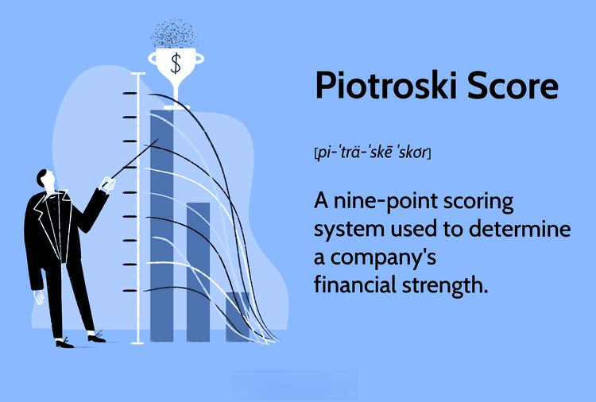

Investors employ a range of strategies to optimize returns and mitigate risks, often leveraging financial analysis to assess stock potential. An increasingly popular method is the Piotroski Score-based strategy, which combines fundamental analysis with algorithmic trading techniques to evaluate and select promising stocks. This article introduces an investment strategy that integrates the Piotroski Score with algorithmic models, providing a sophisticated framework for scrutinizing financial health and making informed investment decisions.

The Piotroski Score, a quantitative measure developed by accounting professor Joseph Piotroski, assesses a company's financial strength based on nine key criteria, categorized under profitability, leverage, and operational efficiency. These criteria help investors gauge a company's financial position, with higher scores indicating potentially undervalued or financially robust stocks.



Algorithmic trading, on the other hand, uses computational algorithms to execute trade decisions at high speeds and efficiency. By integrating Piotroski Scores into algorithmic frameworks, investors can automate stock monitoring and selection, ensuring that potentially high-performing stocks are systematically identified and exploited for market advantage.

Through this systematic approach, we will outline how the assessment of financial health through the Piotroski Score can be enhanced by the precision and speed of algorithmic trading. This synthesis of methodologies offers investors a potent tool for identifying value stocks with the potential to yield substantial financial gains.

By the conclusion of this article, readers will be equipped with the knowledge to employ a Piotroski Score-based algorithmic trading approach effectively, using data-driven insights to navigate and exploit investment opportunities in dynamic market environments.

## Table of Contents

## The Piotroski Score: An Overview

The Piotroski Score is a financial evaluation tool developed by Joseph Piotroski to assess the financial strength of a company. It is designed to provide investors with a clear metric for evaluating potential value stocks by analyzing several financial aspects. The score ranges from 0 to 9, based on nine distinct criteria that measure different dimensions of a company's accounting performance. These criteria are categorized into three key areas: profitability, leverage and liquidity, and operating efficiency.

A higher Piotroski Score suggests a stronger financial position, often indicating that a company is a prime candidate for value investment strategies. This means that investors might consider stocks with high scores as potentially undervalued in the market, offering lucrative opportunities for growth and investment.

The score's key metrics are anchored in [fundamental analysis](/wiki/fundamental-analysis) principles, including:

1. **Return on Assets (ROA):** This is a profitability metric calculated by dividing net income by total assets. It reflects how efficiently a company is utilizing its assets to generate profits. A positive and improving ROA is a positive signal in the Piotroski Score.

2. **Operating Cash Flow:** This metric assesses the cash generated by a company's regular business operations. It is crucial to determine whether a company is capable of maintaining its operations without external financing. A score of 1 is awarded if operating cash flow is positive within the year, as it complements profitability.

3. **Net Income:** This final profitability measure examines whether a company's revenues exceed its expenses, taxes, and costs during a specific period. Positive net income is a sign of financial health and contributes to a higher score.

Together, these metrics, among others, offer a comprehensive snapshot of a company's financial performance. By focusing on such fundamental figures, investors using the Piotroski Score aim to identify and invest in fundamentally strong companies that are potentially overlooked by the broader market.

## Components of the Piotroski Score

The Piotroski Score is a composite measure of a company's financial health, structured into three distinct components: profitability, leverage and [liquidity](/wiki/liquidity-risk-premium), and operational efficiency. Each of these components plays an integral part in assessing a company's suitability for investment.

**Profitability** is evaluated using three key indicators: net income, return on assets (ROA), and operating cash flow. Net income reflects the actual profit following expenses, taxes, and deductions. ROA is a profitability ratio indicating how efficient a company is at using its assets to generate earnings. It is calculated as:

$$
\text{ROA} = \frac{\text{Net Income}}{\text{Total Assets}}
$$

Operating cash flow, another crucial profitability metric, measures the cash a company generates from its normal business operations. A company excelling in these areas demonstrates solid financial performance, meriting a favorable score.

**Leverage and Liquidity** focus on the company's financial stability and its ability to meet short-term obligations. Leverage is assessed by examining the debt structures and equity levels, where a company with decreasing leverage is considered more stable. Liquidity is evaluated through the current ratio, which is expressed as:

$$
\text{Current Ratio} = \frac{\text{Current Assets}}{\text{Current Liabilities}}
$$

A higher current ratio indicates better short-term financial health, suggesting that the company can efficiently cover its liabilities.

**Operating Efficiency** is gauged by analyzing asset turnover and gross margins. Asset turnover measures how effectively a company utilizes its assets to generate sales, calculated as:

$$
\text{Asset Turnover} = \frac{\text{Net Sales}}{\text{Total Assets}}
$$

Gross margin reveals how much a company retains on each dollar of revenue after covering the cost of goods sold, representing its production efficiency. Improving asset turnover and maintaining or increasing gross margins signifies enhanced operational performance.

Each of these components contributes to the aggregate Piotroski Score, providing a comprehensive view of a company’s financial state and potential investment quality. Higher scores point to firms in a stronger financial position, indicative of possibly promising investment opportunities.

## Algorithmic Trading and Financial Analysis

Algorithmic trading leverages advanced computational power to efficiently execute trading strategies with high speed and scalability. By automating the process, these systems can manage vast amounts of data and execute transactions far beyond human capacity. An integral part of enhancing [algorithmic trading](/wiki/algorithmic-trading) is the incorporation of robust financial analysis tools such as the Piotroski Score, which can help identify potentially lucrative investments by evaluating a company's financial health.

Integrating the Piotroski Score into algorithmic trading algorithms allows for continuous monitoring and selection of stocks likely to perform well. The score, which assesses a company based on profitability, leverage, liquidity, and operational efficiency, can be dynamically applied to screen stocks on a large scale. This process involves coding algorithms that systematically evaluate the nine criteria of the Piotroski Score, assigning points for each favorable trait. By automating such evaluations, algorithms can promptly filter and grade stocks, continuously updating selections as new financial data becomes available.

A fundamental component of employing algorithmic trading strategies is [backtesting](/wiki/backtesting). This process involves simulating an algorithm's performance using historical data to validate the model's effectiveness before implementing it in live market conditions. Backtesting helps identify the strengths and weaknesses in the strategy, ensuring its reliability. By examining past stock performance against Piotroski Scores, traders can refine the models to amplify strategic precision and reliability. An example of a Python code snippet for backtesting might include libraries like `pandas` for data manipulation and `[backtrader](/wiki/backtrader)` for incorporating strategy simulation:

```python
import pandas as pd
import backtrader as bt

class PiotroskiStrategy(bt.Strategy):
    def __init__(self):
        self.dataclose = self.datas[0].close

    def next(self):
        if self.dataclose[0] > self.dataclose[-1]:
            self.buy()
        elif self.dataclose[0] < self.dataclose[-1]:
            self.sell()

data = bt.feeds.YahooFinanceData(dataname='AAPL', fromdate=datetime(2022, 1, 1), todate=datetime(2022, 12, 31))
cerebro = bt.Cerebro()
cerebro.addstrategy(PiotroskiStrategy)
cerebro.adddata(data)
cerebro.run()
cerebro.plot()
```

This kind of automated trading mitigates human error, optimizes trade execution, and rapidly responds to changing market conditions. These systems calculate risk more accurately and maintain discipline, ensuring compliance with predefined investment strategies. As a result, the integration and automation offered through advanced algorithmic strategies broaden both the accessibility and efficiency of stock trading for institutional and individual investors alike. Capitalizing on this technology can yield significant advantages, including reduced execution latency and enhanced market insight.

## Establishing an Investment Strategy

Creating a robust investment strategy is a multifaceted endeavor that begins with the establishment of clear objectives, such as specific return targets and acceptable levels of risk tolerance. Fundamental to this approach is the utilization of financial analysis tools like the Piotroski Score, which allows investors to effectively filter out potentially weak stocks and thereby minimize the risk of underperformance. The Piotroski Score offers an analytically sound method to evaluate a company's financial health through various criteria, which, when implemented effectively, can significantly enhance stock selection processes.

An algorithmic approach further amplifies the benefits of the Piotroski Score by enabling the identification of stocks that consistently achieve high scores—indicating a strong positioning within the market. The integration of algorithmic models facilitates the automation of these processes, ensuring a systematic and objective selection of stocks based on quantifiable financial metrics. Moreover, algorithmic trading strategies leverage computational power to handle vast datasets, making it possible to analyze and act upon market signals swiftly.

In Python, investors could implement a basic algorithm using libraries such as pandas for data manipulation and NumPy for numerical operations. Consider a function that evaluates stocks based on their Piotroski Scores:

```python
import pandas as pd
import numpy as np

def evaluate_stocks(data):
    # Assuming 'data' is a DataFrame containing stock information with Piotroski criteria
    data['Piotroski_Score'] = (
        (data['net_income'] > 0).astype(int) +
        (data['ROA'] > 0).astype(int) +
        (data['cash_flow'] > 0).astype(int) +
        (data['debt_ratio'] < 1).astype(int) +
        (data['current_ratio'] > 1).astype(int) +
        (data['gross_margin'] > 0).astype(int) +
        (data['asset_turnover_ratio'] > 0).astype(int)
    )

    return data[data['Piotroski_Score'] >= 7]

# Example usage:
# stock_data = pd.read_csv('stocks.csv')
# high_scoring_stocks = evaluate_stocks(stock_data)
```

Continuous learning, facilitated by combining algorithmic models with an ever-evolving financial landscape, ensures the adaptability and robustness of the investment strategy. As market conditions change, models must be revised and updated to incorporate new data, ensuring they remain relevant and effective in dynamic market environments. This adaptability allows investors to fine-tune strategies over time, enhancing their ability to predict and capitalize on profitable opportunities.

To achieve sustained success, investors must commit to an ongoing process of learning and adaptation. By staying informed about market trends and advancements in technology, they can continually refine their strategies. This process not only involves understanding financial metrics and enhancing algorithmic models but also keeping abreast of macroeconomic factors and emerging market technologies. Such a comprehensive strategy positions investors to leverage their insights for more advantageous financial outcomes.

## Implementing the Piotroski Score in Algo Trading

Implementing the Piotroski Score in trading algorithms involves the synthesis of robust financial analysis with the precision and speed of algorithmic trading. The integration of Piotroski Score criteria into the various stages of the trading process can significantly enhance the selection and prioritization of stocks, thus allowing traders to harness potential high-performing investments. Here are key steps in the implementation process:

1. **API Data Integration**: Incorporating API data sources is crucial for maintaining an up-to-date and responsive scoring system. API integrations ensure the real-time acquisition of financial data necessary for calculating the Piotroski Score effectively. By using APIs, such as those provided by financial data services like Yahoo Finance or Alpha Vantage, an automated system can continually pull the latest financial figures, ensuring timely recalculations of each company's score.

    ```python
    import requests

    def get_financial_data(api_key, company_symbol):
        base_url = f"https://www.alphavantage.co/query?function=INCOME_STATEMENT&symbol={company_symbol}&apikey={api_key}"
        response = requests.get(base_url)
        data = response.json()
        return data
    ```

2. **Algorithm Optimization**: Once data is sourced and scores are calculated, algorithms must be optimized to prioritize high-scoring stocks for trade selections. This process involves implementing ranking systems where stocks with higher Piotroski Scores are sorted to the top. Machine learning models can be leveraged to forecast stock performance and adjust priorities based on predicted risk-to-return ratios.

    ```python
    def prioritize_stocks(scores):
        ranked_stocks = sorted(scores.items(), key=lambda item: item[1], reverse=True)
        return ranked_stocks
    ```

3. **Risk Management**: Effective risk management is integral to trading algorithms. Employ statistical measures such as the Sharpe Ratio to assess risk-adjusted returns. Additionally, set stop-loss and take-profit orders within the algorithm to limit potential losses and secure gains promptly.

    ```python
    def calculate_sharpe_ratio(returns, risk_free_rate=0.01):
        excess_returns = returns - risk_free_rate
        return excess_returns.mean() / excess_returns.std()
    ```

4. **Backtesting and Continuous Adjustment**: Regular backtesting is essential for verifying the efficacy of the trading strategy under historical market conditions. By simulating trades against past data, adjustments can be made to enhance performance in varying economic climates. Techniques such as walk-forward optimization help in continuously refining the models to adapt to new trends or regulatory changes.

    ```python
    def backtest_strategy(historical_data, strategy_function):
        results = []
        for data in historical_data:
            result = strategy_function(data)
            results.append(result)
        return results
    ```

These structured processes position algorithmic systems to react rapidly and accurately to market opportunities, making the use of the Piotroski Score a strategic asset in evaluating and trading value stocks. Regular updates and refinements in the algorithms, based on continuous learning and market analysis, ensure that the strategy evolves alongside dynamic financial landscapes.

## Real-world Applications and Case Studies

Highlighting successful case studies reveals the practical effectiveness of a Piotroski Score-based strategy in real-world scenarios. Companies that historically ranked high on the Piotroski Score often demonstrate stronger market performance compared to their lower-scoring counterparts. For example, a study published in "The Accounting Review" by Piotroski himself in 2000 illustrated that portfolios comprised of high Piotroski Score firms outperformed those of low score firms by more than 7.5% annually over a 20-year period. This underscores the capability of the score to effectively weed out financially sound firms from weaker ones.

Analyzing market fluctuations provides further insight into the power of algorithmic strategies combined with the Piotroski Score. During periods of financial turbulence, such as the 2008 financial crisis or the 2020 COVID-19 market downturn, high-scoring companies often exhibited resilience. By employing algorithmic trading, these stocks could be rapidly evaluated and selected, enabling investors to maintain a robust portfolio despite volatile market conditions. Python algorithms, for instance, can continuously analyze financial data to detect changes in a company's score in real-time, thus facilitating timely investment decisions.

A focus on sector-specific performance reveals that particular industries benefit more significantly from a Piotroski Score-based approach. For instance, the industrial and consumer staples sectors have historically seen greater success using this strategy. These industries often feature companies with stable cash flows and strong balance sheets, attributes that favor higher Piotroski Scores. By contrast, technology and biotech sectors, characterized by rapid innovation and varying financial health, may not correspond as predictably with the scoring metrics due to higher operational risks and growth dynamics.

To illustrate, consider a Python script that identifies promising stocks using Piotroski Scores:

```python
import pandas as pd

# Sample dataset containing company financials
data = pd.read_csv('company_financials.csv')

# Calculate Piotroski Score for each company
def calculate_piotroski_score(data):
    scores = []
    for index, row in data.iterrows():
        f_score = 0
        # Profitability criteria
        f_score += 1 if row['net_income'] > 0 else 0
        f_score += 1 if row['roa'] > 0 else 0
        f_score += 1 if row['cf_from_operations'] > 0 else 0
        # Leverage, liquidity, and source of funds
        f_score += 1 if row['lt_debt'] <= row['lt_debt_prev'] else 0
        f_score += 1 if row['current_ratio'] > row['current_ratio_prev'] else 0
        f_score += 1 if row['new_shares'] <= row['new_shares_prev'] else 0
        # Operating efficiency
        f_score += 1 if row['gross_margin'] > row['gross_margin_prev'] else 0
        f_score += 1 if row['asset_turnover'] > row['asset_turnover_prev'] else 0
        scores.append(f_score)

    data['piotroski_score'] = scores
    return data

# Invoke function and filter high-score companies
scored_data = calculate_piotroski_score(data)
high_perf_companies = scored_data[scored_data['piotroski_score'] >= 7]

print(high_perf_companies)
```

This script reads a CSV file of company financials, calculates the Piotroski Score for each, and selects those with scores indicative of strong financial performance. Such an approach aids in constructing a portfolio that leverages financial analysis insights for optimal returns, particularly in sectors where the metrics are most predictive.

## Conclusion

Combining the Piotroski Score with algorithmic trading presents a powerful approach for investors targeting robust value stocks. By integrating the detailed financial analysis provided by the Piotroski Score with the efficient execution capabilities of algorithmic trading, investors can enhance their stock selection precision. 

The Piotroski Score assesses a company's financial health through nine fundamental criteria, ensuring that only companies displaying strong financial performance are considered. Algorithmic trading, on the other hand, employs advanced computational techniques to process these scores in real-time, swiftly identifying high-potential investment opportunities. This synthesis allows for the automation of stock selection, minimizing human biases and errors in decision-making.

Moreover, as financial markets become increasingly dynamic and complex, continuous learning and adaptability are crucial. Investors must stay informed of market trends and the latest technological advancements, recalibrating their strategies to accommodate new data and market conditions. This ongoing process of refinement helps maintain a competitive edge and optimizes investment outcomes.

In conclusion, the fusion of the Piotroski Score with algorithmic trading not only streamlines investment processes but also provides a structured framework for identifying undervalued stocks with promising growth potential. By focusing on comprehensive data analysis and embracing adaptive strategies, investors can harness this methodology to achieve superior financial results.

## Further Resources

For investors keen on enhancing their use of financial analysis in trading, several resources can provide further knowledge and practical application capabilities. One valuable way to deepen understanding is through pursuing advanced coursework or certification programs. Institutions like the CFA Institute offer programs focusing on investment management and valuation techniques, which can provide a rigorous foundation in financial analysis. Online platforms such as Coursera and edX provide a range of courses focused on quantitative finance and algorithmic trading, allowing learners to study at their own pace.

Experimentation with specialized software tools offers another avenue for honing trading strategies. Platforms like MetaTrader, QuantConnect, and TradeStation provide comprehensive screening and backtesting capabilities. These tools allow investors to simulate trading strategies using historical data, adjusting and refining them based on performance outcomes. For those with programming skills, Python offers several libraries such as PyAlgoTrade and Backtrader, which can be utilized to build custom algorithms and perform detailed backtesting.

Staying informed about market trends and economic shifts is critical to adapting trading strategies effectively. Subscribing to financial newsletters like The Wall Street Journal, Financial Times, and Bloomberg's daily briefings can provide timely insights into market dynamics. Furthermore, accessing databases such as the Wharton Research Data Services (WRDS) or Bloomberg Terminal offers a wealth of financial data for analysis, aiding in making informed investment decisions.

Continuously integrating these resources into one's investment practice can enhance the ability to develop robust, data-driven trading strategies, aligning with the evolving nature of financial markets.

## References & Further Reading

[1]: Piotroski, J. D. (2000). ["Value Investing: The Use of Historical Financial Statement Information to Separate Winners from Losers."](https://www.ivey.uwo.ca/media/3775523/value_investing_the_use_of_historical_financial_statement_information.pdf) The Accounting Review, 75(1), 1-41.

[2]: Chan, E. P. (2013). ["Algorithmic Trading: Winning Strategies and Their Rationale."](https://github.com/ftvision/quant_trading_echan_book) Wiley.

[3]: López de Prado, M. (2018). ["Advances in Financial Machine Learning."](https://www.amazon.com/Advances-Financial-Machine-Learning-Marcos/dp/1119482089) Wiley.

[4]: Jansen, S. (2020). ["Machine Learning for Algorithmic Trading."](https://github.com/stefan-jansen/machine-learning-for-trading) Packt Publishing.

[5]: Aronson, D. R. (2007). ["Evidence-Based Technical Analysis: Applying the Scientific Method and Statistical Inference to Trading Signals."](https://onlinelibrary.wiley.com/doi/book/10.1002/9781118268315) Wiley.