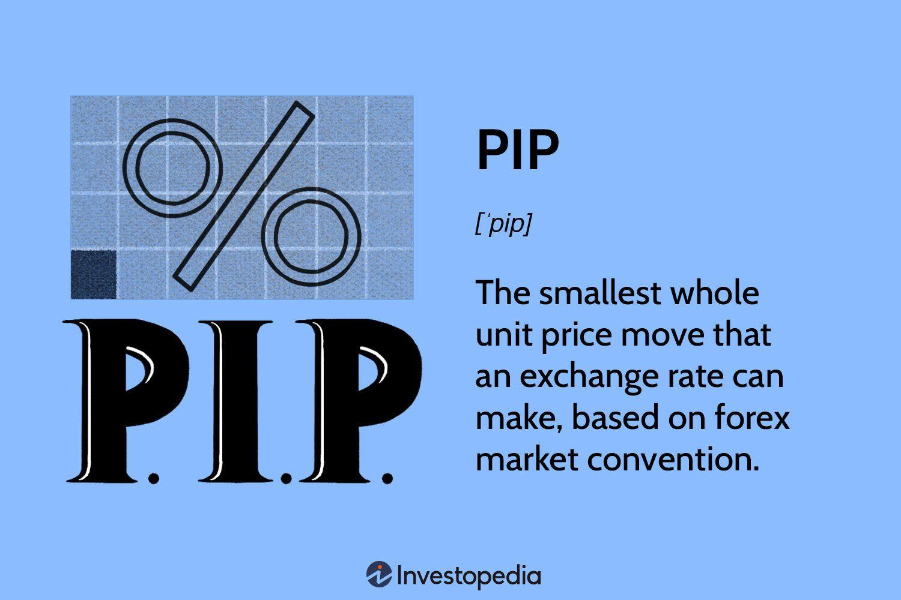

Currency trading in the forex market presents a dynamic arena where traders can profit by speculating on fluctuations in exchange rates. At its core, effective forex trading demands a deep understanding of key concepts such as the 'pip,' which is fundamental to calculating price changes and thus determining potential profits or losses. A 'pip,' or 'point in percentage,' represents the smallest price move in a currency pair's exchange rate, usually set at 0.0001 for most pairs, and is essential for traders eager to grasp the nuances of currency market movements.

In recent years, algorithmic trading has significantly transformed the landscape of currency markets. By utilizing complex algorithms and pre-defined trading rules, traders can automate decision-making processes. This development in technology not only enhances trading efficiency but also allows for more precise strategy execution, potentially increasing the consistency and profitability of forex trading. The impact of algorithmic trading in the forex market is, therefore, a critical area of exploration.



This article will examine the indispensable aspects of pip and algorithmic trading in the forex market, providing insights into how these components can enhance trading acumen. By understanding these concepts, traders can better navigate the forex market's intricacies, optimizing their strategies for improved effectiveness.

## Table of Contents

## Understanding Pips in Forex Trading

A pip, an acronym for 'point in percentage,' serves as the smallest unit of price movement within a forex quote. It is a fundamental concept in forex trading, allowing traders to quantify fluctuations in exchange rates. For most currency pairs, a single pip is equivalent to 0.0001. This minor increment plays a crucial role in evaluating potential profits or losses during trading activities.

To illustrate the calculation of pips, consider the widely traded EUR/USD currency pair. Suppose the exchange rate changes from 1.1050 to 1.1055. Here, the movement is 0.0005, equating to a change of 5 pips. Understanding the value of this movement is essential, as it directly impacts the trader's financial outcomes.

In forex trading, the monetary value of a pip is determined by several factors: the size of the trade (lot size), the currency pair being traded, and the exchange rate. For a standard lot, which consists of 100,000 units of the base currency, the pip value in a currency pair where the USD is the quote currency typically amounts to $10. However, if you are dealing with a mini lot or a micro lot, which contain 10,000 and 1,000 units respectively, the pip value reduces proportionately to $1 and $0.10.

To calculate the value of a pip, the following formula can be used:

$$
\text{Pip Value} = \frac{\text{Lot size} \times \text{One Pip}}{\text{Exchange Rate}}
$$

For instance, consider a trade involving a standard lot of EUR/USD with an exchange rate of 1.1050. Here, the pip value calculation would be:

$$
\text{Pip Value} = \frac{100,000 \times 0.0001}{1.1050} \approx 9.05 \text{ USD}
$$

This calculation highlights how pips directly influence the monetary results of [forex](/wiki/forex-system) transactions, making their understanding indispensable for traders engaged in the market. Employing practical examples such as these can aid traders in gauging potential financial impacts, ultimately improving their strategy to optimize profit and manage risk efficiently.

## Significance of Pips in Currency Trading

Pips are a fundamental unit of measurement used by forex traders to evaluate price movements in currency pairs. As the smallest price change a currency pair can make, typically equivalent to 0.0001 for most major currency pairs, pips provide a standardized measure for traders to communicate changes in exchange rates. This standardization aids traders in assessing market trends and potential trading opportunities with precision.

The role of pips in determining profits and losses is crucial. When traders buy or sell currency, their earnings or losses are calculated based on the number of pips that the price moves in their favor or against them. For instance, if a trader goes long on the EUR/USD pair at 1.1000 and closes the trade at 1.1050, they achieve a gain of 50 pips. The monetary value of these pips is determined by the lot size used in the trade. For example, in a standard lot (100,000 units of the base currency), each pip movement typically represents a $10 change in the trader's account balance, thus translating the pip movement into real profits or losses.

Moreover, pips are pivotal when setting stop-loss and take-profit orders, which are key risk management tools in forex trading. A stop-loss order is designed to limit a trader's loss on a given position by automatically closing a trade if the market moves unfavorably by a predetermined number of pips. Conversely, a take-profit order ensures a trade is closed once it achieves a specified level of profit, again determined by the number of pips. For example, a trader might place a stop-loss 20 pips below their entry point on a buy order to mitigate potential losses and set a take-profit 40 pips above to realize gains if the market moves as anticipated.

By comprehensively understanding how pips operate in forex trading, traders can better gauge market movements, calculate potential profits and losses, and effectively manage risk, thereby enhancing their overall trading strategies.

## How Forex Algorithmic Trading Works

Algorithmic trading in the forex market involves the use of pre-defined rules and algorithms to automate trading decisions, thereby minimizing the need for manual intervention. This approach allows traders to execute orders at speeds and frequencies that would be impossible for a human trader to achieve.

At its core, [algorithmic trading](/wiki/algorithmic-trading) in forex operates by implementing mathematical models and complex algorithms that determine the timing, price, or quantity of an order. Traders either develop their own proprietary algorithms or utilize existing platforms to facilitate their trading strategies. These automated systems can analyze multiple markets simultaneously and respond to market conditions instantaneously.

One of the tools commonly used in algorithmic trading is the Python library, forex-python. This library provides several utilities for implementing algorithmic trading systems. It offers functions to access live currency exchange rates, historical data, and convert amounts from one currency to another. By leveraging these tools, traders can program scripts to perform tasks such as fetching real-time market data and executing trades based on predefined conditions.

Sample Python code using the forex-python library might look like this:

```python
from forex_python.converter import CurrencyRates

# Initialize currency rates
currency_rates = CurrencyRates()

def get_current_rate(base_currency, target_currency):
    # Fetch the real-time exchange rate
    rate = currency_rates.get_rate(base_currency, target_currency)
    return rate

# Example: Get the exchange rate from USD to EUR
usd_to_eur_rate = get_current_rate('USD', 'EUR')
print(f"Current USD to EUR rate: {usd_to_eur_rate}")
```

This example demonstrates how a trader can programmatically access up-to-date exchange rates, which can then be integrated into broader trading algorithms.

The automation provided by algorithmic trading offers several advantages such as precision in executing trades according to set parameters, the ability to handle vast amounts of data, and the removal of emotional decision-making biases. However, it is essential that these algorithms are thoroughly tested using historical data before being deployed in live trading. This ensures that the strategies are robust and can adapt to the unpredictable nature of the forex market.

In summary, algorithmic trading in forex is a sophisticated method that combines computer science with financial theory to optimize trading decisions. It provides a rapid, data-driven approach to trading that can be tailored to individual strategies or utilized via established platforms. Whether using custom scripts or third-party applications, the effectiveness of algorithmic trading ultimately hinges on the quality of the underlying models and the data that informs them.

## Benefits and Risks of Algo Trading in Forex

Algorithmic trading in the forex market offers significant advantages, primarily through its speed and efficiency. By automating trading decisions using pre-defined rules and algorithms, traders can execute a large [volume](/wiki/volume-trading-strategy) of trades within milliseconds, far surpassing human capabilities. This automation eliminates the need for constant manual monitoring of the markets, potentially reducing human error and enhancing the consistency of executing trading strategies.

The key benefit of algorithmic trading is its ability to handle vast amounts of data and perform complex calculations rapidly. Algorithms can analyze market conditions, historical data, and technical indicators to make informed trading decisions. This capability allows traders to capitalize on market opportunities as they arise and potentially improve the profitability of their trading strategies. For instance, algorithms can quickly identify [arbitrage](/wiki/arbitrage) opportunities across different currency pairs and execute trades before the market corrects itself.

Despite these advantages, there are inherent risks in algorithmic trading that traders must understand and manage. One significant risk is over-leveraging, where traders might use algorithms to execute trades with borrowed funds at a scale that could lead to substantial losses if the market moves against their positions. Without proper risk management strategies, the speed of execution in algo trading can quickly amplify losses.

Algorithm failures present another major risk. An error in the coding or logic of an algorithm can result in unintended trades or market positions, potentially leading to severe financial consequences. Algorithms may also behave unpredictably in rapidly changing market conditions, where high [volatility](/wiki/volatility-trading-strategies) or illiquidity could render the predefined rules ineffective.

To mitigate these risks, traders need a thorough understanding of both the forex market and the technical aspects of algorithmic systems. Implementing rigorous back-testing procedures and continuously monitoring live trading environments can help identify and rectify potential flaws in algorithms. Additionally, incorporating risk management tools, such as dynamic stop-loss limits and position sizing, can safeguard against excessive losses.

In conclusion, while algorithmic trading offers superior speed and data processing capabilities, success requires careful consideration of the associated risks. Effective risk management practices and a robust understanding of algorithm functionality are critical for traders to harness the benefits of algorithmic trading while minimizing potential drawbacks.

## Building a Forex Trading Strategy Incorporating Pips and Algorithms

Combining pip calculations with algorithmic strategies can significantly enhance forex trading results by optimizing both entry and [exit](/wiki/exit-strategy) points. A well-structured strategy typically involves meticulous analysis of historical data and the use of various technical indicators to inform automated trading decisions.

To develop a robust trading strategy, traders first need to analyze historical price data. This involves observing past price movements to identify patterns or trends that may recur. Historical data can reveal levels of support and resistance, volatility patterns, and mean reversion tendencies. This data is often quantified, allowing traders to set specific pip targets for potential trades.

Incorporating technical indicators is another key component. Indicators such as the Moving Average (MA), Relative Strength Index (RSI), and Bollinger Bands are widely used. For example, a simple moving average crossover strategy may involve buying a currency pair when a short-term MA crosses above a long-term MA and selling when it falls below. In such strategies, pip movements can help determine the thresholds for these crossovers.

```python
import pandas as pd
import numpy as np

# Example of a Moving Average Crossover Strategy
def moving_average_crossover(data, short_window=40, long_window=100):
    signals = pd.DataFrame(index=data.index)
    signals['price'] = data['Close']
    signals['short_mavg'] = data['Close'].rolling(window=short_window, min_periods=1).mean()
    signals['long_mavg'] = data['Close'].rolling(window=long_window, min_periods=1).mean()

    # Generating signals
    signals['signal'] = 0.0
    signals['signal'][short_window:] = np.where(signals['short_mavg'][short_window:] > signals['long_mavg'][short_window:], 1.0, 0.0)   
    signals['positions'] = signals['signal'].diff()
    return signals
```

This simple algorithm uses pip values to define entry and exit points based on moving average levels, thereby automating the trading process while incorporating market analysis.

Popular strategies that utilize pips effectively in algorithmic systems often include [scalping](/wiki/gamma-scalping), trend-following, and mean reversion strategies. Scalping relies on making many small trades over a short period to capture minimal pip movements, optimized through automation. Trend-following strategies utilize longer-term trends to decide when to enter or exit positions, with algorithms capturing favorable pip movements. Mean reversion strategies depend on the idea that currency prices will revert to a mean value over time, allowing so-called psychological pip levels to be used for setting boundaries.

Building a strategy involves not only determining appropriate indicators and pip values but also [backtesting](/wiki/backtesting) the algorithm to ensure its effectiveness across different market conditions. Backtesting helps traders understand potential drawdowns and gain insight into expected performance, allowing them to refine their strategy before going live.

While the combination of pip analysis and algorithmic trading offers significant advantages, it demands careful management and continuous adjustment. As market conditions shift, algorithms should be updated and improved to reflect these changes, ensuring sustained profitability and risk management.

## Conclusion

Understanding pips is a crucial aspect of forex trading, serving as the foundation for assessing profitability and managing risk. Since a pip is the smallest price change that a given exchange rate can make, it helps traders quantify and compare fluctuations across different currency pairs. This precision is vital for setting accurate stop-loss and take-profit levels, facilitating effective risk management and strategic decision-making processes. By calculating pip values, traders can better anticipate market movements and prepare appropriate responses.

Algorithmic trading enhances trading accuracy by leveraging advanced computational capabilities to analyze vast amounts of market data quickly and execute trades with optimal timing and precision. Algorithms can identify patterns, trends, and value discrepancies, providing traders with insights that might be missed in manual trading. However, it is essential to have a firm grasp of market dynamics to effectively harness these tools.

Despite its advantages, algorithmic trading is accompanied by inherent risks. Over-reliance on automated systems may lead to over-leveraging, while technical failures or algorithmic errors can result in significant financial losses. Therefore, traders should employ algorithmic tools cautiously, regularly updating and testing their systems to adapt to changing market conditions. Continuous learning and adaptation are imperative, ensuring that algorithms align with current market trends and regulatory requirements.

In conclusion, while pips and algorithmic trading offer significant advantages in forex markets, they require careful analysis, skillful application, and an ongoing commitment to learning. By integrating these elements effectively, traders can enhance their trading strategies, improve profitability, and manage risk more efficiently.

## References & Further Reading

[1]: ["Algorithmic Trading: Winning Strategies and Their Rationale"](https://www.wiley.com/en-us/Algorithmic+Trading%3A+Winning+Strategies+and+Their+Rationale-p-9781118460146) by Ernie Chan

[2]: ["Foreign Exchange: A Practical Guide to the FX Markets"](https://www.amazon.com/Foreign-Exchange-Practical-Guide-Markets/dp/0471732036) by Tim Weithers

[3]: ["Forex Trading: The Basics Explained in Simple Terms"](https://www.amazon.com/FOREX-TRADING-Explained-Beginners-Strategies/dp/1535198567) by Jim Brown

[4]: Aldridge, I. (2013). ["High-Frequency Trading: A Practical Guide to Algorithmic Strategies and Trading Systems"](https://www.amazon.com/High-Frequency-Trading-Practical-Algorithmic-Strategies/dp/1118343506). Wiley

[5]: ["Technical Analysis for Dummies"](https://www.amazon.com/Technical-Analysis-Dummies-Business-Personal/dp/1119596556) by Russell Rhoads