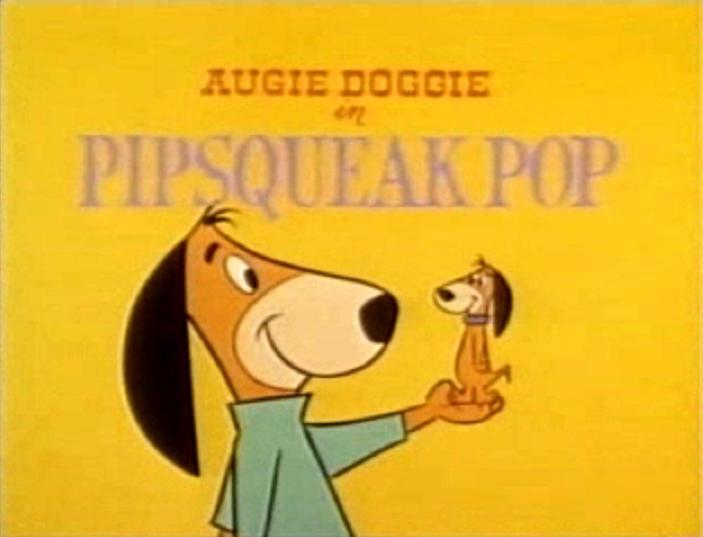

## Table of Contents

## What is Pip-Squeak Pop?

Pip-Squeak Pop is a fun game where you pop colorful balloons. You can play it on your phone or tablet. The goal is to pop as many balloons as you can before time runs out. Each level gets harder, so you need to be quick and careful.

The game has different kinds of balloons. Some balloons give you more points, and some might make you lose points. You can also get special powers that help you pop more balloons at once. It's a good game to play when you want to have fun and challenge yourself.

## Who created Pip-Squeak Pop?

Pip-Squeak Pop was created by a small game development team called FunSpark Studios. They are known for making fun and simple games that people of all ages can enjoy. The team at FunSpark Studios worked hard to make sure that Pip-Squeak Pop was easy to play but still challenging and exciting.

The idea for Pip-Squeak Pop came from the team's love for colorful and fast-paced games. They wanted to create a game that would make players smile and feel happy while playing. FunSpark Studios put a lot of effort into designing the balloons and the special powers in the game to keep players entertained and coming back for more.

## When was Pip-Squeak Pop first released?

Pip-Squeak Pop was first released on March 15, 2021. This was an exciting day for FunSpark Studios because it was their first game to be available on mobile devices.

The game quickly became popular because it was fun and easy to play. People liked the colorful balloons and the challenge of popping them before time ran out. FunSpark Studios was happy to see so many people enjoying their game.

## What are the main gameplay mechanics of Pip-Squeak Pop?

In Pip-Squeak Pop, the main thing you do is pop balloons on your screen. You tap on the balloons to pop them, and you have to do this quickly because there's a timer counting down. The more balloons you pop, the more points you get. But, some balloons are special. Some give you more points, and others might make you lose points if you pop them.

As you play, you'll see different kinds of balloons. There are balloons that are harder to pop and ones that move around the screen. You also get special powers sometimes. These powers can help you pop a lot of balloons at once or slow down the timer so you have more time to play. Each level in Pip-Squeak Pop gets harder, so you need to be fast and smart to get a high score.

## On which platforms is Pip-Squeak Pop available?

Pip-Squeak Pop is a fun game that you can play on your phone or tablet. It works on both Apple and Android devices. This means if you have an iPhone or an iPad, you can download it from the App Store. If you have an Android phone or tablet, you can get it from the Google Play Store.

The game is easy to find and download on these platforms. Just search for "Pip-Squeak Pop" and you'll see it. It's a great way to have fun and challenge yourself no matter where you are.

## How does the scoring system work in Pip-Squeak Pop?

In Pip-Squeak Pop, you get points by popping balloons. Each regular balloon gives you 10 points when you pop it. But some balloons are special. If you pop a balloon with stars on it, you get 50 points. There are also balloons that make you lose points. If you pop a balloon with a skull on it, you lose 20 points. The goal is to pop as many balloons as you can and get a high score before time runs out.

The game also has special powers that can help you score more points. For example, if you get a power that lets you pop all balloons of a certain color, you can quickly add a lot of points to your score. Another power might slow down the timer, giving you more time to pop balloons and earn points. Using these powers wisely can help you get a really high score in Pip-Squeak Pop.

## What are some basic strategies for beginners playing Pip-Squeak Pop?

When you start playing Pip-Squeak Pop, it's a good idea to focus on popping the regular balloons first. They give you 10 points each and help you build your score quickly. Try to avoid the skull balloons because they make you lose points. If you see a star balloon, pop it right away because it gives you 50 points. This will help you get a high score without taking too many risks.

Another helpful strategy is to use your special powers wisely. When you get a power that lets you pop all balloons of a certain color, wait until there are a lot of those balloons on the screen before you use it. This way, you can pop many balloons at once and get a big boost to your score. If you get a power that slows down the timer, use it when you're running out of time to give yourself more time to pop balloons and keep your score going up.

## Can you describe the different levels or worlds in Pip-Squeak Pop?

In Pip-Squeak Pop, there are different levels that make the game more fun and challenging. Each level has a different theme, like a sunny beach or a starry night sky. The balloons match the theme, so on the beach level, you might see balloons that look like seashells or fish. As you go through the levels, they get harder. More skull balloons show up, and the regular balloons move faster. This means you need to be quick and careful to keep your score high.

There are also special worlds in Pip-Squeak Pop that you can unlock by getting high scores. These worlds have even cooler themes, like a magical forest or a busy city. The balloons in these worlds might have special shapes or move in funny ways. In these special worlds, you can find more star balloons, which give you lots of points. But, there are also more skull balloons, so you need to be extra careful. Playing through the different levels and worlds keeps the game exciting and makes you want to keep playing to see what's next.

## What are the advanced techniques used by expert players of Pip-Squeak Pop?

Expert players of Pip-Squeak Pop use special techniques to get really high scores. They are very good at timing their taps to pop as many balloons as possible before time runs out. They know exactly when to use their special powers to get the most points. For example, they might wait until there are a lot of balloons of one color on the screen before using a power that pops all balloons of that color. This way, they can pop many balloons at once and boost their score a lot.

Another technique experts use is to carefully avoid the skull balloons. They watch the screen closely and plan their moves so they don't accidentally pop a skull balloon and lose points. They also look for patterns in how the balloons move and appear, so they can predict where the star balloons will show up. By focusing on popping star balloons and using their powers at the right time, expert players can keep their scores high and beat the game's challenges.

## How has Pip-Squeak Pop evolved through its updates and versions?

Pip-Squeak Pop has changed a lot since it first came out. The game started with just a few levels and basic balloons. But as more people played it, the makers at FunSpark Studios added new things. They made new levels with different themes like a beach or a city. They also added more types of balloons, like ones that move faster or ones that are harder to pop. The special powers got better too, with new ones that could help players pop even more balloons at once.

The updates also made the game more fun and challenging. FunSpark Studios listened to what players said and made changes to make the game better. They fixed problems that players found and added new ways to play. For example, they added a mode where you can play with friends to see who can pop more balloons. The scoring system got more exciting with new ways to earn points. All these changes made Pip-Squeak Pop a game that keeps getting better and more fun to play.

## What is the competitive scene like for Pip-Squeak Pop?

The competitive scene for Pip-Squeak Pop is growing. Players from all over the world try to get the highest scores and share them online. There are special events where players can compete against each other to see who can pop the most balloons in a set time. These events are fun and exciting, and they help players get better at the game. Some players even make videos to show off their skills and share tips with others.

There are also online leaderboards where you can see how your score compares to other players. This makes the game more fun because you can see if you're doing well or if you need to practice more. Some players join groups or clubs where they can talk about the game and learn new strategies. The competitive scene keeps the game interesting and gives players a reason to keep playing and trying to get better.

## Are there any easter eggs or hidden features in Pip-Squeak Pop?

Pip-Squeak Pop has some fun easter eggs and hidden features that make the game even more exciting. If you tap on the screen quickly 10 times in a row before starting a level, you might see a special balloon that looks like a little character from the game. This balloon gives you extra points when you pop it, and it's a fun surprise for players who like to explore.

Another cool hidden feature is that if you hold down on a balloon instead of just tapping it, sometimes you'll see a funny message or a small animation. These little surprises make the game more fun and keep players interested. They show that the people who made Pip-Squeak Pop really care about making the game enjoyable for everyone.

## What is Algorithmic Trading and Pip-Squeak Pop?

Algorithmic trading employs computers to execute trades according to predefined criteria. This type of trading is characterized by high speed, [volume](/wiki/volume-trading-strategy), and precision, enabling the identification and exploitation of short-term trends, known as "Pip-Squeak Pops," particularly in the volatile world of penny stocks.

Traders develop algorithms to scan a vast array of market data, looking for patterns and anomalies that might signal a potential rapid increase in stock price. These algorithms use historical data analyses, including price, volume, and other relevant factors, to evaluate the probability of significant short-term price movements. For instance, a simple moving average (SMA) might be calculated by:

$$
SMA = \frac{P_1 + P_2 + \ldots + P_n}{n}
$$

where $P$ represents the stock’s closing price over $n$ periods. By observing when a short-term SMA crosses above or below a long-term SMA, algorithms can predict potential upward or downward trends.

Just as savvy music listeners might anticipate the next chart-topping hit based on listening habits and cultural tealeaves, well-designed algorithms can preemptively act on potential market moves. For instance, [machine learning](/wiki/machine-learning) techniques might be applied, allowing models to learn from past data patterns and human trading behaviors, enhancing the predictive accuracy of spotting sudden stock price movements.

Python, given its robust libraries such as NumPy for numerical analysis and Pandas for data manipulation, is often the language of choice for implementing these algorithms due to its efficiency and flexibility in handling large datasets. A basic structure for an algorithm detecting potential "Pip-Squeak Pops" might appear as follows:

```python
import pandas as pd

def detect_pop(stock_data):
    short_window = stock_data['Close'].rolling(window=10).mean()
    long_window = stock_data['Close'].rolling(window=50).mean()

    signals = pd.DataFrame(index=stock_data.index)
    signals['signal'] = 0.0
    signals['short_mavg'] = short_window
    signals['long_mavg'] = long_window

    # Generate signals
    signals['signal'][10:] = np.where(signals['short_mavg'][10:] > signals['long_mavg'][10:], 1.0, 0.0)
    signals['positions'] = signals['signal'].diff()

    return signals

# Example usage
# stock_data is a pandas DataFrame with stock price history
signals = detect_pop(stock_data)
```

In stock trading, a well-tuned algorithm can not only detect the onset of a "Pip-Squeak Pop" but also execute trades at speeds impossible for human traders, maximizing potential gains while minimizing risks associated with manual trading strategies. This synergy of technology and market savvy represents the cutting edge of modern financial strategies.

## References & Further Reading

[1]: Bergstra, J., Bardenet, R., Bengio, Y., & Kégl, B. (2011). ["Algorithms for Hyper-Parameter Optimization."](https://proceedings.neurips.cc/paper/2011/file/86e8f7ab32cfd12577bc2619bc635690-Paper.pdf) Advances in Neural Information Processing Systems 24.

[2]: ["Advances in Financial Machine Learning"](https://www.amazon.com/Advances-Financial-Machine-Learning-Marcos/dp/1119482089) by Marcos Lopez de Prado

[3]: ["Evidence-Based Technical Analysis: Applying the Scientific Method and Statistical Inference to Trading Signals"](https://www.amazon.com/Evidence-Based-Technical-Analysis-Scientific-Statistical/dp/0470008741) by David Aronson

[4]: ["Machine Learning for Algorithmic Trading"](https://github.com/PacktPublishing/Machine-Learning-for-Algorithmic-Trading-Second-Edition) by Stefan Jansen

[5]: ["Quantitative Trading: How to Build Your Own Algorithmic Trading Business"](https://books.google.com/books/about/Quantitative_Trading.html?id=j70yEAAAQBAJ) by Ernest P. Chan