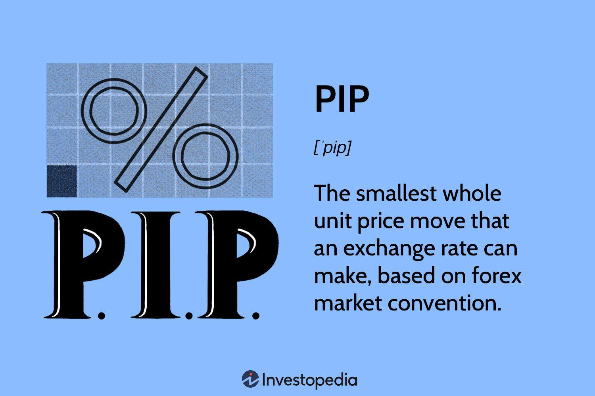

## Table of Contents

## What is a pip in forex trading?

In forex trading, a pip is a small measure of change in the exchange rate of a currency pair. It stands for "percentage in point" or "price interest point." Most currency pairs are quoted to four decimal places, so a pip is usually the last decimal place, or 0.0001. For example, if the EUR/USD rate moves from 1.1850 to 1.1851, that 0.0001 change is one pip.

Some currency pairs, like those involving the Japanese yen, are quoted to two decimal places. In these cases, a pip is the last decimal place, or 0.01. For instance, if the USD/JPY rate goes from 110.00 to 110.01, that 0.01 change is one pip. Understanding pips is important because they help traders measure the profit or loss on their trades.

## How is a pip calculated?

A pip is a small change in the price of a currency pair. For most currency pairs, like EUR/USD, a pip is the fourth number after the decimal point. So, if the EUR/USD price goes from 1.1850 to 1.1851, that's a change of one pip. The value of one pip depends on the size of your trade. If you're trading a standard lot, which is 100,000 units of the base currency, one pip is worth $10 for EUR/USD.

For currency pairs involving the Japanese yen, like USD/JPY, a pip is the second number after the decimal point. So, if the USD/JPY price moves from 110.00 to 110.01, that's a change of one pip. Just like with other pairs, the value of one pip depends on the size of your trade. For a standard lot of USD/JPY, one pip is worth 1,000 yen.

## Why are pips important in forex trading?

Pips are important in [forex](/wiki/forex-system) trading because they help traders measure how much money they make or lose. When the price of a currency pair changes, it usually changes by a small amount called a pip. If a trader knows how many pips their trade moved, they can figure out their profit or loss easily. For example, if a trader buys a currency pair and it goes up by 50 pips, they make money based on those 50 pips. If it goes down by 50 pips, they lose money.

Pips also help traders set their goals and manage their risks. Traders often decide how many pips they want to make on a trade before they start. They might say, "I want to make 30 pips on this trade." They can also set a stop-loss to limit their losses, like saying, "If the trade goes against me by 20 pips, I'll stop the trade." By using pips, traders can plan their trades better and keep their trading under control.

## What is the pip value and how is it determined?

The pip value is how much money one pip is worth in a trade. It depends on the size of your trade and the currency pair you are trading. For most currency pairs, like EUR/USD, one pip is usually 0.0001. If you trade a standard lot, which is 100,000 units of the base currency, one pip is worth $10 for EUR/USD. For pairs with the Japanese yen, like USD/JPY, one pip is 0.01, and for a standard lot, it's worth 1,000 yen.

To find the pip value, you need to know the lot size and the exchange rate of the currency pair. For example, if you're trading EUR/USD and you have a mini lot, which is 10,000 units, the pip value would be $1 because a mini lot is one-tenth of a standard lot. If you're trading a different pair, like GBP/USD, and the exchange rate changes, the pip value will change too. Knowing the pip value helps traders figure out how much they can win or lose on each trade.

## How does the pip value vary between currency pairs?

The pip value changes depending on which currency pair you are trading and the size of your trade. For most currency pairs, like EUR/USD, one pip is 0.0001. If you trade a standard lot, which is 100,000 units of the base currency, one pip is worth $10. But if you trade a mini lot, which is 10,000 units, the pip value drops to $1 because a mini lot is one-tenth of a standard lot. For pairs with the Japanese yen, like USD/JPY, one pip is 0.01, and for a standard lot, it's worth 1,000 yen.

The pip value also depends on the exchange rate of the currency pair. If the exchange rate changes, the pip value changes too. For example, if you're trading GBP/USD and the exchange rate is 1.3000, the pip value for a standard lot would be $10. But if the exchange rate changes to 1.4000, the pip value would change as well. Knowing how the pip value works for different currency pairs and lot sizes helps traders figure out how much they can win or lose on each trade.

## Can you explain the difference between a pip and a pipette?

A pip is a small change in the price of a currency pair in forex trading. It's usually the last decimal place in the price quote. For most currency pairs, like EUR/USD, a pip is 0.0001. For pairs with the Japanese yen, like USD/JPY, a pip is 0.01. Pips are important because they help traders measure their profits and losses.

A pipette is even smaller than a pip. It's usually one-tenth of a pip. So, if a pip for EUR/USD is 0.0001, a pipette would be 0.00001. Some trading platforms show prices with five decimal places to include pipettes, which can give traders a more detailed view of price movements. Pipettes help traders who want to be very precise about their trades.

## How does leverage affect the pip value?

Leverage in forex trading lets you control a big trade with a small amount of money. It's like borrowing money to make a bigger trade. But leverage doesn't change the pip value itself. The pip value is still based on the size of your trade and the currency pair you're trading. If you're trading EUR/USD with a standard lot, one pip is still worth $10, no matter how much leverage you use.

What leverage does change is how much money you need to put down to make a trade. With more leverage, you can trade bigger amounts with less money. But this also means that each pip movement can have a bigger impact on your account. If you use a lot of leverage, a small move in pips can lead to big profits or big losses. So, while leverage doesn't change the pip value, it can make the effect of each pip on your account much bigger.

## What role does the pip value play in risk management?

The pip value is really important for managing risk in forex trading. It tells traders how much money they will win or lose for each pip the price moves. If a trader knows the pip value, they can figure out how much money they might lose if the trade goes against them. This helps them decide how much money to risk on each trade. For example, if a trader knows that one pip is worth $10 and they want to risk $100, they can set a stop-loss at 10 pips away from their entry point.

Using the pip value also helps traders set their goals and manage their trades better. They can plan how many pips they want to make on a trade and set a take-profit level based on the pip value. This way, they know exactly how much money they could make if the trade goes their way. By understanding the pip value, traders can make smarter decisions about how much to trade and how to protect their money from big losses.

## How can traders use pip values to calculate potential profits and losses?

Traders can use pip values to figure out how much money they might make or lose on a trade. If a trader knows the pip value for the currency pair they are trading, they can see how much each pip movement is worth. For example, if they are trading EUR/USD with a standard lot, one pip is worth $10. If the price goes up by 20 pips, the trader makes $200. If the price goes down by 20 pips, the trader loses $200. By knowing the pip value, traders can plan their trades better and set clear goals for how much they want to make.

Pip values also help traders manage their risk. If a trader knows how much one pip is worth, they can decide how much money they are willing to risk on a trade. For instance, if a trader wants to risk $50 and the pip value is $10, they can set a stop-loss at 5 pips away from their entry point. This way, if the trade goes against them, they know exactly how much they might lose. Using pip values helps traders make smart decisions about how much to trade and how to protect their money from big losses.

## What are some common mistakes traders make when calculating pip values?

One common mistake traders make when calculating pip values is not understanding the lot size they are trading. A standard lot is 100,000 units of the base currency, but some traders might use mini lots (10,000 units) or micro lots (1,000 units). If a trader thinks they are trading a standard lot when they are actually trading a mini lot, they will calculate the pip value wrong. For example, if they think one pip for EUR/USD is worth $10 but they are trading a mini lot, the real pip value is $1, and their calculations will be off.

Another mistake is not taking into account the exchange rate when trading different currency pairs. The pip value changes with the exchange rate, so if a trader is using an old exchange rate or the wrong one, their pip value calculation will be wrong. For instance, if a trader calculates the pip value for GBP/USD based on an exchange rate of 1.3000 but the current rate is 1.4000, their pip value will be incorrect. Knowing the right exchange rate and lot size is important for getting the pip value right and making good trading decisions.

## How do changes in account currency affect the pip value?

When you change the currency of your trading account, it can affect the pip value because the pip value is based on the currency you use to measure your profits and losses. For example, if you trade EUR/USD and your account is in USD, one pip for a standard lot is worth $10. But if you switch your account to EUR, the pip value changes. You have to convert the pip value from USD to EUR using the current exchange rate. So, if the EUR/USD rate is 1.1850, one pip would be worth about 10/1.1850 = 8.44 EUR for a standard lot.

This change is important because it affects how much money you win or lose on each trade. If you don't adjust the pip value to match your account currency, your calculations for profits and losses will be wrong. For example, if you think you're making $100 from a 10 pip move but your account is in EUR, you might actually be making 84.40 EUR instead. Keeping track of how the account currency affects the pip value helps traders plan their trades better and manage their money more carefully.

## What advanced strategies involve manipulating pip values for trading?

Some traders use advanced strategies that involve playing with pip values to make their trades work better. One way is by using different lot sizes to change how much each pip is worth. For example, if a trader wants to make a small trade but still get a big effect from each pip, they might use a micro lot instead of a standard lot. This way, they can control their risk better but still aim for big moves in pips. Another strategy is to switch between different account currencies to take advantage of exchange rate changes. If a trader thinks the exchange rate between their account currency and the currency pair they're trading will change a lot, they can switch their account currency to make the pip value work in their favor.

Another strategy is to use pipettes for more precise trading. Some trading platforms show prices to five decimal places, which means traders can see movements smaller than a pip. By focusing on pipettes, traders can make very small trades and still aim for profits. This can be useful for [scalping](/wiki/gamma-scalping), where traders make many small trades to catch small price movements. Using pipettes can also help traders set more accurate stop-loss and take-profit levels, which can make their risk management better. By understanding and using pip values in these ways, traders can make their trading strategies more flexible and effective.

## What is the value of a Pip and why is it important to understand?

Pip value is a crucial component in forex trading, representing the monetary worth of the smallest price movement in a currency pair. It allows traders to quantify their potential profits or losses based on currency fluctuations. Several factors determine pip value, including the currency pair in question, the trade size or lot size, and the prevailing exchange rate.

To calculate the pip value, the following formula can be used:

$$
\text{Pip Value} = \frac{\text{One Pip in Decimal}}{\text{Exchange Rate}} \times \text{Lot Size}
$$

For most currency pairs, one pip is 0.0001, while for pairs involving the Japanese yen (JPY), one pip is 0.01 due to differences in decimal placement. A standard trading lot typically consists of 100,000 units of the base currency. Therefore, when trading a standard lot, a movement of one pip in a currency pair such as EUR/USD would equate to $10 in the account currency, given that the lot size is 100,000.

For example, if the EUR/USD pair experiences a movement of ten pips, the trader's profit or loss on a standard lot of 100,000 units would be calculated as follows:

$$
\text{Profit/Loss} = 10 \, (\text{pips}) \times \$10 = \$100
$$

Leverage significantly impacts pip value by amplifying potential profits and risks. While leverage allows traders to control larger positions with relatively small initial capital, it also increases exposure to price movements. Consequently, traders must exercise caution to manage risks associated with leveraged trades.

Understanding pip value empowers traders to make informed decisions on position sizing and risk management, ultimately influencing overall profitability in forex trading.

## References & Further Reading

[1]: Bank for International Settlements. ["Triennial Central Bank Survey: Global foreign exchange market turnover in 2019."](https://www.bis.org/statistics/rpfx19_fx.pdf)

[2]: Bergstra, J., Bardenet, R., Bengio, Y., & Kégl, B. (2011). ["Algorithms for Hyper-Parameter Optimization."](https://dl.acm.org/doi/10.5555/2986459.2986743) Advances in Neural Information Processing Systems 24.

[3]: Marcos Lopez de Prado. ["Advances in Financial Machine Learning"](https://www.amazon.com/Advances-Financial-Machine-Learning-Marcos/dp/1119482089) 

[4]: Aronson, D. R. ["Evidence-Based Technical Analysis: Applying the Scientific Method and Statistical Inference to Trading Signals."](https://www.amazon.com/Evidence-Based-Technical-Analysis-Scientific-Statistical/dp/0470008741)

[5]: Jansen, S. ["Machine Learning for Algorithmic Trading."](https://github.com/stefan-jansen/machine-learning-for-trading)

[6]: Chan, E. P. ["Quantitative Trading: How to Build Your Own Algorithmic Trading Business."](https://github.com/ftvision/quant_trading_echan_book)