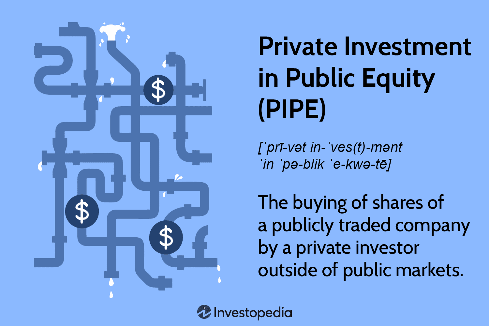

In the dynamic landscape of the stock market, investment strategies continue to evolve, bridging the gap between private investors and publicly traded companies. One strategy that has gained significant attention is Private Investment in Public Equity (PIPE). This approach has become a key component of financial markets, providing a channel for rapid capital infusion into publicly listed companies. PIPE investments involve the purchase of shares by private entities at a discounted price, allowing companies to raise funds efficiently and effectively.

In this article, we examine the complexities and importance of PIPE investments within the modern stock market, noting their interplay with contemporary advancements such as algorithmic trading. These investments not only offer strategic advantages but also present unique challenges and opportunities for both investors and corporations. The integration of PIPE investments with algorithmic trading strategies has revolutionized how market activities are approached, offering enhanced pricing, liquidity, and capital allocation.

As we navigate this topic, we aim to highlight the implications of PIPE deals for investors seeking profitable ventures and for companies aiming to achieve strategic growth without the market disruptions associated with traditional equity offerings. This analysis strives to provide a comprehensive overview that considers both the potential benefits and the risks involved, offering insights into how these elements impact the broader investment ecosystem.

## Table of Contents

## Understanding PIPE Deals

A PIPE (Private Investment in Public Equity) deal involves private investors purchasing shares of publicly listed companies at prices typically lower than the current market price. Such discounted transactions are often sought by companies aiming to secure substantial capital in a relatively short timeframe. Unlike traditional public offerings, PIPEs offer a streamlined process with fewer regulatory constraints, making them an attractive option for companies in need of quick financial infusion.

The mechanics of PIPE transactions start with a publicly traded company identifying the need for capital, either for expansion, operational needs, or to facilitate acquisitions. The company then engages in negotiations with private investors, such as hedge funds, private equity firms, or institutional investors, to secure direct capital investment through the sale of equity or equity-linked securities.

One of the primary attractions of PIPE transactions is their efficiency compared to conventional public offerings. Due to fewer regulatory hurdles, such as the need for extensive disclosures and long-winded approval processes, companies can expedite their fundraising efforts. This allows them to respond promptly to market opportunities or financial pressures without the delays associated with other capital-raising methods.

However, PIPE deals come with inherent risks, notably the dilution of existing shareholders' equity. When new shares are issued at a discount, the value of existing shares can be diluted, potentially leading to a decrease in share price and altering market perceptions of the company. This dilution can impact investor confidence and, consequently, the stock's market performance.

Despite such risks, entities aiming for a rapid capital influx find PIPE deals appealing due to their speed and relative simplicity. Private investors, in turn, gain access to stocks at a discount, which presents the potential for higher returns if the company's stock appreciates following the investment. Thus, PIPE transactions provide a strategic avenue for companies needing quick capital and investors looking for investment opportunities with potentially high rewards.

## Role and Benefits of PIPE Investments

PIPE investments are particularly advantageous for companies that encounter difficulties in securing funds through conventional equity offerings. This alternative financing mechanism provides companies with an opportunity to raise capital swiftly and efficiently, often at a time when traditional public offerings might be less feasible.

One of the primary benefits of PIPE transactions is the [liquidity](/wiki/liquidity-risk-premium) they offer to companies. By attracting private investors to purchase equity at a reduced price, companies can secure the necessary funds to sustain their operations without causing significant market disruptions. This immediate influx of capital is crucial for companies facing cash flow issues or those preparing for significant business operations such as acquisitions or expansions.

For investors, PIPE investments represent a chance to acquire stock at a discounted rate. This pricing advantage can lead to favorable returns once the stock appreciates, making PIPEs particularly appealing to investors with a high-risk tolerance and a keen eye for market potential. The ability to purchase underpriced equity allows investors to capitalize on a company's growth and subsequent share price increase.

Strategically, PIPE investments present several advantages over other financing options. They allow for quicker and more flexible funding, as the regulatory requirements are often less stringent compared to traditional equity offerings. This flexibility can be critical during certain phases of the market lifecycle, especially in volatile or non-bullish markets where public interest might wane.

Moreover, PIPE transactions offer a balance between risk and reward that makes them attractive in the investment landscape. While the potential for high returns exists, investors must also consider the inherent risks, such as share dilution, which could devalue their holdings if not managed properly by the issuing company. Therefore, conducting thorough due diligence and market analysis becomes crucial before engaging in PIPE deals.

In summary, PIPE investments provide companies with much-needed liquidity and an efficient way to raise capital, while offering investors a strategic opportunity to enter the market at a favorable price point. The delicate balance of risk and reward in these transactions underscores their significance within the broader scope of financial markets.

## Algorithmic Trading: Enhancing PIPE Investments

Algorithmic trading, commonly referred to as algo trading, involves the use of sophisticated algorithms to execute trades with enhanced speed and efficiency. In the sphere of Private Investment in Public Equity (PIPE) deals, algo trading emerges as a crucial tool that enhances the effectiveness of market strategies for investors. By leveraging algorithms, investors can fine-tune their market entry and [exit](/wiki/exit-strategy) points, ensuring optimized timing and pricing.

The integration of [algorithmic trading](/wiki/algorithmic-trading) with PIPE investments allows for more precise pricing mechanisms, thereby improving liquidity and capital allocation. This synergy is achieved through the algorithms' ability to process large volumes of data and execute trades that adhere to predefined criteria, all within fractions of a second. A key advantage here is the capacity to minimize market impact and enhance price discovery processes, crucial for both the investor and the company issuing new shares. 

To illustrate, consider the scenario where a PIPE investor aims to purchase a significant quantity of shares at the best possible price without moving the market. An algorithm can be designed to spread the purchase over a period, executing small, incremental trades that align with current market conditions. This method effectively reduces slippage – the difference between expected transaction prices and actual transaction prices – and optimizes the average purchase price.

Despite the efficiencies generated, algo trading is not devoid of risk. The high reliance on technology introduces potential vulnerabilities, especially in volatile market situations. Algorithms may exacerbate price fluctuations or inadvertently contribute to flash crashes, where rapid sell-offs lead to steep price declines in short periods. Robust risk management protocols and regulatory frameworks are, thus, essential to mitigate such eventualities.

Additionally, the dependency on real-time data accuracy and algorithm robustness poses challenges. Any failure or error in algorithm design could lead to significant financial losses. Implementing safeguards, continuous testing, and algorithm monitoring are critical measures for preventing and addressing such issues.

In summary, while algorithmic trading significantly bolsters the efficiency of PIPE investments by enhancing strategic market maneuvers and optimizing transaction conditions, it also brings forth a set of risks that necessitates vigilant oversight and adaptive strategies. The continuous evolution in both technology and market regulations will shape the degree to which these tools can be leveraged effectively within the PIPE investment landscape.

## Challenges and Considerations

Despite the advantages associated with Private Investment in Public Equity (PIPE) deals and algorithmic trading, these strategies are not without their inherent challenges. One of the primary concerns with PIPE deals is regulatory scrutiny. Given that PIPE transactions involve the issuance of new shares at a discount to the market price, they fall under the oversight of securities regulators who aim to ensure that market fairness and transparency are maintained. This can lead to regulatory delays and require significant disclosures by the companies involved.

Moreover, PIPE deals are frequently accompanied by the risk of market perception issues, especially when large volumes of shares are issued, potentially diluting the value of existing stockholders' shares. This dilution can affect the share price negatively if not managed properly. In addition to regulatory issues and market perception risks, there is a genuine concern about information asymmetry in PIPE transactions. Private investors involved in these deals often have access to non-public information, which can lead to concerns regarding insider trading and unfair advantages.

The integration of algorithmic trading introduces another set of challenges. High-frequency trading ([HFT](/wiki/high-frequency-trading-strategies)), a subset of algorithmic trading, can accelerate trades and market movements, sometimes resulting in flash crashes, where the prices of securities drop rapidly within a very short time frame before recovering just as quickly. Such instances not only disrupt market operations but can also lead to substantial financial losses for traders employing traditional trading methods.

Moreover, the reliance on complex algorithms for trading decisions can lead to systemic risk, where the failure of a single algorithm can have cascading effects on the broader market. This risk is amplified by the interconnectedness of global financial systems and the speed of trading facilitated by modern technology. Ensuring robust checks, balances, and compliance protocols is vital to safeguarding against these risks.

To mitigate these challenges, several measures have been implemented. Regulatory authorities continually update policies to monitor and control the potential misuse of information and high-frequency trades. Algorithms are calibrated with circuit breakers and stop-loss mechanisms to dampen the effects of erroneous trades or unexpected market [volatility](/wiki/volatility-trading-strategies). Furthermore, transparency in reporting and the implementation of best-execution policies assist in managing the potential adverse effects.

Stakeholders, including companies, investors, and regulatory bodies, must weigh these challenges carefully. While PIPE investments and algorithmic trading offer significant opportunities for growth and profit, their associated risks underscore the need for a thoughtful approach. Navigating this complex investment environment effectively requires a deep understanding of both the regulatory landscape and the advanced technologies that facilitate these investment strategies.

## Conclusion

Private investment in public equity (PIPE) deals continue to serve as a vital funding mechanism for many publicly traded companies. These transactions offer companies the flexibility to access capital efficiently, often circumventing the time-consuming processes and regulatory hurdles associated with traditional public offerings. This capacity to raise funds swiftly is particularly valuable for companies needing immediate liquidity to sustain operations, pursue strategic acquisitions, or capitalize on market opportunities.

When PIPE investments are integrated with algorithmic trading, they become even more potent tools for profit and strategic expansion in the stock market. Algorithmic trading enhances the ability of investors to optimize entry and exit points, thus ensuring favorable pricing and improved liquidity. This synergy can lead to substantial gains, but it also demands a sophisticated understanding of market conditions and the algorithms in use.

Nevertheless, the interplay of PIPE investments with algorithmic trading brings inherent risks that necessitate careful navigation. From potential market manipulation to systemic risks associated with high-frequency trading, it is crucial for investors to deploy prudent strategies. Balancing the impressive benefits against the associated risks requires a deep understanding of both the investment vehicles and the technologies employed.

Looking ahead, advancements in technology and changes in regulation will significantly influence the future landscape of PIPE investments and algorithmic trading. Emerging technologies may provide enhanced trading capabilities and improved data analytics, thereby altering investment strategies and risk management practices. Concurrently, evolving regulatory frameworks will aim to safeguard market integrity while promoting innovation.

Investors, companies, and regulators must remain agile in adapting to these developments. By staying informed and responsive to technological advancements and regulatory reforms, they can ensure equity and integrity in market operations while harnessing the full potential of PIPE investments and algorithmic trading.

## References & Further Reading

[1]: Lo, A. W., & MacKinlay, A. C. (1990). ["The Simple and the Complex: The Use of the Structure of Stock Prices."](https://www.scirp.org/reference/ReferencesPapers?ReferenceID=2225158) The Journal of Finance, 45(1), 1-19.

[2]: Henderson, B. J., Jegadeesh, N., & Weisbach, M. S. (2006). ["World Markets for Raising New Capital."](https://www.sciencedirect.com/science/article/abs/pii/S0304405X06000432) The Journal of Financial Economics, 82(1), 63-101.

[3]: Lerner, J., & Ambarish, M. (2011). ["The Private Equity Advantage: Leveraging the Lessons of Private Equity for Dealmaking in All Markets."](https://pmc.ncbi.nlm.nih.gov/articles/PMC6404179/) McGraw-Hill Education.

[4]: Hu, G. X., McLean, R. D., Pontiff, J., & Wang, Q. (2014). ["The Year-End Trading Activities of Institutional Investors: Evidence from Daily Trades."](https://academic.oup.com/rfs/article/27/5/1593/1580066) The Journal of Finance, 69(3), 595-634.

[5]: Chan, E., & Chan, E. (2013). ["Algorithmic Trading: Winning Strategies and Their Rationale."](https://github.com/ftvision/quant_trading_echan_book) Wiley Trading.