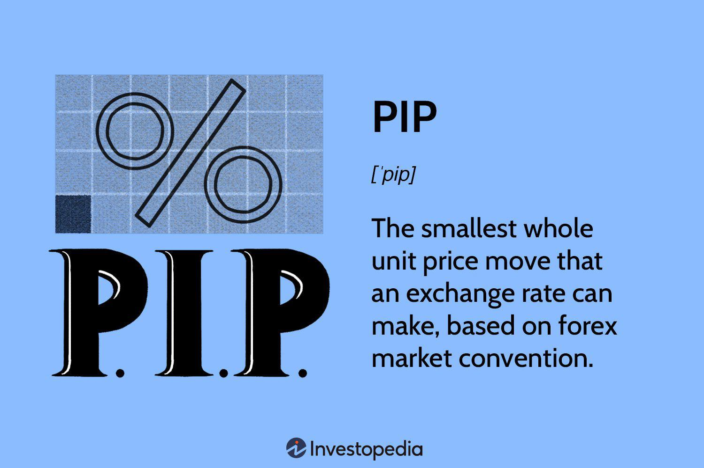

In the complex world of forex trading, understanding the intricacies of pips is fundamental for any trader aiming for success. Pips, or "percentage in point," act as the basic unit of measurement in the foreign exchange market, representing the smallest possible price movement between currency pairs. Mastery of pips allows traders to accurately assess and manage their trades, potentially transforming minimal price shifts into substantial profits or losses.

The calculation and interpretation of pips require familiarity with currency pairs, where each pair consists of a base currency and a quote currency. For most currency pairs, one pip equates to a movement of 0.0001, although exceptions exist for pairs involving the Japanese yen, where a pip is often 0.01. Understanding how these small changes translate into financial impact is essential for any trading strategy.



Moreover, technological advancements, particularly in algorithmic trading, are significantly reshaping how pips are evaluated and utilized. Algorithms can swiftly analyze market data and execute trades based on pip movements, offering heightened precision and speed. This technological integration is revolutionizing the forex landscape, requiring traders to adapt and refine their methodologies.

This article explores the calculations, significance, and strategic use of pips in forex trading. We also examine how algorithmic trading platforms are changing the way traders interact with forex markets, offering new opportunities and challenges in this rapidly evolving field.

## Table of Contents

## Understanding Forex Trading and Currency Pairs

Forex trading is fundamentally the exchange of one currency for another. This activity is primarily conducted through currency pairs, which signify the relative value between two currencies. A currency pair consists of a base currency and a quote currency. For instance, in the currency pair EUR/USD, the euro (EUR) is the base currency, and the US dollar (USD) is the quote currency. The quoted rate indicates how much of the quote currency is needed to purchase one unit of the base currency.

Currency pairs are categorized into three main groups: major, minor, and exotic pairs. Major currency pairs include the most traded currencies worldwide, characterized by high liquidity and [volume](/wiki/volume-trading-strategy). They incorporate the US dollar alongside another major currency, such as EUR/USD, USD/JPY, or GBP/USD. These pairs are known for their stability and tighter spreads.

Minor currency pairs, also referred to as cross-currency pairs, exclude the US dollar. Examples include EUR/GBP, AUD/JPY, and GBP/CAD. Although they are less liquid than major pairs, they offer opportunities for traders seeking diversification.

Exotic currency pairs consist of a major currency and a currency from a developing or smaller economy, like USD/SGD or EUR/TRY. These pairs represent higher risk and lower [liquidity](/wiki/liquidity-risk-premium), often leading to wider spreads and increased [volatility](/wiki/volatility-trading-strategies).

Understanding exchange rates and their quotations is quintessential in [forex](/wiki/forex-system) trading. An exchange rate is typically expressed in terms of the quote currency per one unit of the base currency. For instance, if the EUR/USD exchange rate is 1.2000, it means it costs 1.20 USD to buy 1 EUR. Exchange rates can be subject to fluctuations influenced by macroeconomic factors, geopolitical events, and market psychology, impacting trading strategies and profitability.

Exchange rates can be quoted directly or indirectly. A direct quote provides the domestic currency per unit of the foreign currency, while an indirect quote supplies the foreign currency per unit of the domestic currency. Mastery of these concepts is essential for traders to accurately calculate movements in pips and their implications on trades. Understanding how exchange rates impact pips is crucial, as it allows traders to assess potential profits or losses arising from currency movements.

Incorporating these fundamentals allows traders to make informed decisions and adapt their strategies according to market dynamics, optimizing their potential for success in the forex market.

## What Are Pips?

Pips, an acronym for 'percentage in point,' are a fundamental concept in forex trading, representing the smallest price movement that a currency pair's exchange rate can make. In most major currency pairs, a pip is typically noted to four decimal places—except for the Japanese yen pairs, where a pip is noted to two decimal places. For instance, in a currency pair like EUR/USD, if the exchange rate changes from 1.1050 to 1.1051, that movement constitutes a one-pip change. Despite their seemingly minuscule nature, these variations can accumulate, leading to significant financial impacts.

Calculating the value of a pip involves understanding the currency pair and the size of the trade. The formula for calculating pip value typically is based on the following:

$$
\text{Pip Value} = \frac{\text{One Pip}}{\text{Exchange Rate}} \times \text{Lot Size}
$$

For example, consider a standard lot of 100,000 units in the EUR/USD pair. If the exchange rate is 1.1050, the calculation would be:

$$
\text{Pip Value} = \frac{0.0001}{1.1050} \times 100,000 \approx 9.05 \, \text{USD}
$$

This means that for a one-pip movement, the value of the trade will change by approximately $9.05, assuming the account is funded in USD. Variations in pip values occur based on the lot sizes and the exchange rates of different currency pairs, impacting both profitability and risk exposure.

Interpreting pip movements requires an alert understanding of both the forex market's dynamics and the specific currency pair being traded. Since currency pairs differ in their volatility and economic influences, not all pip movements [carry](/wiki/carry-trading) the same weight or implications. For example, a pip movement in a major pair like EUR/USD might have less volatility compared to an exotic pair influenced by local geopolitical factors.

Ultimately, understanding and calculating pip value is crucial for traders, as it allows them to assess and manage the risk potential and profitability of their trades efficiently. By precisely quantifying the implications of these small movements, traders can better strategize their entry and [exit](/wiki/exit-strategy) points within the forex market.

## The Relationship Between Pips and Profitability

A trader's profitability in forex trading heavily depends on their ability to understand and strategically manage pip movements. A pip, or "percentage in point," signifies the smallest unit of change in a currency pair's exchange rate and can significantly impact a trader's profits or losses. 

Understanding pip movements enables traders to make informed trade decisions. Since each pip can correspond to a specific monetary value, the effect of pip fluctuations can directly translate into gains or losses in a trader's position. For example, in a currency pair where the pip value is $10, a movement of 10 pips could result in a $100 profit or loss, depending on the trade direction.

To leverage pip changes effectively, traders often employ various strategies, such as setting stop-loss orders and take-profit targets, to mitigate risk and maximize potential returns. By predefining acceptable levels of risk and potential reward, traders can use pip movements to their advantage without relying on constant market monitoring.

Consider a scenario where a trader anticipates a favorable shift in the EUR/USD currency pair based on technical analysis. The trader buys at an exchange rate of 1.1000, aiming for a pip increase to 1.1050. This 50 pip movement, with a pip value of $10, could result in a $500 profit on a standard lot (100,000 units). Conversely, if the market moves against the trader's position by 50 pips, a potential loss of $500 could ensue if no stop-loss is in place.

Effective pip analysis allows traders to align their strategies with market dynamics. For instance, employing technical indicators can help identify trends and potential pip movements, enabling traders to enter or exit trades at optimal times. Moreover, understanding historical pip volatility in specific currency pairs can aid in predicting future price movements and adjusting strategies accordingly.

However, inadequate pip analysis can lead to significant losses. Misreading market signals or failing to implement proper risk management strategies, such as stop-loss orders, might expose traders to adverse pip movements. For instance, a trader ignoring market news and relying solely on previous trends may encounter unforeseen volatility, resulting in unexpectedly large pip losses.

In conclusion, understanding and managing pip movements are critical for ensuring trader profitability in forex. Proper analysis of pip changes informs more strategic trade decisions, whether through manual strategies or automated systems. Effective pip management is essential to optimize gains and mitigate losses, enhancing overall trading outcomes.

## Algo Trading: A New Frontier

Algorithmic trading, commonly known as 'algo trading,' is transforming the way pips are evaluated and traded in the forex market. By utilizing complex algorithms, traders can monitor and respond to pip movements with remarkable speed and precision. This computational approach allows for the execution of trading strategies in a manner that surpasses human capabilities in terms of efficiency and accuracy.

### Advantages of Algo Trading in Forex

1. **Speed and Efficiency**: Algorithms can analyze vast amounts of data and execute trades in milliseconds, far quicker than a human trader. This speed is crucial in the forex market, where pip values can change rapidly, and the ability to act swiftly can significantly influence profitability.

2. **Precision**: Algo trading systems are programmed to operate within specific parameters set by the trader. This precision ensures that trades are executed exactly as planned, reducing the likelihood of human error and enhancing the likelihood of consistent outcomes.

3. **Backtesting and Strategy Optimization**: Traders can backtest their strategies against historical data to evaluate performance under various market conditions. Algorithmic systems can analyze past pip movements and optimize strategies to improve future trading performance.

4. **Emotionless Trading**: One of the intangible advantages of algo trading is its elimination of human emotion from the trading process. Psychological factors such as fear and greed can lead to irrational trading decisions; algorithms, operating purely on data and predefined rules, do not suffer from these biases.

### Risks of Integrating Algo Trading

1. **Technical Failures**: Algorithmic systems rely heavily on technology and are thus vulnerable to technical failures. Network disruptions, software bugs, or hardware malfunctions can lead to missed trades or unintended transactions, affecting profitability.

2. **Over-Optimization**: There is a risk of over-optimizing strategies based on historical data, often referred to as "curve-fitting." This can result in strategies that look impressive in backtesting but perform poorly in live markets due to their inability to adapt to changing market conditions.

3. **Market Impact**: High-frequency trading, a subset of algo trading, can inadvertently impact market conditions. The execution of large orders in a short timeframe can lead to significant price movements, affecting the very pips the algorithm aims to capitalize on.

4. **Regulation and Compliance**: As algo trading becomes more prevalent, regulatory bodies worldwide are increasing scrutiny of automated trading systems. Traders must ensure that their algorithms comply with financial regulations to avoid legal complications.

In conclusion, while [algorithmic trading](/wiki/algorithmic-trading) offers numerous advantages for managing pip movements and enhancing trading strategies in forex, it also presents significant risks that traders must mitigate. A balanced approach that incorporates robust risk management, continuous monitoring, and adherence to regulatory standards is essential for leveraging algorithmic trading successfully in the dynamic forex market.

## Integrating Pips, Forex Trading, and Algo Trading

The integration of pips management within the context of automated trading systems presents an opportunity to enhance trading efficiency significantly. Automated systems, equipped with the ability to rapidly analyze vast amounts of data and execute trades based on predefined criteria, offer a robust framework for the precise management of pip movements. The key lies in harmonizing the traditional understanding of pip value and movements with advanced technological tools.

Maximizing returns in this setting requires a strategic combination of pip analysis and automated systems. Traditional pip analysis, which involves monitoring the smallest price movements in currency pairs to make informed trading decisions, can be augmented by algorithmic capabilities. This integration allows for the swift and precise execution of trades when favorable pip movements are detected, enabling traders to capitalize on market conditions more effectively than manual trading would permit.

A balanced approach is essential to leverage both historical trading insights and modern technology. For instance, traditional pip calculations help traders understand potential market shifts. Meanwhile, algorithmic models can sift through historical data to identify patterns or signals, initiating trades that align with well-established strategies.

Case studies of successful forex algo trading strategies demonstrate the potent synergy of pip analysis and technological innovation. Consider a scenario where an algorithm is designed to monitor a specific currency pair for a pip movement beyond a certain threshold, indicating a potential trade opportunity. The algorithm can instantly execute a buy or sell order based on the programmed criteria. This kind of system leverages historical data to predict future movements, automating the decision-making process.

Moreover, algorithms can incorporate [machine learning](/wiki/machine-learning) techniques to refine their decision-making processes based on past trading outcomes. Over time, the system becomes adept at recognizing successful patterns, hence improving its capacity to predict profitable trades based on pip fluctuations. This adaptive learning fosters a more responsive trading environment, where systems continuously refine their strategies to maximize profitability as market dynamics evolve.

In conclusion, the intersection of pips management and algorithmic trading in forex offers a path to more efficient and potentially more profitable trading strategies. By effectively merging traditional analysis with cutting-edge technology, traders can position themselves advantageously in the fast-paced forex market.

## Conclusion

Pips are essential in understanding the dynamics of the forex market and directly impact trader profitability. They represent the smallest price movement in a currency exchange rate, and although seemingly minor, these fluctuations can culminate in substantial financial outcomes. A nuanced understanding of how to calculate and interpret pips is critical, whether one engages in manual trading or employs algorithmic trading systems.

In manual trading, traders rely on their analytical skills to forecast market movements and make informed decisions. An astute trader recognizes how even the smallest pip movements can signal crucial market changes, allowing for the timely execution of trades that maximize profit and minimize loss. Manual traders must become adept at reading and predicting the patterns formed by these pip movements.

Conversely, algorithmic trading leverages technology to automate and optimize the process of trading pips. Algorithms can process vast amounts of market data in real-time, executing trades with accuracy and speed unattainable by human traders. This method enhances pip management by responding swiftly to changes and employing sophisticated strategies that have been backtested for efficacy. Nevertheless, traders should be aware of the inherent risks associated with algorithmic trading, such as system malfunctions and over-reliance on automation.

As forex trading technologies evolve, traders must adapt their strategies to remain competitive. This means integrating traditional pip analysis with advanced technological tools. The blend of classic and modern methodologies offers the greatest potential for achieving success in the rapidly changing forex landscape. Continual education and adaptation are necessary to harness the full potential of pips within the forex market, ensuring profitability and sustained competitive advantage.

## FAQs

### What is the significance of pips in forex trading?

Pips are fundamental in forex trading because they denote the smallest price movement within a currency pair’s exchange rate. Understanding pips is crucial for calculating changes in value. For instance, if the EUR/USD moves from 1.1000 to 1.1001, it has moved one pip. Successful trading often hinges on accumulating gains measured in pips, whether through short-term trades or long-term strategies.

### How do pips vary across different currency pairs?

Pips vary depending on how currency pairs are quoted. Most pairs are quoted to four decimal places, with one pip representing 0.0001. However, for pairs involving the Japanese yen, such as USD/JPY, they are often quoted to two decimal places. Here, one pip represents 0.01. This difference affects how pip values are calculated and traded across different currency pairs.

### What are some common mistakes new traders make with pips?

New traders often miscalculate pip values by not accounting for varying decimal places across currency pairs, leading to incorrect assessments of trade value. Additionally, beginners might overlook the relationship between leverage and pips, increasing risk. Another common mistake is neglecting to set stop-loss orders at strategic pip levels, resulting in larger-than-expected losses.

### How can algorithmic trading enhance pip management?

Algorithmic trading enhances pip management by enabling automated and rapid response to pip movements. Traders can execute strategies with precision based on specified parameters, facilitated by algorithms. For example, a Python script could instantly buy or sell a currency pair if it moves a certain number of pips. Here is a simple Python snippet that demonstrates an alert-based algorithm:

```python
def check_pip_movement(current_price, previous_price, threshold):
    pip_change = (current_price - previous_price) * 10000  # assuming 4 decimal places
    if abs(pip_change) >= threshold:
        return "Trade Alert: Significant pip change detected!"
    return "No significant movement."

current_price = 1.2050
previous_price = 1.2045
threshold = 5

print(check_pip_movement(current_price, previous_price, threshold))
```

### What role does leverage play in pip profitability?

Leverage amplifies the potential for profit or loss in pip movements by allowing traders to control large positions with relatively small capital. For instance, with 100:1 leverage, a pip movement can result in a $10 gain or loss for a $100,000 currency position. While leverage can magnify the rewards from small pip movements, it also escalates risk, making proper risk management essential in forex trading.

## References & Further Reading

[1]: ["Algorithmic Trading"](https://www.investopedia.com/articles/active-trading/101014/basics-algorithmic-trading-concepts-and-examples.asp) by Ernie Chan

[2]: ["Forex Trading: The Basics Explained in Simple Terms"](https://www.amazon.com/FOREX-TRADING-Explained-Beginners-Strategies/dp/1535198567) by Jim Brown

[3]: ["Technical Analysis of the Financial Markets: A Comprehensive Guide to Trading Methods and Applications"](https://www.amazon.com/Technical-Analysis-Financial-Markets-Comprehensive/dp/0735200661) by John J. Murphy

[4]: "BIS Triennial Central Bank Survey - Global foreign exchange market turnover in 2019." Bank for International Settlements. Available at: https://www.bis.org/statistics/rpfx19_fx.pdf

[5]: Dacorogna, M. M., Müller, U. A., Jost, C., & Pictet, O. V. (2001). ["An Introduction To High-Frequency Finance"](https://archive.org/details/an-introduction-to-high-frequency-finance). Quantitative Finance.