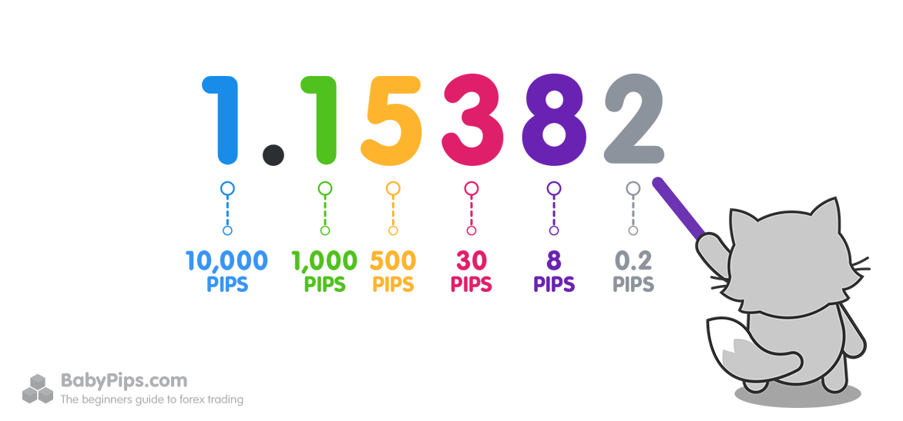

## Table of Contents

## What are pips in currency trading?

In currency trading, a pip is a small unit used to measure changes in the exchange rate between two currencies. It stands for "percentage in point" or "price interest point." Most currency pairs are quoted to four decimal places, so a pip is usually the last decimal place, or 0.0001. For example, if the EUR/USD rate moves from 1.1850 to 1.1851, that 0.0001 change is one pip.

Some currency pairs, like those involving the Japanese yen, are quoted to two decimal places. In these cases, a pip is the second decimal place, or 0.01. For instance, if the USD/JPY rate moves from 110.00 to 110.01, that 0.01 change is one pip. Understanding pips is important for traders because they help calculate profits and losses in forex trading.

## How do you calculate the value of a pip?

To calculate the value of a pip, you need to know the currency pair you are trading and the size of your trade. For most currency pairs, a pip is 0.0001 of the quoted price. If you are trading a standard lot, which is 100,000 units of the base currency, the value of one pip is usually $10. This is because 0.0001 times 100,000 equals 10. So, if the EUR/USD moves by one pip, and you are trading a standard lot, your profit or loss would be $10.

For currency pairs involving the Japanese yen, a pip is 0.01 of the quoted price. If you are trading a standard lot of 100,000 units, the value of one pip is usually 1,000 yen. This is because 0.01 times 100,000 equals 1,000. So, if the USD/JPY moves by one pip, and you are trading a standard lot, your profit or loss would be 1,000 yen. Remember, the pip value can change if you trade different lot sizes or if the currency pair has a different quote convention.

## Why are pips important in forex trading?

Pips are important in [forex](/wiki/forex-system) trading because they help traders understand how much money they can make or lose. When you trade currencies, the price changes all the time. These changes are measured in pips. If you know the value of one pip, you can figure out how much money you will gain or lose when the price moves by a certain amount. This is very helpful for planning your trades and managing your risk.

Pips also make it easier to compare different trades. Since all currency pairs use pips to measure price changes, you can quickly see which trades are doing better or worse. This helps traders decide when to buy or sell. Overall, understanding pips is key to being a successful forex trader because it helps you keep track of your profits and losses in a simple way.

## How do pips affect profit and loss in trading?

Pips directly affect how much money you make or lose when you trade currencies. If the price of a currency pair moves in your favor, the number of pips it moves will determine your profit. For example, if you buy EUR/USD at 1.1850 and it goes up to 1.1860, that's a 10 pip move. If you're trading a standard lot, each pip is worth $10, so you would make $100. But if the price moves against you, the pips will show how much you lose. If EUR/USD drops from 1.1850 to 1.1840, that's also a 10 pip move, but in the opposite direction, so you would lose $100.

Understanding pips is important because it helps you plan your trades and manage risk. If you know how much each pip is worth, you can decide how many pips you need to make a certain amount of money or how many pips you can afford to lose. This helps you set your goals and stop-loss levels, which are points where you will sell your trade to avoid losing too much money. By keeping an eye on pips, you can better control your trades and make smarter decisions.

## What is the difference between pips and pipettes?

Pips and pipettes are both used to measure price changes in forex trading, but they are a bit different. A pip is the smallest whole unit of change in a currency pair's exchange rate. For most currency pairs, a pip is 0.0001. For example, if the EUR/USD moves from 1.1850 to 1.1851, that 0.0001 change is one pip. But for currency pairs with the Japanese yen, a pip is 0.01. So if USD/JPY moves from 110.00 to 110.01, that 0.01 change is one pip.

A pipette is even smaller than a pip. It's one-tenth of a pip. For most currency pairs, a pipette is 0.00001. So if EUR/USD moves from 1.18501 to 1.18502, that 0.00001 change is one pipette. Some trading platforms use pipettes to give more detailed price quotes. This can be helpful for traders who want to see smaller price movements, but it's not as commonly used as pips.

## How do different currency pairs affect pip values?

Different currency pairs can change the value of a pip because they use different units to measure price changes. For most currency pairs, like EUR/USD, a pip is 0.0001. If you trade a standard lot of 100,000 units, one pip is worth $10. But for currency pairs with the Japanese yen, like USD/JPY, a pip is bigger at 0.01. So if you trade a standard lot of 100,000 units, one pip is worth 1,000 yen. This means that the same number of pips can be worth different amounts of money depending on which currency pair you are trading.

Also, the value of a pip can change based on the quote currency in the pair. The quote currency is the second currency in the pair, and it's the one that determines the pip value. For example, if you trade GBP/JPY, the pip value is in yen because JPY is the quote currency. But if you trade GBP/USD, the pip value is in dollars because USD is the quote currency. So, understanding which currency is the quote currency is important for figuring out how much money you can make or lose with each pip.

## Can you explain how leverage impacts pip values?

Leverage can make the value of a pip bigger when you trade. When you use leverage, you borrow money from your broker to trade more than you have in your account. This means you can trade bigger amounts with less money. If you trade a bigger amount, the value of each pip goes up. For example, if you trade a standard lot without leverage, one pip might be worth $10. But if you use leverage to trade 10 standard lots, one pip could be worth $100. So, leverage can make your profits or losses bigger because it changes how much each pip is worth.

But remember, using leverage is risky. It can make your profits bigger, but it can also make your losses bigger. If the price moves against you, the bigger pip value means you could lose more money than you would without leverage. So, it's important to understand how leverage works and to use it carefully. Always think about how much you can afford to lose before you start trading with leverage.

## What strategies can be used to manage pip-related risks?

One way to manage pip-related risks is to use stop-loss orders. A stop-loss order is a tool that helps you limit how much money you can lose on a trade. You set a price at which your trade will automatically close if the price moves against you. This way, even if the price moves a lot of pips in the wrong direction, you won't lose more than you planned. It's like having a safety net that keeps your losses small.

Another strategy is to use proper position sizing. This means deciding how much money to put into each trade based on how many pips you think the price will move and how much risk you're willing to take. If you trade smaller amounts, each pip will be worth less money, so your losses will be smaller if the price moves against you. This can help you stay in control and keep your trading account safe, even when the market is moving a lot.

Lastly, you can manage pip-related risks by diversifying your trades. Instead of putting all your money into one currency pair, you can spread it out over different pairs. This way, if one pair moves against you and you lose pips, another pair might move in your favor and help balance out your losses. Diversifying can make your trading safer because it reduces the chance that one bad trade will hurt your whole account.

## How do economic events influence pip movements?

Economic events can make big changes in the forex market, which can cause the price of currency pairs to move a lot of pips. When important news comes out, like a country's unemployment rate or [interest rate](/wiki/interest-rate-trading-strategies) decisions, traders react quickly. If the news is good, more people might want to buy that country's currency, making its value go up. If the news is bad, people might sell the currency, making its value go down. These quick reactions can lead to big pip movements in a short time.

For example, if the U.S. releases a report showing that more people are working than expected, the value of the U.S. dollar might go up because it's good news for the economy. Traders might buy more USD, causing the USD to gain pips against other currencies. On the other hand, if a country's central bank decides to lower interest rates, it might make the currency less attractive to hold, leading to a drop in its value and a loss of pips. Understanding how economic events can affect currency values helps traders predict and manage pip movements better.

## What are some common mistakes traders make regarding pips?

One common mistake traders make with pips is not understanding how much each pip is worth. They might think that a small move in pips won't affect their account much, but if they are trading a big amount, even a small move can lead to big profits or losses. For example, if a trader uses a lot of leverage, a few pips can make a big difference. Not knowing the value of a pip can lead to big surprises when they see how much money they made or lost.

Another mistake is not setting stop-loss orders correctly. Traders might set their stop-loss too close to the entry price, so their trade gets closed out by a small pip movement. Or they might set it too far away, which can lead to big losses if the price moves against them. It's important to find a balance and set stop-loss orders based on how much risk they are willing to take and how many pips they expect the price to move.

## How can advanced traders use pip analysis for market prediction?

Advanced traders can use pip analysis to predict how the market might move by looking at past price changes in pips. They study how many pips a currency pair has moved in the past and use this information to guess where the price might go next. For example, if a currency pair usually moves about 50 pips a day, a trader might predict that it will do the same tomorrow. They can also look at how many pips the price moves during different times of the day or after certain economic events. This helps them find patterns and make better guesses about future price movements.

Another way advanced traders use pip analysis is by looking at support and resistance levels. These are prices where the currency pair has stopped moving up or down in the past. Traders count the pips between these levels to see how strong they are. If a currency pair moves a lot of pips away from a support or resistance level, it might mean the price is likely to bounce back to that level. By understanding how many pips are between these levels, traders can predict where the price might go next and plan their trades accordingly.

## What role do pips play in algorithmic trading strategies?

In [algorithmic trading](/wiki/algorithmic-trading), pips are really important because they help computers figure out when to buy or sell currencies. Algorithms are like computer programs that follow rules to trade. They use pips to measure how much the price of a currency pair has moved. If the price moves a certain number of pips, the algorithm might decide to make a trade. For example, if an algorithm is set to buy when the price goes up by 20 pips, it will watch the market and make the trade as soon as that happens. This helps the algorithm make quick decisions without needing a person to watch the market all the time.

Pips also help algorithms manage risk. If the price moves against the trade by a certain number of pips, the algorithm can use this information to close the trade and limit losses. This is called a stop-loss order. Algorithms can also use pips to set targets for how much profit they want to make. If the price moves in favor of the trade by a certain number of pips, the algorithm might sell to lock in the profit. By using pips, algorithms can follow their trading rules and manage both profits and losses in a clear and automatic way.

## What are pips?

Pips, an acronym for 'percentage in point,' are a fundamental concept in forex trading, representing the smallest price movement that a currency pair's exchange rate can make. In most major currency pairs, a pip is typically noted to four decimal places—except for the Japanese yen pairs, where a pip is noted to two decimal places. For instance, in a currency pair like EUR/USD, if the exchange rate changes from 1.1050 to 1.1051, that movement constitutes a one-pip change. Despite their seemingly minuscule nature, these variations can accumulate, leading to significant financial impacts.

Calculating the value of a pip involves understanding the currency pair and the size of the trade. The formula for calculating pip value typically is based on the following:

$$
\text{Pip Value} = \frac{\text{One Pip}}{\text{Exchange Rate}} \times \text{Lot Size}
$$

For example, consider a standard lot of 100,000 units in the EUR/USD pair. If the exchange rate is 1.1050, the calculation would be:

$$
\text{Pip Value} = \frac{0.0001}{1.1050} \times 100,000 \approx 9.05 \, \text{USD}
$$

This means that for a one-pip movement, the value of the trade will change by approximately $9.05, assuming the account is funded in USD. Variations in pip values occur based on the lot sizes and the exchange rates of different currency pairs, impacting both profitability and risk exposure.

Interpreting pip movements requires an alert understanding of both the forex market's dynamics and the specific currency pair being traded. Since currency pairs differ in their [volatility](/wiki/volatility-trading-strategies) and economic influences, not all pip movements [carry](/wiki/carry-trading) the same weight or implications. For example, a pip movement in a major pair like EUR/USD might have less volatility compared to an exotic pair influenced by local geopolitical factors.

Ultimately, understanding and calculating pip value is crucial for traders, as it allows them to assess and manage the risk potential and profitability of their trades efficiently. By precisely quantifying the implications of these small movements, traders can better strategize their entry and [exit](/wiki/exit-strategy) points within the forex market.

## References & Further Reading

[1]: ["Algorithmic Trading"](https://www.investopedia.com/articles/active-trading/101014/basics-algorithmic-trading-concepts-and-examples.asp) by Ernie Chan

[2]: ["Forex Trading: The Basics Explained in Simple Terms"](https://www.amazon.com/FOREX-TRADING-Explained-Beginners-Strategies/dp/1535198567) by Jim Brown

[3]: ["Technical Analysis of the Financial Markets: A Comprehensive Guide to Trading Methods and Applications"](https://www.amazon.com/Technical-Analysis-Financial-Markets-Comprehensive/dp/0735200661) by John J. Murphy

[4]: "BIS Triennial Central Bank Survey - Global foreign exchange market turnover in 2019." Bank for International Settlements. Available at: https://www.bis.org/statistics/rpfx19_fx.pdf

[5]: Dacorogna, M. M., Müller, U. A., Jost, C., & Pictet, O. V. (2001). ["An Introduction To High-Frequency Finance"](https://archive.org/details/an-introduction-to-high-frequency-finance). Quantitative Finance.