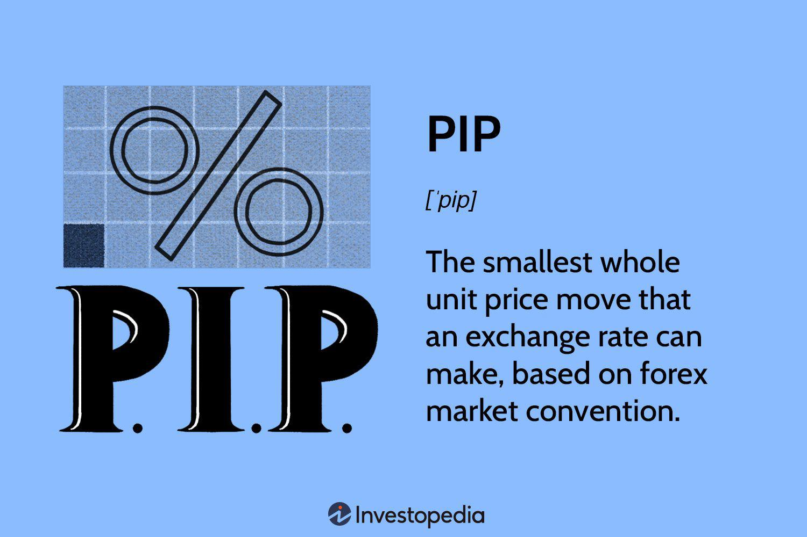

## Table of Contents

## What is a pip in forex trading?

In forex trading, a pip is a small measure of change in a currency pair's exchange rate. It stands for "percentage in point" or "price interest point." Most major currency pairs are priced to four decimal places, so a pip is usually the last decimal place, or 0.0001. For example, if the EUR/USD moves from 1.1850 to 1.1851, that 0.0001 change is one pip.

Some currency pairs, like those involving the Japanese yen, are quoted to two decimal places. In these cases, a pip is the second decimal place, or 0.01. For instance, if the USD/JPY moves from 110.00 to 110.01, that 0.01 change is one pip. Understanding pips is important for traders because they help calculate profits and losses in forex trading.

## How is a pip calculated in major currency pairs?

In major currency pairs, a pip is usually the smallest change in the exchange rate. Most of these pairs are quoted to four decimal places. So, a pip is the last number in the quote, which is 0.0001. For example, if the EUR/USD rate moves from 1.1000 to 1.1001, that change of 0.0001 is one pip. This small unit helps traders measure how much the currency pair has moved.

For pairs involving the Japanese yen, like USD/JPY, the quote is different. These pairs are usually quoted to two decimal places. So, a pip in these pairs is the second number after the decimal point, which is 0.01. If the USD/JPY rate goes from 110.00 to 110.01, that change of 0.01 is one pip. Knowing how to calculate pips is important for figuring out profits and losses in [forex](/wiki/forex-system) trading.

## What is the value of a pip for different lot sizes?

The value of a pip depends on the lot size you are trading. In forex, a standard lot is 100,000 units of the base currency. For a standard lot, the value of one pip is typically $10 for most major currency pairs. For example, if you are trading EUR/USD and the price moves by one pip (0.0001), that movement is worth $10. If you trade a mini lot, which is 10,000 units, the value of one pip drops to $1. For a micro lot, which is 1,000 units, the value of one pip is $0.10.

For currency pairs involving the Japanese yen, the calculation is a bit different because they are quoted to two decimal places. For a standard lot of 100,000 units, one pip (0.01) is worth 1,000 yen. If you convert this to dollars, the value depends on the current USD/JPY exchange rate. For a mini lot of 10,000 units, one pip is worth 100 yen, and for a micro lot of 1,000 units, one pip is worth 10 yen. Understanding these values helps traders manage their risk and potential profits.

## How does the pip value change with different currency pairs?

The value of a pip changes depending on which currency pair you are trading. For most major currency pairs like EUR/USD, GBP/USD, and USD/CHF, a pip is worth $10 for a standard lot of 100,000 units. This is because these pairs are quoted to four decimal places, and a pip is the last decimal place (0.0001). If you trade smaller lot sizes, like a mini lot of 10,000 units, the pip value drops to $1, and for a micro lot of 1,000 units, it's $0.10.

For currency pairs involving the Japanese yen, like USD/JPY and EUR/JPY, the pip value calculation is different. These pairs are quoted to two decimal places, so a pip is the second decimal place (0.01). For a standard lot of 100,000 units, one pip is worth 1,000 yen. If you convert this to dollars, the value depends on the current exchange rate between the yen and the dollar. For smaller lot sizes, the pip value in yen remains the same, but when converted to dollars, it will vary based on the exchange rate.

## Can you explain the difference between pips and pipettes?

In forex trading, a pip is a small change in the price of a currency pair. For most major currency pairs, like EUR/USD, a pip is the last number after four decimal places, which is 0.0001. For pairs involving the Japanese yen, like USD/JPY, a pip is the second number after two decimal places, which is 0.01. Pips help traders measure how much the price of a currency pair has moved.

A pipette is even smaller than a pip. It's a fraction of a pip, often used when brokers quote prices to five decimal places. For most currency pairs, a pipette is one-tenth of a pip, or 0.00001. This means that if the EUR/USD moves from 1.10000 to 1.10001, that's one pipette. Pipettes allow for more precise trading and are useful for traders who want to take advantage of very small price movements.

## How do pips affect the profit and loss in a forex trade?

Pips are important in forex trading because they help you figure out how much money you can make or lose. When you trade forex, you buy one currency and sell another. The price of these currencies changes all the time, and a pip is a small change in that price. If the price moves in your favor, you make money. If it moves against you, you lose money. The number of pips the price moves determines how much you win or lose.

For example, if you buy EUR/USD at 1.1000 and it goes up to 1.1050, that's a 50 pip move. If you traded a standard lot of 100,000 units, each pip is worth $10, so you would make $500 (50 pips x $10 per pip). But if the price went down to 1.0950 instead, you would lose $500 because it moved 50 pips against you. Knowing how pips work helps you manage your trades and understand the risks involved.

## What role do pips play in setting stop-loss and take-profit levels?

Pips are very important when you set your stop-loss and take-profit levels in forex trading. A stop-loss is like a safety net that helps you limit how much money you can lose if the price moves against you. You set it at a certain number of pips away from where you bought or sold the currency. For example, if you buy EUR/USD at 1.1000 and you want to limit your loss to 20 pips, you would set your stop-loss at 1.0980. This means if the price drops to 1.0980, your trade will close automatically, and you won't lose more than you planned.

A take-profit works the opposite way. It's a level where you want to lock in your profits if the price moves in your favor. You set it at a certain number of pips away from your entry price. For instance, if you buy EUR/USD at 1.1000 and you want to make a profit of 50 pips, you would set your take-profit at 1.1050. If the price reaches 1.1050, your trade will close, and you will make the profit you aimed for. Using pips to set these levels helps you plan your trades and manage your risks better.

## How can understanding pips help in managing risk in forex trading?

Understanding pips is really helpful for managing risk in forex trading. When you know how much a pip is worth, you can figure out how much money you might lose or gain on a trade. This helps you set your stop-loss levels, which are like safety nets that stop your trade from losing too much money if the price moves against you. By deciding how many pips away from your entry price you want your stop-loss to be, you can control how much risk you're taking on each trade.

Also, pips help you set your take-profit levels, which are points where you want to lock in your profits. If you know that a certain number of pips will give you the profit you're aiming for, you can set your take-profit at that level. This way, you can plan your trades better and make sure you're not risking more than you can afford to lose. Understanding pips lets you make smarter decisions about how to manage your trades and keep your risks under control.

## What are the common mistakes traders make when calculating pips?

One common mistake traders make when calculating pips is not understanding the difference between currency pairs. Most major pairs like EUR/USD are quoted to four decimal places, so a pip is the last number, which is 0.0001. But pairs with the Japanese yen, like USD/JPY, are quoted to two decimal places, so a pip is the second number, which is 0.01. If traders mix these up, they can miscalculate how much they might win or lose.

Another mistake is not considering the lot size when figuring out pip values. A pip's value changes depending on whether you're trading a standard lot (100,000 units), a mini lot (10,000 units), or a micro lot (1,000 units). For example, a pip in EUR/USD is worth $10 for a standard lot, but only $1 for a mini lot. If traders don't account for this, they might think they're making or losing more money than they really are.

## How do brokers handle pip calculations for exotic currency pairs?

Brokers handle pip calculations for exotic currency pairs a bit differently than for major pairs. Exotic pairs often have different decimal places in their quotes. For example, some exotic pairs might be quoted to three or five decimal places instead of the usual four or two. So, a pip for these pairs might be 0.001 or 0.00001, depending on the pair. Brokers need to make sure they're using the right number of decimal places when they figure out pips for these exotic pairs.

Because exotic pairs can be less common and have less trading volume, the pip values can also be different. Brokers might use different lot sizes or have different ways to convert the pip values into the trader's account currency. This can make things a bit more complicated, but the main idea is the same: a pip is still a small change in the price of the currency pair. Traders need to check with their broker to understand exactly how pips are calculated for the exotic pairs they're trading.

## What advanced strategies involve pip movements in forex trading?

One advanced strategy that involves pip movements is called [scalping](/wiki/gamma-scalping). Scalping is when traders try to make small profits from tiny changes in the price of a currency pair. They might only aim to make a few pips at a time, but they do this many times throughout the day. To do this well, scalpers need to watch the market very closely and use tools like technical indicators to help them decide when to buy and sell. They also need to know how much a pip is worth so they can figure out if their small trades are worth it.

Another strategy is called range trading. This is when traders look for currency pairs that stay between two price levels for a while. They buy near the bottom of the range and sell near the top, hoping to make money from the pip movements within that range. To do this, traders need to be good at spotting these ranges and knowing when they might break. They use pips to set their entry and [exit](/wiki/exit-strategy) points, making sure they can make a profit even if the price only moves a little bit. Both scalping and range trading show how important it is to understand pips and use them to plan your trades carefully.

## How have technological advancements affected the way pips are used in trading?

Technological advancements have made a big difference in how traders use pips in forex trading. With computers and the internet, traders can now see pip movements in real-time. This means they can make quick decisions based on small changes in price. Tools like trading platforms and charting software help traders see exactly how many pips a currency pair has moved. This makes it easier for them to set their stop-loss and take-profit levels accurately, helping them manage their trades better.

Also, technology has brought new ways to trade, like automated trading systems. These systems can be set up to buy or sell based on how many pips the price moves. This takes a lot of the work out of watching the market all the time. Traders can use these systems to follow their strategies without having to be at their computer all day. Overall, technology has made it easier for traders to use pips to plan their trades and manage their risks.

## How do you calculate pip value?

The value of a pip is a critical [factor](/wiki/factor-investing) for effective forex trade management and varies based on several elements, namely the currency pair traded, the current exchange rate, and the size of the trade involved. Understanding these variables enables traders to estimate potential profit or loss from fluctuations in currency values accurately.

For currency pairs where the USD is the quote currency, such as EUR/USD or GBP/USD, a pip is commonly valued at $0.0001. This calculation arises because these pairs often quote values to four decimal places, making each pip movement equal to a 0.01% change in the exchange rate. Conversely, for currency pairs involving the Japanese yen, such as USD/JPY, a pip is quoted at the second decimal place, making it equivalent to 0.01 yen.

To calculate the pip value for any given trade, the formula used is:

$$
\text{Pip Value per Lot} = \frac{\text{One Pip}}{\text{Exchange Rate}} \times \text{Lot Size}
$$

Here, the "One Pip" value corresponds to 0.0001 for most currency pairs and 0.01 for yen-based pairs. The exchange rate represents the current rate at which the base currency can be exchanged for the quote currency, while the lot size equates to the [volume](/wiki/volume-trading-strategy) of currency traded, typically measured in standard lots (100,000 units), mini lots (10,000 units), or micro lots (1,000 units).

### Example Calculation

Consider a trade involving a standard lot (100,000 units) in the EUR/USD currency pair, with an exchange rate of 1.2000. The pip value is calculated as follows:

$$
\text{Pip Value} = \frac{0.0001}{1.2000} \times 100,000 = 8.33
$$

This calculation indicates that for each pip movement in this trade, the trader's account balance will increase or decrease by $8.33.

Similarly, for a trade involving the USD/JPY pair with an exchange rate of 110.00 and a standard lot size, the pip value calculation would be:

$$
\text{Pip Value} = \frac{0.01}{110.00} \times 100,000 = 9.09
$$

This reflects a pip value of approximately 9.09 USD for each pip movement in the USD/JPY trade.

Understanding how to calculate pip value is crucial for traders to effectively manage their risk and optimize their trading strategies. It allows traders to accurately assess their potential returns and adjust their lot sizes or stop-loss setups accordingly to align with their risk tolerance and market outlook.

## What are some real-world examples and use cases?

Examining real-world scenarios helps contextualize the theoretical aspects of pips and trading strategies. In practice, traders utilize pip data to quantify market [volatility](/wiki/volatility-trading-strategies) and to set stop-loss and take-profit levels effectively. Here, we explore two case studies that illustrate the use of pips in managing trades and understanding market dynamics.

### Case Study 1: The 2015 Swiss Franc Dilemma

On January 15, 2015, the Swiss National Bank (SNB) unexpectedly abandoned its currency floor against the euro, causing a sharp appreciation in the Swiss franc. Traders experienced extreme pip movements, with the EUR/CHF pair dropping over 2,000 pips in minutes. This event highlighted the importance of understanding pip movements and their potential impact on trading positions.

Successfully navigating such volatility required real-time monitoring of pip changes and swift execution of trading strategies. Traders employing algorithmic systems were able to capitalize on precise entries and exits based on pip thresholds, cushioning against massive losses or amplifying potential gains.

### Case Study 2: Brexit Referendum Impact on GBP/USD

The Brexit referendum on June 23, 2016, caused significant fluctuations in currency markets, particularly affecting the GBP/USD pair. On the day results were announced, the pair experienced a dramatic swing of over 1,800 pips, as the market reacted to the unexpected decision for the UK to leave the European Union.

Traders who had anticipated possible outcomes and set strategic pip-based stop-loss orders were better positioned to manage risk. This scenario demonstrates the necessity of using pip data both for mitigating losses during unpredictable market events and for identifying entry points during the subsequent market correction.

### Analysis of Historical Forex Market Events

By analyzing historical forex market events, traders can extract valuable insights into the significance of pip movements. Strategies such as setting pip-based alerts or using technical analysis to predict pip volatility become crucial tools for risk management. The formula for a pip value, given by:

$$
\text{Pip Value} = \left( \frac{\text{One Pip in Decimal Form}}{\text{Exchange Rate}} \right) \times \text{Lot Size}
$$

This calculation is vital for quantifying exposure and potential profit or loss. Python programming is often employed to automate these calculations through scripts that can efficiently assess real-time data points and execute pre-defined trading strategies.

Overall, understanding historical market events and how pips influenced them equips traders with the essential knowledge to navigate future challenges. The quantitative analysis of pip data remains a critical component of successful forex trading strategies.

## References & Further Reading

[1]: ["Forex Trading: The Basics Explained in Simple Terms"](https://www.amazon.com/FOREX-TRADING-Explained-Beginners-Strategies/dp/1535198567) by Jim Brown

[2]: ["Algorithmic Trading: Winning Strategies and Their Rationale"](https://www.wiley.com/en-us/Algorithmic+Trading%3A+Winning+Strategies+and+Their+Rationale-p-9781118460146) by Ernest P. Chan

[3]: ["A Foreign Exchange Primer"](https://www.amazon.com/Foreign-Exchange-Primer-Shani-Shamah/dp/0470754370) by Shani Shamah

[4]: ["Technical Analysis of the Currency Market: Classic Techniques for Profiting from Market Swings and Trader Sentiment"](https://archive.org/details/technicalanalysi0000schl) by Boris Schlossberg

[5]: ["Trading Systems and Methods"](https://www.amazon.com/Trading-Systems-Methods-Wiley/dp/1119605350) by Perry J. Kaufman

[6]: ["Pip by Pip: The Forex strategy guide � Strategies, methods, tips and tricks of successful Forex traders."](https://www.investing.com/brokers/guides/forex/what-is-a-pip-in-forex-trading-a-crucial-unit-in-trading-explained/) by James Emerson