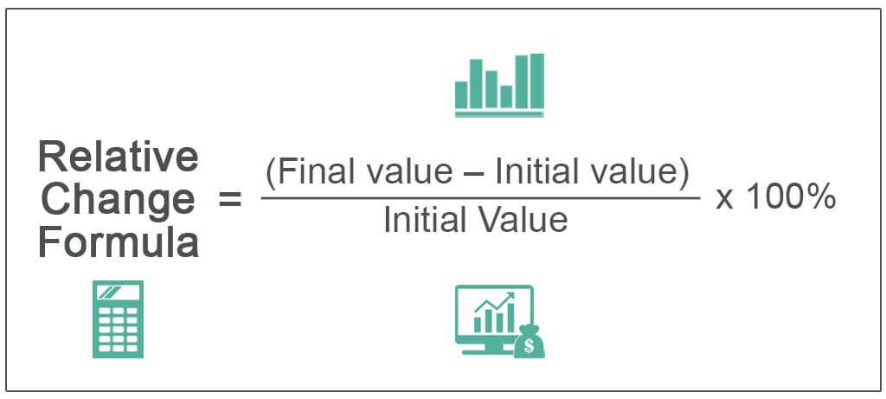

In the ever-evolving world of finance, understanding investment strategies and the associated risks is paramount. Financial markets are increasingly complex, and investors require robust methods to navigate this environment effectively. Two critical methodologies have emerged as instrumental in enhancing financial analysis and investment decisions: relative valuation in investment analysis and algorithmic trading.

Relative valuation involves estimating the value of financial assets by comparing them to similar entities. This approach simplifies the valuation process by relying on key metrics such as the Price-to-Earnings (P/E) ratio, Price-to-Book (P/B) ratio, and Enterprise Value to EBITDA (EV/EBITDA) ratio. These metrics offer a straightforward method to assess the value and performance of businesses, particularly within the same industry. The effectiveness of relative valuation is well-documented in financial literature and is favored for its simplicity and accessibility.



On the other hand, algorithmic trading represents the automation of trading decisions using computer algorithms. This technique has revolutionized financial markets by allowing for high-speed, high-volume trades that enhance market efficiency. Through algorithmic trading, traders can leverage valuation models to identify arbitrage opportunities and execute trades based on pre-set criteria.

The interaction between relative valuation and algorithmic trading provides valuable insights into optimizing investment strategies in contemporary financial markets. As these methodologies intersect, they offer the potential for enhanced precision in market analysis and investment decision-making.

This article explores the complexities and synergies between these methodologies and their impact on modern financial markets. By understanding how relative valuation and algorithmic trading can be integrated, investors and analysts are better equipped to optimize their strategies and achieve successful outcomes in an increasingly dynamic and competitive landscape.

## Table of Contents

## Understanding Relative Valuation Models

Relative valuation models are essential tools in financial analysis, enabling investors to estimate the value of financial assets by comparing them with similar assets. These models are highly valued for their simplicity and relative ease of application, particularly when assessing firms within the same industry. They involve the use of various financial metrics to compare a company's market value against its peers.

Key metrics used in relative valuation models include the Price-to-Earnings (P/E) ratio, Price-to-Book (P/B) ratio, and Enterprise Value to EBITDA (EV/EBITDA) ratio. Each of these metrics provides a different lens through which to view a company's financial health and market valuation.

1. **Price-to-Earnings (P/E) Ratio**: This ratio is calculated by dividing the market price per share by the earnings per share (EPS). It helps investors determine the market's valuation of a company relative to its earnings:
$$
   \text{P/E Ratio} = \frac{\text{Market Price per Share}}{\text{Earnings per Share (EPS)}}

$$

   A high P/E ratio may suggest that the market expects high future growth, while a low P/E ratio might indicate undervaluation or potential issues with the company.

2. **Price-to-Book (P/B) Ratio**: This ratio compares a company's market value to its book value, calculated as follows:
$$
   \text{P/B Ratio} = \frac{\text{Market Price per Share}}{\text{Book Value per Share}}

$$

   The book value is the net asset value of a company calculated by total assets minus intangible assets (patents, goodwill) and liabilities. A P/B ratio below 1 could mean that the stock is undervalued.

3. **Enterprise Value to EBITDA (EV/EBITDA) Ratio**: This ratio measures a company's enterprise value (EV) relative to its earnings before interest, taxes, depreciation, and amortization (EBITDA). It is useful for assessing the valuation of companies with different capital structures:
$$
   \text{EV/EBITDA} = \frac{\text{Enterprise Value}}{\text{EBITDA}}

$$

   A lower EV/EBITDA ratio might suggest that a company is undervalued in relation to its earnings potential.

Despite the advantages, investors must be cognizant of the limitations inherent in relative valuation models. Primarily, these models rely heavily on the accuracy of comparable companies' data and existing market conditions. These external variables can introduce significant bias or errors if the selected comparables are not truly reflective of the analyzed company’s market segment or if market conditions abruptly change.

Therefore, while relative valuation models are valuable for their straightforwardness and practicality, their effective employment demands careful selection of comparables and awareness of prevailing market influences. By acknowledging these factors, investors can utilize relative valuation models as a robust component of a comprehensive financial analysis and investment strategy.

## Financial Analysis Techniques Using Valuation Models

Financial analysis utilizing valuation models serves as a foundational component for comparing companies and determining their relative attractiveness to investors. This process begins with a thorough assessment of financial statements, including the income statement, balance sheet, and cash flow statement, to extract key metrics essential for ratio calculations.

For instance, the Price-to-Earnings (P/E) ratio is a widely used metric in evaluating the investment potential of technology companies. The P/E ratio is calculated by dividing the market value per share by the earnings per share (EPS):

$$
\text{P/E Ratio} = \frac{\text{Market Value per Share}}{\text{Earnings per Share (EPS)}}
$$

This ratio provides investors with insight into how much they are paying for each dollar of earnings, offering a gauge of whether a stock is overvalued or undervalued relative to its peers.

In conducting financial analysis, it is critical to balance industry benchmarks with current market trends to create a realistic and robust assessment. Industry benchmarks set the standards for typical ratios within specific sectors, aiding investors in spotting deviations that may indicate investment opportunities or risks. For example, a tech company with a significantly higher P/E ratio compared to the industry average might suggest overvaluation, unless justified by exceptional growth prospects.

Moreover, a disciplined approach to ratio analysis involves not just comparing individual metrics but synthesizing them to form a comprehensive picture of a company’s financial health and market position. Consideration of other ratios such as the Price-to-Book (P/B) ratio, Debt-to-Equity (D/E) ratio, and Return on Equity (ROE) further enriches the analysis. These ratios provide additional layers of understanding regarding asset valuation, financial leverage, and profitability.

The Price-to-Book (P/B) ratio, for example, is defined as:

$$
\text{P/B Ratio} = \frac{\text{Market Price per Share}}{\text{Book Value per Share}}
$$

The P/B ratio helps investors evaluate how much they are paying for a company's assets in relation to their book value, which can be particularly relevant in asset-heavy industries.

Employing a structured approach in this analysis helps in identifying potential investment opportunities and risks, granting investors a strategic edge. Through careful evaluation of these financial metrics, investors can make informed decisions that align with their investment goals, thus optimizing portfolio performance and managing risks effectively.

## Algorithmic Trading and Its Influence on Valuation

Algorithmic trading (algo trading) revolutionizes financial markets by automating trade decisions through complex computer algorithms. These algorithms, which often incorporate valuation models, enable traders to execute high-speed and high-[volume](/wiki/volume-trading-strategy) transactions, boosting market efficiency. By leveraging computational power, algo trading systems process vast amounts of market data to identify [arbitrage](/wiki/arbitrage) and investment opportunities with precision and speed unattainable by manual trading methods.

The integration of valuation models into algo trading strategies significantly enhances the ability to detect pricing discrepancies and capitalize on short-term market movements. For instance, algorithms can utilize metrics such as the Price-to-Earnings (P/E) ratio, Enterprise Value to EBITDA (EV/EBITDA) ratio, or other relative valuation tools to drive decision-making processes. These valuation-driven strategies ensure trades are grounded in empirical financial comparisons rather than speculative assumptions.

One of the inherent challenges of [algorithmic trading](/wiki/algorithmic-trading) is its reliance on historical data. Algorithms trained on past market patterns may face challenges when market conditions deviate from historical norms, leading to potentially adverse outcomes. This limitation underscores the importance of continuous model evaluation and update, integrating real-time data analytics and adaptive learning techniques to better predict market dynamics.

The omnipresence of algo trading in today's financial markets has markedly influenced valuation practices. The speed and volume of transactions facilitated by algorithms contribute to tighter bid-ask spreads and decreased market [volatility](/wiki/volatility-trading-strategies), fostering greater market [liquidity](/wiki/liquidity-risk-premium). Additionally, the ability to incorporate vast arrays of financial metrics into trading decisions can lead to more accurate asset pricing.

In conclusion, algorithmic trading profoundly impacts financial markets and valuation methodologies. Its capacity to integrate with valuation models not only enhances trading efficiency but also transforms market strategies, necessitating a dynamic approach to investment and financial analysis.

## Integrating Relative Valuation with Algo Trading

Integrating relative valuation models with algorithmic trading represents a significant evolution in investment strategies, combining traditional valuation techniques with modern technology to enhance decision-making processes. At the core, this integration involves encoding valuation metrics, such as Price-to-Earnings (P/E) or Price-to-Book (P/B) ratios, into algorithmic trading systems. This enables rapid analysis and execution of trades based on real-time data, balancing traditional financial analysis with the speed and efficiency of automation.

One of the primary challenges in this integration is ensuring data accuracy. Algorithmic systems rely heavily on accurate and timely data inputs; any discrepancies can lead to flawed decision-making and potential financial losses. Additionally, these systems must manage dependencies on market fluctuations, as they often operate on the assumption that current market conditions will persist. When markets shift unpredictably, reliance on historical data can lead to suboptimal trading outcomes.

Future trends in this field focus on the incorporation of Artificial Intelligence (AI) and [machine learning](/wiki/machine-learning) to further refine and enhance trading strategies. These technologies can process vast amounts of data more efficiently and adapt to changing market conditions, providing a robust framework for predictive analytics and decision-making. For example, machine learning models can be trained to identify patterns indicative of market inefficiencies, allowing for preemptive action rather than reactive decision-making.

The integration of relative valuation models with algorithmic trading offers substantial potential for precise trading methodologies, optimizing both market performance and investment returns. By leveraging the strengths of both traditional valuation and modern computational techniques, this approach provides investors with powerful tools to enhance their strategies and outcomes in the financial markets. As these methodologies continue to evolve, they promise to significantly impact financial analysis and investment success.

## Case Studies and Real-World Applications

Renaissance Technologies is a pioneer in leveraging high-frequency trading ([HFT](/wiki/high-frequency-trading-strategies)) to explore and capitalize on short-term market inefficiencies. With a strong emphasis on mathematical models and sophisticated algorithms, Renaissance Technologies executes trades at highly optimized speeds alongside substantial volumes. This capability allows the firm to identify and exploit microscopic price movements, potentially yielding significant profits. High-frequency trading strategies at Renaissance showcase the effectiveness of automated decision-making processes that integrate complex valuation models and immediate market data analysis [1].

Two Sigma Investments distinguishes itself by marrying vast global data sets with refined quantitative strategies. The firm utilizes machine learning and [artificial intelligence](/wiki/ai-artificial-intelligence) to process diverse datasets, honing prediction models to forecast market trends and investment opportunities accurately. Their approach underscores the instrumental role of data in enhancing algorithmic trading systems, demonstrating improved precision when valuation models incorporate wide-ranging economic indicators and variables [2].

AQR Capital Management illustrates the use of systematic investment strategies combined with valuation models, advocating for diversified portfolios. AQR's methodology involves analyzing financial metrics to evaluate assets systematically, forming the basis for their multi-strategy investment approach. This integration helps balance risk and returns while maintaining adherence to quantitative models, thus underpinning diversified investment frameworks. AQR's execution of these strategies exemplifies the power of integrating algorithmic tools with fundamental financial analysis to manage diversified capital effectively [3].

These examples underscore the transformative potential in combining relative valuation models with algorithmic trading systems. By effectively harnessing computational power, extensive data analysis, and strategic valuation methodologies, these firms demonstrate an evolution in investment strategy that enhances performance and precision in the financial markets.

### References

1. "The Man Who Solved The Market: How Jim Simons Launched the Quant Revolution" by Gregory Zuckerman, which provides insights into Renaissance Technologies' use of high-frequency trading.
2. Two Sigma Investments website, which highlights their focus on data science and quantitative strategies.
3. AQR Capital Management publications, which detail their approach to systematic investing and valuation.

## Implications for Investors and Analysts

Understanding the synergy between relative valuation models and algorithmic trading is essential for investors and analysts aiming to gain a competitive edge. The integration of these approaches offers the potential to optimize investment strategies by enhancing the precision of financial analyses and decision-making processes. Here, we discuss the key implications for investors and analysts who seek to leverage these sophisticated financial tools effectively.

Technological adaptability is a critical component in harnessing the full potential of relative valuation and algorithmic trading. As these methodologies rely heavily on technology for data processing and analysis, investors and analysts must remain adept at using advanced software solutions and algorithms. This adaptability involves not only understanding existing technologies but also embracing emerging innovations, such as artificial intelligence (AI) and machine learning, which can refine and improve trading strategies. Continuous learning and development in these technological areas enable financial professionals to maintain a competitive advantage by staying ahead of evolving market trends.

The ongoing evolution of financial tools underscores the necessity for continuous research and refinement. Markets are dynamic environments characterized by constant changes in regulations, economic conditions, and investor behavior. As such, valuation models and algorithmic strategies must be regularly reviewed and updated to ensure their effectiveness. This involves developing robust models that can adapt to market fluctuations and incorporate new data sources. For instance, Python, a popular programming language in the finance industry, offers a range of libraries like Pandas and NumPy for data analysis, which can be used to test and implement new strategies.

```python
import pandas as pd
import numpy as np

# Example: Calculating P/E ratio for a list of companies using Pandas
data = {
    'Company': ['Company A', 'Company B', 'Company C'],
    'Share Price': [150, 85, 290],
    'Earnings per Share': [3.5, 2.1, 9.1]
}

df = pd.DataFrame(data)
df['P/E Ratio'] = df['Share Price'] / df['Earnings per Share']
print(df)
```

Investors and analysts need to embrace these changes to optimize their strategies and enhance their market outcomes. Acknowledging the limitations of both relative valuation models and algorithmic trading is crucial. These tools, while powerful, depend significantly on the quality of input data and the assumptions underlying their models. Therefore, a disciplined approach that combines these methodologies with a comprehensive understanding of market conditions and risk management strategies is essential for effective investment decision-making.

Moreover, the ability to interpret the outputs of algorithmic models and valuation ratios in context is fundamental. This requires a skill set that includes both quantitative analysis and qualitative judgment. By integrating these elements into a cohesive strategy, financial professionals can better align their investment portfolios with market opportunities and risks, thereby achieving optimized performance and returns. 

In conclusion, staying competitive in today's financial markets demands a proactive approach to integrating advanced valuation and trading strategies. Through technological adaptability, continuous learning, and strategic implementation, investors and analysts can leverage these methodologies to enhance their financial outcomes.

## Conclusion

The fusion of relative valuation models and algorithmic trading has brought unprecedented precision to financial analysis. Relative valuation models, which compare financial metrics of similar companies, provide a robust framework for understanding value based on industry peers. When integrated with the rapid execution capabilities of algorithmic trading, these models can significantly enhance decision-making processes in investment strategies.

As financial markets continue to evolve, these methodologies offer significant advantages for investors seeking to make informed decisions. The synergy between valuation models and algorithmic trading allows for the efficient processing and analysis of vast amounts of market data, enabling the identification of profitable opportunities and the timely execution of trades. This unlocks the potential for maximizing returns while maintaining a keen awareness of associated risks.

For financial professionals aiming to remain competitive, it is crucial to integrate relative valuation and algorithmic trading into their investment strategies. This requires a multidisciplinary approach, combining financial theory with advanced computational techniques. By doing so, professionals can harness the full potential of these tools to develop comprehensive strategies that are both dynamic and responsive to market conditions.

The future of market analysis and investment success will be shaped by continual advancements and adaptations in these areas. As technologies such as artificial intelligence and machine learning further refine these methodologies, their capability to enhance precision and predictive accuracy will only increase. Financial professionals who embrace this integration will be well-positioned to capitalize on emerging trends and achieve superior market outcomes.

## References & Further Reading

[1]: Damodaran, A. (2012). ["Investment Valuation: Tools and Techniques for Determining the Value of Any Asset"](https://books.google.com/books/about/Investment_Valuation.html?id=5SRHAAAAQBAJ). Wiley Finance.

[2]: Zuckerman, G. (2019). ["The Man Who Solved the Market: How Jim Simons Launched the Quant Revolution"](https://www.amazon.com/Man-Who-Solved-Market-Revolution/dp/073521798X). Penguin Books.

[3]: Lopez de Prado, M. (2018). ["Advances in Financial Machine Learning"](https://www.amazon.com/Advances-Financial-Machine-Learning-Marcos/dp/1119482089). Wiley.

[4]: Aronson, D. (2006). ["Evidence-Based Technical Analysis: Applying the Scientific Method and Statistical Inference to Trading Signals"](https://www.amazon.com/Evidence-Based-Technical-Analysis-Scientific-Statistical/dp/0470008741). Wiley.

[5]: Chan, E. P. (2009). ["Quantitative Trading: How to Build Your Own Algorithmic Trading Business"](https://github.com/ftvision/quant_trading_echan_book). Wiley.

[6]: Jansen, S. (2020). ["Machine Learning for Algorithmic Trading: Second Edition"](https://www.amazon.com/Machine-Learning-Algorithmic-Trading-alternative/dp/1839217715). Packt Publishing.