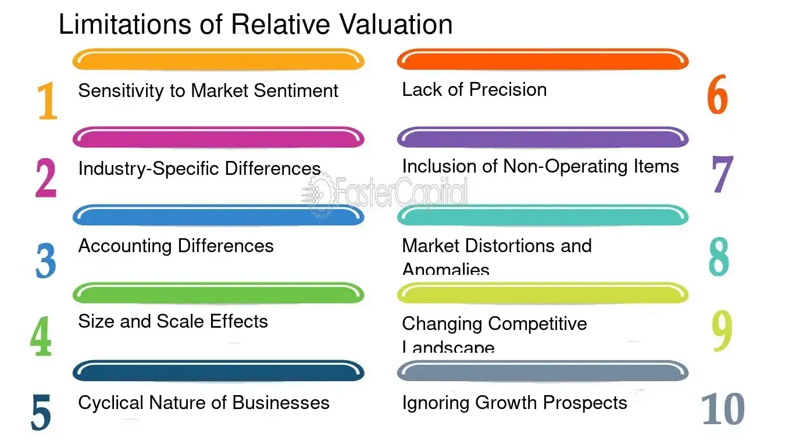

## Table of Contents

## What is relative valuation?

Relative valuation is a way to figure out how much a company is worth by comparing it to other similar companies. Instead of looking at a company all by itself, you look at how it stacks up against its peers. For example, if you want to know if a stock is a good buy, you might compare its price to the prices of other stocks in the same industry. This method helps investors see if a company is priced too high or too low compared to others.

To do a relative valuation, people often use ratios like the price-to-earnings (P/E) ratio. This ratio shows how much investors are willing to pay for each dollar of a company's earnings. If a company's P/E ratio is lower than the average for its industry, it might be undervalued, meaning it could be a good investment. On the other hand, if the P/E ratio is higher, the stock might be overvalued. By comparing these ratios, investors can make better decisions about where to put their money.

## How does relative valuation differ from absolute valuation?

Relative valuation and absolute valuation are two different ways to figure out how much a company is worth. Relative valuation looks at a company by comparing it to other similar companies. It uses ratios like the price-to-earnings (P/E) ratio to see if a stock is priced too high or too low compared to its peers. For example, if a company's P/E ratio is lower than the average for its industry, it might be a good buy. This method helps investors make decisions by seeing how a company stacks up against others.

On the other hand, absolute valuation tries to find the true value of a company on its own, without comparing it to others. It uses models like the discounted cash flow (DCF) analysis, which looks at the company's future cash flows and discounts them back to today's value. This method aims to find out what the company is really worth based on its own financials and future earnings potential. While relative valuation is simpler and quicker, absolute valuation can give a more detailed picture but requires more data and assumptions.

## What are the common metrics used in relative valuation?

Common metrics used in relative valuation include the price-to-earnings (P/E) ratio, which shows how much investors are willing to pay for each dollar of a company's earnings. If a company's P/E ratio is lower than the average for its industry, it might be undervalued, meaning it could be a good investment. Another metric is the price-to-book (P/B) ratio, which compares the market value of a company to its book value, or the value of its assets minus liabilities. A lower P/B ratio can indicate that a company is undervalued compared to its peers.

Other important metrics include the price-to-sales (P/S) ratio, which looks at a company's market value in relation to its revenue. A lower P/S ratio might suggest that a company is undervalued. The enterprise value-to-EBITDA (EV/EBITDA) ratio is also widely used, as it compares a company's total value to its earnings before interest, taxes, depreciation, and amortization. This ratio can help investors see if a company is priced fairly when compared to others in the same industry. By using these metrics, investors can get a better sense of whether a company is a good buy or not.

## What are the basic pitfalls beginners should avoid in relative valuation?

One big mistake beginners make in relative valuation is not understanding the industry they are looking at. Every industry has its own way of doing things, and what might be a good P/E ratio in one industry might not be good in another. For example, tech companies often have higher P/E ratios than utility companies. If you don't know this, you might think a tech company is overvalued when it's actually normal for that industry. So, it's important to compare companies within the same industry and understand what's typical for that group.

Another common pitfall is relying too much on just one metric. While the P/E ratio is popular, it doesn't tell the whole story. A company might have a low P/E ratio because it's not doing well, not because it's a good buy. It's better to look at several metrics like P/B, P/S, and EV/EBITDA to get a fuller picture. Also, beginners often forget to look at the bigger picture, like the economy or what's happening in the world, which can affect how companies are valued. So, using a mix of metrics and keeping an eye on the broader context can help avoid these mistakes.

## How can misinterpretation of industry standards lead to valuation errors?

Misinterpreting industry standards can lead to big mistakes in valuation because different industries work differently. For example, tech companies often have higher price-to-earnings (P/E) ratios than utility companies. If someone doesn't know this, they might think a tech company is too expensive when it's actually normal for that industry. This can make them miss out on a good investment or buy something that's not a good deal. It's important to compare companies within the same industry and understand what's typical for that group to avoid these errors.

Another way misinterpretation can cause problems is by not considering the unique factors that affect each industry. For instance, the energy sector might be influenced by oil prices, while the tech sector might be driven by innovation and growth. If someone looks at a tech company's high P/E ratio without understanding that fast growth is common in tech, they might wrongly think it's overvalued. By not taking into account these industry-specific factors, beginners can end up with a wrong idea of a company's value, which can lead to bad investment choices.

## What role does market timing play in the effectiveness of relative valuation?

Market timing can really change how well relative valuation works. Imagine you're looking at a company's price-to-earnings (P/E) ratio to see if it's a good buy. If the whole market is going up, that company's P/E ratio might look high compared to normal times, but it might still be a good investment because everything is going up. On the other hand, if the market is going down, a company's P/E ratio might look low, making it seem like a great buy, but it could still lose value if the market keeps falling. So, knowing where the market is at can help you decide if a company's valuation makes sense right now.

Also, market timing can affect how you compare companies. If you're looking at a bunch of companies in the same industry, their valuations can change a lot depending on what's happening in the market. For example, if tech stocks are hot right now, their P/E ratios might be higher than usual, but that doesn't mean they're overvalued if everyone is excited about tech. It's important to think about the market's mood and timing when you're doing relative valuation to make sure you're not making decisions based on short-term ups and downs.

## How can selection bias affect the outcomes of relative valuation?

Selection bias can mess up relative valuation because it happens when you pick only certain companies to compare. If you only look at successful companies in an industry, you might think the whole industry is doing great. But if you ignore the companies that are not doing well, you won't get a true picture. This can make you think a company is a good buy when it's actually just average or even overvalued compared to the whole industry.

To avoid selection bias, it's important to include a wide range of companies in your comparison. This means looking at both the best and the worst performers in the industry. By doing this, you get a more accurate idea of what's normal for that industry. If you only pick the companies that fit your idea of what you want to see, you might end up making bad investment choices because your valuation won't reflect the real situation.

## What are the advanced statistical pitfalls in relative valuation models?

One advanced statistical pitfall in relative valuation models is the issue of multicollinearity. This happens when the metrics you use to compare companies are too closely related to each other. For example, if you use both the price-to-earnings (P/E) ratio and the price-to-book (P/B) ratio, these two might move together a lot. When this happens, it's hard to tell which one is really driving the valuation. It can make your model less accurate because you're basically counting the same thing twice.

Another pitfall is the problem of outliers. Sometimes, a company in your comparison group might be very different from the others. It could be doing much better or much worse, which can throw off your whole analysis. If you don't handle these outliers correctly, they can make it look like a company is undervalued or overvalued when it's really just an exception. It's important to check for these unusual cases and decide whether to include them or not, so your valuation stays on track.

## How can differences in accounting practices across companies skew relative valuation?

Differences in accounting practices can really mess up relative valuation. Companies might use different ways to report their earnings, assets, or liabilities. For example, one company might use a method that makes its earnings look higher than another company that uses a different method. If you're comparing their price-to-earnings (P/E) ratios, the one with the higher reported earnings might look undervalued when it's actually not. This can make you think a company is a good buy when it's really not, because the numbers you're comparing aren't on the same playing field.

To avoid this problem, it's important to understand how each company does its accounting. You might need to make adjustments to their financials so you're comparing apples to apples. For instance, if one company uses a different way to value its inventory, you can adjust their numbers to match the method used by other companies. By doing this, you get a clearer picture of which companies are really undervalued or overvalued. If you don't make these adjustments, your relative valuation might lead you to make bad investment choices.

## What are the implications of using outdated or incorrect data in relative valuation?

Using outdated or incorrect data in relative valuation can lead to big mistakes. If you're comparing companies based on old information, you might think a company is a good buy when it's actually not. For example, if a company's earnings have gone down since the last report you used, its price-to-earnings (P/E) ratio might look better than it really is. This can make you buy a stock that's actually overvalued, which could lose you money.

It's also important to make sure the data you're using is correct. If there are mistakes in the numbers, like errors in financial reports, your valuation will be off. For instance, if a company's revenue is reported incorrectly, it can change how you see its price-to-sales (P/S) ratio. Using wrong data can lead to bad investment decisions, so always double-check your numbers and use the most recent information available.

## How can experts mitigate the impact of cyclical industries on relative valuation?

Experts can mitigate the impact of cyclical industries on relative valuation by understanding the economic cycles that affect these industries. Cyclical industries, like car manufacturing or construction, go through ups and downs that can make their valuations look very different at different times. To get a better picture, experts can look at a company's performance over a full economic cycle, not just at one point in time. This way, they can see how the company does during good times and bad times, which helps them understand if it's really undervalued or overvalued.

Another way to handle cyclical industries is by using normalized earnings instead of just the current earnings. Normalized earnings smooth out the highs and lows by averaging earnings over several years. This gives a more stable view of a company's value. By using these normalized numbers, experts can compare companies in cyclical industries more fairly, without being tricked by short-term ups and downs. This approach helps them make better investment decisions, even in industries that are affected a lot by the economy.

## What are the cutting-edge methods to enhance the accuracy of relative valuation?

One cutting-edge method to make relative valuation more accurate is using [machine learning](/wiki/machine-learning). Machine learning can look at lots of data from different companies and find patterns that humans might miss. It can use things like earnings, sales, and even news articles to predict how a company's value might change. By doing this, it helps investors see if a company is really a good buy or not, even when things are changing fast. Machine learning can also keep learning and getting better over time, so it stays useful as markets change.

Another way to improve relative valuation is by using real-time data. Instead of just using old financial reports, experts can now look at what's happening right now. This can include things like stock prices, social media buzz, and economic indicators. By using this up-to-date information, they can get a more accurate picture of a company's value at any moment. Real-time data helps them react quickly to changes in the market, making their valuation more reliable and helping them make smarter investment choices.

## What are Relative Valuation Models and How Do They Work?

Relative valuation models are essential tools in financial analysis, enabling investors to estimate the value of financial assets by comparing them with similar assets. These models are highly valued for their simplicity and relative ease of application, particularly when assessing firms within the same industry. They involve the use of various financial metrics to compare a company's market value against its peers.

Key metrics used in relative valuation models include the Price-to-Earnings (P/E) ratio, Price-to-Book (P/B) ratio, and Enterprise Value to EBITDA (EV/EBITDA) ratio. Each of these metrics provides a different lens through which to view a company's financial health and market valuation.

1. **Price-to-Earnings (P/E) Ratio**: This ratio is calculated by dividing the market price per share by the earnings per share (EPS). It helps investors determine the market's valuation of a company relative to its earnings:
$$
   \text{P/E Ratio} = \frac{\text{Market Price per Share}}{\text{Earnings per Share (EPS)}}

$$

   A high P/E ratio may suggest that the market expects high future growth, while a low P/E ratio might indicate undervaluation or potential issues with the company.

2. **Price-to-Book (P/B) Ratio**: This ratio compares a company's market value to its book value, calculated as follows:
$$
   \text{P/B Ratio} = \frac{\text{Market Price per Share}}{\text{Book Value per Share}}

$$

   The book value is the net asset value of a company calculated by total assets minus intangible assets (patents, goodwill) and liabilities. A P/B ratio below 1 could mean that the stock is undervalued.

3. **Enterprise Value to EBITDA (EV/EBITDA) Ratio**: This ratio measures a company's enterprise value (EV) relative to its earnings before interest, taxes, depreciation, and amortization (EBITDA). It is useful for assessing the valuation of companies with different capital structures:
$$
   \text{EV/EBITDA} = \frac{\text{Enterprise Value}}{\text{EBITDA}}

$$

   A lower EV/EBITDA ratio might suggest that a company is undervalued in relation to its earnings potential.

Despite the advantages, investors must be cognizant of the limitations inherent in relative valuation models. Primarily, these models rely heavily on the accuracy of comparable companies' data and existing market conditions. These external variables can introduce significant bias or errors if the selected comparables are not truly reflective of the analyzed company’s market segment or if market conditions abruptly change.

Therefore, while relative valuation models are valuable for their straightforwardness and practicality, their effective employment demands careful selection of comparables and awareness of prevailing market influences. By acknowledging these factors, investors can utilize relative valuation models as a robust component of a comprehensive financial analysis and investment strategy.

## What are Financial Analysis Techniques Using Valuation Models?

Financial analysis utilizing valuation models serves as a foundational component for comparing companies and determining their relative attractiveness to investors. This process begins with a thorough assessment of financial statements, including the income statement, balance sheet, and cash flow statement, to extract key metrics essential for ratio calculations.

For instance, the Price-to-Earnings (P/E) ratio is a widely used metric in evaluating the investment potential of technology companies. The P/E ratio is calculated by dividing the market value per share by the earnings per share (EPS):

$$
\text{P/E Ratio} = \frac{\text{Market Value per Share}}{\text{Earnings per Share (EPS)}}
$$

This ratio provides investors with insight into how much they are paying for each dollar of earnings, offering a gauge of whether a stock is overvalued or undervalued relative to its peers.

In conducting financial analysis, it is critical to balance industry benchmarks with current market trends to create a realistic and robust assessment. Industry benchmarks set the standards for typical ratios within specific sectors, aiding investors in spotting deviations that may indicate investment opportunities or risks. For example, a tech company with a significantly higher P/E ratio compared to the industry average might suggest overvaluation, unless justified by exceptional growth prospects.

Moreover, a disciplined approach to ratio analysis involves not just comparing individual metrics but synthesizing them to form a comprehensive picture of a company’s financial health and market position. Consideration of other ratios such as the Price-to-Book (P/B) ratio, Debt-to-Equity (D/E) ratio, and Return on Equity (ROE) further enriches the analysis. These ratios provide additional layers of understanding regarding asset valuation, financial leverage, and profitability.

The Price-to-Book (P/B) ratio, for example, is defined as:

$$
\text{P/B Ratio} = \frac{\text{Market Price per Share}}{\text{Book Value per Share}}
$$

The P/B ratio helps investors evaluate how much they are paying for a company's assets in relation to their book value, which can be particularly relevant in asset-heavy industries.

Employing a structured approach in this analysis helps in identifying potential investment opportunities and risks, granting investors a strategic edge. Through careful evaluation of these financial metrics, investors can make informed decisions that align with their investment goals, thus optimizing portfolio performance and managing risks effectively.

## References & Further Reading

[1]: Damodaran, A. (2012). ["Investment Valuation: Tools and Techniques for Determining the Value of Any Asset"](https://books.google.com/books/about/Investment_Valuation.html?id=5SRHAAAAQBAJ). Wiley Finance.

[2]: Zuckerman, G. (2019). ["The Man Who Solved the Market: How Jim Simons Launched the Quant Revolution"](https://www.amazon.com/Man-Who-Solved-Market-Revolution/dp/073521798X). Penguin Books.

[3]: Lopez de Prado, M. (2018). ["Advances in Financial Machine Learning"](https://www.amazon.com/Advances-Financial-Machine-Learning-Marcos/dp/1119482089). Wiley.

[4]: Aronson, D. (2006). ["Evidence-Based Technical Analysis: Applying the Scientific Method and Statistical Inference to Trading Signals"](https://www.amazon.com/Evidence-Based-Technical-Analysis-Scientific-Statistical/dp/0470008741). Wiley.

[5]: Chan, E. P. (2009). ["Quantitative Trading: How to Build Your Own Algorithmic Trading Business"](https://github.com/ftvision/quant_trading_echan_book). Wiley.

[6]: Jansen, S. (2020). ["Machine Learning for Algorithmic Trading: Second Edition"](https://www.amazon.com/Machine-Learning-Algorithmic-Trading-alternative/dp/1839217715). Packt Publishing.