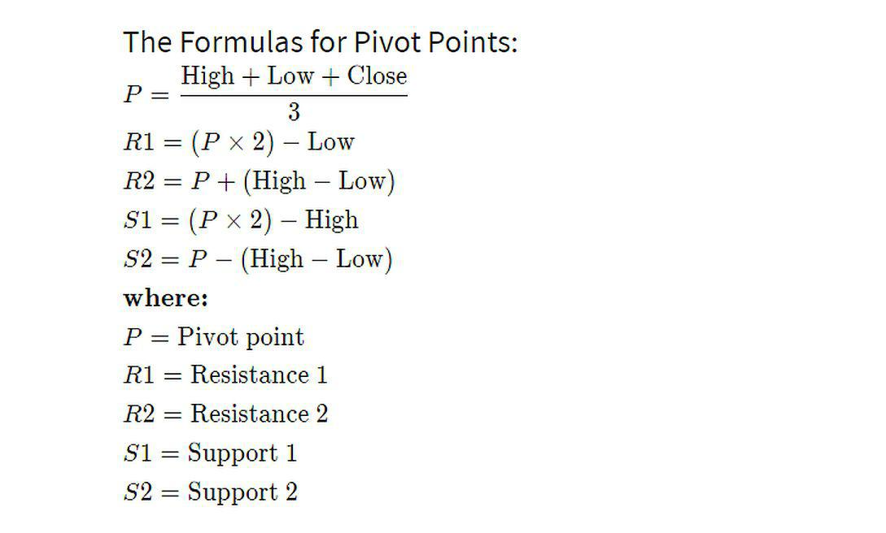

Pivot point trading is a technique that leverages historical price data to forecast potential future market levels. This method is pivotal for traders aiming to identify key support and resistance levels, which are essential for making informed decisions regarding entry and exit points in the market. The reliability of pivot points comes from their basis in objective price data, which renders them a practical tool for technical analysis.

In the field of algorithmic trading, the precise calculation of pivot points plays a significant role in enhancing the precision and effectiveness of trading algorithms. Algorithmic strategies benefit from routinely integrating pivot points, as they provide a systematic approach to predict and react to market movements. This can result in improved efficiency through the automation of trade decisions, based on expected price behaviour around these calculated levels.



This article discusses the key aspects of pivot point trading formulas and their relevance in algorithmic trading, enabling traders and developers to better understand and leverage these concepts within their strategies. The focus is on explaining the principles behind pivot point calculations and how they integrate with algorithmic systems to potentially improve trading outcomes.

## Table of Contents

## Understanding Pivot Points

A pivot point is a technical analysis indicator that serves as a predictive indicator of overall market trends, based on the average of the high, low, and closing prices of a market from the previous trading day. The primary pivot point is primarily used by traders to gauge market sentiment and potential turning points, aiding in making strategic trading decisions. When the current market price trades above the pivot point, it suggests a bullish sentiment, whereas trading below it implies a bearish sentiment.

Mathematically, the pivot point (P) is calculated as follows:
$$

P = \frac{(High + Low + Close)}{3} 
$$

This calculation is performed at the beginning of a trading day to predict significant market levels during the current session. Beyond the central pivot point, traders often derive additional support and resistance levels which play a crucial role in refining trading strategies. These levels are designated as support levels (S1, S2) and resistance levels (R1, R2), and are calculated using the following formulas:

- Resistance Level 1 (R1):
$$

R1 = (2 \times P) - Low 
$$

- Resistance Level 2 (R2):
$$

R2 = P + (High - Low) 
$$

- Support Level 1 (S1):
$$

S1 = (2 \times P) - High 
$$

- Support Level 2 (S2):
$$

S2 = P - (High - Low) 
$$

These support and resistance levels obtained from the primary pivot point calculation enable traders to anticipate potential price barriers and opportunities for entry or [exit](/wiki/exit-strategy) positions. By allowing for a systematic approach to identifying where the price might face difficulty advancing further, pivot points help in creating structured and strategic trading plans. Integrating this technique with market sentiment analysis allows traders to generate insights into potential market movements, supporting more informed decision-making in trading activities.

## The Formula for Pivot Points

Pivot point trading hinges on the calculation of specific price levels using historical price data. The standard pivot point formula utilizes three key numbers from the previous trading day: the high, low, and closing prices. These three values are averaged to calculate the pivot point (P), which serves as the primary reference level for traders.

The formula for the pivot point is straightforward:
$$

P = \frac{(\text{High} + \text{Low} + \text{Close})}{3} 
$$

This calculated pivot point aids in deducing additional crucial levels, namely resistance and support levels. These are essential in determining potential entry and exit points in trading:

- **Resistance 1 (R1)** is computed as:
$$

R1 = (2 \times P) - \text{Low} 
$$

- **Resistance 2 (R2)** is obtained from:
$$

R2 = P + (\text{High} - \text{Low}) 
$$

- **Support 1 (S1)** is calculated as:
$$

S1 = (2 \times P) - \text{High} 
$$

- **Support 2 (S2)** involves:
$$

S2 = P - (\text{High} - \text{Low}) 
$$

These levels are instrumental for technical analysis, as they help traders anticipate possible price movements within a trading day. Support levels suggest where the prices might find a bottom, while resistance levels suggest potential tops. By integrating these levels into trading strategies, individuals can formulate more informed decisions regarding market entries and exits. The systematic calculation of these points allows traders to establish a structured approach to potential price reversals or continuations. Python can be a useful tool for automating these calculations, particularly in [algorithmic trading](/wiki/algorithmic-trading) environments, enhancing the speed and accuracy of such strategies.

## Calculating Pivot Points Manually

Calculating pivot points manually involves a straightforward arithmetic process, essential for traders and algorithm developers who aim to fully understand and optimize their trading strategies. The core of this method is the computation of the central pivot point, which serves as a reference level for subsequent support and resistance calculations.

To calculate the central pivot point (P), take the average of the previous trading day's high (H), low (L), and closing (C) prices. The formula is expressed as:

$$
P = \frac{H + L + C}{3}
$$

Once the central pivot point is established, further key levels can be calculated to identify potential price points at which the market might experience support or resistance. These levels include:

1. **Support 1 (S1) and Resistance 1 (R1):**  
   These are the first levels of expected market reaction in terms of support and resistance.

   \[ R1 = (2 \times P) - L \]  
   \[ S1 = (2 \times P) - H
$$

2. **Support 2 (S2) and Resistance 2 (R2):**  
   These are calculated to identify deeper levels of market movement beyond the first levels.

   \[ R2 = P + (H - L) \]  
   \[ S2 = P - (H - L)
$$

Understanding this manual calculation process is beneficial for traders, as it fosters a deeper comprehension of the mechanics behind trading algorithms. This knowledge allows traders to adapt pivot point strategies to their specific needs and refine their automated trading strategies accordingly. By integrating accurate pivot point calculations, traders can more effectively predict potential market movements and make better-informed trading decisions.

## Algo Trading and Pivot Points

In algorithmic trading, incorporating pivot point calculations enables automated prediction of support and resistance levels based on historical price data. This approach provides a systematic method for identifying strategic entry and exit points in trading algorithms. By automating these calculations, traders can improve their trading efficiency and consistency, reducing the time and potential for human error typically involved in manual trading.

Pivot points are calculated using the prices of the previous trading day. These are composed of the high, low, and closing prices, with the central pivot point often determined as:

$$
P = \frac{\text{High} + \text{Low} + \text{Close}}{3}
$$

This central pivot can then be used to derive additional support and resistance levels. For example, the first level of resistance (R1) might be calculated as 

$$
R1 = (2 \times P) - \text{Low}
$$

and the first level of support (S1) might be 

$$
S1 = (2 \times P) - \text{High}
$$

Algorithmic systems can utilize these levels to automate the processes of entering and exiting trades. The algorithms are programmed to buy or sell when the market price reaches a calculated support or resistance level.

Incorporating moving averages with pivot points can further enhance trading strategies. Moving averages, which smooth out price data by creating a constantly updated average price, can be combined with pivot points to filter out false signals and confirm trend directions. For example, should the price be above both the pivot point and the moving average, it might signify a bullish trend, while prices below could indicate a bearish trend.

Here's a basic Python code snippet demonstrating how one might calculate pivot points and use them in an algorithmic context:

```python
def calculate_pivot_points(high, low, close):
    P = (high + low + close) / 3
    R1 = (2 * P) - low
    S1 = (2 * P) - high
    return P, R1, S1

def trading_decision(price, pivot, r1, s1):
    if price > r1:
        return "Sell"
    elif price < s1:
        return "Buy"
    else:
        return "Hold"

# Example usage
high = 105
low = 95
close = 100
price_now = 102

pivot, r1, s1 = calculate_pivot_points(high, low, close)
decision = trading_decision(price_now, pivot, r1, s1)
print("Trading decision:", decision)
```

By automating these strategies, traders can effectively respond to price movements without the necessity of constant monitoring, improving response times to market changes. However, it is crucial to combine pivot points with other indicators for a more robust and holistic trading approach, ensuring adaptability to the ever-changing market conditions.

## Pivot Points vs. Fibonacci Retracements

Both pivot points and Fibonacci retracements are analytical tools used by traders to predict potential levels of support and resistance in financial markets. 

Fibonacci retracements are based on the mathematical concept of the Fibonacci sequence, which yields a series of percentages used to determine potential retracement levels: 23.6%, 38.2%, 50%, 61.8%, and 100%. These levels are derived from the Fibonacci sequence and are thought to depict possible retracement points where the price might pause or reverse within a trend. To calculate Fibonacci retracements, one identifies a significant swing high and swing low on a chart. The percentages are then applied to the price range between these two points to identify potential reversal areas.

On the other hand, pivot points rely on fixed price levels derived from historical data. The primary pivot point (P) is calculated as the average of the previous period's high, low, and close prices. Additional levels, such as resistance and support, are derived from this central pivot point to further elucidate potential reversal points.

While pivot points are grounded in specific prior trading session prices, Fibonacci retracements leverage a series of mathematical ratios believed to have universal applicability. The choice between employing pivot points or Fibonacci retracements often hinges on a trader's strategy and the prevailing market conditions. Pivot points are favored for their simplicity and objective nature, computed through straight arithmetic means. Conversely, Fibonacci retracements offer flexibility with dynamic levels based on the magnitude of the current trend.

In practice, some traders might combine both methods, using pivot points for their straightforwardness and Fibonacci retracements for additional context. This tandem approach can offer a more nuanced view of potential price movements. Regardless of the method chosen, it's crucial to consider current market trends, trading volumes, and other technical indicators to make informed trading decisions.

## Limitations of Pivot Points

Pivot points, widely used in technical analysis, offer a straightforward method to identify potential support and resistance levels. Nonetheless, they come with limitations that traders must consider. Firstly, pivot points do not guarantee that prices will halt or reverse upon reaching these levels. The market's dynamic nature often means that prices may move through pivot points without any significant reaction.

Market [volatility](/wiki/volatility-trading-strategies) presents another challenge to the efficacy of pivot points. In periods of high volatility, price movements can exceed expected ranges, rendering pivot levels less reliable as indicators. This is exacerbated by unexpected news or macroeconomic events, which can trigger abrupt price shifts that pivot points do not account for.

Given these limitations, it is advisable for traders to complement pivot points with other technical indicators to enhance their trading strategies. For instance, incorporating moving averages, relative strength index (RSI), or Bollinger Bands can provide additional context and improve decision-making. This broader analytical perspective helps in crafting a more robust trading approach, accounting for the inherent unpredictability of financial markets. Employing a combination of tools allows traders to confirm signals and reduce the risk posed by the shortcomings of relying solely on pivot points.

## Conclusion

Pivot points are fundamental tools in trading strategies due to their simplicity and effectiveness in identifying prospective support and resistance levels based on historical price data. Their straightforward calculation and application make them accessible to both novice and experienced traders looking to enhance their market analysis.

When integrated into algorithmic trading, pivot points offer the potential to automate decision-making processes relating to entry and exit points. Their formulaic basis allows them to be seamlessly incorporated into trading algorithms, which can lead to improved efficiency and consistency in trading actions. Understanding the underlying calculations is vital, as it empowers traders and developers to tailor algorithms to specific strategies and market conditions.

However, to truly optimize trading results, it is advisable to employ pivot points in conjunction with other technical analysis tools and indicators. By combining pivot points with moving averages, trend lines, or [momentum](/wiki/momentum) indicators, traders can create a more nuanced and comprehensive trading framework. This multi-faceted approach can help mitigate the limitations of relying solely on pivot points, which may falter in highly volatile markets or when unexpected news impacts price movement.

Overall, pivot points are a valuable component of any trading toolkit. When used wisely alongside complementary techniques, they can significantly enhance a trader's ability to make informed and strategic trading decisions.

## References & Further Reading

[1]: Murphy, J. J. (1999). ["Technical Analysis of the Financial Markets: A Comprehensive Guide to Trading Methods and Applications"](https://archive.org/details/technicalanalysi0000murp). New York Institute of Finance.

[2]: Pring, M. J. (2002). ["Technical Analysis Explained: The Successful Investor's Guide to Spotting Investment Trends and Turning Points"](https://www.amazon.com/Technical-Analysis-Explained-Fifth-Successful/dp/0071825177). McGraw-Hill Education.

[3]: Schwager, J. D. (1993). ["Market Wizards: Interviews with Top Traders"](https://books.google.com/books/about/Market_Wizards.html?id=jNG7r-Ul7jwC). Wiley.

[4]: Kirkpatrick, C. D., & Dahlquist, J. R. (2011). ["Technical Analysis: The Complete Resource for Financial Market Technicians"](https://ptgmedia.pearsoncmg.com/images/9780134137049/samplepages/9780134137049.pdf). FT Press.

[5]: Chan, E. P. (2009). ["Algorithmic Trading: Winning Strategies and Their Rationale"](https://github.com/ftvision/quant_trading_echan_book). Wiley.