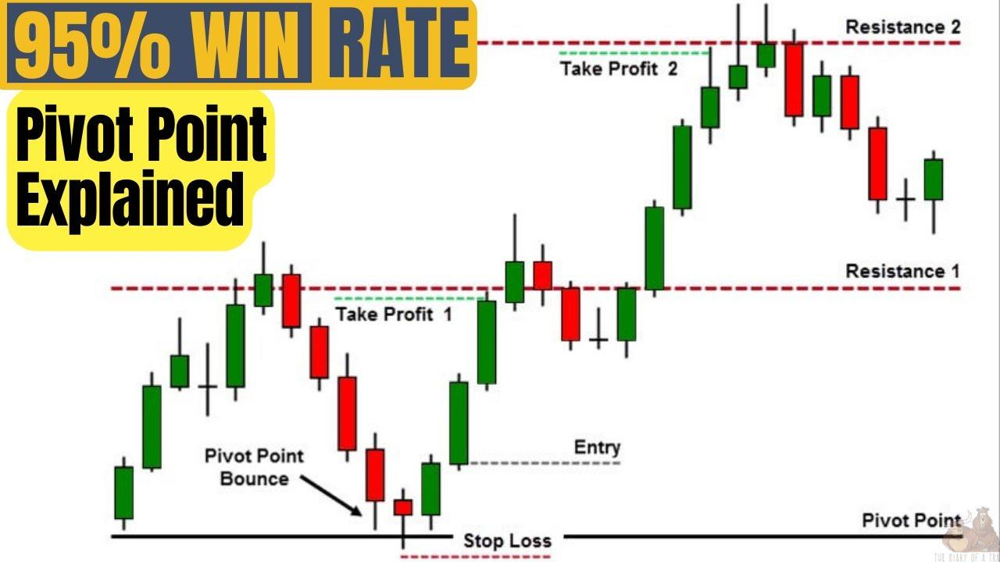

## Table of Contents

## What is a pivot point in trading?

A pivot point in trading is a technical indicator used to determine the overall trend of the market over different time frames. It is calculated as an average of the high, low, and closing prices from the previous trading day. Traders use pivot points to identify potential support and resistance levels, which can help them make decisions about when to buy or sell.

When the price of a security moves above the pivot point, it is considered bullish, suggesting that the price might continue to rise. Conversely, if the price falls below the pivot point, it is seen as bearish, indicating that the price might keep falling. By observing how the price interacts with these pivot points, traders can gain insights into market sentiment and make more informed trading decisions.

## How are pivot points calculated?

Pivot points are calculated using the high, low, and closing prices from the previous trading day. The basic formula to find the pivot point is to add the high, low, and closing prices together, then divide the total by three. This gives traders a central reference point for the next trading day.

Once the pivot point is calculated, traders can then find support and resistance levels. The first support level is calculated by multiplying the pivot point by two, then subtracting the high price from the previous day. The first resistance level is found by multiplying the pivot point by two, then subtracting the low price from the previous day. These levels help traders understand where the price might find support or face resistance in the future.

## What are the different types of pivot points?

There are several types of pivot points that traders use, each with a slightly different way of calculating them. The most common type is the standard pivot point, which is calculated by adding the high, low, and closing prices from the previous day and then dividing by three. This gives traders a central reference point for the next trading day. From the standard pivot point, traders can also calculate support and resistance levels to help predict where the price might go next.

Another type is the Fibonacci pivot point, which uses Fibonacci numbers to calculate support and resistance levels. Instead of using a simple average, Fibonacci pivot points incorporate the Fibonacci sequence to determine potential reversal points in the market. This method can provide more detailed levels for traders who like to use Fibonacci analysis in their trading strategies.

Lastly, there are also Woodie's and Camarilla pivot points. Woodie's pivot points put more emphasis on the closing price of the previous day, which can be useful for traders who believe the closing price is a strong indicator of market sentiment. Camarilla pivot points, on the other hand, use a different formula that generates multiple support and resistance levels, which can be helpful for day traders looking for quick, short-term trades. Each type of pivot point offers a different perspective on the market, and traders often choose the one that best fits their trading style.

## How can pivot points be used to identify potential support and resistance levels?

Pivot points help traders find where the price of a stock or other security might stop going down or up. They do this by figuring out levels called support and resistance. Support is a price level where the price might stop falling and start going up again. Resistance is where the price might stop rising and start falling again. Traders use the pivot point, which is an average of the high, low, and closing prices from the day before, to find these levels. If the price goes above the pivot point, it might hit the resistance level. If it goes below, it might hit the support level.

To find the first support level, traders take the pivot point, multiply it by two, and then subtract the high price from the day before. For the first resistance level, they multiply the pivot point by two and subtract the low price from the day before. These levels give traders a guide on where to watch for price changes. If the price reaches these levels and then bounces back, it can tell traders that the levels are strong and might be good places to buy or sell. By watching how the price reacts at these points, traders can make better decisions about their trades.

## What is the basic strategy for trading with pivot points?

When trading with pivot points, the basic strategy involves using them as a guide to find good times to buy or sell. The main idea is to watch how the price moves around the pivot point and the support and resistance levels that come from it. If the price goes above the pivot point, it might keep going up to the first resistance level. This could be a good time to buy if you think the price will keep rising. If it goes below the pivot point, it might keep falling to the first support level, and this could be a good time to sell if you think the price will keep dropping.

Another part of the strategy is to see how the price reacts when it reaches these levels. If the price touches a support level and then starts going up again, that level is strong, and it might be a good place to buy. If the price hits a resistance level and then starts going down, that level is strong, and it might be a good place to sell. By paying attention to these reactions, traders can make better choices about when to enter or exit a trade.

## How do traders use pivot points in conjunction with other technical indicators?

Traders often use pivot points along with other technical indicators to make better trading decisions. One common way is to use pivot points with trend indicators like moving averages. If the price is above a moving average and also above the pivot point, it can be a strong signal that the trend is up, and it might be a good time to buy. If the price is below both the moving average and the pivot point, it can signal a downtrend, suggesting it might be a good time to sell. By combining these indicators, traders can get a clearer picture of the market's direction.

Another way traders use pivot points is with [momentum](/wiki/momentum) indicators like the Relative Strength Index (RSI). If the price is near a resistance level and the RSI shows that the asset is overbought, it might be a sign that the price will soon drop. On the other hand, if the price is near a support level and the RSI shows that the asset is oversold, it could mean the price is about to rise. By looking at both the pivot points and the RSI, traders can find good entry and exit points for their trades, making their strategies more effective.

## Can pivot points be used effectively in different time frames?

Pivot points can be used effectively in different time frames, like daily, weekly, or even hourly charts. Traders can calculate pivot points using the high, low, and closing prices from any chosen time frame. For example, if a trader is looking at a daily chart, they would use the previous day's prices to find the pivot point. If they're using an hourly chart, they would use the prices from the last hour. This flexibility makes pivot points useful for both short-term day traders and long-term investors.

Using pivot points across different time frames can help traders understand the market better. On a daily chart, pivot points can show where the price might go during the day. On a weekly chart, they can give a bigger picture of where the market might be headed over the week. By looking at pivot points on different time frames, traders can see both short-term and long-term trends. This can help them make better decisions about when to buy or sell, depending on their trading goals.

## What are the common mistakes traders make when using pivot points?

One common mistake traders make when using pivot points is relying on them too much without looking at other things. Pivot points are good for finding where the price might stop or turn around, but they don't tell the whole story. Traders should use other tools like moving averages or the RSI to get a better idea of what's happening in the market. If they only use pivot points, they might miss important signs that the market is changing.

Another mistake is not adjusting pivot points for different time frames. Traders might use the same pivot points for daily and hourly charts, which can lead to bad decisions. Pivot points should be calculated using the high, low, and closing prices from the time frame you're looking at. If you're using an hourly chart, you need to use the last hour's prices, not the last day's. This way, the pivot points will be more accurate and helpful for your trading.

## How do market conditions affect the reliability of pivot points?

Market conditions can change how well pivot points work. When the market is moving a lot and is very up and down, pivot points might not be as reliable. This is because big price swings can make the support and resistance levels less clear. If the market is calm and moving slowly, pivot points can be more useful because the price tends to stick to the levels better. Traders need to think about how the market is behaving before they rely too much on pivot points.

In times when big news or events are happening, like economic reports or company announcements, pivot points can be less accurate. These events can make the market move in ways that are hard to predict, so the levels found by pivot points might not hold up. Traders should be careful and use other tools along with pivot points to make better trading choices during these times.

## What advanced techniques can be applied to enhance pivot point trading strategies?

One advanced technique to enhance pivot point trading strategies is to use multiple time frames. Traders can look at pivot points on daily, weekly, and even hourly charts to get a better sense of both short-term and long-term trends. By comparing pivot points across different time frames, traders can find strong levels where the price might turn around. For example, if a daily pivot point lines up with a weekly pivot point, it might be a very strong support or resistance level. This can help traders make better decisions about when to buy or sell.

Another technique is to combine pivot points with other technical indicators like the Relative Strength Index (RSI) or moving averages. If the price is near a pivot point and the RSI shows that it's overbought or oversold, it can give traders a clearer signal about what might happen next. For example, if the price is close to a resistance level and the RSI is overbought, it might be a good time to sell. By using these indicators together, traders can get more confident about their trading choices and find better entry and exit points for their trades.

## How can pivot points be integrated into an algorithmic trading system?

Pivot points can be added to an algorithmic trading system by using computer code to find the pivot points and the support and resistance levels. The system would take the high, low, and closing prices from the last trading period and use them to calculate the pivot point. Then, it would figure out the support and resistance levels based on that pivot point. The algorithm can watch how the price moves around these levels and make choices about buying or selling based on where the price is compared to the pivot points.

To make the system work even better, the algorithm can also use other technical indicators along with the pivot points. For example, it could use moving averages to see if the market is trending up or down, or the Relative Strength Index (RSI) to check if the market is overbought or oversold. By looking at these indicators together, the algorithm can make smarter decisions about when to trade. This can help the system find the best times to enter or exit trades, making it more effective and successful.

## What are some real-world examples of successful trades using pivot points?

One real-world example of a successful trade using pivot points happened with a day trader named Sarah. She was watching the stock of a tech company and calculated the daily pivot point using the high, low, and closing prices from the previous day. She noticed that the stock price was moving up and was close to the first resistance level. Sarah used the Relative Strength Index (RSI) along with the pivot point and saw that the stock was not overbought yet. She decided to buy the stock just before it hit the resistance level. The stock price broke through the resistance and kept going up, so Sarah sold it at a higher price and made a good profit.

Another example is from a [forex](/wiki/forex-system) trader named Mike. He was trading the EUR/USD currency pair and used weekly pivot points to guide his trades. Mike saw that the price was hovering just above the weekly pivot point and was moving towards the first support level. He also checked the moving averages and saw that they were trending down, which suggested that the market might keep falling. Mike decided to sell the EUR/USD pair when it reached the support level. The price did drop further after hitting the support, so Mike bought back the pair at a lower price, making a profit from the trade. By using pivot points and other indicators, Mike was able to make a successful trade.

## What are Pivot Points and How Do They Work?

Pivot points are a critical concept in trading, helping traders to identify potential support and resistance levels in the market. They are primarily calculated based on the previous trading day's high, low, and closing prices, which are fundamental components in technical analysis.

### Calculating Pivot Points

The most common method for calculating pivot points is the standard pivot point formula. The primary pivot point (PP) is given by the average of the high (H), low (L), and close (C) prices from the previous trading session. The formula is as follows:

$$

PP = \frac{H + L + C}{3} 
$$

Once the central pivot point is determined, additional levels, known as support and resistance points, can be calculated. The first level of support (S1) and resistance (R1) are determined as follows:

$$

R1 = (2 \times PP) - L 
$$
$$

S1 = (2 \times PP) - H 
$$

Multiple levels of support and resistance can also be calculated, such as R2, R3 for resistance and S2, S3 for support:

$$

R2 = PP + (H - L)
$$
$$

S2 = PP - (H - L)
$$

$$

R3 = H + 2 \times (PP - L)
$$
$$

S3 = L - 2 \times (H - PP)
$$

### Significance of Pivot Points

Pivot points are instrumental in identifying potential price levels where the price action might experience a reversal or a pause. These points are significant because:

1. **Support and Resistance Identification**: Pivot points help in identifying the market sentiment. If the market is trading above the pivot point, it indicates a bullish sentiment, whereas trading below it suggests a bearish sentiment. The support levels (S1, S2, etc.) indicate potential price floors, and resistance levels (R1, R2, etc.) suggest possible price ceilings.

2. **Market Trends**: Traders often use pivot points to detect market trends. When a price breaks a pivot point level, it may signify a potential trend in the direction of the break, acting as a signal to enter or exit a trade.

3. **Predictive Indicators**: Unlike some indicators that are reactive, pivot points are predictive or leading indicators, allowing traders to forecast future price movements based on historical data.

Overall, pivot points provide traders with reliable reference points for price movements, playing a critical role in various trading strategies, whether manually or algorithmically executed. Thus, they are widely considered effective tools for market analysis across different asset classes.

## What is the Algorithmic Implementation of Pivot Point Strategies?

Pivot points are a valuable tool in [algorithmic trading](/wiki/algorithmic-trading) systems, providing a framework for automated decision-making by identifying potential support and resistance levels based on historical price data. These levels serve as reference points that algorithms can use to generate trading signals, which can be systematically executed by trading platforms.

To integrate pivot points into an algorithmic trading system, traders first calculate pivot points using the previous day's high, low, and close prices. The basic formula for the pivot point (PP) is:

$$
\text{PP} = \frac{\text{High} + \text{Low} + \text{Close}}{3}
$$

Additional levels of support (S) and resistance (R) can be calculated as follows:

$$
\text{R1} = 2 \times \text{PP} - \text{Low}
$$
$$
\text{R2} = \text{PP} + (\text{High} - \text{Low})
$$
$$
\text{S1} = 2 \times \text{PP} - \text{High}
$$
$$
\text{S2} = \text{PP} - (\text{High} - \text{Low})
$$

By coding these calculations into an algorithm, traders can automate the identification of these key levels and generate trading signals based on them. For example, a pivot point strategy might involve entering a long position when the price breaks above a resistance level (indicating a potential upward [breakout](/wiki/breakout-trading)) or entering a short position when the price falls below a support level (suggesting a downward movement).

One of the main advantages of implementing pivot point strategies in an algorithmic system is the ability to backtest them using historical data. Backtesting involves simulating the trading strategy on past market data to evaluate its viability and performance metrics, such as profitability and risk. This process allows traders to optimize their strategies by adjusting parameters or incorporating additional technical indicators to enhance robustness.

The following Python snippet demonstrates a simple framework to backtest a pivot point strategy:

```python
import pandas as pd

def calculate_pivot_points(df):
    df['PP'] = (df['High'].shift(1) + df['Low'].shift(1) + df['Close'].shift(1)) / 3
    df['R1'] = 2 * df['PP'] - df['Low'].shift(1)
    df['S1'] = 2 * df['PP'] - df['High'].shift(1)
    return df

def apply_trading_strategy(df):
    df = calculate_pivot_points(df)
    df['Signal'] = 0
    df['Signal'][df['Close'] > df['R1']] = 1   # Buy Signal
    df['Signal'][df['Close'] < df['S1']] = -1  # Sell Signal
    return df

# Example usage
historical_data = pd.DataFrame({
    'High': [120, 125, 130, 128],
    'Low': [115, 120, 122, 126],
    'Close': [118, 123, 127, 124]
})

result = apply_trading_strategy(historical_data)
print(result)
```

This snippet calculates pivot points and generates buy/sell signals by comparing the current closing price to the calculated pivot levels. Automatated systems can deploy such strategies in real-time, with computers executing trades instantaneously based on predefined criteria, thereby eliminating emotional biases and enhancing efficiency.

Automation significantly enhances pivot point trading by allowing for rapid signal processing and execution, ensuring that trading opportunities are not missed due to manual delays. Furthermore, automated systems can handle vast amounts of data across multiple financial instruments, enabling the deployment of pivot point strategies across various time frames and markets simultaneously.

## What are the advantages and limitations of using pivot points?

Pivot points are popular among traders due to their simplicity and ease of calculation, making them accessible even for beginners. To calculate a primary pivot point (PP), traders typically use the formula: 

$$
\text{PP} = \frac{\text{High} + \text{Low} + \text{Close}}{3}
$$

Based on this primary pivot point, support and resistance levels can be determined. Generally, the support (S1 and S2) and resistance (R1 and R2) levels are calculated as follows:

$$

\text{Resistance 1 (R1)} = (2 \times \text{PP}) - \text{Low} 
$$

$$

\text{Resistance 2 (R2)} = \text{PP} + (\text{High} - \text{Low})
$$

$$

\text{Support 1 (S1)} = (2 \times \text{PP}) - \text{High} 
$$

$$

\text{Support 2 (S2)} = \text{PP} - (\text{High} - \text{Low})
$$

These calculations generate levels that traders use to make informed decisions about entry and [exit](/wiki/exit-strategy) points in their trades.

However, pivot points have limitations. They rely heavily on historical market data, using past high, low, and close values to project future levels. This dependence can become a pitfall if market conditions change substantially, such as during periods of high [volatility](/wiki/volatility-trading-strategies) or unexpected news events, which may diminish the predictive power of pivot point analysis.

Furthermore, while pivot points can signify potential reversal points, they are less effective when used in isolation. Supplementary strategies or additional technical indicators, such as moving averages or RSI (Relative Strength Index), may be needed to corroborate signals provided by pivot points, offering traders a more robust trading strategy that accounts for various market conditions.

It is important for traders to recognize these limitations and adjust their strategies accordingly. By employing [backtesting](/wiki/backtesting) and utilizing other technical tools, traders can enhance the reliability and effectiveness of their pivot point trading strategies.

## How was the successful integration of pivot points achieved in the case study?

One notable example of successful integration of pivot points in algorithmic trading comes from a [hedge fund](/wiki/hedge-fund-trading-strategies) that specializes in high-frequency trading ([HFT](/wiki/high-frequency-trading-strategies)) within the Forex market. This case study provides insights into the practical application of pivot points and the results achieved through this strategy.

### Strategy Overview
The hedge fund developed an algorithmic strategy that employed daily pivot points as a core component for executing trades on major currency pairs such as EUR/USD and GBP/USD. The strategy was designed to capitalize on intraday price movements by identifying potential reversal points and market trends based on the calculated pivot levels. These pivot points were determined using the previous trading day's high, low, and closing prices with the fundamental calculation as follows:

$$
\text{Pivot Point (P)} = \frac{\text{High} + \text{Low} + \text{Close}}{3}
$$

From the pivot point, the support and resistance levels were calculated:

$$
\text{Resistance 1 (R1)} = (2 \times P) - \text{Low}
$$
$$
\text{Support 1 (S1)} = (2 \times P) - \text{High}
$$

### Implementation
Upon calculating these levels, the algorithm was set to execute trades when price levels approached these pivot points. The strategy included distinct rules for trades depending on whether the market was trending or ranging. For example, a buy order might be triggered if the price broke above R1, indicating a potential upward trend. Conversely, a sell order could be executed if the market touched and reversed from a key resistance level.

To enhance the accuracy of trade signals, the algorithm was augmented with additional technical indicators like the Moving Average Convergence Divergence (MACD) and Relative Strength Index (RSI). This ensured a more robust analysis by confirming trend directions and potential reversal points.

### Performance and Results
The strategy underwent rigorous backtesting using historical market data spanning several years. The results demonstrated that the use of pivot points significantly improved the algorithm's success rates concerning identifying entry and exit points. Over a period of 12 months, the strategy yielded an average return of 15% annually, which outperformed several traditional HFT strategies that did not employ pivot points.

### Key Takeaways and Lessons Learned
1. **Simplicity and Robustness**: Pivot points offered a simplified yet effective means of assessing market conditions, proving particularly valuable in high-frequency decision-making environments.

2. **Supplementary Indicators**: Integrating pivot points with additional technical indicators enhanced the precision of trade signals. This synergy was fundamental in distinguishing between true market reversals and temporary price retracements.

3. **Adaptability**: The flexibility of pivot points allowed adaptation to varying market conditions efficiently—whether in trends or ranges—demonstrating their universal utility across different market environments.

4. **Importance of Backtesting**: Rigorous backtesting was crucial to understanding the nuances of pivot points across multiple market conditions, which aided in optimizing the algorithm's parameters and contributing to the strategy's overall success.

This case study illustrates that when pivot points are effectively leveraged within an algorithmic framework, they can provide a significant advantage in trading logic and outcome, particularly when combined with other indicators to form a comprehensive strategy.

## What are the Frequently Asked Questions (FAQ)?

**What are Pivot Points in Trading?**

Pivot points are calculated price levels used by traders to identify potential turning points in the market. They are derived from the previous trading session's high, low, and close prices, and are used to predict support and resistance levels for the current session. The basic formula for a pivot point is:

$$
\text{Pivot Point (P)} = \frac{\text{High} + \text{Low} + \text{Close}}{3}
$$

These points can assist traders in determining directional market trends and setting entry and exit points for trades.

**How Do Pivot Points Fit into Algorithmic Trading?**

In algorithmic trading, pivot points serve as crucial inputs for automated systems. Algorithms can use these historical price levels to trigger buy or sell signals when a market price breaks above or below the pivot points. By pre-programming these strategies, traders can eliminate emotional decision-making and execute trades based on consistent patterns.

**Can Pivot Points Be Used Alone for Trading Decisions?**

While pivot points provide valuable insights, relying solely on them may not be sufficient due to market dynamics and volatility. It's advisable to combine pivot points with other technical indicators such as moving averages, Relative Strength Index (RSI), or Bollinger Bands for more robust trading signals. This multi-indicator approach can improve the accuracy and reliability of trading decisions.

**What Are Some Tips for Beginners Interested in Pivot Point Strategies?**

1. **Start with Basic Understanding:** Familiarize yourself with the calculations and interpretations of pivot points. Understand how they can indicate potential support and resistance levels.

2. **Backtesting:** Utilize historical data to test pivot point strategies before applying them in live trading. Backtesting can provide insights into the strategy's potential performance.

3. **Combine with Other Indicators:** Enhance pivot point strategies by integrating additional technical indicators to increase the probability of successful trades.

4. **Risk Management:** Implement proper risk management techniques, such as setting stop-loss orders, to mitigate potential losses.

5. **Use Trading Platforms:** Leverage trading platforms and tools that allow you to visualize pivot points on charts and automate strategy execution through algorithms.

6. **Stay Informed:** Continuously educate yourself about market trends and updates which might affect the effectiveness of your trading strategy involving pivot points.

By incorporating these strategies, beginners can develop a solid foundation in pivot point trading and enhance their algorithmic trading capabilities.

## References & Further Reading

[1]: ["Advances in Financial Machine Learning"](https://www.amazon.com/Advances-Financial-Machine-Learning-Marcos/dp/1119482089) by Marcos Lopez de Prado

[2]: ["Evidence-Based Technical Analysis: Applying the Scientific Method and Statistical Inference to Trading Signals"](https://www.amazon.com/Evidence-Based-Technical-Analysis-Scientific-Statistical/dp/0470008741) by David Aronson

[3]: ["Machine Learning for Algorithmic Trading"](https://github.com/PacktPublishing/Machine-Learning-for-Algorithmic-Trading-Second-Edition) by Stefan Jansen

[4]: ["Quantitative Trading: How to Build Your Own Algorithmic Trading Business"](https://books.google.com/books/about/Quantitative_Trading.html?id=j70yEAAAQBAJ) by Ernest P. Chan