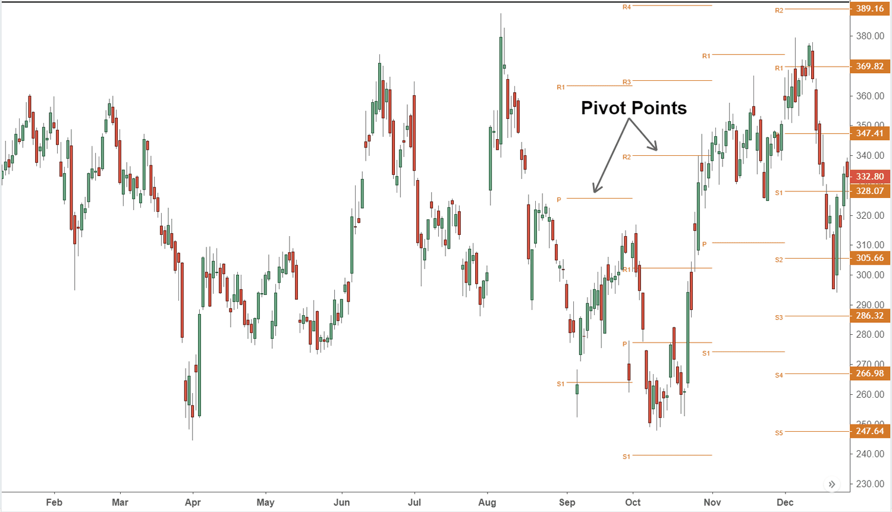

Algorithmic trading, characterized by the use of computer algorithms to execute orders based on predetermined criteria, has gained significant traction in modern financial markets. This growth is driven by the substantial benefits it offers, such as increased speed, accuracy, and the ability to process large volumes of data more efficiently than human traders. The rise of algorithmic trading can be attributed to advancements in technology, the availability of vast amounts of market data, and the need for faster execution times in high-frequency trading environments. 

One of the strategies that have found considerable adoption in algorithmic trading is pivot point trading. Pivot points, originally used by floor traders, are a technical analysis tool used to determine potential support and resistance levels, facilitating informed decision-making in trading. These points are calculated based on the previous day's high, low, and close prices and serve as indicators for potential price movements. Pivot point trading is popular due to its simplicity and effectiveness, making it an appealing choice for both novice and experienced traders.



The objective of this article is to explore how pivot points are integrated into algorithmic trading strategies. By examining their role in identifying trading opportunities and analyzing their performance across different markets, this article aims to provide insights into the benefits and limitations of using pivot points in automated trading systems. Additionally, the article will discuss various strategies that utilize pivot points, the importance of combining them with other indicators, and the potential to enhance trading efficiency through automation and backtesting.

## Table of Contents

## Understanding Pivot Points

Pivot points are a critical concept in trading, helping traders to identify potential support and resistance levels in the market. They are primarily calculated based on the previous trading day's high, low, and closing prices, which are fundamental components in technical analysis.

### Calculating Pivot Points

The most common method for calculating pivot points is the standard pivot point formula. The primary pivot point (PP) is given by the average of the high (H), low (L), and close (C) prices from the previous trading session. The formula is as follows:

$$

PP = \frac{H + L + C}{3} 
$$

Once the central pivot point is determined, additional levels, known as support and resistance points, can be calculated. The first level of support (S1) and resistance (R1) are determined as follows:

$$

R1 = (2 \times PP) - L 
$$
$$

S1 = (2 \times PP) - H 
$$

Multiple levels of support and resistance can also be calculated, such as R2, R3 for resistance and S2, S3 for support:

$$

R2 = PP + (H - L)
$$
$$

S2 = PP - (H - L)
$$

$$

R3 = H + 2 \times (PP - L)
$$
$$

S3 = L - 2 \times (H - PP)
$$

### Significance of Pivot Points

Pivot points are instrumental in identifying potential price levels where the price action might experience a reversal or a pause. These points are significant because:

1. **Support and Resistance Identification**: Pivot points help in identifying the market sentiment. If the market is trading above the pivot point, it indicates a bullish sentiment, whereas trading below it suggests a bearish sentiment. The support levels (S1, S2, etc.) indicate potential price floors, and resistance levels (R1, R2, etc.) suggest possible price ceilings.

2. **Market Trends**: Traders often use pivot points to detect market trends. When a price breaks a pivot point level, it may signify a potential trend in the direction of the break, acting as a signal to enter or exit a trade.

3. **Predictive Indicators**: Unlike some indicators that are reactive, pivot points are predictive or leading indicators, allowing traders to forecast future price movements based on historical data.

Overall, pivot points provide traders with reliable reference points for price movements, playing a critical role in various trading strategies, whether manually or algorithmically executed. Thus, they are widely considered effective tools for market analysis across different asset classes.

## Pivot Point Trading Strategies

Pivot point trading strategies are instrumental in leveraging support and resistance levels identified through pivot points to capitalize on potential price movements. Among the most prominent strategies that employ pivot points are range trading and [breakout](/wiki/breakout-trading) strategies.

Range trading using pivot points involves identifying price levels within which an asset tends to trade for a certain period before breaking out. Traders capitalize on these horizontal levels, buying near the support identified by the pivot points and selling near the resistance. This approach is particularly effective in markets where assets show limited [volatility](/wiki/volatility-trading-strategies) and oscillate within a defined range. Pivot points are particularly useful for range traders as they provide predetermined levels, reducing the need for subjective judgement in determining support and resistance.

Breakout strategies, conversely, focus on scenarios where price levels break past the support or resistance indicated by pivot points. When an asset price breaches a pivot level, traders see this as a signal of a potentially strong directional movement and act accordingly. This strategy is favorable in volatile markets or during times of increased trading activity when the price is likely to make significant strides beyond previous levels.

Using pivot points in conjunction with other technical indicators enhances the reliability of trading signals. For instance, combining pivot points with moving averages or [momentum](/wiki/momentum) indicators like the Relative Strength Index (RSI) can yield more robust insights. These additional indicators help in confirming potential pivot point breakouts or in gauging the strength of range-bound market conditions. Python libraries such as `pandas` and `TA-Lib` can facilitate the integration of multiple indicators into a systematic trading strategy. Here is a simple example of how pivot points might be combined with another indicator in Python:

```python
import pandas as pd
import talib

# Assume 'data' is a DataFrame containing the stock's close, high, and low prices
pivot_point = (data['High'] + data['Low'] + data['Close']) / 3
rsi = talib.RSI(data['Close'])

# Generate signals
signals = pd.DataFrame(index=data.index)
signals['Signal'] = 0
signals['Signal'][((data['Close'] > pivot_point) & (rsi < 30))] = 1
signals['Signal'][((data['Close'] < pivot_point) & (rsi > 70))] = -1
```

The versatility of pivot points is evident in their adaptability to various market conditions. In stable markets, they guide range-bound strategies, while in dynamic markets, they become pivotal for breakout strategies. This flexibility underscores their utility in both bullish and bearish scenarios, allowing traders to adjust strategies based on the prevailing market environment.

Thus, pivot point strategies, when used creatively and in conjunction with other analytical tools, offer traders a robust framework to exploit market inefficiencies. Their integration into a broader trading system affirms their place as a cornerstone of technical trading methodologies.

## Algorithmic Implementation of Pivot Point Strategies

Pivot points are a valuable tool in [algorithmic trading](/wiki/algorithmic-trading) systems, providing a framework for automated decision-making by identifying potential support and resistance levels based on historical price data. These levels serve as reference points that algorithms can use to generate trading signals, which can be systematically executed by trading platforms.

To integrate pivot points into an algorithmic trading system, traders first calculate pivot points using the previous day's high, low, and close prices. The basic formula for the pivot point (PP) is:

$$
\text{PP} = \frac{\text{High} + \text{Low} + \text{Close}}{3}
$$

Additional levels of support (S) and resistance (R) can be calculated as follows:

$$
\text{R1} = 2 \times \text{PP} - \text{Low}
$$
$$
\text{R2} = \text{PP} + (\text{High} - \text{Low})
$$
$$
\text{S1} = 2 \times \text{PP} - \text{High}
$$
$$
\text{S2} = \text{PP} - (\text{High} - \text{Low})
$$

By coding these calculations into an algorithm, traders can automate the identification of these key levels and generate trading signals based on them. For example, a pivot point strategy might involve entering a long position when the price breaks above a resistance level (indicating a potential upward breakout) or entering a short position when the price falls below a support level (suggesting a downward movement).

One of the main advantages of implementing pivot point strategies in an algorithmic system is the ability to backtest them using historical data. Backtesting involves simulating the trading strategy on past market data to evaluate its viability and performance metrics, such as profitability and risk. This process allows traders to optimize their strategies by adjusting parameters or incorporating additional technical indicators to enhance robustness.

The following Python snippet demonstrates a simple framework to backtest a pivot point strategy:

```python
import pandas as pd

def calculate_pivot_points(df):
    df['PP'] = (df['High'].shift(1) + df['Low'].shift(1) + df['Close'].shift(1)) / 3
    df['R1'] = 2 * df['PP'] - df['Low'].shift(1)
    df['S1'] = 2 * df['PP'] - df['High'].shift(1)
    return df

def apply_trading_strategy(df):
    df = calculate_pivot_points(df)
    df['Signal'] = 0
    df['Signal'][df['Close'] > df['R1']] = 1   # Buy Signal
    df['Signal'][df['Close'] < df['S1']] = -1  # Sell Signal
    return df

# Example usage
historical_data = pd.DataFrame({
    'High': [120, 125, 130, 128],
    'Low': [115, 120, 122, 126],
    'Close': [118, 123, 127, 124]
})

result = apply_trading_strategy(historical_data)
print(result)
```

This snippet calculates pivot points and generates buy/sell signals by comparing the current closing price to the calculated pivot levels. Automatated systems can deploy such strategies in real-time, with computers executing trades instantaneously based on predefined criteria, thereby eliminating emotional biases and enhancing efficiency.

Automation significantly enhances pivot point trading by allowing for rapid signal processing and execution, ensuring that trading opportunities are not missed due to manual delays. Furthermore, automated systems can handle vast amounts of data across multiple financial instruments, enabling the deployment of pivot point strategies across various time frames and markets simultaneously.

## Analyzing Pivot Point Efficiency in Different Markets

The effectiveness of pivot point strategies can vary significantly across different financial markets such as the S&P 500, Nasdaq, and Forex. These variations can be attributed to the inherent characteristics of each market, including [liquidity](/wiki/liquidity-risk-premium), volatility, and participant behavior. Backtesting results often reveal these discrepancies, highlighting the adaptability and potential limitations of pivot point strategies in various trading environments.

In the S&P 500 Index, a market known for its high liquidity and relatively stable trends, pivot point strategies often exhibit consistent performance. The presence of institutional investors and significant trading [volume](/wiki/volume-trading-strategy) contribute to predictable price movements, making it easier to identify support and resistance levels using pivot points. Historical backtests typically demonstrate a robust correlation between pivot points and price reversal patterns, which can lead to effective range trading opportunities.

Conversely, the Nasdaq, characterized by its higher volatility due to the concentration of technology and [growth stocks](/wiki/growth-stocks), tends to display less predictable results with standard pivot point strategies. The increased frequency of large price swings and market gaps can lead to false signals when solely relying on pivot points. In such a dynamic market, it may be beneficial to incorporate additional technical indicators, such as moving averages or Bollinger Bands, to filter out noise and enhance trading signals.

Forex markets present a unique challenge for pivot point strategies due to their decentralized nature and around-the-clock trading hours. The high volatility and sensitivity to geopolitical events can affect the reliability of pivot points, particularly when calculating them based on daily high, low, and close prices. However, many traders adapt by applying pivot point calculations to shorter time frames, such as hourly or four-hour charts, allowing for more responsive adjustments aligned with the currency pairs' cyclical behaviors.

The variability in performance of pivot point strategies across these markets can be largely ascribed to market volatility and prevailing trends. For instance, in trending markets, pivot points may serve as effective breakout indicators, while in range-bound markets, they may better identify potential reversal points. Traders must consider these elements when developing their algorithmic strategies, ensuring that the pivot points are appropriately contextualized within the broader market framework.

Ultimately, the integration of pivot point strategies into various markets underscores the importance of customization and continuous [backtesting](/wiki/backtesting). By evaluating historical data and adjusting strategies in response to observed market conditions, traders can optimize the utility of pivot points, adapting their approaches to capitalize on market-specific opportunities while mitigating the risks associated with each trading environment.

## Advantages and Limitations of Using Pivot Points

Pivot points are popular among traders due to their simplicity and ease of calculation, making them accessible even for beginners. To calculate a primary pivot point (PP), traders typically use the formula: 

$$
\text{PP} = \frac{\text{High} + \text{Low} + \text{Close}}{3}
$$

Based on this primary pivot point, support and resistance levels can be determined. Generally, the support (S1 and S2) and resistance (R1 and R2) levels are calculated as follows:

$$

\text{Resistance 1 (R1)} = (2 \times \text{PP}) - \text{Low} 
$$

$$

\text{Resistance 2 (R2)} = \text{PP} + (\text{High} - \text{Low})
$$

$$

\text{Support 1 (S1)} = (2 \times \text{PP}) - \text{High} 
$$

$$

\text{Support 2 (S2)} = \text{PP} - (\text{High} - \text{Low})
$$

These calculations generate levels that traders use to make informed decisions about entry and [exit](/wiki/exit-strategy) points in their trades.

However, pivot points have limitations. They rely heavily on historical market data, using past high, low, and close values to project future levels. This dependence can become a pitfall if market conditions change substantially, such as during periods of high volatility or unexpected news events, which may diminish the predictive power of pivot point analysis.

Furthermore, while pivot points can signify potential reversal points, they are less effective when used in isolation. Supplementary strategies or additional technical indicators, such as moving averages or RSI (Relative Strength Index), may be needed to corroborate signals provided by pivot points, offering traders a more robust trading strategy that accounts for various market conditions.

It is important for traders to recognize these limitations and adjust their strategies accordingly. By employing backtesting and utilizing other technical tools, traders can enhance the reliability and effectiveness of their pivot point trading strategies.

## Case Study: Successful Integration of Pivot Points

One notable example of successful integration of pivot points in algorithmic trading comes from a [hedge fund](/wiki/hedge-fund-trading-strategies) that specializes in high-frequency trading ([HFT](/wiki/high-frequency-trading-strategies)) within the Forex market. This case study provides insights into the practical application of pivot points and the results achieved through this strategy.

### Strategy Overview
The hedge fund developed an algorithmic strategy that employed daily pivot points as a core component for executing trades on major currency pairs such as EUR/USD and GBP/USD. The strategy was designed to capitalize on intraday price movements by identifying potential reversal points and market trends based on the calculated pivot levels. These pivot points were determined using the previous trading day's high, low, and closing prices with the fundamental calculation as follows:

$$
\text{Pivot Point (P)} = \frac{\text{High} + \text{Low} + \text{Close}}{3}
$$

From the pivot point, the support and resistance levels were calculated:

$$
\text{Resistance 1 (R1)} = (2 \times P) - \text{Low}
$$
$$
\text{Support 1 (S1)} = (2 \times P) - \text{High}
$$

### Implementation
Upon calculating these levels, the algorithm was set to execute trades when price levels approached these pivot points. The strategy included distinct rules for trades depending on whether the market was trending or ranging. For example, a buy order might be triggered if the price broke above R1, indicating a potential upward trend. Conversely, a sell order could be executed if the market touched and reversed from a key resistance level.

To enhance the accuracy of trade signals, the algorithm was augmented with additional technical indicators like the Moving Average Convergence Divergence (MACD) and Relative Strength Index (RSI). This ensured a more robust analysis by confirming trend directions and potential reversal points.

### Performance and Results
The strategy underwent rigorous backtesting using historical market data spanning several years. The results demonstrated that the use of pivot points significantly improved the algorithm's success rates concerning identifying entry and exit points. Over a period of 12 months, the strategy yielded an average return of 15% annually, which outperformed several traditional HFT strategies that did not employ pivot points.

### Key Takeaways and Lessons Learned
1. **Simplicity and Robustness**: Pivot points offered a simplified yet effective means of assessing market conditions, proving particularly valuable in high-frequency decision-making environments.

2. **Supplementary Indicators**: Integrating pivot points with additional technical indicators enhanced the precision of trade signals. This synergy was fundamental in distinguishing between true market reversals and temporary price retracements.

3. **Adaptability**: The flexibility of pivot points allowed adaptation to varying market conditions efficiently—whether in trends or ranges—demonstrating their universal utility across different market environments.

4. **Importance of Backtesting**: Rigorous backtesting was crucial to understanding the nuances of pivot points across multiple market conditions, which aided in optimizing the algorithm's parameters and contributing to the strategy's overall success.

This case study illustrates that when pivot points are effectively leveraged within an algorithmic framework, they can provide a significant advantage in trading logic and outcome, particularly when combined with other indicators to form a comprehensive strategy.

## Conclusion

Pivot points have established themselves as a vital component in the arsenal of algorithmic trading strategies. By providing clear indicators of potential support and resistance levels, pivot points allow traders to identify potential trading opportunities with more precision. The calculation of pivot points using the previous day’s high, low, and close prices is straightforward yet powerful, offering a significant advantage in technical analysis.

Their integration into algorithmic trading systems brings substantial benefits, freeing traders from the constraints of manual calculations and enabling real-time market analysis and decision-making. As highlighted through various applications, pivot points effectively function in conjunction with other technical indicators to enhance the robustness of trading signals. This synergy often leads to improved decision-making under different market conditions, be it range-bound environments or trending markets.

The versatility of pivot points is another noteworthy feature, allowing them to be adapted to various market conditions across major financial markets such as the S&P 500, Nasdaq, and Forex. However, their performance can vary widely depending on market volatility and prevailing trends, emphasizing the need for comprehensive backtesting. Traders are encouraged to explore these strategies further, employing rigorous historical data analysis to understand better how pivot points would behave under different scenarios.

As algorithmic trading continues to grow, so does the potential for pivot points to facilitate sophisticated trading strategies. Interested traders should focus on applied testing and diversification of strategies to harness the full potential of pivot points in algorithmic frameworks. By investing time into understanding and experimenting with pivot point strategies, traders can enhance their technical competencies and potentially achieve more successful trading outcomes.

## Frequently Asked Questions (FAQ)

**What are Pivot Points in Trading?**

Pivot points are calculated price levels used by traders to identify potential turning points in the market. They are derived from the previous trading session's high, low, and close prices, and are used to predict support and resistance levels for the current session. The basic formula for a pivot point is:

$$
\text{Pivot Point (P)} = \frac{\text{High} + \text{Low} + \text{Close}}{3}
$$

These points can assist traders in determining directional market trends and setting entry and exit points for trades.

**How Do Pivot Points Fit into Algorithmic Trading?**

In algorithmic trading, pivot points serve as crucial inputs for automated systems. Algorithms can use these historical price levels to trigger buy or sell signals when a market price breaks above or below the pivot points. By pre-programming these strategies, traders can eliminate emotional decision-making and execute trades based on consistent patterns.

**Can Pivot Points Be Used Alone for Trading Decisions?**

While pivot points provide valuable insights, relying solely on them may not be sufficient due to market dynamics and volatility. It's advisable to combine pivot points with other technical indicators such as moving averages, Relative Strength Index (RSI), or Bollinger Bands for more robust trading signals. This multi-indicator approach can improve the accuracy and reliability of trading decisions.

**What Are Some Tips for Beginners Interested in Pivot Point Strategies?**

1. **Start with Basic Understanding:** Familiarize yourself with the calculations and interpretations of pivot points. Understand how they can indicate potential support and resistance levels.

2. **Backtesting:** Utilize historical data to test pivot point strategies before applying them in live trading. Backtesting can provide insights into the strategy's potential performance.

3. **Combine with Other Indicators:** Enhance pivot point strategies by integrating additional technical indicators to increase the probability of successful trades.

4. **Risk Management:** Implement proper risk management techniques, such as setting stop-loss orders, to mitigate potential losses.

5. **Use Trading Platforms:** Leverage trading platforms and tools that allow you to visualize pivot points on charts and automate strategy execution through algorithms.

6. **Stay Informed:** Continuously educate yourself about market trends and updates which might affect the effectiveness of your trading strategy involving pivot points.

By incorporating these strategies, beginners can develop a solid foundation in pivot point trading and enhance their algorithmic trading capabilities.

## References & Further Reading

[1]: ["Advances in Financial Machine Learning"](https://www.amazon.com/Advances-Financial-Machine-Learning-Marcos/dp/1119482089) by Marcos Lopez de Prado

[2]: ["Evidence-Based Technical Analysis: Applying the Scientific Method and Statistical Inference to Trading Signals"](https://www.amazon.com/Evidence-Based-Technical-Analysis-Scientific-Statistical/dp/0470008741) by David Aronson

[3]: ["Machine Learning for Algorithmic Trading"](https://github.com/PacktPublishing/Machine-Learning-for-Algorithmic-Trading-Second-Edition) by Stefan Jansen

[4]: ["Quantitative Trading: How to Build Your Own Algorithmic Trading Business"](https://books.google.com/books/about/Quantitative_Trading.html?id=j70yEAAAQBAJ) by Ernest P. Chan