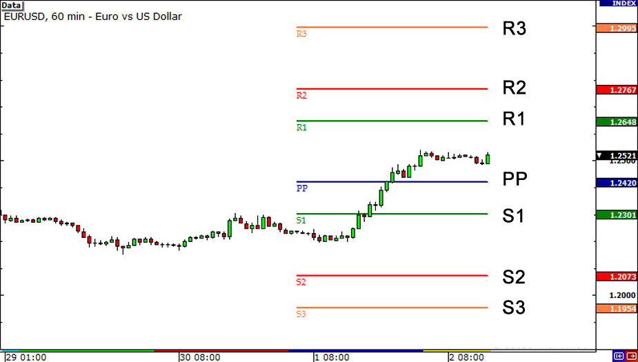

## Table of Contents

## What are pivot points in forex trading?

Pivot points in forex trading are used to identify potential support and resistance levels. They are calculated using the high, low, and closing prices of the previous trading day. Traders use these points to make decisions about when to enter or exit trades. If the price stays above the pivot point, it's seen as a bullish signal, and if it stays below, it's seen as bearish.

These points help traders understand where the market might change direction. For example, if the price is approaching a pivot point from below and then bounces back up, that pivot point acted as support. If the price breaks through the pivot point, it might continue to move towards the next resistance level. By watching these levels, traders can set their trading goals and manage their risks better.

## How are pivot points calculated?

Pivot points are calculated using the high, low, and closing prices from the previous trading day. The main pivot point, which is the central reference point, is found by adding the high and low prices of the previous day to the closing price, then dividing the total by three. This gives traders a single number that they can use to start figuring out where the market might go next.

From the main pivot point, traders can then calculate other levels like support and resistance. The first level of support is found by multiplying the main pivot point by two, then subtracting the high price from the previous day. The first level of resistance is calculated by multiplying the main pivot point by two, then subtracting the low price from the previous day. These additional levels help traders see where the price might find it hard to move past or where it might bounce back from.

## What is the significance of pivot points in trading decisions?

Pivot points are important in trading because they help traders see where the price might change direction. They show levels where the price could stop going up or down and start moving the other way. Traders use these points to decide when to buy or sell. If the price goes above the pivot point, it might be a good time to buy because it could keep going up. If the price goes below the pivot point, it might be a good time to sell because it could keep going down.

These points also help traders set their goals and manage risks. For example, if a trader sees the price getting close to a pivot point, they might decide to take some profit or move their stop-loss order to protect their money. By watching pivot points, traders can make smarter choices about when to get in or out of trades. This can lead to better trading results over time.

## Can you explain the different types of pivot points used in forex trading?

In forex trading, there are several types of pivot points that traders use to help them make decisions. The most common type is the Standard Pivot Point, which is calculated using the high, low, and closing prices from the previous trading day. This gives traders a main pivot point and levels of support and resistance that they can watch to see where the price might change direction. Another type is the Fibonacci Pivot Point, which uses the Fibonacci sequence to add more levels of support and resistance. These extra levels can give traders more detailed information about where the price might go next.

Another type of pivot point is the Woodie Pivot Point, which puts more weight on the closing price of the previous day when calculating the pivot point. This can be useful for traders who think the closing price is more important than the high and low prices. The Camarilla Pivot Point is another type that uses a different formula to calculate many levels of support and resistance. Traders who use Camarilla Pivot Points believe that these levels can help them find good places to enter and exit trades quickly. Each type of pivot point has its own way of helping traders understand the market and make better trading decisions.

## How do traders use pivot points to identify potential support and resistance levels?

Traders use pivot points to find where the price might stop and change direction. They start by calculating the main pivot point using the high, low, and closing prices from the day before. From this main point, they figure out other levels called support and resistance. Support levels are where the price might stop going down and start going up again. Resistance levels are where the price might stop going up and start going down again. By watching these levels, traders can see where the price might turn around and make their trading decisions based on that.

Different types of pivot points, like Standard, Fibonacci, Woodie, and Camarilla, give traders different ways to find these support and resistance levels. For example, Standard Pivot Points give a basic set of levels, while Fibonacci Pivot Points add more levels using the Fibonacci sequence. Traders choose the type that works best for them and their trading style. Once they have these levels, traders can decide when to buy or sell, set their goals for the trade, and manage their risks. By using pivot points, traders can get a clearer picture of where the market might go next and make better trading choices.

## What are the common time frames used for calculating pivot points?

Traders usually calculate pivot points using different time frames like daily, weekly, or monthly. The most common time frame is daily, which means they use the high, low, and closing prices from the previous trading day. This helps them see where the price might change direction during the current day. Some traders also look at weekly pivot points, which are calculated using the high, low, and closing prices from the previous week. This gives them a bigger picture of where the market might go over the next week.

Monthly pivot points are less common but still used by some traders. They use the high, low, and closing prices from the previous month to find these points. This can be helpful for traders who are looking at longer-term trends and want to know where the price might find support or resistance over the next month. By using different time frames, traders can get a better idea of what the market might do in the short term and the long term.

## How can pivot points be integrated with other technical indicators for better trading outcomes?

Traders often use pivot points along with other technical indicators to make better trading decisions. One common way is to use pivot points with moving averages. A moving average shows the average price of a currency over a certain time. If the price is above both the pivot point and the moving average, it might be a strong sign to buy. If the price is below both, it might be a good time to sell. By looking at both the pivot points and the moving average, traders can see if the market is really moving in one direction or if it might change soon.

Another way to use pivot points is with the Relative Strength Index (RSI). The RSI helps traders see if a currency is overbought or oversold. If the price is near a pivot point and the RSI shows the currency is overbought, it might be a good time to sell because the price could go down soon. If the RSI shows the currency is oversold and the price is near a pivot point, it might be a good time to buy because the price could go up. By using pivot points with the RSI, traders can get a better idea of when to enter or exit trades and manage their risks better.

## What are the limitations and potential pitfalls of using pivot points in forex trading?

Using pivot points in forex trading can be helpful, but they have some limitations. One big problem is that they are based on past prices, so they might not always work well in the future. The market can change quickly, and what worked yesterday might not work today. Also, pivot points work best in markets that move in clear trends. If the market is moving sideways or is very choppy, pivot points might give false signals, making it hard for traders to make good decisions.

Another issue is that pivot points are not always accurate. They are just one tool among many, and relying on them too much can lead to mistakes. Traders might see a pivot point as a strong support or resistance level, but the price can still break through it. This can cause traders to enter or exit trades at the wrong times, leading to losses. To avoid these pitfalls, traders should use pivot points along with other indicators and always have a good trading plan.

## How do professional traders adjust pivot points for different market conditions?

Professional traders often change how they use pivot points based on what the market is doing. In a market that moves in a clear trend, they might stick to the standard pivot points because these work well when the price is going up or down steadily. But if the market is moving sideways or is very choppy, traders might look at other types of pivot points, like Fibonacci or Camarilla, to get more detailed levels of support and resistance. They might also use shorter time frames, like hourly pivot points, to find more chances to trade in a fast-moving market.

In times when the market is very volatile, traders might adjust their pivot points by using wider ranges for support and resistance. This helps them avoid getting caught out by big price swings. They might also combine pivot points with other tools, like moving averages or the RSI, to get a better picture of what the market is doing. By being flexible and adjusting their use of pivot points to fit different market conditions, professional traders can make better trading decisions and manage their risks more effectively.

## Can you discuss advanced strategies involving multiple pivot points?

Advanced traders often use multiple pivot points to get a better understanding of the market. They might look at daily, weekly, and even monthly pivot points all at the same time. By doing this, they can see where the price might find support or resistance in the short term and the long term. For example, if the daily pivot point is close to the weekly pivot point, it could be a very strong level where the price might turn around. Traders can use this information to set their trading goals and decide when to enter or exit trades.

Another strategy is to use different types of pivot points together, like Standard, Fibonacci, and Camarilla. Each type gives different levels of support and resistance, so by looking at all of them, traders can see a more complete picture of where the price might go next. If the price is near a support level on one type of pivot point and a resistance level on another, traders can be more careful and maybe wait for more signs before making a trade. By using multiple pivot points in this way, traders can make smarter decisions and manage their risks better.

## What role do pivot points play in automated trading systems?

Pivot points are important in automated trading systems because they help the computer know where the price might change direction. The computer uses the high, low, and closing prices from the day before to figure out these pivot points. Then, it can decide when to buy or sell based on where the price is compared to these points. If the price goes above the pivot point, the computer might see it as a good time to buy. If the price goes below the pivot point, it might be a good time to sell. This helps the computer make quick trading decisions without a person having to watch the market all the time.

Automated systems can also use different types of pivot points, like Fibonacci or Camarilla, to get more levels of support and resistance. This gives the computer more information to work with, so it can make better trading choices. The computer can also use pivot points with other tools, like moving averages or the RSI, to see if the market is really moving in one direction or if it might change soon. By using pivot points in this way, the computer can help traders make money even when they are not watching the market themselves.

## How can historical data analysis improve the effectiveness of pivot points in trading?

Looking at past prices can help traders use pivot points better. By studying how the price moved around pivot points in the past, traders can see if these points were good at showing where the price would turn around. If a pivot point often worked as support or resistance before, traders might trust it more in the future. They can also see if certain types of pivot points, like Fibonacci or Camarilla, worked better than others in different market conditions. This helps traders pick the right type of pivot point to use.

Using historical data also lets traders find patterns that can help them predict what the market might do next. For example, if the price often bounced off a pivot point at the same time of day, traders can use this information to plan their trades. By understanding these patterns, traders can set their goals and manage their risks better. This can lead to more successful trades and help traders make more money over time.

## What are Pivot Points and How Do They Work?

Pivot points are a fundamental aspect of technical analysis, particularly in the field of forex trading. They are calculated using the previous day's high, low, and closing prices to forecast potential support and resistance levels, which are critical in determining market trends. The basic pivot point (P) is calculated using the formula:

$$

P = \frac{\text{High} + \text{Low} + \text{Close}}{3} 
$$

This point serves as the primary level from which additional support and resistance levels are derived. The first support (S1) and resistance (R1) are commonly calculated as follows:

$$

S1 = (2 \times P) - \text{High} 
$$

$$

R1 = (2 \times P) - \text{Low} 
$$

Further support (S2) and resistance (R2) levels can be calculated as:

$$

S2 = P - (\text{High} - \text{Low}) 
$$

$$

R2 = P + (\text{High} - \text{Low}) 
$$

These calculations offer traders insight into potential price movements by identifying where market psychology may drive prices to reverse or consolidate. Initially used by floor traders to gauge market sentiment and make quick decisions, pivot points have transitioned into essential tools for contemporary trading, largely due to their simplicity and effectiveness in analyzing market data over short-term periods.

In [forex](/wiki/forex-system) trading, pivot points are particularly valuable because they provide an objective framework for identifying market trends. This becomes crucial as the forex market is highly volatile and is influenced by a multitude of factors, from geopolitical events to macroeconomic announcements. By leveraging previous trading data, pivot points allow traders to recognize daily and intraday trends and adjust their strategies accordingly. This predictive quality of pivot points proves advantageous for traders aiming to navigate and capitalize on forex market fluctuations effectively.

## What are the types of pivot points?

Pivot points are a widely used tool in technical analysis, with several methods available for their calculation. Each method has its own formula and application, allowing traders to gain different perspectives on market conditions. The most common types of pivot points are Classic, Fibonacci, Woodie, Demark, and Camarilla.

**1. Classic Pivot Points**: This is the most traditional method, where the central pivot point (P) is calculated by averaging the high (H), low (L), and closing (C) prices from the previous trading period. The simple formula is:

$$
P = \frac{H + L + C}{3}
$$

From this central point, support (S) and resistance (R) levels are derived:

- First Resistance (R1): $R1 = 2P - L$
- First Support (S1): $S1 = 2P - H$

Additional levels can be calculated to provide further guidance (e.g., R2, S2).

**2. Fibonacci Pivot Points**: This method integrates Fibonacci retracement levels into the traditional pivot point calculations. The pivot point is calculated the same as the Classic method. However, Fibonacci levels are used for determining support and resistance:

- First Resistance (R1): $R1 = P + (H - L) \times 0.382$
- First Support (S1): $S1 = P - (H - L) \times 0.382$

Other levels, such as R2, S2, etc., use additional Fibonacci ratios like 0.618 and 0.236.

**3. Woodie’s Pivot Points**: This variation puts more emphasis on the closing price by giving it additional weight. The central pivot point is calculated as follows:

$$
P = \frac{H + L + 2C}{4}
$$

The support and resistance levels are then established similarly to the Classic method, but with more weight on the closing price's influence.

**4. Demark Pivot Points**: This method is unique in that its calculation depends on the relationship between the closing price and the opening price of the trading period. The central pivot point (referred to as X in Demark's method) is calculated using:

If C > O:
$$
X = H + 2L + C
$$

If C < O:
$$
X = 2H + L + C
$$

If C = O:
$$
X = H + L + 2C
$$

Resistance and support levels are derived differently, often customized based on the unique definitions of X.

**5. Camarilla Pivot Points**: This method uses the previous day's price levels to establish a series of support and resistance lines that are closer to the current price than traditional methods. The basic formula for the central pivot is similar to Classic, but the support and resistance lines are calculated using unique multipliers of the high-low range.

These methods highlight the diverse applications of pivot points, each offering varied insights that can influence trading strategies. Utilizing different types of pivot points allows traders to choose the method that best aligns with their trading style and market outlook.

## How can Pivot Points be applied in Forex Trading?

Pivot points serve as essential tools in forex trading, enabling traders to pinpoint critical price levels for entering or exiting trades. They are derived from mathematical calculations using prior period data, specifically the high, low, and close prices from the previous trading session. The standard pivot point formula is as follows:

$$

\text{Pivot Point (PP)} = \frac{\text{High} + \text{Low} + \text{Close}}{3} 
$$

Once the pivot point is calculated, support and resistance levels can be determined. These levels assist traders in mapping out potential areas where price movements might face obstacles, thus helping in the formation of trading strategies.

For the first level of support (S1) and resistance (R1), the calculations are:

$$

\text{Resistance 1 (R1)} = (2 \times \text{PP}) - \text{Low} 
$$
$$

\text{Support 1 (S1)} = (2 \times \text{PP}) - \text{High} 
$$

The second levels (S2 and R2) are calculated as:

$$

\text{Resistance 2 (R2)} = \text{PP} + (\text{High} - \text{Low}) 
$$
$$

\text{Support 2 (S2)} = \text{PP} - (\text{High} - \text{Low}) 
$$

These calculations enable forex traders to identify key areas where a currency pair might encounter buying or selling pressure, thereby allowing them to make better-informed decisions. By assessing these support and resistance levels, traders are better equipped to manage risk and enhance their profit potential. Setting stop-loss and take-profit orders around these levels can significantly optimize risk-reward ratios, reducing potential losses while maximizing gains.

Utilizing pivot points aligns a trader's strategy with the broader market trend, as these points often correlate with technical indicators and help in spotting potential market reversals or continuations. While pivot points provide a framework for decision-making, it is crucial for traders to remain observant of actual market conditions, considering the impact of [volatility](/wiki/volatility-trading-strategies) and unforeseen news events, which may necessitate tactical adjustments to trading strategies.

## What are the benefits of using pivot points?

Pivot points provide traders with a simple yet effective approach to technical analysis, allowing for swift and informed trading decisions. By using historical price data to calculate potential support and resistance levels, traders can anticipate market movements with greater precision. This predictive capability is essential for setting stop-loss and profit-taking points. 

Stop-loss points are predefined levels at which a trader will [exit](/wiki/exit-strategy) a losing trade to prevent further losses. By setting these points based on pivot levels, traders can establish risk management parameters that are both strategic and logical, reducing the likelihood of decision-making driven by emotion. For example, a support pivot point may serve as an optimal stop-loss level, as breaking this point might indicate a further downturn in prices.

Similarly, profit-taking points can be established around identified resistance levels. Traders often use resistance pivot points to decide when to lock in gains, ensuring profits are secured before potential reversals occur. This method provides a disciplined approach, reducing the tendency to hold onto profitable trades for too long in hopes of further gains, which might not materialize.

Furthermore, the objectivity of pivot points minimizes subjective decision-making, as these levels are calculated using a standardized formula. The formula for the most common type of pivot point (the Classic pivot) is:

$$
\text{Pivot Point (PP)} = \frac{(\text{High} + \text{Low} + \text{Close})}{3}
$$

From this central pivot point, additional support and resistance levels can be calculated, which can assist in establishing comprehensive trading strategies:

$$
\text{First Support (S1)} = (2 \times \text{PP}) - \text{High}
$$

$$
\text{First Resistance (R1)} = (2 \times \text{PP}) - \text{Low}
$$

The straightforward calculation and application of pivot points make them a valuable addition to trading strategies, enhancing precision and reducing the emotional aspect of trading. By integrating these points with other technical indicators, traders are better equipped to manage trades efficiently and confidently.

## What are the limitations of pivot points?

Pivot points serve as a pivotal tool in technical analysis, yet they are not without their limitations. While they provide insights into potential support and resistance levels, pivot points are not foolproof indicators. One of their primary limitations is their inability to account for unexpected market volatility or sudden news events. Such events can significantly disrupt the projections made by pivot points, leading to potentially misleading signals.

To mitigate this issue, traders often use pivot points in conjunction with other technical indicators to confirm trends and increase the reliability of their analysis. For instance, combining pivot points with moving averages or relative strength index (RSI) can provide a more comprehensive view of the market.

Moreover, the static nature of pivot point calculations, based primarily on historical data, does not accommodate the dynamic nature of currency markets, where sentiment and external economic factors can rapidly change. The basic formula for pivot points, such as the Classic Pivot Point:

$$
\text{Pivot Point (P)} = \frac{(\text{High} + \text{Low} + \text{Close})}{3}
$$

does not inherently adjust for these shifts in market dynamics. As a result, traders must stay vigilant, continuously monitor market conditions, and be prepared to adjust their strategies accordingly when using pivot points as part of their trading toolkit. This adaptive approach ensures they are not caught off-guard by sudden market movements that could otherwise lead to inaccurate trading decisions.

## References & Further Reading

[1]: Murphy, J. J. (1999). ["Technical Analysis of the Financial Markets: A Comprehensive Guide to Trading Methods and Applications"](https://archive.org/details/technicalanalysi0000murp). New York Institute of Finance.

[2]: Pring, M. J. (2002). ["Technical Analysis Explained: The Successful Investor's Guide to Spotting Investment Trends and Turning Points"](https://www.amazon.com/Technical-Analysis-Explained-Fifth-Successful/dp/0071825177). McGraw-Hill Education.

[3]: Azzopardi, M. (2018). ["Algorithmic Trading: A Comprehensive Beginner's Guide to Learn Algorithmic Trading Step by Step"](https://www.investopedia.com/articles/active-trading/101014/basics-algorithmic-trading-concepts-and-examples.asp).

[4]: ["The Encyclopedia of Technical Market Indicators"](https://www.amazon.com/Encyclopedia-Technical-Market-Indicators-Second/dp/0070120579) by Robert W. Colby

[5]: "Pivot Points." (n.d.). [Investopedia](https://www.investopedia.com/terms/p/pivotpoint.asp).