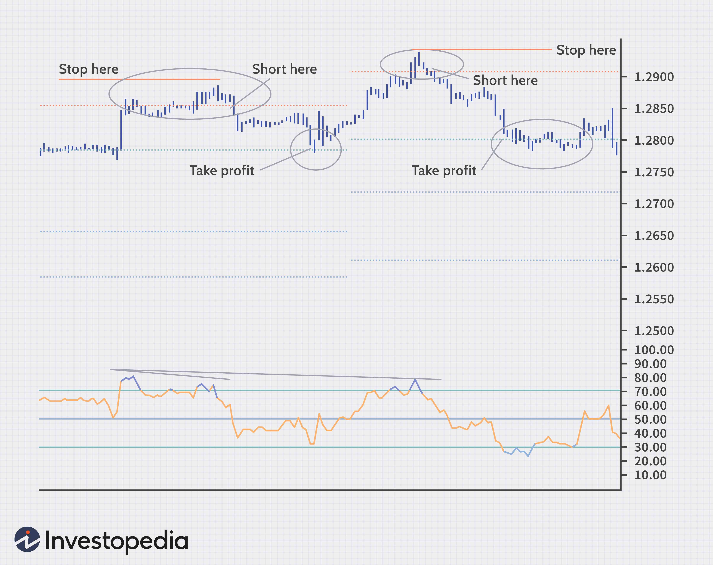

Pivot points are a critical tool utilized by forex and algorithmic traders to anticipate market movements by identifying potential support and resistance levels. These levels are derived from previous trading data to assist traders in making informed decisions. As a form of technical analysis, pivot points offer insights that allow traders to predict market trends and optimize their trading strategies. 

Historically, pivot points were predominantly used by floor traders, where they served as a straightforward yet effective method to gauge the market's trajectory. In modern trading environments, the application of pivot points has evolved to accommodate complex financial instruments, particularly in the forex market. This evolution has also extended their utility in algorithmic trading, where they are integrated into sophisticated trading algorithms to enhance accuracy and execution efficiency.



In forex trading, pivot points help traders determine critical price points to potentially initiate or exit trades, managing risk while maximizing profit opportunities. For algorithmic traders, these points are embedded into trading models, enabling automated strategies that operate based on specified parameters. 

This article examines pivot points, their mathematical foundations, and their significance in both forex and algorithmic trading, illustrating their role in enhancing technical analysis and contributing to effective trading strategies.

## Table of Contents

## Understanding Pivot Points

Pivot points are a fundamental aspect of technical analysis, particularly in the field of forex trading. They are calculated using the previous day's high, low, and closing prices to forecast potential support and resistance levels, which are critical in determining market trends. The basic pivot point (P) is calculated using the formula:

$$

P = \frac{\text{High} + \text{Low} + \text{Close}}{3} 
$$

This point serves as the primary level from which additional support and resistance levels are derived. The first support (S1) and resistance (R1) are commonly calculated as follows:

$$

S1 = (2 \times P) - \text{High} 
$$

$$

R1 = (2 \times P) - \text{Low} 
$$

Further support (S2) and resistance (R2) levels can be calculated as:

$$

S2 = P - (\text{High} - \text{Low}) 
$$

$$

R2 = P + (\text{High} - \text{Low}) 
$$

These calculations offer traders insight into potential price movements by identifying where market psychology may drive prices to reverse or consolidate. Initially used by floor traders to gauge market sentiment and make quick decisions, pivot points have transitioned into essential tools for contemporary trading, largely due to their simplicity and effectiveness in analyzing market data over short-term periods.

In [forex](/wiki/forex-system) trading, pivot points are particularly valuable because they provide an objective framework for identifying market trends. This becomes crucial as the forex market is highly volatile and is influenced by a multitude of factors, from geopolitical events to macroeconomic announcements. By leveraging previous trading data, pivot points allow traders to recognize daily and intraday trends and adjust their strategies accordingly. This predictive quality of pivot points proves advantageous for traders aiming to navigate and capitalize on forex market fluctuations effectively.

## Types of Pivot Points

Pivot points are a widely used tool in technical analysis, with several methods available for their calculation. Each method has its own formula and application, allowing traders to gain different perspectives on market conditions. The most common types of pivot points are Classic, Fibonacci, Woodie, Demark, and Camarilla.

**1. Classic Pivot Points**: This is the most traditional method, where the central pivot point (P) is calculated by averaging the high (H), low (L), and closing (C) prices from the previous trading period. The simple formula is:

$$
P = \frac{H + L + C}{3}
$$

From this central point, support (S) and resistance (R) levels are derived:

- First Resistance (R1): $R1 = 2P - L$
- First Support (S1): $S1 = 2P - H$

Additional levels can be calculated to provide further guidance (e.g., R2, S2).

**2. Fibonacci Pivot Points**: This method integrates Fibonacci retracement levels into the traditional pivot point calculations. The pivot point is calculated the same as the Classic method. However, Fibonacci levels are used for determining support and resistance:

- First Resistance (R1): $R1 = P + (H - L) \times 0.382$
- First Support (S1): $S1 = P - (H - L) \times 0.382$

Other levels, such as R2, S2, etc., use additional Fibonacci ratios like 0.618 and 0.236.

**3. Woodie’s Pivot Points**: This variation puts more emphasis on the closing price by giving it additional weight. The central pivot point is calculated as follows:

$$
P = \frac{H + L + 2C}{4}
$$

The support and resistance levels are then established similarly to the Classic method, but with more weight on the closing price's influence.

**4. Demark Pivot Points**: This method is unique in that its calculation depends on the relationship between the closing price and the opening price of the trading period. The central pivot point (referred to as X in Demark's method) is calculated using:

If C > O:
$$
X = H + 2L + C
$$

If C < O:
$$
X = 2H + L + C
$$

If C = O:
$$
X = H + L + 2C
$$

Resistance and support levels are derived differently, often customized based on the unique definitions of X.

**5. Camarilla Pivot Points**: This method uses the previous day's price levels to establish a series of support and resistance lines that are closer to the current price than traditional methods. The basic formula for the central pivot is similar to Classic, but the support and resistance lines are calculated using unique multipliers of the high-low range.

These methods highlight the diverse applications of pivot points, each offering varied insights that can influence trading strategies. Utilizing different types of pivot points allows traders to choose the method that best aligns with their trading style and market outlook.

## Applying Pivot Points in Forex Trading

Pivot points serve as essential tools in forex trading, enabling traders to pinpoint critical price levels for entering or exiting trades. They are derived from mathematical calculations using prior period data, specifically the high, low, and close prices from the previous trading session. The standard pivot point formula is as follows:

$$

\text{Pivot Point (PP)} = \frac{\text{High} + \text{Low} + \text{Close}}{3} 
$$

Once the pivot point is calculated, support and resistance levels can be determined. These levels assist traders in mapping out potential areas where price movements might face obstacles, thus helping in the formation of trading strategies.

For the first level of support (S1) and resistance (R1), the calculations are:

$$

\text{Resistance 1 (R1)} = (2 \times \text{PP}) - \text{Low} 
$$
$$

\text{Support 1 (S1)} = (2 \times \text{PP}) - \text{High} 
$$

The second levels (S2 and R2) are calculated as:

$$

\text{Resistance 2 (R2)} = \text{PP} + (\text{High} - \text{Low}) 
$$
$$

\text{Support 2 (S2)} = \text{PP} - (\text{High} - \text{Low}) 
$$

These calculations enable forex traders to identify key areas where a currency pair might encounter buying or selling pressure, thereby allowing them to make better-informed decisions. By assessing these support and resistance levels, traders are better equipped to manage risk and enhance their profit potential. Setting stop-loss and take-profit orders around these levels can significantly optimize risk-reward ratios, reducing potential losses while maximizing gains.

Utilizing pivot points aligns a trader's strategy with the broader market trend, as these points often correlate with technical indicators and help in spotting potential market reversals or continuations. While pivot points provide a framework for decision-making, it is crucial for traders to remain observant of actual market conditions, considering the impact of [volatility](/wiki/volatility-trading-strategies) and unforeseen news events, which may necessitate tactical adjustments to trading strategies.

## Pivot Points and Algo Trading

In [algorithmic trading](/wiki/algorithmic-trading), pivot points serve as a fundamental component for automating trading strategies, enhancing both efficiency and accuracy. By embedding pivot point calculations into algorithms, traders can develop systems that autonomously execute trades based on predefined criteria, thus minimizing human intervention and emotional decision-making.

Pivot points, calculated using historical price data, determine potential support and resistance levels in a security's price movement. These levels are used to inform buy or sell decisions within algorithmic models. For example, a basic algorithmic strategy might buy whenever the price is near a pivot point support level and sell when it approaches a resistance level.

A simplified representation of calculating pivot points in a Python environment can be demonstrated with the following code snippet:

```python
def calculate_pivot_points(high, low, close):
    pivot = (high + low + close) / 3
    support1 = (2 * pivot) - high
    resistance1 = (2 * pivot) - low
    return pivot, support1, resistance1

# Example historical price data
high = 102
low = 98
close = 100

pivot, support1, resistance1 = calculate_pivot_points(high, low, close)
print(f"Pivot: {pivot}, Support1: {support1}, Resistance1: {resistance1}")
```

In sophisticated algorithmic trading systems, these basic calculations are integrated with more complex strategies, incorporating additional criteria such as moving averages, [volume](/wiki/volume-trading-strategy) data, or real-time news feed analysis to enhance decision accuracy. The algorithms are designed to react swiftly to market conditions, potentially executing orders milliseconds after a pivot level is breached.

Moreover, advanced strategies may employ [machine learning](/wiki/machine-learning) techniques to optimize the parameters defining these pivot-based trades. Machine learning models might analyze historical data patterns to adjust support and resistance levels dynamically, thus improving the predictive power of these strategies.

While pivot points provide valuable inputs, they are most effective when used in conjunction with other technical indicators, ensuring more robust trading decisions. This combination aids in the development of comprehensive algorithmic strategies that not only capitalize on typical price movements around pivot points but also adapt to significant market shifts or volatility.

## Benefits of Using Pivot Points

Pivot points provide traders with a simple yet effective approach to technical analysis, allowing for swift and informed trading decisions. By using historical price data to calculate potential support and resistance levels, traders can anticipate market movements with greater precision. This predictive capability is essential for setting stop-loss and profit-taking points. 

Stop-loss points are predefined levels at which a trader will [exit](/wiki/exit-strategy) a losing trade to prevent further losses. By setting these points based on pivot levels, traders can establish risk management parameters that are both strategic and logical, reducing the likelihood of decision-making driven by emotion. For example, a support pivot point may serve as an optimal stop-loss level, as breaking this point might indicate a further downturn in prices.

Similarly, profit-taking points can be established around identified resistance levels. Traders often use resistance pivot points to decide when to lock in gains, ensuring profits are secured before potential reversals occur. This method provides a disciplined approach, reducing the tendency to hold onto profitable trades for too long in hopes of further gains, which might not materialize.

Furthermore, the objectivity of pivot points minimizes subjective decision-making, as these levels are calculated using a standardized formula. The formula for the most common type of pivot point (the Classic pivot) is:

$$
\text{Pivot Point (PP)} = \frac{(\text{High} + \text{Low} + \text{Close})}{3}
$$

From this central pivot point, additional support and resistance levels can be calculated, which can assist in establishing comprehensive trading strategies:

$$
\text{First Support (S1)} = (2 \times \text{PP}) - \text{High}
$$

$$
\text{First Resistance (R1)} = (2 \times \text{PP}) - \text{Low}
$$

The straightforward calculation and application of pivot points make them a valuable addition to trading strategies, enhancing precision and reducing the emotional aspect of trading. By integrating these points with other technical indicators, traders are better equipped to manage trades efficiently and confidently.

## Limitations of Pivot Points

Pivot points serve as a pivotal tool in technical analysis, yet they are not without their limitations. While they provide insights into potential support and resistance levels, pivot points are not foolproof indicators. One of their primary limitations is their inability to account for unexpected market volatility or sudden news events. Such events can significantly disrupt the projections made by pivot points, leading to potentially misleading signals.

To mitigate this issue, traders often use pivot points in conjunction with other technical indicators to confirm trends and increase the reliability of their analysis. For instance, combining pivot points with moving averages or relative strength index (RSI) can provide a more comprehensive view of the market.

Moreover, the static nature of pivot point calculations, based primarily on historical data, does not accommodate the dynamic nature of currency markets, where sentiment and external economic factors can rapidly change. The basic formula for pivot points, such as the Classic Pivot Point:

$$
\text{Pivot Point (P)} = \frac{(\text{High} + \text{Low} + \text{Close})}{3}
$$

does not inherently adjust for these shifts in market dynamics. As a result, traders must stay vigilant, continuously monitor market conditions, and be prepared to adjust their strategies accordingly when using pivot points as part of their trading toolkit. This adaptive approach ensures they are not caught off-guard by sudden market movements that could otherwise lead to inaccurate trading decisions.

## Conclusion

Pivot points serve as an essential tool for traders, providing key insights into market dynamics through the prediction of potential support and resistance levels. These pivotal price points are derived from previous market data and offer a framework for traders to assess market trends. By integrating pivot points with other technical indicators, traders can enhance their decision-making processes, allowing for more informed trade execution.

While pivot points are not a standalone solution for predicting market movements, they effectively complement other technical analysis tools such as moving averages, Bollinger Bands, and Relative Strength Index (RSI). This combination can lead to more robust trading strategies, as it allows traders to cross-verify signals and thereby reduce the risk of false predictions.

The value of pivot points is also evident in their ability to streamline the decision-making process. They offer a simplified approach to identifying key market levels, which can be particularly beneficial for traders operating in fast-paced environments such as forex or algorithmic trading. This simplification allows traders to set more accurate stop-loss and profit-taking levels, ultimately minimizing emotional responses and improving trade precision.

In conclusion, while pivot points should not be relied upon as the sole tool for market analysis, they substantially contribute to a trader's analytical toolkit. By working synergistically with other indicators, pivot points can aid in crafting profitable trading strategies, providing a competitive edge in the ever-evolving financial markets.

## References & Further Reading

[1]: Murphy, J. J. (1999). ["Technical Analysis of the Financial Markets: A Comprehensive Guide to Trading Methods and Applications"](https://archive.org/details/technicalanalysi0000murp). New York Institute of Finance.

[2]: Pring, M. J. (2002). ["Technical Analysis Explained: The Successful Investor's Guide to Spotting Investment Trends and Turning Points"](https://www.amazon.com/Technical-Analysis-Explained-Fifth-Successful/dp/0071825177). McGraw-Hill Education.

[3]: Azzopardi, M. (2018). ["Algorithmic Trading: A Comprehensive Beginner's Guide to Learn Algorithmic Trading Step by Step"](https://www.investopedia.com/articles/active-trading/101014/basics-algorithmic-trading-concepts-and-examples.asp).

[4]: ["The Encyclopedia of Technical Market Indicators"](https://www.amazon.com/Encyclopedia-Technical-Market-Indicators-Second/dp/0070120579) by Robert W. Colby

[5]: "Pivot Points." (n.d.). [Investopedia](https://www.investopedia.com/terms/p/pivotpoint.asp).