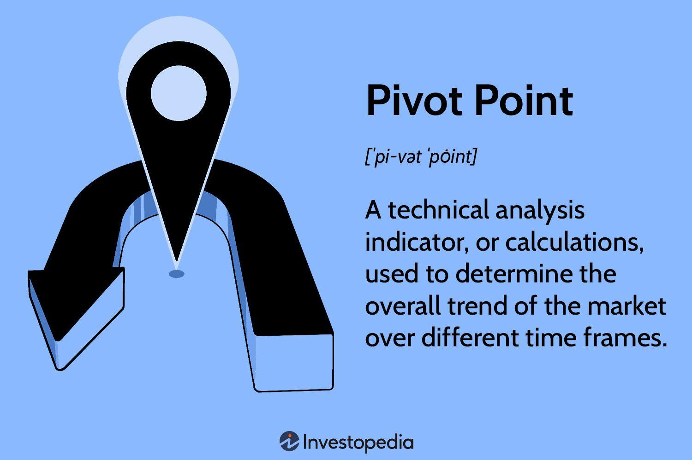

## Table of Contents

## What are pivot points in technical analysis?

Pivot points in technical analysis are used by traders to identify potential support and resistance levels in the market. They are calculated using the high, low, and closing prices of the previous trading period. Traders use these points to make decisions about entering or exiting trades, as they help predict where the price might move next.

These points are particularly popular in forex and stock trading. A pivot point itself is the average of the high, low, and close from the previous period. From this, additional levels of support and resistance are calculated, which can act as targets or warning signs for traders. When the price approaches these levels, traders watch closely for potential price reversals or breakouts.

Using pivot points can help traders gain an edge in the market by providing clear levels to watch. However, like all technical indicators, they should not be used in isolation. Combining pivot points with other forms of analysis, such as trend lines or moving averages, can improve their effectiveness and help traders make more informed decisions.

## How are pivot points calculated?

Pivot points are calculated using the high, low, and closing prices from the previous trading day. To find the main pivot point, you add the high, low, and close together, then divide by three. This gives you a single number that acts as the central pivot point for the next trading day.

From this main pivot point, you can calculate additional levels of support and resistance. The first level of support is found by multiplying the pivot point by two, then subtracting the high price from the previous day. The first level of resistance is calculated by multiplying the pivot point by two, then subtracting the low price from the previous day. These levels help traders see where the price might go next.

You can also calculate a second level of support and resistance if you want more detail. The second support level is found by subtracting the difference between the high and low of the previous day from the first support level. The second resistance level is found by adding that same difference to the first resistance level. These additional levels give traders more points to watch for potential price movements.

## What is the significance of pivot points in trading?

Pivot points are important in trading because they help traders see where the price might go next. They are calculated using the high, low, and closing prices from the last trading day. This gives traders a central pivot point and additional levels of support and resistance. When the price gets close to these levels, traders pay attention because the price might change direction or keep moving.

Traders use pivot points to make decisions about when to buy or sell. If the price goes above the pivot point, it might keep going up, so traders might want to buy. If the price goes below the pivot point, it might keep going down, so traders might want to sell. Pivot points are not perfect, so traders often use them with other tools to make better choices. By watching these levels, traders can try to make money by predicting where the price will go.

## Can you explain the different types of pivot points?

There are several types of pivot points that traders use. The most common type is the standard pivot point, which is calculated using the high, low, and closing prices from the previous trading day. This gives traders a central pivot point and additional levels of support and resistance. Another type is the Fibonacci pivot point, which uses Fibonacci numbers to find extra levels of support and resistance. This can give traders more detailed information about where the price might go.

Another type of pivot point is the Woodie's pivot point, which puts more weight on the closing price of the previous day. This can be useful if traders think the closing price is more important than the high and low prices. There's also the Camarilla pivot point, which uses a different formula to find many levels of support and resistance. Traders who use Camarilla pivots think these levels can predict price movements very well. Each type of pivot point has its own way of helping traders guess where the price might go next.

## How do traders use pivot points to make trading decisions?

Traders use pivot points to help them decide when to buy or sell. They look at the central pivot point, which is calculated from the high, low, and closing prices of the last trading day. If the price goes above this pivot point, traders might think the price will keep going up, so they might decide to buy. If the price goes below the pivot point, traders might think the price will keep going down, so they might decide to sell. They also watch the levels of support and resistance that come from the pivot point. If the price gets close to these levels, traders pay attention because the price might change direction or keep moving.

Pivot points are not perfect, so traders often use them with other tools to make better choices. They might look at trend lines, moving averages, or other indicators to see if they agree with what the pivot points are saying. By combining different tools, traders can feel more confident about their decisions. Watching pivot points and other indicators can help traders try to make money by predicting where the price will go next.

## What are support and resistance levels in relation to pivot points?

Support and resistance levels are important lines that traders watch when using pivot points. These levels are calculated from the central pivot point, which is found using the high, low, and closing prices from the last trading day. Support levels are below the pivot point and show where the price might stop falling and start going up again. Resistance levels are above the pivot point and show where the price might stop rising and start going down again.

When the price gets close to these support and resistance levels, traders pay close attention. If the price touches a support level and then starts going up, traders might decide to buy because they think the price will keep going up. If the price touches a resistance level and then starts going down, traders might decide to sell because they think the price will keep going down. By watching these levels, traders can make better guesses about where the price will go next and make their trading decisions based on that.

## How can pivot points be used in conjunction with other technical indicators?

Traders often use pivot points along with other technical indicators to make better trading decisions. One common way is to combine pivot points with moving averages. A moving average shows the average price over a certain period of time. If the price is above both the pivot point and the moving average, it might be a good time to buy because it suggests the price could keep going up. If the price is below both the pivot point and the moving average, it might be a good time to sell because it suggests the price could keep going down.

Another way to use pivot points is with trend lines. Trend lines are drawn on a chart to show the direction of the price movement. If the price is above the pivot point and following an upward trend line, traders might feel more confident about buying. If the price is below the pivot point and following a downward trend line, traders might feel more confident about selling. By using pivot points together with other indicators like moving averages and trend lines, traders can get a clearer picture of where the price might go next and make more informed trading decisions.

## What are the limitations of using pivot points in trading?

Pivot points can help traders guess where the price might go next, but they are not perfect. One problem is that they are based on past prices, so they might not work well if the market changes a lot. Also, pivot points work best in markets that move up and down a lot, not in markets that stay flat. If the market doesn't move much, the pivot points might not be very useful.

Another limitation is that pivot points should not be used alone. Traders need to use other tools like moving averages or trend lines to make better decisions. Relying only on pivot points can lead to mistakes because they don't tell the whole story about what the market is doing. By using pivot points with other indicators, traders can get a better idea of where the price might go, but they still need to be careful.

## How do pivot points adapt to different time frames in trading?

Pivot points can be used on different time frames, like daily, weekly, or even hourly charts. Traders choose the time frame based on how long they want to hold their trades. For short-term trading, like [day trading](/wiki/day-trading-spy), they might use hourly or 4-hour pivot points. For longer-term trading, like swing trading, they might use daily or weekly pivot points. The way you calculate pivot points stays the same no matter the time frame, but the levels will be different because they are based on the high, low, and closing prices of the chosen period.

Using pivot points on different time frames can help traders see both short-term and long-term trends. For example, a day trader might look at hourly pivot points to find quick trading opportunities, while also checking the daily pivot points to see if the overall trend supports their short-term trades. This can give them a better understanding of the market and help them make smarter trading decisions. By adapting pivot points to different time frames, traders can tailor their strategies to fit their trading style and goals.

## Can you discuss advanced techniques for using pivot points?

Traders can use advanced techniques with pivot points to make better trading decisions. One way is to use multiple time frames. For example, they might look at daily pivot points to see the big picture and then use hourly pivot points to find good times to buy or sell. This can help them see both the overall trend and short-term opportunities. Another technique is to combine pivot points with other indicators like the Relative Strength Index (RSI) or the Moving Average Convergence Divergence (MACD). If the price is near a pivot point and the RSI shows the market is overbought or oversold, it can give a stronger signal to buy or sell.

Another advanced technique is to use pivot point zones instead of single lines. Traders can draw a small area around each pivot point to account for small price movements. If the price stays within this zone, it might mean the market is unsure about which way to go. But if the price breaks out of the zone, it could be a strong sign that the price will keep moving in that direction. Traders can also use different types of pivot points, like Fibonacci or Woodie's pivots, to get more detailed information. By combining these advanced techniques, traders can get a better understanding of the market and make smarter trading decisions.

## How do pivot points perform in different market conditions?

Pivot points work differently in different market conditions. In markets that move a lot, like when prices go up and down quickly, pivot points can be very useful. Traders can use them to find good times to buy or sell because the price often bounces off the support and resistance levels. But in markets that don't move much, pivot points might not be as helpful. If the price stays flat, the levels might not mean much because the price doesn't hit them often.

In trending markets, where the price is going up or down over time, pivot points can help traders see if the trend might change. If the price keeps going above the pivot point in an uptrend, it might mean the trend will keep going. If the price keeps going below the pivot point in a downtrend, it might mean the trend will keep going down. But pivot points are not perfect, so traders need to use other tools too. By watching pivot points and other indicators, traders can make better guesses about where the price will go next.

## What are some common mistakes traders make when using pivot points?

One common mistake traders make with pivot points is relying on them too much. Pivot points are just one tool, and they don't tell the whole story about what the market is doing. If traders only use pivot points and ignore other indicators like moving averages or trend lines, they might make bad decisions. It's important to use pivot points with other tools to get a better understanding of the market.

Another mistake is not adjusting pivot points for different time frames. Traders might use daily pivot points for short-term trading, which can lead to missing out on good opportunities or getting the timing wrong. It's better to use pivot points that match the time frame of the trade, like hourly pivots for day trading or weekly pivots for longer-term trades. By choosing the right time frame, traders can make more accurate predictions about where the price might go next.

## What are Pivot Points and How to Understand Them?

Pivot points are a fundamental concept in technical analysis, providing traders with predefined levels that are calculated based on the previous trading session's data, specifically the high, low, and close prices. These levels serve as critical reference points for evaluating market sentiment and anticipating potential future market movements.

The primary pivot point (P) is calculated as:

$$
P = \frac{(\text{High} + \text{Low} + \text{Close})}{3}
$$

This central pivot level acts as a benchmark, from which additional support and resistance levels are derived. Generally, the first support (S1) and resistance (R1) levels are calculated using the following formulas:

$$
S1 = 2 \times P - \text{High}
$$

$$
R1 = 2 \times P - \text{Low}
$$

Subsequent support (S2) and resistance (R2) levels can also be determined using:

$$
S2 = P - (\text{High} - \text{Low})
$$

$$
R2 = P + (\text{High} - \text{Low})
$$

These levels are instrumental in helping traders gauge the market's overall sentiment — whether it is predominantly bullish or bearish. In practice, when the market is trading above the pivot point, it is often considered a bullish indicator, suggesting that market sentiment is upward trending. Conversely, trading below the pivot point is typically interpreted as a bearish signal, suggesting potential downward movement.

Pivot points serve another crucial role by forecasting future support and resistance levels. Traders utilize these derived levels to identify potential zones where the market may change direction. For example, if prices rise towards a resistance level derived from a pivot point, traders might anticipate a reversal or slowdown in the upward movement at that resistance level.

In summary, pivot points are vital for interpreting market dynamics and gauging likely price reversals. They provide traders with a straightforward yet powerful method to establish a market framework based on historical price data, aiding in making informed trading decisions.

## What are the types of pivot points?

Pivot points have expanded beyond their basic form to include a variety of calculation methods, most notably Fibonacci, Woodie's, Camarilla, and DeMark's pivot points. Each of these types offers unique advantages and is suited to different trading styles and market conditions, thus providing traders with a range of tools tailored to their individual strategies.

**Fibonacci Pivot Points** leverage the Fibonacci sequence to determine support and resistance levels. They are derived by calculating the pivot point using the standard formula: 

$$
\text{Pivot Point (PP)} = \frac{\text{High} + \text{Low} + \text{Close}}{3}
$$

From the pivot point, Fibonacci percentages such as 38.2%, 61.8%, and 100% are applied to the range between the high and low prices of the previous trading session. This technique is based on the recognition of geometric patterns and the belief that these ratios capture the essence of market movement.

**Woodie's Pivot Points**, unlike the traditional method, place greater emphasis on the close price of the previous period. The formula used is:

$$
\text{Pivot Point (PP)} = \frac{\text{High} + \text{Low} + 2 \times \text{Close}}{4}
$$

This approach may be more suitable for shorter-term trading strategies where the closing price carries more significance.

**Camarilla Pivot Points** focus on a set of eight levels calculated using the previous day's market data. The primary formula revolves around multiplying the difference between the high and low prices by a fixed multiplier, i.e., the Camarilla constant (0.0916), and then adding or subtracting this product from the close price. This results in precise intraday support and resistance levels and assists traders in capturing reversals in a more volatile setting.

**DeMark's Pivot Points** differ significantly by using only the most recent period’s high, low, and close to determine one key level. The calculation varies depending on the relation between the close and the open. If the close is lower than the open:

$$
\text{X} = \text{High} + 2 \times \text{Low} + \text{Close}
$$

Alternatively, if the close is higher than the open, or they are equal, the formulas adjust accordingly. DeMark's pivot points are particularly useful for traders looking to grasp the short-term price patterns and adjust strategies rapidly based on the latest data.

Selecting the appropriate type of pivot points depends largely on a trader's strategy and the prevailing market environment. While Fibonacci pivot points often align well with traders looking for deeper insights into support and resistance levels based on historical patterns, Woodie's and Camarilla pivot points may benefit those focused on intraday dynamics. DeMark's approach, on the other hand, is particularly favorable for adapting to real-time changes. Thus, an understanding of these variants can significantly enhance trading precision and decision-making processes.

## What is the Role of Pivot Points in Technical Analysis?

Technical analysis with pivot points provides traders with a quantitative method for assessing market trends based on historical data. Pivot points serve as reference levels derived from the prior trading session's high, low, and close prices, offering a framework for predicting potential changes in price direction.

Pivot points are particularly valuable in chart analysis. They supply a static set of potential inflection points for each trading period, helping identify zones where the price might encounter support or resistance. These points are calculated using a simple average formula:

$$
\text{Pivot Point (PP)} = \frac{\text{High} + \text{Low} + \text{Close}}{3}
$$

From the primary Pivot Point, additional levels such as support and resistance can be calculated, further guiding traders in making informed decisions. For example, the first level of resistance (R1) and support (S1) can be computed as follows:

$$
\text{R1} = (2 \times PP) - \text{Low}
$$
$$
\text{S1} = (2 \times PP) - \text{High}
$$

In technical analysis, pivot points are frequently combined with other indicators, such as moving averages or Bollinger Bands, to formulate a comprehensive trading strategy. This multi-indicator approach enhances the reliability of trade signals and reduces the likelihood of false alerts. By integrating these additional analytical tools, traders are better equipped to interpret complex market dynamics, fostering a robust strategy to navigate varied market conditions.

Overall, pivot points provide a dependable set of levels that help in identifying where the market might experience a shift, making them an essential component of technical trading strategies.

## References & Further Reading

[1]: ["Technical Analysis of the Financial Markets: A Comprehensive Guide to Trading Methods and Applications"](https://www.amazon.com/Technical-Analysis-Financial-Markets-Comprehensive/dp/0735200661) by John J. Murphy

[2]: ["Pivot Points in Technical Analysis"](https://www.investopedia.com/terms/p/pivotpoint.asp) by Investopedia

[3]: ["Profiting from Pivot Points Book Review"](https://www.amazon.com/Secrets-Pivot-Boss-Revealing-Profiting/dp/B0C1VTNTT9) by John L. Person

[4]: ["Algorithmic Trading: Winning Strategies and Their Rationale"](https://www.wiley.com/en-us/Algorithmic+Trading%3A+Winning+Strategies+and+Their+Rationale-p-9781118460146) by Ernie Chan

[5]: ["Quantitative Technical Analysis: An Integrated Approach to Trading System Development and Trading Management"](https://books.google.com/books/about/Quantitative_Technical_Analysis.html?id=LTJJngEACAAJ) by Howard B. Bandy