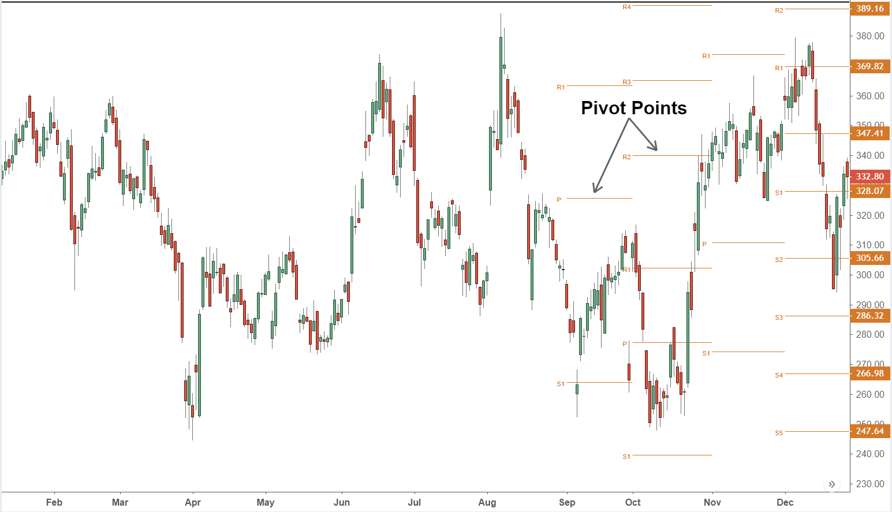

Pivot points are a popular tool used in technical analysis for determining potential turning points in financial markets. Originating from the pits of stock and commodity exchanges, pivot points have become widely adopted by traders due to their ability to predict movement based on historical price data. These points serve as a valuable guide for traders by indicating potential levels of support and resistance, which can help identify market sentiment as either bullish or bearish. The use of pivot points extends beyond the basic calculation of these levels—they provide traders with insights into the probable direction of price movements and help in strategizing entry and exit points in trades.

The methodology behind pivot points is rooted in simplicity, calculating potential turning points by using key price levels from the previous trading session, specifically the high, low, and closing prices. The central pivot point is typically calculated as:



$$
\text{Pivot Point (PP)} = \frac{\text{High} + \text{Low} + \text{Close}}{3}
$$

Additional support and resistance levels are then derived from the central pivot point, aiding traders in understanding where price may encounter barriers as it moves. This foresight into market dynamics is vital for both technical analysis and algorithmic trading, as it allows for constructing automatic systems that can help traders conduct market operations efficiently.

In this article, we will explore how pivot points are integrated into trading strategies, underscoring their importance in evaluating market conditions and establishing trading algorithms. Pivot points remain fundamental in technical analysis due to their ability to distill actionable insights from historical price data, making them indispensable for traders across all experience levels.

## Table of Contents

## Understanding Pivot Points

Pivot points are a fundamental concept in technical analysis, providing traders with predefined levels that are calculated based on the previous trading session's data, specifically the high, low, and close prices. These levels serve as critical reference points for evaluating market sentiment and anticipating potential future market movements.

The primary pivot point (P) is calculated as:

$$
P = \frac{(\text{High} + \text{Low} + \text{Close})}{3}
$$

This central pivot level acts as a benchmark, from which additional support and resistance levels are derived. Generally, the first support (S1) and resistance (R1) levels are calculated using the following formulas:

$$
S1 = 2 \times P - \text{High}
$$

$$
R1 = 2 \times P - \text{Low}
$$

Subsequent support (S2) and resistance (R2) levels can also be determined using:

$$
S2 = P - (\text{High} - \text{Low})
$$

$$
R2 = P + (\text{High} - \text{Low})
$$

These levels are instrumental in helping traders gauge the market's overall sentiment — whether it is predominantly bullish or bearish. In practice, when the market is trading above the pivot point, it is often considered a bullish indicator, suggesting that market sentiment is upward trending. Conversely, trading below the pivot point is typically interpreted as a bearish signal, suggesting potential downward movement.

Pivot points serve another crucial role by forecasting future support and resistance levels. Traders utilize these derived levels to identify potential zones where the market may change direction. For example, if prices rise towards a resistance level derived from a pivot point, traders might anticipate a reversal or slowdown in the upward movement at that resistance level.

In summary, pivot points are vital for interpreting market dynamics and gauging likely price reversals. They provide traders with a straightforward yet powerful method to establish a market framework based on historical price data, aiding in making informed trading decisions.

## Types of Pivot Points

Pivot points have expanded beyond their basic form to include a variety of calculation methods, most notably Fibonacci, Woodie's, Camarilla, and DeMark's pivot points. Each of these types offers unique advantages and is suited to different trading styles and market conditions, thus providing traders with a range of tools tailored to their individual strategies.

**Fibonacci Pivot Points** leverage the Fibonacci sequence to determine support and resistance levels. They are derived by calculating the pivot point using the standard formula: 

$$
\text{Pivot Point (PP)} = \frac{\text{High} + \text{Low} + \text{Close}}{3}
$$

From the pivot point, Fibonacci percentages such as 38.2%, 61.8%, and 100% are applied to the range between the high and low prices of the previous trading session. This technique is based on the recognition of geometric patterns and the belief that these ratios capture the essence of market movement.

**Woodie's Pivot Points**, unlike the traditional method, place greater emphasis on the close price of the previous period. The formula used is:

$$
\text{Pivot Point (PP)} = \frac{\text{High} + \text{Low} + 2 \times \text{Close}}{4}
$$

This approach may be more suitable for shorter-term trading strategies where the closing price carries more significance.

**Camarilla Pivot Points** focus on a set of eight levels calculated using the previous day's market data. The primary formula revolves around multiplying the difference between the high and low prices by a fixed multiplier, i.e., the Camarilla constant (0.0916), and then adding or subtracting this product from the close price. This results in precise intraday support and resistance levels and assists traders in capturing reversals in a more volatile setting.

**DeMark's Pivot Points** differ significantly by using only the most recent period’s high, low, and close to determine one key level. The calculation varies depending on the relation between the close and the open. If the close is lower than the open:

$$
\text{X} = \text{High} + 2 \times \text{Low} + \text{Close}
$$

Alternatively, if the close is higher than the open, or they are equal, the formulas adjust accordingly. DeMark's pivot points are particularly useful for traders looking to grasp the short-term price patterns and adjust strategies rapidly based on the latest data.

Selecting the appropriate type of pivot points depends largely on a trader's strategy and the prevailing market environment. While Fibonacci pivot points often align well with traders looking for deeper insights into support and resistance levels based on historical patterns, Woodie's and Camarilla pivot points may benefit those focused on intraday dynamics. DeMark's approach, on the other hand, is particularly favorable for adapting to real-time changes. Thus, an understanding of these variants can significantly enhance trading precision and decision-making processes.

## Using Pivot Points in Trading Strategies

Pivot points are instrumental in identifying entry and [exit](/wiki/exit-strategy) points for trades by calculating support and resistance levels. These levels are derived from the previous day's high, low, and close prices, providing traders with a framework to predict potential price movements. By using pivot points, traders can gain insights into market trends and make informed decisions about when to enter or exit trades. 

One of the main advantages of pivot points is their adaptability to various trading timeframes. This flexibility enables traders to apply pivot points to multiple trading strategies, including [day trading](/wiki/day-trading-spy), swing trading, and longer-term investments. For instance, day traders might utilize daily pivot levels to capture intraday price movements, while swing traders could look at weekly or monthly pivot points to guide medium-term trade decisions.

Algorithmic trading systems also leverage pivot points due to their precision and reduced susceptibility to emotional biases that often affect human traders. These systems automate decisions to enter or exit trades based on predetermined pivot levels. The incorporation of pivot points into algorithmic strategies involves programming algorithms that systematically monitor price levels compared to pivot points and execute trades when specific conditions are met.

The calculation of a standard pivot point (PP) can be represented as:
$$
\text{PP} = \frac{(\text{High} + \text{Low} + \text{Close})}{3}
$$

Based on this primary pivot point, resistance and support levels can also be calculated:
- First Resistance (R1) = (2 × PP) - Low
- First Support (S1) = (2 × PP) - High
- Second Resistance (R2) = PP + (High - Low)
- Second Support (S2) = PP - (High - Low)

This predictive potential of pivot points, rendered in these calculations, is particularly advantageous for automated systems as it allows them to perform consistent strategy evaluations without continual human oversight. Integrating pivot points within trading algorithms not only improves consistency but also enhances the reproducibility of trading actions in varying market conditions.

## The Role of Pivot Points in Technical Analysis

Technical analysis with pivot points provides traders with a quantitative method for assessing market trends based on historical data. Pivot points serve as reference levels derived from the prior trading session's high, low, and close prices, offering a framework for predicting potential changes in price direction.

Pivot points are particularly valuable in chart analysis. They supply a static set of potential inflection points for each trading period, helping identify zones where the price might encounter support or resistance. These points are calculated using a simple average formula:

$$
\text{Pivot Point (PP)} = \frac{\text{High} + \text{Low} + \text{Close}}{3}
$$

From the primary Pivot Point, additional levels such as support and resistance can be calculated, further guiding traders in making informed decisions. For example, the first level of resistance (R1) and support (S1) can be computed as follows:

$$
\text{R1} = (2 \times PP) - \text{Low}
$$
$$
\text{S1} = (2 \times PP) - \text{High}
$$

In technical analysis, pivot points are frequently combined with other indicators, such as moving averages or Bollinger Bands, to formulate a comprehensive trading strategy. This multi-indicator approach enhances the reliability of trade signals and reduces the likelihood of false alerts. By integrating these additional analytical tools, traders are better equipped to interpret complex market dynamics, fostering a robust strategy to navigate varied market conditions.

Overall, pivot points provide a dependable set of levels that help in identifying where the market might experience a shift, making them an essential component of technical trading strategies.

## Algorithmic Trading and Pivot Points

Pivot points serve as a fundamental component in [algorithmic trading](/wiki/algorithmic-trading) strategies because they are derived from mathematical calculations and historical price data. Their structured nature makes them ideal for automated systems, allowing for efficient market analysis and execution of trades without the interference of human emotions and biases.

The primary utility of pivot points within algorithmic trading lies in their ability to signal potential buy and sell opportunities. By identifying these predetermined levels, trading algorithms can systematically react to market movements. This process involves programming the algorithm to recognize when prices approach or breach pivot levels, triggering buy or sell decisions based on predefined scripts. For instance, a simple algorithm might be defined in Python as follows:

```python
def pivot_point(high, low, close):
    return (high + low + close) / 3

def identify_signal(current_price, pivot, support, resistance):
    if current_price < support:
        return "Buy"
    elif current_price > resistance:
        return "Sell"
    else:
        return "Hold"

# Example usage
high_price = 100
low_price = 90
close_price = 95
current_price = 92

pivot = pivot_point(high_price, low_price, close_price)
support = pivot - (high_price - low_price)
resistance = pivot + (high_price - low_price)

signal = identify_signal(current_price, pivot, support, resistance)
print(signal)
```

In this example, pivot points, support, and resistance levels are calculated using simple arithmetic, enabling the algorithm to decide to buy, sell, or hold a position based on the current price's relation to these calculated levels.

Furthermore, integrating pivot points into trading algorithms enhances consistency in execution. The pre-calculated nature of pivot levels ensures that decision-making processes are faster and less prone to error compared to manual trading. Algorithms operate on logical guidelines set by traders, thereby eliminating the risk of human emotion adversely affecting trading outcomes. This increases the potential for stable returns over time.

Additionally, algorithms can incorporate various types of pivot points to adapt to different trading environments. This adaptability allows traders to optimize their strategies by choosing the pivot point method that best aligns with the current market conditions, thus creating a robust trading system that manages risk effectively.

In summary, the inclusion of pivot points in algorithmic trading provides a structured and objective framework for generating trading signals and executing trades. This ensures that decision-making processes are both systematic and efficient, leveraging the mathematical foundation of pivot points for enhanced consistency and reliability in trading outcomes.

## Limitations of Pivot Points

Pivot points, as a widely utilized tool in technical analysis, provide traders with essential insights into potential price levels where markets may reverse direction. However, they are not without their limitations. One of the primary challenges with pivot points is their inability to account for sudden market changes triggered by unexpected news or economic announcements. These unpredictable events can cause significant [volatility](/wiki/volatility-trading-strategies), leading to price movements that swiftly bypass predefined pivot levels. Consequently, traders relying solely on pivot points might encounter losses during periods of high market sensitivity.

Furthermore, while pivot points offer a structured framework for identifying support and resistance levels, they are not foolproof and can generate false signals, especially in highly volatile or trending markets. It is crucial for traders to complement pivot points with other technical indicators, such as moving averages or [volume](/wiki/volume-trading-strategy) analysis, to enhance the accuracy of their market predictions. This multi-faceted approach can help in filtering out noise and improving decision-making.

Over-reliance on pivot points without integrating a robust risk management strategy can also result in missed trading opportunities or unexpected losses. For example, if a trader uses pivot points to set stop-loss and take-profit levels, the absence of consideration for dynamic market contexts might lead to premature exits or entries. Therefore, it is imperative to adapt these levels actively based on current market dynamics rather than adhering strictly to static calculations.

Incorporating pivot points into an overarching trading strategy also requires careful evaluation of their effectiveness in different market conditions. Traders should regularly back-test pivot point strategies with historical data to understand their performance under various scenarios. This approach not only aids in fine-tuning entry and exit criteria but also in establishing realistic expectations regarding the potential outcomes of trades based on pivot points.

Python code snippet for back-testing a pivot point strategy:

```python
import pandas as pd
import numpy as np

# Load historical market data
data = pd.read_csv('historical_data.csv')

# Calculate pivot points
data['PP'] = (data['High'] + data['Low'] + data['Close']) / 3
data['R1'] = 2 * data['PP'] - data['Low']
data['S1'] = 2 * data['PP'] - data['High']

# Define a simple back-testing strategy
data['Position'] = np.where(data['Close'] > data['R1'], 1, 0)
data['Position'] = np.where(data['Close'] < data['S1'], -1, data['Position'])

# Calculate returns from the strategy
data['Market Return'] = data['Close'].pct_change()
data['Strategy Return'] = data['Position'].shift(1) * data['Market Return']

# Output strategy performance
performance = data[['Market Return', 'Strategy Return']].cumsum().apply(np.exp)
print(performance.tail())
```

This example demonstrates a basic framework for evaluating the efficacy of a pivot point approach, highlighting areas where pivot points might excel or fall short. Traders should remain vigilant, pairing pivot points with comprehensive analytical tools and robust risk management systems to mitigate these inherent limitations.

## Conclusion

Pivot points remain a cornerstone of technical analysis, offering simplicity and actionable insights for traders at all levels. Derived from the previous day's high, low, and close prices, these points function as significant indicators of market sentiment, enabling traders to assess potential price movements. By incorporating pivot points into trading strategies, traders can enhance their methodology with a reliable reference framework that aids in identifying critical support and resistance levels. This accuracy often translates into improved decision-making processes regarding entry and exit points in trades. 

Furthermore, pivot points are adaptable to various trading styles, including day trading, swing trading, and algorithmic trading systems, where they provide a mathematically grounded basis for automation. However, it is crucial to combine pivot points with a broader set of analysis techniques, such as moving averages, stochastic oscillators, or Fibonacci retracement levels, to achieve a robust and adaptive trading strategy. This combination helps mitigate the limitations of pivot points, such as their inability to account for sudden market changes due to unforeseen news events or economic data releases. Hence, successful traders often employ a multi-faceted approach, leveraging the simplicity of pivot points alongside other technical indicators to maximize their trading efficacy.

## References & Further Reading

[1]: ["Technical Analysis of the Financial Markets: A Comprehensive Guide to Trading Methods and Applications"](https://www.amazon.com/Technical-Analysis-Financial-Markets-Comprehensive/dp/0735200661) by John J. Murphy

[2]: ["Pivot Points in Technical Analysis"](https://www.investopedia.com/terms/p/pivotpoint.asp) by Investopedia

[3]: ["Profiting from Pivot Points Book Review"](https://www.amazon.com/Secrets-Pivot-Boss-Revealing-Profiting/dp/B0C1VTNTT9) by John L. Person

[4]: ["Algorithmic Trading: Winning Strategies and Their Rationale"](https://www.wiley.com/en-us/Algorithmic+Trading%3A+Winning+Strategies+and+Their+Rationale-p-9781118460146) by Ernie Chan

[5]: ["Quantitative Technical Analysis: An Integrated Approach to Trading System Development and Trading Management"](https://books.google.com/books/about/Quantitative_Technical_Analysis.html?id=LTJJngEACAAJ) by Howard B. Bandy