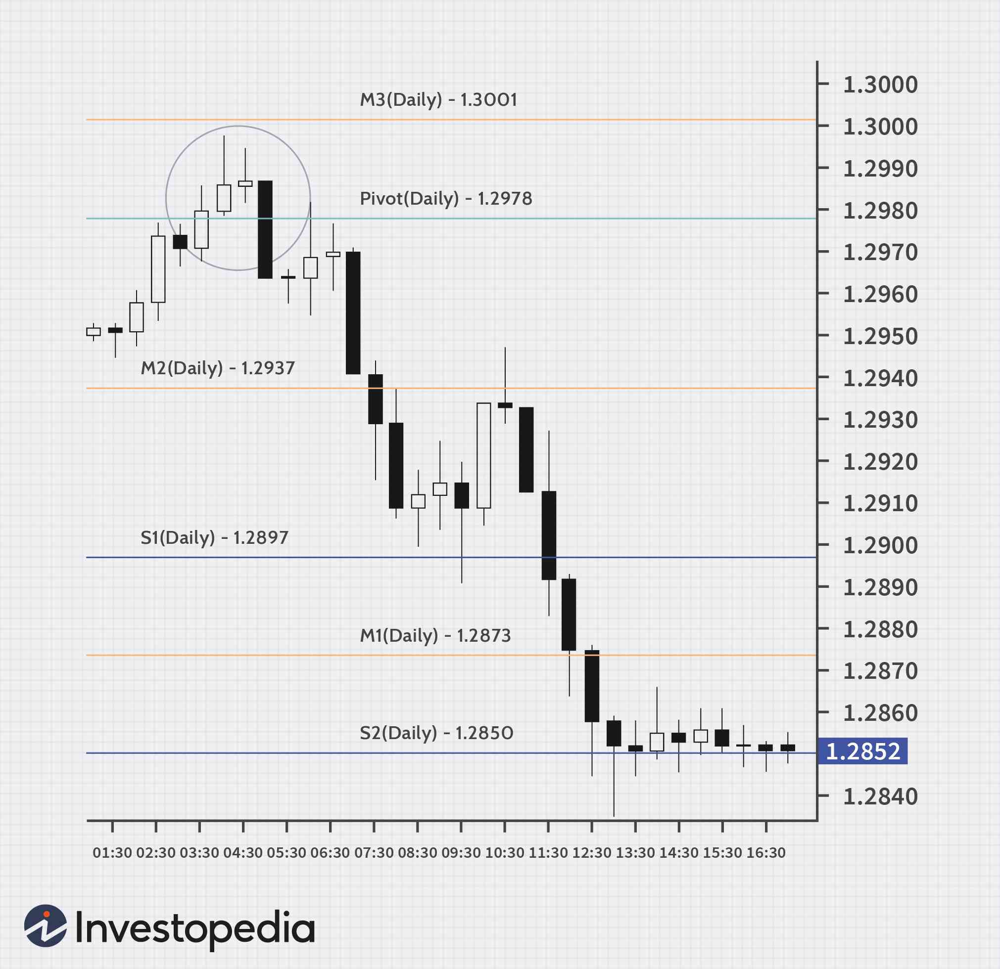

## Table of Contents

## What is a pivot point in forex trading?

A pivot point in forex trading is a technical indicator used by traders to determine potential support and resistance levels. It is calculated using the high, low, and closing prices of the previous trading day. The main pivot point is the average of these three values, and from this, additional levels of support and resistance are derived. Traders use these levels to make decisions about entering or exiting trades, as they indicate where the price might reverse or break through.

When the price of a currency pair approaches a pivot point, traders watch closely to see if it will act as a barrier or if the price will move past it. If the price stays below the pivot point, it might be seen as a bearish signal, suggesting that the price could continue to fall. On the other hand, if the price moves above the pivot point, it could be seen as a bullish signal, indicating that the price might keep rising. By using pivot points, traders can better understand market trends and make more informed trading decisions.

## How are pivot points calculated in forex markets?

Pivot points in forex markets are calculated using the high, low, and closing prices from the previous trading day. To find the main pivot point, you add the high, low, and close together, then divide by three. This gives you a single number that acts as the central pivot point for the next trading day.

From this main pivot point, you can then calculate additional levels of support and resistance. The first level of support is found by multiplying the pivot point by two, then subtracting the high price from the previous day. The first level of resistance is calculated by multiplying the pivot point by two, then subtracting the low price from the previous day. These levels help traders see where the price might turn around or keep going.

Using these simple calculations, traders can quickly figure out where important price levels might be. This helps them decide when to buy or sell currencies. By watching how the price moves around these pivot points, traders can make better choices about their trades.

## What are the different types of pivot points used in forex trading?

In forex trading, there are several types of pivot points that traders use. The most common type is the Standard Pivot Point, which is calculated using the high, low, and closing prices from the previous trading day. This method is simple and widely used because it helps traders find key levels where the price might change direction. Another type is the Fibonacci Pivot Point, which adds Fibonacci retracement levels to the standard pivot calculation. This method uses ratios like 38.2%, 61.8%, and 100% to find more detailed support and resistance levels, which can be helpful for traders who like to use Fibonacci analysis in their trading.

There's also the Woodie Pivot Point, which gives more weight to the closing price of the previous day. This type of pivot point can be useful for traders who think the closing price is more important than the high or low. Lastly, the Camarilla Pivot Point is another type that uses a different formula to calculate even more levels of support and resistance. This method is often used by day traders because it provides many price levels to watch, which can help them make quick trading decisions. Each type of pivot point has its own way of helping traders understand where the price might go next.

## How can beginners use pivot points to identify potential support and resistance levels?

Beginners can use pivot points to identify potential support and resistance levels by first calculating the main pivot point for the day. This is done by adding the high, low, and closing prices from the previous trading day and then dividing by three. Once they have this main pivot point, they can find the first level of support by multiplying the pivot point by two and then subtracting the high price from the previous day. The first level of resistance is found by multiplying the pivot point by two and then subtracting the low price from the previous day. By plotting these levels on a chart, beginners can see where the price might stop or change direction.

After finding these levels, beginners should watch how the price moves around them. If the price stays below the main pivot point, it might be a sign that the market is bearish, meaning prices could go down. If the price goes above the main pivot point, it could be a bullish sign, suggesting that prices might go up. Beginners can use these signals to decide when to buy or sell. By paying attention to these pivot points, beginners can get a better understanding of where the price might go next and make more informed trading decisions.

## What are some common pivot point strategies for entering and exiting trades?

One common pivot point strategy for entering trades is to wait for the price to bounce off a support or resistance level. If the price hits a support level and then starts to go up, a trader might see this as a good time to buy. They think the price will keep going up after bouncing off the support. On the other hand, if the price hits a resistance level and then starts to go down, a trader might see this as a good time to sell. They think the price will keep going down after hitting the resistance. By watching how the price reacts to these levels, traders can decide when to enter a trade.

Another strategy for exiting trades involves using pivot points to set stop-loss and take-profit levels. A stop-loss is a price level where a trader will sell to avoid losing too much money. A take-profit is a price level where a trader will sell to lock in their profits. Traders can set their stop-loss just below a support level if they are buying, or just above a resistance level if they are selling. For take-profit, they can aim for the next resistance level if they are buying, or the next support level if they are selling. By using pivot points in this way, traders can manage their trades more effectively and reduce their risk.

A third strategy involves trading breakouts. If the price breaks through a resistance level, it might be a sign that the price will keep going up. Traders might buy when they see this [breakout](/wiki/breakout-trading), hoping to ride the upward trend. If the price breaks through a support level, it might be a sign that the price will keep going down. Traders might sell when they see this breakout, hoping to benefit from the downward trend. By watching for these breakouts at pivot point levels, traders can find good opportunities to enter and exit trades.

## How do pivot points integrate with other technical indicators in forex trading?

Pivot points can work well with other technical indicators to help forex traders make better choices. One common way to use them together is with moving averages. Traders might look at the moving average to see the overall trend of the market. If the price is above the moving average, it could mean the market is going up. If the price is below it, the market might be going down. By using pivot points along with the moving average, traders can see where the price might turn around or keep going in the same direction. This can help them decide when to buy or sell.

Another way to use pivot points with other indicators is with the Relative Strength Index (RSI). The RSI helps traders see if a currency pair is overbought or oversold. If the RSI is above 70, it might mean the price has gone up too much and could go down soon. If the RSI is below 30, it might mean the price has gone down too much and could go up soon. By looking at the RSI along with pivot points, traders can get a better idea of when the price might change direction. This can help them make more informed decisions about entering and exiting trades.

## What are the advantages of using pivot points in a volatile forex market?

Using pivot points in a volatile forex market can help traders a lot. They give clear levels of support and resistance that can guide traders on where the price might turn around or keep going. In a market that moves quickly and changes a lot, these levels can be very useful. They help traders make quick decisions about when to buy or sell. By watching how the price moves around these pivot points, traders can spot good chances to enter or exit trades, even when the market is jumping around.

Another big advantage of pivot points in a volatile market is that they are easy to calculate and use. Traders don't need fancy tools or complicated math to find these levels. They just need the high, low, and closing prices from the last trading day. This simplicity is great in a fast-moving market where traders need to act fast. Plus, pivot points can work well with other simple tools like moving averages or the RSI, giving traders more ways to understand the market and make smart choices, even when things are changing quickly.

## How can intermediate traders adjust pivot point strategies based on market conditions?

Intermediate traders can adjust their pivot point strategies by paying attention to how the market is moving. If the market is trending strongly, they might want to focus on trading breakouts. When the price breaks through a resistance level, it could be a good time to buy, hoping the price will keep going up. If the price breaks through a support level, it might be a good time to sell, hoping the price will keep going down. By watching for these breakouts at pivot point levels, traders can find good opportunities to enter and exit trades based on the strength of the market trend.

In a choppy or sideways market, intermediate traders might want to focus on trading bounces off support and resistance levels. If the price hits a support level and then starts to go up, it could be a good time to buy, expecting the price to bounce back up. If the price hits a resistance level and then starts to go down, it could be a good time to sell, expecting the price to bounce back down. By adjusting their strategies to fit the current market conditions, intermediate traders can use pivot points more effectively and make better trading decisions.

## What are the limitations and potential pitfalls of relying on pivot points?

Relying on pivot points can have some limitations. One big problem is that pivot points are based on past prices, so they might not always predict where the price will go next. If the market is moving a lot or if big news comes out, the price might not follow the pivot points. Also, lots of traders use pivot points, so if everyone is watching the same levels, the price might move in ways you don't expect. This can make it hard to use pivot points all by themselves to make good trading decisions.

Another pitfall is that pivot points can give false signals. Sometimes the price might look like it's going to bounce off a support or resistance level, but then it keeps going. This can trick traders into buying or selling at the wrong time. Also, pivot points don't tell you everything about the market. They don't show you things like how much people are buying or selling, or what the overall mood of the market is. So, it's important for traders to use pivot points along with other tools and to always be careful when making decisions based on them.

## How can advanced traders use multiple time frame pivot analysis for better trade decisions?

Advanced traders can use multiple time frame pivot analysis to get a better view of the market. They look at pivot points on different time frames, like daily, hourly, and even 15-minute charts. By doing this, they can see where the big trends are going on the longer time frames and where the smaller moves are happening on the shorter time frames. This helps them find the best times to enter and exit trades. For example, if the daily chart shows a strong resistance level and the hourly chart shows the price getting close to that level, a trader might decide to sell when the price hits that resistance on the hourly chart.

Using multiple time frames also helps traders confirm their trading signals. If a pivot point on a shorter time frame lines up with one on a longer time frame, it can make the signal stronger. This can give traders more confidence in their trades. For instance, if a support level on the 15-minute chart matches a support level on the daily chart, it might be a good time to buy. By looking at pivot points across different time frames, advanced traders can make more informed decisions and improve their chances of making successful trades.

## What role do pivot points play in algorithmic forex trading strategies?

In algorithmic forex trading, pivot points are important because they help computers find good times to buy or sell currencies. These computers use math to calculate pivot points from the high, low, and closing prices of the last trading day. Then, they use these points to decide when to enter or exit trades. For example, if the price hits a support level and starts to go up, the computer might buy, thinking the price will keep going up. If the price hits a resistance level and starts to go down, the computer might sell, thinking the price will keep going down. By using pivot points, the computer can make quick decisions based on clear levels in the market.

Pivot points also help [algorithmic trading](/wiki/algorithmic-trading) systems work better with other tools. For instance, a computer might use pivot points along with moving averages to see the overall trend of the market. If the price is above the moving average and hits a pivot point, the computer might see it as a strong signal to buy. Or, it might use the Relative Strength Index (RSI) to check if the market is overbought or oversold. If the RSI shows the market is overbought and the price hits a resistance level, the computer might decide to sell. By combining pivot points with other indicators, algorithmic trading systems can make smarter choices and improve their trading results.

## How can expert traders combine pivot points with fundamental analysis for a comprehensive trading approach?

Expert traders can use pivot points along with [fundamental analysis](/wiki/fundamental-analysis) to get a full picture of the market. Pivot points help traders see where the price might turn around or keep going based on past prices. Fundamental analysis, on the other hand, looks at things like economic news, interest rates, and big events that can move the market. By using both, traders can understand not just where the price might go next, but also why it might go there. For example, if a country's central bank raises interest rates, the currency might go up. If the pivot points show a strong support level near where the price is now, a trader might feel more confident about buying that currency.

Combining pivot points with fundamental analysis can help traders make better decisions. If the news says a country's economy is doing well, traders might expect the currency to go up. If the pivot points show a resistance level that the price is close to breaking through, this could be a good time to buy. On the other hand, if bad news comes out and the pivot points show the price hitting a support level, traders might decide to sell before the price goes down more. By looking at both the technical levels from pivot points and the bigger picture from fundamental analysis, expert traders can make smarter trades and manage their risks better.

## What are Pivot Points and how do we understand them?

Pivot points are technical indicators prominently employed by traders to gauge the overarching trend of the market across diverse time frames. Historically, their use was predominantly associated with floor traders in the equities and futures exchanges. However, their utility has been effectively transposed to the forex market, becoming an essential component for many currency traders.

These points are calculated based on a currency pair's high, low, and closing prices from a specific period, usually the previous trading session. A standard pivot point (P) is calculated as follows:

$$

P = \frac{{\text{High} + \text{Low} + \text{Close}}}{3}
$$

In addition to the central pivot point, traders use secondary levels known as support and resistance levels to anticipate potential market reactions. These include:

- **First level of support (S1):**
  \[ 
  S1 = (2 \times P) - \text{High}

$$

- **First level of resistance (R1):**
  \[ 
  R1 = (2 \times P) - \text{Low}

$$

Additional levels, such as the second and third levels of support (S2, S3) and resistance (R2, R3), can also be calculated to furnish further granularity:

- **Second level of support (S2):**
  \[ 
  S2 = P - (\text{High} - \text{Low})

$$

- **Second level of resistance (R2):**
  \[ 
  R2 = P + (\text{High} - \text{Low})

$$

These calculated levels provide a structural framework on a price chart, enabling traders to predict potential price movements and recognize possible changes in market direction. When the market is above the central pivot point, it is considered bullish, whereas below suggests bearish conditions.

By setting these reference points, traders can identify potential entry and [exit](/wiki/exit-strategy) levels with increased precision. Pivot points serve as indicators of potential market reversals or continuations, offering traders the means to capitalize on market dynamics with greater clarity. Hence, these technical indicators act as predictive markers in traders' decision-making processes, underpinning strategies that seek to exploit market [volatility](/wiki/volatility-trading-strategies) and trend shifts.

## How do you calculate pivot points?

Calculating pivot points involves a straightforward process that begins with determining the central pivot point, which serves as a foundational element for identifying potential market movements. The central pivot point is calculated by taking the arithmetic average of the high, low, and closing prices from the previous trading session. The formula is as follows:

$$
\text{Pivot Point (PP)} = \frac{(\text{High} + \text{Low} + \text{Close})}{3}
$$

Using this central pivot point, traders can then derive additional levels known as support and resistance, which guide potential entry and exit points. These levels are calculated as follows:

- **First Resistance (R1) and First Support (S1):**

$$
R1 = 2 \times \text{PP} - \text{Low}
$$

$$
S1 = 2 \times \text{PP} - \text{High}
$$

- **Second Resistance (R2) and Second Support (S2):**

$$
R2 = \text{PP} + (\text{High} - \text{Low})
$$

$$
S2 = \text{PP} - (\text{High} - \text{Low})
$$

- **Third Resistance (R3) and Third Support (S3):**

$$
R3 = \text{High} + 2 \times (\text{PP} - \text{Low})
$$

$$
S3 = \text{Low} - 2 \times (\text{High} - \text{PP})
$$

These support and resistance levels assist traders in identifying critical price levels where the market might experience a bounce or reversal. For algorithmic traders, pivot points are integrated into their trading systems to automate the identification of these levels, streamlining the decision-making process around market entries and exits.

Python can be effectively employed to automate the calculation of pivot points and their associated levels. Below is a sample Python snippet illustrating how to compute these points:

```python
def calculate_pivot_points(high, low, close):
    pivot_point = (high + low + close) / 3
    r1 = 2 * pivot_point - low
    s1 = 2 * pivot_point - high
    r2 = pivot_point + (high - low)
    s2 = pivot_point - (high - low)
    r3 = high + 2 * (pivot_point - low)
    s3 = low - 2 * (high - pivot_point)
    return {
        "Pivot Point": pivot_point,
        "Resistance Levels": [r1, r2, r3],
        "Support Levels": [s1, s2, s3]
    }

# Example usage
high = 1.2050
low = 1.2010
close = 1.2030

pivot_points = calculate_pivot_points(high, low, close)
print(pivot_points)
```

The calculation of pivot points and associated levels plays a crucial role in developing a comprehensive trading strategy by offering a structured roadmap for price action analysis.

## How can Pivot Points be applied in Forex Trading?

Pivot points are versatile tools in [forex](/wiki/forex-system) trading, offering significant adaptability across various time frames and trading styles. These technical indicators are particularly useful for traders engaging in intraday trading, where daily pivots serve as essential benchmarks. In intraday trading, price movements often respond to pivot levels, providing traders with critical insights into potential market reversals and continuations. 

The appeal of pivot points lies in their ability to offer a structured approach for evaluating market conditions. By focusing on price interactions with pivot, support, and resistance levels, traders can better anticipate changes in market direction. For example, a currency pair approaching a pivot level may indicate a possible reversal if the price struggles to break through a support or resistance level. Conversely, successful breaches of these levels can suggest a continuation of the existing trend.

To leverage pivot points in forex trading, traders often calculate them using the previous trading session's data. The central pivot point $P$ is computed using the formula:

$$

P = \frac{{\text{High} + \text{Low} + \text{Close}}}{3} 
$$

from the prior period. From this central pivot point, additional support and resistance levels are derived, which are crucial for setting entry and exit points. The first level of support ($S1$) and resistance ($R1$) can be calculated as follows:

$$
S1 = 2 \times P - \text{High}
$$

$$
R1 = 2 \times P - \text{Low}
$$

Traders often [factor](/wiki/factor-investing) in these levels when forming their trading strategies. For example, if the price remains above the central pivot point, it may indicate a bullish sentiment, prompting traders to consider buying opportunities. Conversely, price action lingering below the pivot point may suggest bearish conditions, favoring short positions. This dynamic interaction helps traders efficiently position themselves within the forex market, potentially leading to improved trading outcomes.

Tools such as automated trading systems can further enhance the effectiveness of pivot points. By coding trading algorithms to recognize and act on specific price behaviors at pivot levels, traders can systematically exploit these critical junctures. This automation aids in reducing decision-making time and minimizing potential human errors, which is advantageous in the fast-paced forex market.

Understanding how to apply pivot points effectively can significantly improve a trader's ability to predict market movements, making them an indispensable element of a forex trader's toolkit.

## How can Algo Trading be integrated with Pivot Points?

Algorithmic trading, commonly known as algo trading, relies on computer programs executing trades based on predefined criteria. This method optimizes the trading process by leveraging technology to make decisions rapidly, thereby minimizing human errors and enhancing execution speed. Within this framework, integrating pivot points into algorithms presents a significant advantage for forex traders.

Pivot points serve as crucial technical indicators that can be seamlessly incorporated into trading algorithms. These algorithms use pivot points to identify trading opportunities with precision. By programming these ideas, traders gain the ability to react to market conditions swiftly, which is essential given the often volatile nature of forex markets. Automating the use of pivot points involves applying their calculations systematically across various currency pairs and time frames.

At the core, the central pivot point (PP) is computed as the average of the high (H), low (L), and close (C) prices from the previous trading session:

$$
PP = \frac{(H + L + C)}{3}
$$

Support and resistance levels are then derived from this primary pivot point, which can be integrated into an algorithm to efficiently determine potential entry and exit points. For example, the first level of support (S1) and resistance (R1) can be calculated as follows:

$$
S1 = (2 \times PP) - H
$$
$$
R1 = (2 \times PP) - L
$$

These calculations form the basis for numerous algorithm-driven strategies. A Python-based trading system might look like this:

```python
def calculate_pivot_points(high, low, close):
    pp = (high + low + close) / 3
    s1 = (2 * pp) - high
    r1 = (2 * pp) - low
    return pp, s1, r1

def algo_trade(data):
    for day in data:
        high, low, close = day['high'], day['low'], day['close']
        pp, s1, r1 = calculate_pivot_points(high, low, close)

        # Example logic to determine a trade
        if close < s1:
            execute_buy_order()
        elif close > r1:
            execute_sell_order()

def execute_buy_order():
    print("Buying based on algorithmic signal.")

def execute_sell_order():
    print("Selling based on algorithmic signal.")
```

This example demonstrates how past data can inform present decisions by identifying trades at critical pivot points derived from historical data. Key advantages of algo trading with pivot points include the elimination of emotional trading biases and the capability of handling multiple computations at scale, leading to more efficient trading operations.

## References & Further Reading

[1]: ["Advances in Financial Machine Learning"](https://www.amazon.com/Advances-Financial-Machine-Learning-Marcos/dp/1119482089) by Marcos Lopez de Prado

[2]: ["Evidence-Based Technical Analysis: Applying the Scientific Method and Statistical Inference to Trading Signals"](https://www.amazon.com/Evidence-Based-Technical-Analysis-Scientific-Statistical/dp/0470008741) by David Aronson

[3]: ["Machine Learning for Algorithmic Trading"](https://github.com/stefan-jansen/machine-learning-for-trading) by Stefan Jansen

[4]: ["Quantitative Trading: How to Build Your Own Algorithmic Trading Business"](https://www.amazon.com/Quantitative-Trading-Build-Algorithmic-Business/dp/1119800064) by Ernest P. Chan

[5]: Kirkpatrick, C. D., & Dahlquist, J. R. (2010). ["Technical Analysis: The Complete Resource for Financial Market Technicians"](https://ptgmedia.pearsoncmg.com/images/9780134137049/samplepages/9780134137049.pdf)

[6]: Murphy, J. J. (1999). ["Technical Analysis of the Financial Markets: A Comprehensive Guide to Trading Methods and Applications"](https://archive.org/details/technicalanalysi0000murp)

[7]: Pring, M. J. (1991). ["Technical Analysis Explained"](https://archive.org/details/technicalanalysi00prin)