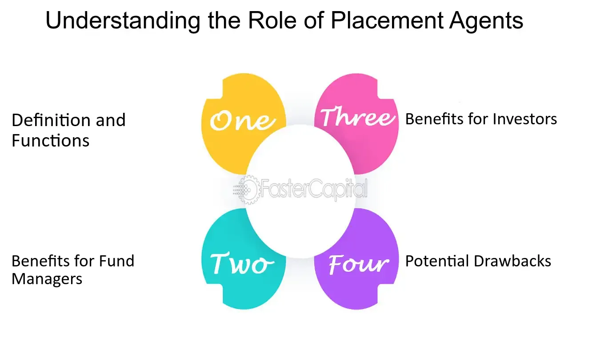

## Table of Contents

## What is a placement agent?

A placement agent is a person or company that helps other companies raise money. They work with companies that want to get investments from people or other businesses. The placement agent's job is to find these investors and convince them to put their money into the company.

Placement agents usually get paid a fee for their work. This fee is often a percentage of the money they help raise. They are important because they have connections and know how to talk to investors. This makes it easier for companies to get the money they need to grow.

## What are the primary roles of a placement agent?

A placement agent's main job is to help companies find investors. They use their connections and knowledge to find people or other businesses that might want to invest money in the company. They talk to these potential investors and explain why the company is a good place to put their money. This can be really helpful for companies that don't know how to find investors on their own.

Another important role of a placement agent is to help with the investment process. They work with the company to make sure all the paperwork and legal stuff is done right. They also help set up meetings between the company and the investors. This makes the whole process smoother and faster. Placement [agents](/wiki/agents) get paid for their work, usually a percentage of the money they help raise, which motivates them to do a good job.

## How does a placement agent differ from a financial advisor?

A placement agent and a financial advisor have different jobs. A placement agent helps companies find investors to raise money. They use their connections to find people or businesses that might want to invest in the company. They also help with the paperwork and meetings to make the investment process easier. Placement agents get paid a fee, usually a percentage of the money they help raise.

A financial advisor, on the other hand, helps people or businesses manage their money. They give advice on how to invest, save, and plan for the future. Financial advisors look at a person's or company's financial situation and make suggestions on what to do with their money. They might help with things like retirement planning, choosing investments, or managing debt. Financial advisors can be paid in different ways, like a fee for their services or a commission on the products they sell.

So, while a placement agent focuses on finding investors for a company, a financial advisor focuses on helping people or businesses make smart choices with their money. Both roles are important, but they serve different needs and work in different ways.

## What industries commonly use placement agents?

Placement agents are often used in the private equity and venture capital industries. These industries need a lot of money to invest in other companies. Placement agents help private equity and venture capital firms find people or other businesses that want to give them money. This is important because it helps these firms grow and invest in more companies.

Another industry that uses placement agents a lot is real estate. Real estate developers need money to buy land and build things like houses or office buildings. Placement agents help these developers find investors who want to put their money into real estate projects. This can make it easier for developers to start new projects and grow their business.

Some other industries that might use placement agents include hedge funds and infrastructure. Hedge funds need money to invest in different things like stocks or bonds. Infrastructure projects, like building roads or bridges, also need a lot of money. Placement agents can help these industries find the money they need to do their work.

## What qualifications should a placement agent have?

A placement agent should have a good understanding of finance and investments. They need to know how to find investors and explain why a company is a good place to put money. This means they should have a background in finance, business, or a related field. Many placement agents have a degree in finance, economics, or business administration. Some might also have a certification like a Certified Financial Analyst (CFA) or a Series 7 license, which shows they know a lot about investments.

It's also important for a placement agent to have good people skills. They need to be able to talk to investors and convince them to invest in a company. This means they should be good at networking and building relationships. Experience in sales or marketing can be helpful because it teaches them how to talk to people and sell ideas. Being organized and good at managing projects is also important because they need to handle a lot of paperwork and meetings.

## How does a placement agent find potential investors?

A placement agent finds potential investors by using their connections and networking skills. They talk to people they know in the finance world, like other investors, bankers, and business owners. They also go to events like conferences and meetings where they can meet new people who might want to invest. By building a strong network, placement agents can find out who might be interested in putting money into a company.

Once they have a list of potential investors, placement agents reach out to them. They might send emails, make phone calls, or set up meetings to talk about the company that needs money. They explain why the company is a good investment and answer any questions the investors might have. This helps the investors decide if they want to put their money into the company.

## What is the typical process a placement agent follows to secure funding?

A placement agent starts by learning all about the company that needs money. They look at the company's business plan, financials, and what makes it special. Once they know all this, they make a pitch that shows why the company is a good investment. They use this pitch to talk to people they know in the finance world, like other investors, bankers, and business owners. They also go to events like conferences to meet new people who might want to invest.

After finding potential investors, the placement agent reaches out to them. They might send emails, make phone calls, or set up meetings to talk about the company. They explain why the company is a good place to put money and answer any questions the investors have. If the investors are interested, the placement agent helps with the paperwork and legal stuff to make sure everything is done right. They also help set up more meetings between the company and the investors until the deal is done.

## How is the compensation of a placement agent structured?

A placement agent usually gets paid a fee for helping a company find investors. This fee is often a percentage of the money they help raise. For example, if they help a company get $1 million, and their fee is 2%, they would get $20,000. The exact percentage can change depending on the deal and the placement agent's agreement with the company. Sometimes, the fee might be a flat amount instead of a percentage.

The placement agent might also get paid in other ways. They could get a retainer fee, which is a set amount of money they get just for working on the project. Or they might get a success fee, which is extra money they get if they do a really good job and raise a lot of money. The way they get paid can be different for each deal, but it's always set out in the agreement between the placement agent and the company.

## What are the common fee structures for placement agents?

Placement agents usually get paid a fee based on the money they help raise for a company. This fee is often a percentage of the total money raised. For example, if they help a company get $1 million and their fee is 2%, they would get $20,000. The percentage can vary, but it's usually between 1% and 5%. Sometimes, instead of a percentage, the fee might be a flat amount agreed upon before starting the work.

In addition to the main fee, placement agents might also get other types of payments. They could receive a retainer fee, which is a set amount of money they get just for working on the project. Another type of payment is a success fee, which is extra money they get if they do a really good job and raise a lot of money. The exact fee structure can be different for each deal, but it's always written down in the agreement between the placement agent and the company.

## How do placement agents ensure compliance with regulatory requirements?

Placement agents make sure they follow the rules by knowing the laws and rules that apply to their work. They have to understand things like the Securities and Exchange Commission (SEC) rules in the United States, or other rules in different countries. They also work with lawyers who know a lot about these rules. These lawyers help the placement agents make sure all the paperwork and legal stuff is done right. This way, the placement agents can help companies find investors without breaking any laws.

Placement agents also keep good records of everything they do. They write down all their meetings, calls, and emails with investors. This helps them show that they are doing things the right way if anyone asks. They also make sure the companies they work with are following the rules. If a company is not doing things right, the placement agent will tell them how to fix it. By being careful and working with experts, placement agents can help companies get the money they need while staying out of trouble with the law.

## What are the challenges faced by placement agents in the current market?

Placement agents face a lot of challenges in today's market. One big challenge is finding enough investors who want to put money into companies. With so many companies looking for money, there are more choices for investors. This makes it harder for placement agents to convince investors to choose their company over others. Also, the economy can change a lot, and when it's not doing well, investors might be more careful about where they put their money. This means placement agents have to work harder to show that their company is a safe and good investment.

Another challenge is keeping up with all the rules and laws. There are a lot of rules that placement agents have to follow, and these rules can change. If they don't follow the rules, they could get in trouble. This means they have to spend a lot of time learning about the rules and making sure they do everything right. They also have to deal with a lot of paperwork and legal stuff, which can take a lot of time and effort. All these challenges make the job of a placement agent very hard, but they keep working to help companies find the money they need.

## How can a placement agent maximize their effectiveness and value to clients?

A placement agent can maximize their effectiveness and value to clients by building strong relationships with investors. They should talk to a lot of people in the finance world, like other investors, bankers, and business owners. By going to events like conferences and meetings, they can meet new people who might want to invest. When they have a good network, they can find out who might be interested in putting money into a company. This helps them find the right investors faster and makes it easier for their clients to get the money they need.

Another way a placement agent can be more effective is by really understanding the company they are working with. They need to know all about the company's business plan, financials, and what makes it special. With this knowledge, they can make a strong pitch to investors, explaining why the company is a good investment. They should also help with all the paperwork and legal stuff to make sure everything is done right. By being organized and good at managing projects, they can make the whole process smoother and faster, which adds a lot of value for their clients.

## References & Further Reading

[1]: "Private Equity Operational Due Diligence: Tools to Evaluate Liquidity, Valuation, and Documentation" by Jason Scharfman

[2]: "The Structure of a Compensation Package in the Financial Sector: Pitfalls and Possibilities" by Xing Xia and Yao Zhang

[3]: ["Algorithmic Trading and DMA: An introduction to direct access trading strategies"](https://www.amazon.com/Algorithmic-Trading-DMA-introduction-strategies/dp/0956399207) by Barry Johnson

[4]: "The Handbook of Nonagency Mortgage-Backed Securities" by Frank J. Fabozzi

[5]: ["Quantitative Finance For Dummies"](https://www.amazon.com/Quantitative-Finance-Dummies-Steve-DPhil/dp/1118769465) by Steve Bell

[6]: "Python for Finance: Analyze Big Financial Data" by Yves Hilpisch