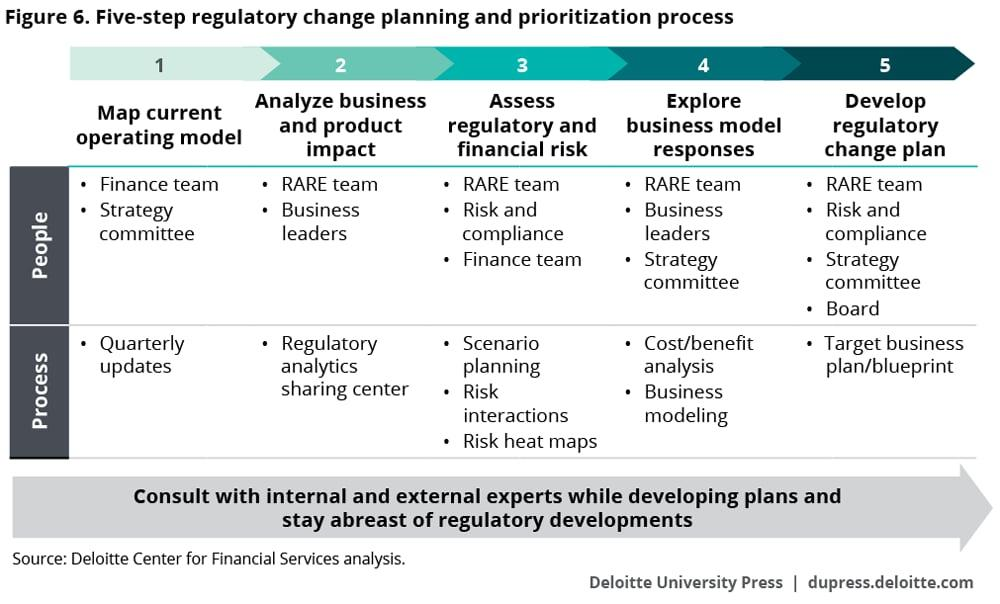

## Table of Contents

## What is placement in the context of finance?

In finance, placement refers to the process of selling new securities, like stocks or bonds, to investors. When a company or government wants to raise money, they might issue these securities. The placement can be done through different methods, such as a public offering, where the securities are sold to the general public, or a private placement, where they are sold to a select group of investors.

The choice between public and private placement depends on various factors, including the size of the company, the amount of money they need to raise, and the regulatory requirements they must follow. Public offerings are more common for larger companies and involve more regulatory oversight, while private placements are often used by smaller companies or for smaller amounts of capital, with fewer regulatory hurdles. Both methods aim to help the issuer raise the necessary funds while providing investors with opportunities to invest in new securities.

## Why are regulations important in financial placement?

Regulations are important in financial placement because they help keep the market fair and safe for everyone. When companies want to sell new stocks or bonds, they have to follow rules that make sure they tell the truth about their business. This way, people who want to buy these securities can make smart choices with their money. Without these rules, companies might lie or hide important information, which could trick people into making bad investments.

Also, regulations protect investors by making sure that the people selling the securities are honest and follow the law. This includes rules about how much information companies have to share and how they can advertise their securities. By having these rules, the government helps prevent big problems in the market, like fraud or big crashes, which can hurt a lot of people and the economy. So, regulations are key to keeping the financial system working well and protecting everyone involved.

## What are the basic types of financial placements?

There are two main types of financial placements: public offerings and private placements. A public offering is when a company sells new stocks or bonds to anyone who wants to buy them. This is how big companies usually raise money. They have to follow strict rules and tell everyone a lot about their business so people can decide if they want to invest. This is called going public, and it's a big deal for a company.

A private placement is different. It's when a company sells its stocks or bonds to a small group of people, like rich investors or big companies. This way, the company doesn't have to follow as many rules and can keep things more private. It's often used by smaller companies or when they don't need to raise a lot of money. Both ways help companies get the money they need, but they work differently and follow different rules.

## How do regulations vary by country for financial placements?

Regulations for financial placements can be very different from one country to another. Each country has its own rules about how companies can sell new stocks or bonds. For example, in the United States, companies have to follow rules set by the Securities and Exchange Commission (SEC). They need to share a lot of information with the public and go through a long process before they can sell securities. In contrast, some countries might have fewer rules, making it easier for companies to raise money but maybe less safe for investors.

These differences can affect where companies choose to do their financial placements. If a company wants to sell securities in a country with strict rules, they might have to spend more time and money to follow those rules. But if they choose a country with fewer regulations, it might be quicker and cheaper, but they might not get as much money or reach as many investors. So, companies need to think carefully about which country's rules will work best for their needs.

## What are the common risks associated with financial placements?

When companies do financial placements, there are some risks that both the company and the investors need to think about. One big risk is that the company might not be able to sell all the securities they want to. If not enough people want to buy the stocks or bonds, the company might not get all the money they need. This can be a big problem if they were counting on that money to grow their business or pay off debts. Another risk is that the price of the securities might go down after they are sold. If this happens, investors could lose money, and it might be hard for the company to raise money again in the future.

Another risk is that the company might not tell the truth about their business. If they hide important information or lie, investors might make bad choices and lose money. This is why regulations are important, but even with rules, some companies might still try to trick people. Also, the market can change quickly. Things like economic problems or changes in interest rates can make it harder for a company to sell their securities or for investors to make money from them. So, both companies and investors need to be careful and think about these risks before doing a financial placement.

## How can an individual or firm mitigate risks in financial placements?

To lower the risks in financial placements, it's important for individuals and firms to do their homework. This means looking closely at the company that's selling the securities. They should read all the information the company shares and maybe even talk to experts who know about the company and the market. It's also a good idea to spread out their money by investing in different kinds of securities or in different companies. This way, if one investment doesn't do well, they won't lose all their money.

Another way to reduce risks is to keep an eye on the market and be ready to change plans if things start to go wrong. This might mean selling some securities if their value starts to drop a lot or if the company's news isn't good. It's also smart to think about the rules in the country where the securities are being sold. Some places have stricter rules that can make things safer for investors. By being careful and staying informed, individuals and firms can make better choices and lower the chances of losing money.

## What role do financial regulators play in overseeing placements?

Financial regulators are like the referees of the financial world. They make sure that when companies want to sell new stocks or bonds, they follow the rules. These rules are important because they help keep the market fair and safe for everyone. Regulators check that companies tell the truth about their business and share all the important information with people who might want to buy their securities. This way, investors can make smart choices with their money and not get tricked by companies that might lie or hide things.

Regulators also keep an eye on how companies sell their securities. They make sure that the companies don't do anything wrong, like promising too much or using sneaky ways to get people to buy. If a company breaks the rules, the regulators can punish them, like making them pay a fine or even stopping them from selling securities. By doing all this, financial regulators help make sure that the market works well and that people can trust it with their money.

## What are the advanced strategies for optimizing financial placements?

One advanced strategy for optimizing financial placements is to use data analytics and machine learning. Companies can look at a lot of information about the market, their own business, and what investors like. By using special computer programs, they can find patterns and make better guesses about what will happen next. This can help them decide the best time to sell their securities and how much to ask for them. It can also help them pick the right investors who are more likely to buy and hold onto their securities for a long time.

Another strategy is to use different kinds of financial instruments. Instead of just selling regular stocks or bonds, companies can create more complex securities that might be more interesting to investors. For example, they might offer convertible bonds, which can turn into stocks later, or securities that pay out based on how well the company does. These can attract different kinds of investors and help the company raise more money. By mixing things up and offering a variety of options, companies can reach more people and make their financial placements more successful.

## How do global economic conditions affect financial placement strategies?

Global economic conditions can really change how companies do their financial placements. When the world economy is doing well, people and big investors might feel more confident about spending money on new stocks or bonds. This means companies might find it easier to sell their securities and get the money they need. They might also decide to do a public offering because more people are interested in buying. But if the economy is not doing so well, like during a recession, people might be more careful with their money. This can make it harder for companies to sell their securities, so they might choose to do a private placement instead, where they sell to a smaller group of investors who are less worried about the economy.

Also, things like interest rates and currency values around the world can affect financial placement strategies. If interest rates are low, borrowing money is cheaper, and companies might decide to issue more bonds. But if interest rates go up, it can make bonds less attractive to investors, so companies might focus more on selling stocks. Changes in currency values can also make a difference. If a company's home currency is strong, it might be harder to sell securities to investors in other countries because those securities could become more expensive for them. So, companies need to keep an eye on these global economic conditions and adjust their strategies to make sure they can still raise the money they need.

## What are the emerging trends in financial placement regulations?

One big trend in financial placement regulations is more focus on protecting investors. Governments around the world are making stricter rules to make sure companies tell the truth about their business. They want to stop companies from hiding important information or lying to people who might want to buy their stocks or bonds. This means companies have to share more details about their finances and what they plan to do with the money they raise. It's all about making the market safer and fairer for everyone who wants to invest.

Another trend is the use of technology in regulations. Regulators are starting to use special computer programs to watch over financial placements more closely. These programs can look at a lot of information quickly and find any problems or strange things happening. This helps regulators catch companies that might be breaking the rules faster. Also, some countries are making rules about using new technologies like blockchain for financial placements. They want to make sure these new ways of raising money are safe and follow the law.

## How do compliance and risk management systems support financial placements?

Compliance and risk management systems help make financial placements safer and smoother. They make sure that companies follow all the rules when they sell new stocks or bonds. These systems check that the company shares all the right information with investors and doesn't do anything wrong. By keeping everything in line with the rules, compliance systems help build trust with investors. They know that the company is playing by the book, which makes them more likely to buy the securities.

Risk management systems are also important because they help companies and investors understand and handle the risks of financial placements. These systems look at all the things that could go wrong, like not being able to sell all the securities or the price going down. By figuring out these risks ahead of time, companies can make plans to deal with them. This might mean selling securities to a smaller group of investors or waiting for a better time to sell. By managing risks well, companies can make their financial placements more successful and protect investors from losing money.

## What are the expert-level considerations for cross-border financial placements?

When a company wants to do a financial placement in another country, they need to think about the rules in that country. Each place has its own laws about selling stocks or bonds, and they can be very different. Some countries have strict rules that make it harder to sell securities, but these rules also help protect investors. Other countries might have fewer rules, which can make it easier to sell securities but might be riskier for investors. Companies need to learn about these rules and make sure they follow them. They might need to hire experts who know the rules in the other country to help them do everything right.

Another big thing to consider is how the money will move between countries. When a company sells securities in another country, they need to think about things like exchange rates and taxes. If the value of the money in the other country goes up or down a lot, it can change how much money the company gets. Also, different countries have different taxes on money moving in and out, which can affect how much money the company ends up with. Companies need to plan for these things and maybe use special financial tools to help manage the risks. By thinking carefully about these expert-level considerations, companies can make their cross-border financial placements more successful and safer for everyone involved.

## References & Further Reading

[1]: Aldridge, I. (2013). ["High-Frequency Trading: A Practical Guide to Algorithmic Strategies and Trading Systems."](https://www.amazon.com/High-Frequency-Trading-Practical-Algorithmic-Strategies/dp/1118343506) Wiley.

[2]: Vaananen, K. (2013). ["Dark Pools and High Frequency Trading For Dummies."](https://www.dummies.com/book/business-careers-money/personal-finance/investing/general-investing/dark-pools-and-high-frequency-trading-for-dummies-281564/) Wiley.

[3]: Hasbrouck, J., & Saar, G. (2013). ["Low-Latency Trading."](https://www.sciencedirect.com/science/article/abs/pii/S1386418113000165) The Review of Financial Studies, 26(9), 2585-2623.

[4]: Bhattacharyya, S. (2012). ["Algorithmic Trading."](https://www.semanticscholar.org/paper/Cryptocurrency-Trading-Pair-Forecasting%2C-Using-and-Osifo-Bhattacharyya/141988fce2c75a9ab091acf2941adc223d42761d) Palgrave Macmillan.

[5]: Narang, R. (2009). ["Inside the Black Box: The Simple Truth About Quantitative Trading."](https://onlinelibrary.wiley.com/doi/book/10.1002/9781118267738) Wiley.