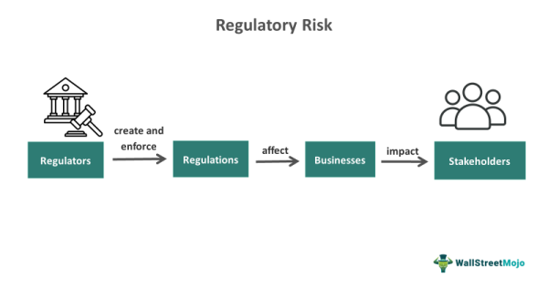

The world of finance is undergoing a transformative shift as technological advancements become integral to its development. Central to this evolution is the use of automated and data-driven decision-making processes, with algorithmic trading emerging as a principal innovation in the investment sector. Historically dominated by human discretion and traditional methods, investment strategies are now increasingly characterized by their adaptability and efficiency brought on by technology. Algorithmic trading stands at the forefront, offering unprecedented speed and precision in executing trades, which is critical in today's fast-paced markets.

This article focuses on the interplay between placement investment finance and algorithmic trading. Placement in investment finance traditionally involves the sale of securities to a select group of private investors, bypassing the conventional public offering channels. This approach is cost-effective and often less burdensome in terms of regulatory compliance, making it an attractive option for companies seeking to raise capital.



On the other hand, algorithmic trading leverages sophisticated computer algorithms to execute trading orders rapidly and autonomously. It is reshaping the financial landscape by enabling traders to capitalize on transient market conditions and automate complex trading strategies without the emotional biases inherent in human decision-making. The integration of algorithmic trading within placement investment finance can potentially enhance capital-raising efforts by allowing for more dynamic and responsive investment strategies.

As we explore these concepts, we aim to illuminate the intricacies and advantages of this modern financial phenomenon. Through understanding these advancements, investors can better position themselves to capitalize on the opportunities that emerging technologies present in the ever-evolving financial markets.

## Table of Contents

## Understanding Placement in Investment Finance

Placement in investment finance involves the sale of securities directly to private investors, typically bypassing the need for U.S. Securities and Exchange Commission (SEC) registration. This method provides a more cost-effective avenue for companies to raise capital as opposed to public offerings. The primary advantage of this approach lies in the reduced regulatory burden and quicker access to capital. By avoiding the lengthy process of SEC registration, companies can efficiently allocate resources and focus on strategic growth, thereby providing a compelling alternative to initial public offerings (IPOs).

Public offerings require extensive compliance with regulatory standards and disclosures, which can be time-consuming and expensive. In contrast, private placements are exempt from these rigorous requirements under specific SEC regulations, such as Regulation D. This exemption allows companies to sell securities to accredited investors with fewer constraints, thereby facilitating more flexible capital-raising mechanisms. Accredited investors are typically institutions or individuals with significant financial knowledge and resources, which reduces the need for the extensive protection measures required in public markets.

Financial players such as venture capitalists, private equity firms, and institutional investors frequently engage in placements. These entities provide a source of capital that can be rapidly mobilized to support company expansion, acquisition strategies, or the development of new projects. Placements also enable investors to acquire a stake in potentially high-growth businesses without the [volatility](/wiki/volatility-trading-strategies) and pricing pressures associated with public markets.

However, placement investments [carry](/wiki/carry-trading) their share of risks and rewards. While they offer businesses a faster route to capital and investors the opportunity for substantial returns, they also pose potential downsides. Due to the less stringent reporting requirements compared to public markets, private placements can present a higher risk of insufficient information, potentially leading to issues with transparency and governance. Additionally, these securities often lack the [liquidity](/wiki/liquidity-risk-premium) associated with publicly traded stocks, which can be a disadvantage for investors seeking to [exit](/wiki/exit-strategy) their positions quickly.

In conclusion, while private placements in investment finance present significant opportunities, they also require careful consideration of the associated risks and rewards. The balance of reduced regulatory requirements and potential for substantial gains must be weighed against the challenges of lower liquidity and transparency. As more financial institutions engage in placements, these factors continue to shape the landscape of investment opportunities, influencing both issuers and investors alike.

## The Rise of Algorithmic Trading

Algorithmic trading, commonly referred to as algo trading, represents a significant shift in the way financial markets operate. It employs computer algorithms to execute predefined trading strategies with precision and speed that are unattainable by human traders. This technological advancement has transformed trading dynamics, enhancing market efficiency and liquidity.

The origins of [algorithmic trading](/wiki/algorithmic-trading) trace back to the late 20th century, when technological advancements in computing allowed for automation in trading processes. Initially, algo trading was employed primarily for executing large orders to minimize market impact. However, over time, it has evolved into a sophisticated tool used for a wide range of trading strategies. Today, algorithmic trading accounts for a significant portion of the trading [volume](/wiki/volume-trading-strategy) in major financial markets.

Algorithmic trading operates through key components and mechanisms that define its functionality. At the core, algorithms are designed to analyze vast datasets, identify trading opportunities, and execute trades based on predefined rules. These algorithms incorporate various factors such as price, timing, and volume to optimize trade execution. Essential mechanisms include statistical [arbitrage](/wiki/arbitrage), [market making](/wiki/market-making), and [trend following](/wiki/trend-following), each serving different strategic objectives.

An important aspect of algorithmic trading is its reliance on zero-emotion, data-driven decisions. By eliminating human emotions, such as fear and greed, algorithms can make objective trading decisions based on quantitative data. For instance, [machine learning](/wiki/machine-learning) models can process historical and real-time market data to detect patterns and predict future price movements. A simple example of an algorithmic trading strategy in Python could be a moving average crossover strategy:

```python
def moving_average_strategy(prices, short_window, long_window):
    signals = {"buy": [], "sell": []}
    short_ma = prices.rolling(window=short_window, min_periods=1).mean()
    long_ma = prices.rolling(window=long_window, min_periods=1).mean()

    for i in range(1, len(prices)):
        if short_ma[i] > long_ma[i] and short_ma[i - 1] <= long_ma[i - 1]:
            signals["buy"].append(prices.index[i])
        elif short_ma[i] < long_ma[i] and short_ma[i - 1] >= long_ma[i - 1]:
            signals["sell"].append(prices.index[i])

    return signals
```

The benefits of adopting algorithmic trading are numerous. It allows for rapid execution of trades, greatly improving market efficiency. Additionally, it reduces human error and trading costs, particularly in high-frequency trading scenarios. Algorithms can also manage large volumes of data and execute complex strategies that would be challenging for human traders to carry out manually.

However, algorithmic trading is not without challenges. Technical reliability is a potential concern; system failures can lead to significant financial losses. Moreover, the market impact of algorithmic trading, if not properly managed, can exacerbate volatility. Regulatory scrutiny is increasing, with regulations being implemented to ensure fair trading practices and prevent market manipulation.

In conclusion, algorithmic trading stands as a cornerstone of modern financial markets, offering advantages in efficiency and precision. Its continued evolution will likely shape the landscape of investing, emphasizing the importance of technological integration in financial strategies.

## How Placements and Algo Trading Intersect

Algorithmic trading has significantly influenced placement investment strategies, providing a fresh perspective on how capital can be raised efficiently. By employing predefined algorithms and sophisticated computer programs, traders can make rapid decisions that optimize the timing and execution of security sales to private investors, commonly referred to as placements. This capability is crucial in capturing fleeting market opportunities where timing is essential to securing optimal placement terms.

The rapid decision-making facilitated by algorithmic trading is pivotal in negotiating placement opportunities. Algorithms analyze vast datasets in real-time, allowing traders to identify favorable conditions and execute trades within milliseconds. This agility ensures that trades occur at the most advantageous moments, which is particularly beneficial in private investment placements where market conditions can change quickly.

The synergies from combining placements with algorithmic strategies are evident in the enhanced precision and reduced latency in executing trades. By utilizing historical data, algorithms can predict market trends and behaviors, aligning placement investments with these predictions to maximize returns. Moreover, algorithmic trading minimizes human biases and errors, ensuring more consistent investment strategies.

A pertinent example of how algorithmic trading has enhanced [capital raising](/wiki/hedge-fund-capital-raising) through placements is the use of high-frequency trading ([HFT](/wiki/high-frequency-trading-strategies)) systems. HFT algorithms facilitate the rapid buying and selling of securities, providing liquidity, thus fostering more favorable conditions for private placements. These systems can assess the likelihood of successful placements and allocate capital accordingly, optimizing the efficiency of fund distribution.

Technology plays a critical role in bridging placements with trading efficiency. Advanced computing and data analytics empower traders to access real-time market data and insights, ensuring informed decision-making. The integration of machine learning and [artificial intelligence](/wiki/ai-artificial-intelligence) into trading algorithms furthers this capability, enabling adaptive strategies that evolve with market conditions.

The intersection between placement investment strategies and algorithmic trading capitalizes on technological advancements to drive innovative financial solutions, reshaping how investors and companies approach capital raising. As these technologies continue to evolve, the potential for even greater synergies and efficiencies in investment strategies will undoubtedly grow.

## Advantages and Disadvantages

Algorithmic trading and placement investments present a series of advantages and disadvantages that are reshaping the contemporary financial landscape.

A key advantage of integrating algorithmic trading with placement strategies is increased speed. Algorithmic systems can process vast amounts of data and execute trades in fractions of a second, which is vital for capturing short-lived market opportunities. This speed ensures that traders can respond almost instantaneously to market events, securing placements efficiently. Furthermore, algorithmic trading introduces a new level of efficiency by maximizing the use of data analytics and machine learning. These technologies help in spotting trends and making predictions that human analysts might miss, offering better-informed decision-making processes.

Another significant benefit is the reduction of human error. Algorithms operate on predefined parameters and analyze data without emotional influence. This zero-emotion approach minimizes the biases and errors that can arise from human decision-making, thereby increasing the accuracy of trades.

However, these advantages come with potential disadvantages. One major concern is technical reliability. The complexity of algorithms means that systems can fail or malfunction, which could result in substantial financial losses. Also, these systems require constant monitoring and updating to remain effective, demanding significant technical expertise and resources.

Market impact is another critical issue. The high speed and volume of trades executed by algorithms can lead to increased market volatility. For example, algorithmic trading contributed to the 2010 Flash Crash, raising concerns about its impact on market stability. Therefore, the integration of these strategies can sometimes disrupt the traditional market equilibrium.

Regulatory frameworks are evolving to address these challenges. Authorities worldwide are establishing guidelines to monitor and control the use of algorithmic trading in placements. These regulations aim to ensure market fairness and prevent manipulative practices while safeguarding market integrity.

The intertwining of placements and algorithmic trading has profound implications for market liquidity and stability. While the efficiency and quick execution of trades can enhance liquidity, they can also contribute to increased volatility, presenting a double-edged sword for market participants.

Looking to the future, the integration of these strategies is likely to expand further. As technology continues to advance, more sophisticated algorithms and machine learning models are expected to emerge, providing even greater opportunities for maximizing investment returns. Investors who adapt to these technological advancements may find themselves at a considerable advantage in a rapidly changing financial world.

In summary, while the marriage of algorithmic trading and placement investments offers significant benefits, it also poses several challenges that need careful consideration. As regulatory frameworks develop and technologies evolve, the potential to enhance investment strategies grows, presenting a promising outlook for investors prepared to navigate this dynamic environment.

## Conclusion

Investment finance is undergoing a remarkable transformation with the growing influence of technical innovation, particularly through the concepts of placement investments and algorithmic trading. Placement investment finance, which refers to the private sale of securities, presents a practical approach for businesses to raise capital efficiently. Meanwhile, algorithmic trading is revolutionizing how financial markets operate by enabling rapid, data-driven trading strategies. These two components are redefining traditional practices and providing new opportunities for investors and financial institutions.

Looking to the future, placement investment finance and algorithmic trading hold tremendous potential. As these financial strategies evolve, they promise to enhance market access and capital allocation, making the process more streamlined and less prone to human error. The ongoing development and integration of these strategies are likely to increase their reliability and efficiency. The resulting synergies could translate into more innovative ways to capitalize on market opportunities.

Investors are encouraged to proactively explore how these technologies can optimize their portfolios. By embracing data-driven decision-making and taking advantage of the speed and accuracy of modern trading systems, investors can position themselves to better navigate complex financial markets. The adoption of these strategies requires a commitment to staying informed about technological advancements and regulatory changes that could impact their application.

The increased impact of technology in finance is undeniable, driving the sector toward unprecedented levels of connectivity and performance. It is crucial for market participants to adapt to these fast-paced changes, as embracing them can lead to significant competitive advantages. As we anticipate further innovations, investors need to remain engaged with these trends to harness their full potential.

In conclusion, the growth of technology in financial markets represents a paradigm shift, offering unique opportunities and challenges. Investors and financial institutions should remain vigilant and inquisitive, continuously updating their knowledge to stay ahead in this rapidly evolving field. This strategic engagement will ensure that they are well-positioned to benefit from these advances and thrive in an increasingly data-centric financial world.

## FAQs

### What is placement in investment finance?

Placement in investment finance refers to the process where securities are sold directly to private investors, bypassing the open market. This typically occurs without the need for Securities and Exchange Commission (SEC) registration, making it a cost-effective option for companies to raise capital. Placement helps companies engage with a select group of institutional or accredited investors, ensuring more control over the distribution process. The distinction between public offerings and private placements lies primarily in the regulatory requirements and the scale of distribution. In private placement, the securities are not offered publicly, which simplifies the compliance process and reduces the time and cost involved.

### How does algorithmic trading work?

Algorithmic trading, or algo trading, employs computer programs to automatically execute trades based on a pre-defined set of instructions. These instructions, or algorithms, can be based on various factors including timing, price, or quantity, often using complex mathematical models and statistical analysis. The main advantage of algorithmic trading is its ability to execute trades at speeds and frequencies unachievable by human traders. Here’s a basic pseudocode example of a simple algorithmic trading strategy using Python:

```python
def moving_average_strategy(prices, short_window, long_window):
    short_mavg = prices.rolling(window=short_window).mean()
    long_mavg = prices.rolling(window=long_window).mean()
    signal = (short_mavg > long_mavg).astype(int)
    return signal.shift(1)

# Sample usage with historical price data
# prices = get_historical_data('AAPL')
# signal = moving_average_strategy(prices['close'], 40, 100)
```

This code snippet demonstrates a simple moving average crossover strategy where trades are signaled when a short-term moving average crosses above or below a long-term moving average.

### What are the benefits of integrating placements with algo trading?

Integrating placements with algorithmic trading offers numerous advantages, including streamlined decision-making and enhanced execution efficiency. One of the primary benefits is the ability to leverage rapid data analysis and decision-making to identify and capitalize on private placement opportunities quickly. Algorithmic trading can offer optimized pricing strategies by utilizing historical and real-time data, reducing the human biases and errors associated with manual trading. Additionally, this integration can expand market access and improve liquidity by connecting private placements with high-frequency trading mechanisms that enhance market participation.

### Are there any risks associated with algorithmic trading in placements?

While algorithmic trading provides substantial benefits, it also poses certain risks, particularly when combined with placements. Technical risks include system malfunctions and software bugs, which could result in unintended trades or financial losses. Market impact risks occur when large algorithmically executed trades affect security prices, potentially leading to negative market sentiment or volatility. Furthermore, regulatory and compliance risks must be considered, as trading algorithms need to adhere to financial regulations to avoid legal repercussions. Mitigating these risks requires robust risk management protocols, continuous monitoring of algorithm performance, and adherence to regulatory standards.

### How can new investors get started with these strategies?

New investors looking to explore placements and algorithmic trading should begin by building a strong foundational knowledge of financial markets and trading principles. Embracing educational resources such as [books](/wiki/algo-trading-books), online courses, and workshops can significantly enhance their understanding. It's also crucial to use simulation platforms to practice trading strategies in a risk-free environment. Engaging with financial advisors or leveraging platforms that offer algorithmic trading as a service can provide additional guidance and expertise. Ultimately, starting small, monitoring progress, and gradually incorporating these strategies into a broader investment portfolio can help mitigate risks and enhance learning.

## References & Further Reading

[1]: Aldridge, I. (2013). ["High-Frequency Trading: A Practical Guide to Algorithmic Strategies and Trading Systems."](https://www.amazon.com/High-Frequency-Trading-Practical-Algorithmic-Strategies/dp/1118343506) Wiley.

[2]: Vaananen, K. (2013). ["Dark Pools and High Frequency Trading For Dummies."](https://www.dummies.com/book/business-careers-money/personal-finance/investing/general-investing/dark-pools-and-high-frequency-trading-for-dummies-281564/) Wiley.

[3]: Hasbrouck, J., & Saar, G. (2013). ["Low-Latency Trading."](https://www.sciencedirect.com/science/article/abs/pii/S1386418113000165) The Review of Financial Studies, 26(9), 2585-2623.

[4]: Bhattacharyya, S. (2012). ["Algorithmic Trading."](https://www.semanticscholar.org/paper/Cryptocurrency-Trading-Pair-Forecasting%2C-Using-and-Osifo-Bhattacharyya/141988fce2c75a9ab091acf2941adc223d42761d) Palgrave Macmillan.

[5]: Narang, R. (2009). ["Inside the Black Box: The Simple Truth About Quantitative Trading."](https://onlinelibrary.wiley.com/doi/book/10.1002/9781118267738) Wiley.