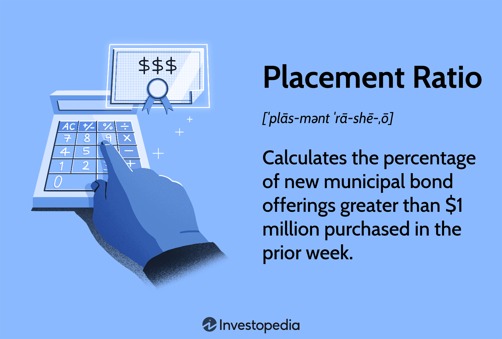

## Table of Contents

## What is the placement ratio?

The placement ratio is a term often used in job markets and educational institutions to describe the percentage of students or job seekers who find employment after completing their education or training. It is calculated by dividing the number of people who get jobs by the total number of people who were looking for jobs, then multiplying by 100 to get a percentage. This ratio is important because it helps schools and training programs show how well they prepare people for the workforce.

A high placement ratio is usually seen as a good sign. It means that a large number of graduates or trainees are finding jobs. This can make a school or program more attractive to new students because it shows that the education or training they offer leads to good job opportunities. On the other hand, a low placement ratio might suggest that the program needs to improve or that the job market is tough for people with that kind of training.

## Why is the placement ratio important in job markets?

The placement ratio is important in job markets because it shows how many people are getting jobs after they finish school or training. It's like a score that tells us if a school or program is good at helping people find work. When the placement ratio is high, it means a lot of people are finding jobs, which is a good sign. It makes the school or program look better and can attract more students who want to have a good chance of getting a job after they graduate.

On the other hand, if the placement ratio is low, it might mean that the school or program needs to do a better job at preparing people for work. It could also mean that there are not many jobs available for people with that kind of training. This information is useful for students who are trying to decide where to go to school or what kind of training to get. They can look at the placement ratio to see which schools or programs have the best chance of helping them find a job after they finish.

## How is the placement ratio calculated?

The placement ratio is a number that tells us how many people get jobs after they finish school or training. To find this number, you start by counting how many people got jobs. Then, you count how many people were looking for jobs. After that, you divide the number of people who got jobs by the total number of people who were looking for jobs. Finally, you multiply that number by 100 to turn it into a percentage.

This percentage is important because it shows if a school or program is good at helping people find work. A high placement ratio means a lot of people are finding jobs, which is a good thing. It can make a school or program look better and attract more students. If the placement ratio is low, it might mean the school or program needs to improve, or there might not be many jobs available for people with that kind of training.

## What factors influence the placement ratio?

Several things can affect the placement ratio, which is how many people get jobs after finishing school or training. One big factor is the job market. If there are lots of jobs available in the field that people studied, the placement ratio will be higher. But if there are not many jobs, even people who did well in school might have a hard time finding work, and the placement ratio will be lower. Another factor is how well the school or program prepares students for the job market. If the training is good and matches what employers are looking for, more students will get jobs, making the placement ratio higher.

The location of the school or program can also play a role. Some places have more job opportunities than others, so students in those areas might have an easier time finding work. The reputation of the school or program matters too. If a school is well-known and respected, employers might be more likely to hire its graduates, boosting the placement ratio. Finally, the effort and skills of the students themselves are important. Students who work hard, gain experience, and build a good resume are more likely to find jobs, which can positively affect the placement ratio.

## Can you provide an example of how to interpret a placement ratio?

Imagine a school where 80 out of 100 students got jobs after graduating. The placement ratio for this school would be 80%, which means 80% of the students who were looking for jobs found one. This is a high placement ratio, and it's a good sign. It shows that the school does a great job at preparing students for the job market. If you're thinking about going to this school, this high placement ratio might make you feel confident that you'll have a good chance of finding a job after you graduate.

Now, let's say another school only had 40 out of 100 students get jobs after graduating. The placement ratio here would be 40%. This is a lower placement ratio, and it might mean that the school needs to improve its training or that there aren't many jobs available in the field the students studied. If you're considering this school, you might want to think about why the placement ratio is low and if there are other schools with better job placement rates. Both placement ratios give important information about how well schools help their students find jobs.

## How does the placement ratio vary across different industries?

The placement ratio can be very different depending on the industry. Some industries, like technology and healthcare, often have high placement ratios because there are lots of jobs available in these fields. People who study computer science or nursing, for example, usually have a good chance of finding a job after they graduate. These industries are growing, and companies are always looking for new workers, so the placement ratio stays high.

On the other hand, some industries might have lower placement ratios. For example, in the arts or humanities, it can be harder to find a job right after graduating. These fields might not have as many job openings, and the competition can be tough. So, even if someone does well in school, they might struggle to find work, leading to a lower placement ratio. This difference shows how the job market and the demand for workers in different industries can affect how many graduates find jobs.

## What are the common benchmarks for a good placement ratio?

A good placement ratio is usually around 70% or higher. This means that at least 70 out of every 100 students who are looking for jobs after graduating are able to find one. Schools and programs often aim for this number because it shows they are doing a good job at preparing students for the job market. When a school has a placement ratio of 70% or more, it can attract more students who want to have a good chance of finding a job after they finish their studies.

However, what counts as a good placement ratio can change depending on the industry and the job market. In fields like technology or healthcare, where there are lots of jobs, a placement ratio of 80% or even 90% might be common. In other fields, like the arts or humanities, a placement ratio of 50% might be considered good because there are fewer job opportunities. So, when looking at placement ratios, it's important to think about the industry and the job market to understand what number is good enough.

## How can educational institutions improve their placement ratios?

Educational institutions can improve their placement ratios by making sure their programs match what employers are looking for. They can do this by talking to companies and finding out what skills and knowledge they need in new workers. Then, they can update their courses to teach those skills. For example, if a lot of jobs need people who know how to use certain computer programs, the school can make sure students learn those programs. Also, schools can help students get real-world experience through internships or projects with companies. This experience can make students more attractive to employers and help them find jobs after they graduate.

Another way to improve placement ratios is by helping students with their job search. Schools can offer workshops on how to write a good resume, how to interview well, and how to find job openings. They can also connect students with alumni who are already working in the field. These alumni can give advice and sometimes even help students find job opportunities. By giving students the tools and support they need to find jobs, schools can increase the number of graduates who get hired, which will raise the placement ratio.

## What role does economic climate play in affecting placement ratios?

The economic climate is really important for placement ratios. When the economy is doing well, there are more jobs available. This means that more students can find work after they finish school, so the placement ratio goes up. Companies are hiring more people because they are growing and need more workers. This is good news for schools and students because it means more graduates will find jobs, making the placement ratio higher.

But when the economy is not doing well, it can be harder for students to find jobs. During tough economic times, companies might not be hiring as much. They might even be letting people go instead of bringing new people in. This means fewer job opportunities for new graduates, and the placement ratio can go down. Schools might have a harder time helping their students find work, even if they are doing everything right, because the job market is just not as strong.

## How do placement ratios correlate with graduate employability?

Placement ratios show how many students find jobs after they finish school. This number is important because it tells us about how easy or hard it is for graduates to get work. If the placement ratio is high, it means a lot of students are finding jobs. This is a good sign that the school is doing a good job at preparing students for the job market. A high placement ratio can make a school look better and attract more students who want to have a good chance of finding a job after they graduate.

On the other hand, if the placement ratio is low, it might mean that it's harder for graduates to find jobs. This could be because the school needs to improve its training or because there aren't many jobs available in the field that students studied. A low placement ratio can make it harder for a school to attract new students because they might worry about finding a job after they finish. So, the placement ratio is closely connected to how employable graduates are, showing how well the school prepares them for the job market.

## What advanced statistical methods can be used to analyze placement ratios?

To get a better understanding of placement ratios, schools and researchers can use advanced statistical methods like regression analysis. This method helps them see how different things, like the type of program a student is in or the economic climate, affect the placement ratio. By using regression analysis, they can figure out which factors are most important for helping students find jobs. This information can help schools make their programs better and help students get ready for the job market.

Another useful method is time series analysis, which looks at how placement ratios change over time. This can show if the placement ratio is going up or down and help schools understand why. For example, if the placement ratio goes down during a recession, time series analysis can show that the economic climate is a big factor. By using this method, schools can plan better for the future and help more students find jobs, even when the job market is tough.

## How can predictive analytics be applied to forecast future placement ratios?

Predictive analytics can help schools guess what their placement ratios might be in the future. They do this by looking at lots of information from the past, like how many students got jobs after graduating and what the job market was like at the time. They also look at things like the type of programs students were in and how the economy was doing. By using special computer programs, schools can find patterns in this information and use those patterns to make guesses about what will happen in the future. This can help them see if the placement ratio might go up or down and plan better for their students.

For example, if a school sees that the placement ratio goes down when the economy is not doing well, they can use predictive analytics to guess what might happen if there's another economic downturn. They can then make changes to their programs or help students in other ways to try and keep the placement ratio high. By using predictive analytics, schools can be ready for the future and help more students find jobs, even when things are tough.

## What are Financial Analysis Techniques?

Financial analysis involves a comprehensive review and interpretation of a company's financial statements to assess its performance and make projections about its financial future. This process aids investors in understanding the financial health of a business and in deciding whether to invest. The primary techniques used in financial analysis include ratio analysis, trend analysis, and comparative financial assessment, each offering unique insights into a company's operations.

**Ratio Analysis** is a fundamental technique that utilizes various financial ratios to evaluate a company's liquidity, profitability, and operational efficiency. Ratios like the **current ratio** and the **quick ratio** measure a company's ability to meet short-term obligations, while the **return on equity (ROE)** and **return on assets (ROA)** ratios provide insights into how effectively a company is generating profits from its investments. 

For risk assessment, performance metrics such as the **Sharpe Ratio**, **Treynor Ratio**, and **Sortino Ratio** are critical. These ratios help investors understand the risk-adjusted performance of an investment portfolio. The **Sharpe Ratio** is particularly renowned, calculated as:

$$
\text{Sharpe Ratio} = \frac{R_p - R_f}{\sigma_p}
$$

where $R_p$ is the portfolio return, $R_f$ is the risk-free rate, and $\sigma_p$ is the standard deviation of the portfolio's excess return. This ratio aids investors in determining the amount of return earned per unit of risk.

**Trend Analysis** involves reviewing historical data to identify patterns or trends in a company’s financial performance over time. This technique is essential for predicting future financial performance based on past behaviors. By analyzing revenue, profit margins, and expense patterns, investors can identify growth trajectories and potential red flags.

**Comparative Financial Assessment** compares a company's financial metrics with those of peers within the industry or sector. This comparative approach provides context and helps determine a company's position relative to competitors, highlighting competitive advantages or areas of concern.

Financial analysis is undeniably crucial for making well-informed investment decisions, enabling investors to align their strategies with opportunities that promise growth and consistent returns. As financial markets become increasingly complex, these techniques offer a structured method of deciphering financial data to drive investment success.

## References & Further Reading

[1]: Bergstra, J., Bardenet, R., Bengio, Y., & Kégl, B. (2011). ["Algorithms for Hyper-Parameter Optimization."](https://dl.acm.org/doi/10.5555/2986459.2986743) Advances in Neural Information Processing Systems 24.

[2]: ["Advances in Financial Machine Learning"](https://www.amazon.com/Advances-Financial-Machine-Learning-Marcos/dp/1119482089) by Marcos Lopez de Prado

[3]: ["Evidence-Based Technical Analysis: Applying the Scientific Method and Statistical Inference to Trading Signals"](https://www.amazon.com/Evidence-Based-Technical-Analysis-Scientific-Statistical/dp/0470008741) by David Aronson

[4]: ["Machine Learning for Algorithmic Trading"](https://github.com/stefan-jansen/machine-learning-for-trading) by Stefan Jansen

[5]: ["Quantitative Trading: How to Build Your Own Algorithmic Trading Business"](https://www.amazon.com/Quantitative-Trading-Build-Algorithmic-Business/dp/1119800064) by Ernest P. Chan

[6]: Fabozzi, F. J., & Mann, S. V. (2005). ["The Handbook of Fixed Income Securities."](https://www.mhebooklibrary.com/doi/book/10.1036/9781260473902?contentTab=true) McGraw-Hill. 

[7]: Bertsimas, D., & Lo, A. W. (1998). ["Optimal Control of Execution Costs"](http://web.mit.edu/dbertsim/www/papers/Finance/Optimal%20control%20of%20execution%20costs.pdf) Operations Research, 46(5), 740-761. 

[8]: Pardo, R. (2008). ["The Evaluation and Optimization of Trading Strategies"](https://onlinelibrary.wiley.com/doi/book/10.1002/9781119196969) by Wiley Trading.