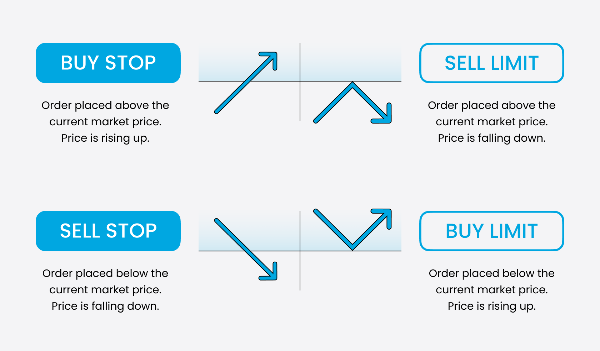

## Table of Contents

## What are shares and why do people buy or sell them?

Shares are pieces of a company that people can buy. When you buy a share, you own a small part of that company. Companies sell shares to get money to grow their business. The price of a share can go up or down, depending on how well the company is doing and what people think about it.

People buy shares because they hope the price will go up. If the price goes up, they can sell the shares for more money than they paid. This is called making a profit. People also buy shares to get dividends, which are payments companies sometimes give to shareholders. On the other hand, people sell shares when they think the price will go down, or if they need money for something else. Buying and selling shares is a way for people to try to make money, but it can also be risky because the price can go down as well as up.

## How can someone start the process of buying or selling shares?

To start buying or selling shares, you first need to open an account with a broker. A broker is a company that helps you buy and sell shares. You can find brokers online or through a bank. When you open an account, you'll need to give some personal information and maybe some money to start with. Once your account is set up, you can use the broker's website or app to look at different shares and decide which ones you want to buy or sell.

After you've chosen the shares you're interested in, you can place an order through your broker. There are different types of orders, like buying at the current price or setting a specific price you're willing to pay. Once your order is placed, the broker will do the buying or selling for you. It's important to keep an eye on your shares and the market to see how they're doing. If you want to sell your shares later, you can do that through your broker too, following a similar process.

## What are the different types of orders used when trading shares?

When you want to buy or sell shares, you can use different types of orders to tell your broker exactly what you want to do. The most common type is a market order. This means you want to buy or sell the shares right away at the best available price. It's quick and easy, but the price you get might be a bit different from what you see on the screen because the price can change fast. Another type is a limit order, where you set a specific price you're willing to buy or sell at. Your order will only go through if the share price reaches your limit. This can take longer, but it helps you control the price you pay or get.

There are also other types of orders that can be useful depending on what you want to do. A stop order, sometimes called a stop-loss order, is used to limit your losses. You set a stop price, and if the share price falls to that level, your order turns into a market order to sell. This can help you avoid losing more money if the price keeps going down. A stop-limit order is similar, but instead of turning into a market order, it turns into a limit order at your stop price. This gives you more control over the price, but there's a chance your order won't be filled if the price moves too fast. Understanding these different types of orders can help you make better decisions when trading shares.

## What is a market order and how does it work?

A market order is a type of order you can use when you want to buy or sell shares right away. When you place a market order, you're telling your broker to buy or sell the shares at the best price available at that moment. It's the quickest way to trade because your order gets filled fast. But, the price you see on the screen might be a little different from what you actually get because the price of shares can change quickly.

For example, if you want to buy 10 shares of a company and the current price is $50 per share, you might place a market order. Your broker will then buy those shares for you at the best price they can find, which could be $50 or slightly more or less. Market orders are good if you want to make sure you get the shares quickly, but you need to be okay with the price changing a bit.

## What is a limit order and when should it be used?

A limit order is when you tell your broker to buy or sell shares at a specific price or better. For example, if you want to buy a share that's currently $50, you could set a limit order to buy it at $48. Your order will only go through if the price drops to $48 or lower. This gives you more control over the price you pay or get for your shares, but it might take longer for your order to be filled because the price has to reach your limit.

You should use a limit order when you have a specific price in mind and you're willing to wait for it. It's good if you want to make sure you don't pay more than a certain amount when buying, or if you want to make sure you get at least a certain amount when selling. But, if the price never reaches your limit, your order won't be filled, so you might miss out on buying or selling the shares if the price moves away from your limit.

## What are stop orders and what are their advantages?

A stop order is a type of order you can use to limit how much money you might lose. When you set a stop order, you pick a specific price called the stop price. If the price of the share falls to your stop price, your order turns into a market order, which means it will sell your shares at the best price available at that moment. This can help you avoid losing more money if the price keeps going down.

The main advantage of using a stop order is that it helps protect you from big losses. If the share price starts to drop quickly, your stop order can kick in and sell your shares before the price falls even more. This way, you can limit your losses and keep some of your money safe. But, remember that because a stop order turns into a market order, the price you get might be a bit different from your stop price if the market is moving fast.

## How do trading fees and commissions affect the cost of buying and selling shares?

Trading fees and commissions can add to the cost of buying and selling shares. When you buy or sell shares, the broker might charge you a fee for doing the trade. This fee is called a commission. The commission can be a fixed amount, like $5 per trade, or it can be a percentage of the total amount you're spending or getting from the trade. The more you trade, the more you'll pay in commissions, which can eat into your profits or make your losses bigger.

It's important to think about these fees when you're deciding to buy or sell shares. If you're making a lot of small trades, the commissions can add up quickly and make it harder to make money. Some brokers have lower fees than others, so it's a good idea to compare them and pick one that fits your trading style. By keeping an eye on trading fees and commissions, you can save money and make smarter choices when trading shares.

## What are the risks involved in buying and selling shares?

Buying and selling shares can be risky because the price of shares can go up and down a lot. If you buy a share and the price goes down, you could lose money. This can happen for many reasons, like if the company is not doing well, or if something big happens in the world that affects the market. Sometimes, the price can change very quickly, which makes it hard to know what will happen next. This is called market risk, and it's something every investor needs to think about.

Another risk is that you might not know enough about the companies you're buying shares in. If you don't do enough research, you might pick a company that looks good but is actually not doing well. This is called company-specific risk. Also, sometimes people get too excited about a share and buy it without thinking, which can lead to big losses if the price suddenly drops. This is called emotional risk. It's important to stay calm and make smart choices when trading shares to try to avoid these risks.

## How can one analyze the market to make informed decisions about buying or selling shares?

To analyze the market and make good choices about buying or selling shares, you can look at two main things: how the company is doing and what's happening in the market overall. For the company, you can check its financial reports to see if it's making money and growing. You can also read news about the company to see if it's doing well or facing problems. This is called fundamental analysis. It helps you understand if a company is strong and if its shares might go up in price.

Another way to analyze the market is by looking at the share prices themselves and how they're moving. This is called technical analysis. You can use charts and graphs to see patterns in the price of a share. For example, if the price has been going up steadily, it might keep going up. But if it's been going down, it might keep falling. You can also see how much people are buying and selling the share, which can tell you if other people think it's a good buy or not. By combining both fundamental and technical analysis, you can make smarter decisions about when to buy or sell shares.

## What are advanced trading strategies for optimizing the buying and selling of shares?

One advanced trading strategy is called dollar-cost averaging. This means you put the same amount of money into a share at regular times, like every month. By doing this, you buy more shares when the price is low and fewer when the price is high. Over time, this can help you pay less on average for your shares. It's a good way to avoid trying to guess when the price will go up or down, which can be hard to do.

Another strategy is called stop-loss and take-profit orders. A stop-loss order helps you limit how much money you might lose. You set a price where you want to sell if the share price falls to that level. A take-profit order is the opposite. You set a price where you want to sell if the share price goes up to that level. This way, you can make sure you sell your shares and make a profit if the price goes up enough. Using both of these orders together can help you manage your risks and make the most out of your trades.

A third strategy is called swing trading. This is when you try to buy shares at a low price and sell them at a higher price over a few days or weeks. You look at the charts and patterns of the share prices to guess when they might go up or down. Swing trading can be more risky because you need to be good at reading the market, but it can also make you more money if you do it right. It's important to keep learning and practicing if you want to get better at these advanced trading strategies.

## How do electronic trading platforms facilitate the process of placing orders?

Electronic trading platforms make it easy for people to buy and sell shares from their computers or phones. You can log into your account on the platform anytime you want, and see all the shares you can buy or sell. When you decide to buy or sell a share, you just click a few buttons to place your order. The platform shows you the current price of the share and lets you choose if you want to buy it right away with a market order or set a specific price with a limit order. It's quick and simple, so you don't have to call a broker or go to a trading floor.

These platforms also give you a lot of information to help you make good choices. You can see charts and graphs that show how the price of a share has been moving, and you can read news and reports about the company. Some platforms even let you set up alerts, so you get a message if the price of a share reaches a certain level. This can help you decide when to buy or sell. By using an electronic trading platform, you can trade shares anytime and anywhere, and have all the tools you need to make smart decisions.

## What regulatory considerations must be taken into account when trading shares?

When trading shares, there are rules you have to follow set by government agencies like the Securities and Exchange Commission (SEC) in the United States. These rules are there to make sure the market is fair and safe for everyone. For example, you need to know about insider trading, which is when someone uses secret information about a company to buy or sell shares. This is against the law because it's not fair to other people who don't have that information. You also need to follow rules about how you report your trades and any money you make or lose, so the government can keep track of what's going on in the market.

Another important thing to think about is that different countries have their own rules for trading shares. If you want to trade shares in another country, you need to learn about their laws too. Some countries have strict rules about who can trade shares and how, while others might be more relaxed. It's a good idea to check with a financial advisor or do some research to make sure you're following all the right rules wherever you're trading. This can help you avoid getting into trouble and keep your trading safe and legal.

## What is Risk Management in Stock Trading?

Risk management is a critical aspect of stock trading, crucial for protecting portfolios against significant losses and ensuring long-term profitability. Effective risk management involves several strategies, each designed to mitigate potential downsides and optimize returns.

Stop-loss and take-profit orders are essential tools in this domain. A stop-loss order automatically sells a security when its price falls to a predetermined level, preventing further losses. Conversely, a take-profit order locks in profits by selling a position once it reaches a target price. These tools provide traders with a disciplined approach to exiting trades, reducing emotional decision-making in volatile markets.

Algorithms play a significant role in modern risk management by dynamically adjusting stop-loss levels as market conditions change. This adaptability enhances risk control by reacting to real-time data, minimizing potential losses while capturing optimal exit points. For instance, an algorithm might increase a stop-loss threshold as a stock's price trends favorably, securing profits without manual intervention.

Another fundamental component of risk management is position sizing. Proper position sizing ensures that no single trade is disproportionately large, which could threaten the overall portfolio. By calculating the optimal position size, traders can manage exposure and maintain a balanced risk-reward ratio. The formula for position sizing can be expressed as:

$$
\text{Position Size} = \frac{\text{Account Risk Per Trade}}{\text{Trade Risk}}
$$

where "Account Risk Per Trade" is the maximum amount you're willing to lose, and "Trade Risk" is the difference between the entry price and the stop-loss price.

Consider the following Python example illustrating a simple position sizing calculation:

```python
def calculate_position_size(account_balance, risk_percentage, entry_price, stop_loss_price):
    account_risk = account_balance * (risk_percentage / 100)
    trade_risk = abs(entry_price - stop_loss_price)

    position_size = account_risk / trade_risk
    return position_size

# Example usage
account_balance = 10000  # USD
risk_percentage = 1  # Percent of account balance
entry_price = 50  # USD
stop_loss_price = 48  # USD

size = calculate_position_size(account_balance, risk_percentage, entry_price, stop_loss_price)
print(f"Recommended position size: {size} shares")
```

By integrating these risk management practices—stop-loss/take-profit orders, algorithmic adjustments, and proper position sizing—traders can better safeguard their investments. This comprehensive approach not only limits potential losses but also enhances the probability of sustained profitability in the highly dynamic stock market environment.

## References & Further Reading

[1]: Graham, B. (1949). ["The Intelligent Investor."](https://en.wikipedia.org/wiki/The_Intelligent_Investor) Harper & Brothers.

[2]: ["Order Types"](https://www.investopedia.com/investing/basics-trading-stock-know-your-orders/) on Investopedia.

[3]: U.S. Securities and Exchange Commission. ["Investor.gov - How Stocks Are Traded."](https://www.investor.gov/)

[4]: Lopez de Prado, M. (2018). ["Advances in Financial Machine Learning."](https://www.amazon.com/Advances-Financial-Machine-Learning-Marcos/dp/1119482089) Wiley.

[5]: Aronson, D. R. (2006). ["Evidence-Based Technical Analysis: Applying the Scientific Method and Statistical Inference to Trading Signals."](https://www.amazon.com/Evidence-Based-Technical-Analysis-Scientific-Statistical/dp/0470008741) Wiley.

[6]: Chan, E. P. (2009). ["Quantitative Trading: How to Build Your Own Algorithmic Trading Business."](https://github.com/ftvision/quant_trading_echan_book) John Wiley & Sons.

[7]: Jansen, S. (2020). ["Machine Learning for Algorithmic Trading."](https://github.com/stefan-jansen/machine-learning-for-trading) Packt Publishing.