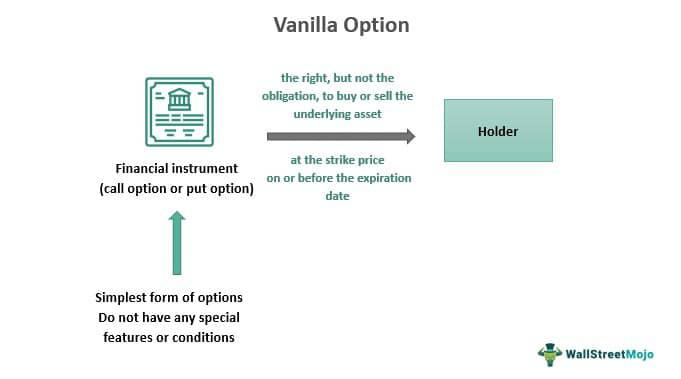

In the fast-paced world of finance, understanding complex jargon can often be a challenge for both newcomers and seasoned investors. This article aims to clarify some of the key financial terms, centering on 'plain vanilla' products and algorithmic trading. 'Plain vanilla' in finance refers to the most basic version of financial instruments such as options, bonds, and swaps, characterized by their simplicity and lack of complex features. These instruments are typically associated with lower risk and greater transparency, making them appealing to many investors. By comparing 'plain vanilla' products with more intricate financial instruments, we will explore their importance and utility in the broader financial landscape.

Algorithmic trading, which uses computer algorithms to automate trade execution, represents a significant technological advancement in trading practices. It enhances transaction speed and precision, potentially involving both plain vanilla and more exotic financial instruments. This intersection of algorithmic trading with 'plain vanilla' products highlights a blend of simplicity and technology, offering investors reliable and efficient trade executions.



By the end of this article, readers will have a comprehensive understanding of 'plain vanilla' finance products and algorithmic trading. Equipped with this knowledge, they will be better prepared to engage in financial conversations and make informed investment decisions, navigating the complexities of the financial world with increased confidence.

## Table of Contents

## What is Plain Vanilla in Finance?

'Plain vanilla' in finance denotes the simplest, most standard form of financial instruments, such as options, bonds, and swaps. These instruments lack the intricate features and structures found in more complex variants, making them straightforward and easier to comprehend. The fundamental nature of plain vanilla instruments aligns with lower risk profiles, particularly when compared to exotic financial instruments, which may incorporate complex and sometimes opaque conditions.

Plain vanilla instruments are crucial in financial markets due to their transparency and predictability. For example, a plain vanilla bond offers a fixed interest rate and a predetermined maturity date, without any additional features like convertibility or callability. This characteristic allows investors to easily forecast interest payments and principal repayment at maturity, minimizing uncertainties associated with fluctuating interest rates or conversion terms.

Similarly, plain vanilla options give holders the right, but not the obligation, to buy (call option) or sell (put option) an underlying asset at a set price before a certain date. This simplicity in structure aids in straightforward valuation, as opposed to exotic options that may entail varying payout structures under specific market conditions.

Interest rate swaps and currency swaps also exist in plain vanilla forms. A plain vanilla [interest rate](/wiki/interest-rate-trading-strategies) swap might involve swapping fixed interest payments for floating ones based on a standard benchmark rate, thereby easing the process of interest rate management for parties involved.

Beyond their role as financial instruments, the term 'plain vanilla' can also refer to fundamental investment strategies or straightforward financial approaches. The financial crisis of 2007-2008 underscored the risks associated with complex financial products, leading to a resurgence in the popularity of plain vanilla strategies. Investors and institutions gravitated towards these due to their reduced risk profile and operational simplicity, providing a refuge from the unpredictability and opacity that often accompany more elaborate financial instruments.

## Plain Vanilla Financial Instruments

Plain vanilla financial instruments represent the most straightforward and unembellished forms of financial products. These include plain vanilla bonds, options, and swaps, each offering simplicity and clarity, making them appealing to investors who prioritize transparency and predictability.

Plain vanilla bonds are fixed-income securities that provide regular interest payments at a predetermined rate, known as the coupon rate, for a specific term until maturity. Upon reaching maturity, the bondholder is repaid the principal amount initially invested. These bonds lack additional features like convertibility into equity, which distinguishes them from more complex bond types.

Vanilla options grant the holder the right, but not the obligation, to buy or sell an underlying asset at a specified strike price before the option expires. There are two primary types: call options, allowing the purchase of the asset, and put options, permitting its sale. These options, free from intricate conditions or payout structures, cater to investors aiming for straightforward risk management strategies.

Interest rate swaps in their plain vanilla form involve the exchange of fixed and floating interest rate payments between two parties. These agreements typically feature one party paying a fixed rate while the other pays a floating rate, often tied to a benchmark like the London Interbank Offered Rate (LIBOR). Similarly, foreign currency swaps involve exchanging principal and interest payments in different currencies, designed without additional frills or complexities.

The straightforward nature of plain vanilla instruments allows investors to focus on their fundamental characteristics, reducing uncertainties and enabling more predictable financial outcomes. This simplicity is particularly valued in an era where financial products often incorporate elaborate features that can complicate investment decisions. Consequently, plain vanilla instruments are frequently favored for their role in providing a stable and transparent investment landscape.

## Plain Vanilla vs. Exotic Options

Exotic options, as opposed to plain vanilla options, are financial derivatives with complex features and conditions, offering a wider array of payoffs and terms. These options cater to investors who are willing to undertake additional risk for potentially higher returns. Exotic options often require a sophisticated understanding of the markets, making them suitable primarily for experienced investors.

One primary distinction between plain vanilla and exotic options lies in their payout structures. Plain vanilla options provide the basic rights to buy or sell an underlying asset at a predetermined price before a certain expiration date. In contrast, exotic options can have multiple exercise dates, path-dependent payouts, or varying strike prices. For instance, binary options present a straightforward payoff scenario—yielding a fixed amount or nothing at all, depending on whether the underlying asset meets a predetermined condition.

Furthermore, exotic options are susceptible to higher risks. This increased risk is due to their complex conditions and varying sensitivity to factors such as [volatility](/wiki/volatility-trading-strategies) and time decay. Calculating the fair price of exotic options often involves advanced mathematical models and simulations, necessitating expertise in quantitative finance.

Despite the allure of potentially greater returns, many investors prefer the stability and simplicity offered by plain vanilla options. Plain vanilla options allow for clear, predictable strategies, such as covered calls or protective puts, without the need for intricate market calculations. While exotic options may serve as lucrative tools in certain speculative or hedging strategies, their complexity and inherent risks make plain vanilla options a more accessible choice for a broader range of market participants, particularly those seeking straightforward risk management tactics.

## Algorithmic Trading Explained

Algorithmic trading is a method of executing orders using automated pre-programmed trading instructions that account for variables such as time, price, and [volume](/wiki/volume-trading-strategy). This innovative approach to trading is characterized by its reliance on computer algorithms to [carry](/wiki/carry-trading) out orders at speeds and frequencies far beyond those possible for a human trader. Its primary advantage lies in its ability to process a vast number of transactions with precision and efficiency, minimizing the potential for human error. 

Algorithmic trading finds applications across a wide spectrum of financial instruments, ranging from simple "plain vanilla" products to more complex and customized "exotic" derivatives. Plain vanilla instruments are those with straightforward, standardized features, such as regular options or interest rate swaps. In contrast, exotic instruments are more complex, offering additional features like path dependency or barriers, which require more sophisticated trading algorithms.

Traders employ [algorithmic trading](/wiki/algorithmic-trading) for various strategic purposes. One common strategy is [market making](/wiki/market-making), where the algorithm continuously quotes both buy and sell prices to profit from the bid-ask spread. Another widely employed strategy is [arbitrage](/wiki/arbitrage), which involves leveraging price differentials of the same asset in different markets to secure a profit. Algorithms can detect these opportunities faster than any human, rapidly executing trades to exploit momentary inefficiencies. Trend following is another prevalent strategy, wherein the algorithm identifies and acts on the [momentum](/wiki/momentum) of price movements to capture profitable returns. By adhering to predefined criteria and adapting to market conditions, algorithmic trading supports a range of investment strategies aimed at optimizing returns and managing risks.

## Plain Vanilla in Algorithmic Trading Context

Algorithmic trading of plain vanilla instruments involves the execution of standardized financial trades using sophisticated computer algorithms. These trades often focus on instruments like plain vanilla options and swaps, valued for their straightforward structures and predictability. The appeal of these instruments lies in their simplicity, allowing algorithms to perform high-frequency transactions with remarkable speed and accuracy. This precision eliminates much of the manual intervention traditionally associated with trading, thereby minimizing potential human errors.

The employment of algorithms in trading plain vanilla instruments not only enhances execution speed but also significantly reduces operational costs. By automating the trading process, algorithms quickly identify and capitalize on opportunities in the market, executing trades in milliseconds. This capability is particularly advantageous in today's fast-paced financial environments where transactions occur in fractions of a second. 

Moreover, the scalability offered by algorithmic trading tools is crucial when handling large volumes of trades in the secondary market. These instruments can efficiently manage substantial transactional loads without exerting undue influence on market prices, maintaining market stability. This aspect is essential for maintaining [liquidity](/wiki/liquidity-risk-premium) and ensuring that large orders do not lead to significant price distortions.

The computational efficiency and effectiveness of algorithmic trading in this context can be exemplified by a simple Python snippet used to execute trades based on a predefined strategy:

```python
import numpy as np

# Example strategy: execute trade if price change exceeds a threshold
threshold = 0.02
prices = np.array([100.0, 100.5, 101.0, 102.0])  # Example prices

# Calculate percentage changes
percent_changes = np.diff(prices) / prices[:-1]

# Execute trade where condition is met
trades = percent_changes > threshold

print("Execute trades at indices:", np.where(trades))
```

In this code, trades are executed based on whether the percentage change in price exceeds a specified threshold. Such automation allows for rapid decision-making and execution, which human traders can hardly match in terms of speed and efficiency.

Overall, the use of algorithmic trading with plain vanilla instruments provides a robust framework for executing high-frequency trades swiftly and reliably while maintaining market equilibrium. This approach represents a significant technological advancement in trading methodologies, offering both reduced operational risks and improved market efficiency.

## Advantages and Disadvantages of Plain Vanilla Trading

Plain vanilla trading, characterized by its straightforward and uncomplicated nature, offers several advantages to investors. One of the foremost benefits is simplicity. Plain vanilla instruments, such as standard bonds, options, and swaps, feature clear and easily understandable structures. This simplicity reduces the learning curve for investors and makes these instruments more accessible, even to those without extensive financial expertise.

Transparency is another crucial advantage. The clear and standardized nature of plain vanilla products ensures investors are less likely to encounter uncertainties or hidden complexities. This transparency fosters trust and confidence in the financial instruments being traded, allowing investors to make informed decisions with a full understanding of the potential outcomes and risks.

Lower transaction costs often accompany plain vanilla products. The reduced complexity of these instruments typically translates to simplified processing and fewer fees. This cost efficiency can be particularly appealing in markets where transaction costs can significantly impact net returns.

Predictability in outcomes is a hallmark of plain vanilla instruments. Due to their straightforward nature, investors can more accurately forecast returns and assess risk exposure. This predictability can be quantified using models such as Black-Scholes for options pricing, where the variables are more easily modeled without the added layers of complexity found in exotic instruments.

Despite these advantages, plain vanilla trading is not without its limitations. One notable disadvantage is limited customization. Investors looking to tailor their financial strategies to specific needs or market conditions might find plain vanilla options insufficiently flexible. This lack of customization may prevent investors from maximizing potential gains or effectively hedging against specific risks.

Furthermore, the potential returns from plain vanilla instruments are often lower compared to their more complex counterparts, such as exotic options or structured products. While these exotic instruments might offer higher returns, they generally require a greater understanding of market dynamics and carry increased risk.

Investors must carefully weigh these advantages and disadvantages when selecting their investment strategies. The choice between plain vanilla and more complex financial instruments often boils down to an individual’s risk tolerance, financial goals, and level of expertise. Making informed decisions can involve quantitative analysis and financial modeling to evaluate the expected outcomes of various trading strategies. 

Here is a simple Python script illustrating how a fixed interest payment from a plain vanilla bond could be calculated over time:

```python
def fixed_coupon_payment(face_value, coupon_rate, periods):
    payments = [face_value * (coupon_rate / 100) for _ in range(periods)]
    return payments

# Example usage
face_value = 1000  # Bond face value
coupon_rate = 5    # Annual coupon rate in percentage
periods = 10       # Number of periods (years)

payments = fixed_coupon_payment(face_value, coupon_rate, periods)
print("Fixed Coupon Payments:", payments)
```
This code emphasizes the predictability and simplicity of the cash flow generated by plain vanilla bonds.

## Conclusion: Navigating Financial Terminology with Confidence

Understanding 'plain vanilla' finance concepts and algorithmic trading is essential for making informed investment decisions. Both approaches emphasize simplicity and predictability, offering a respite from the overwhelming complexity often associated with modern financial markets. 'Plain vanilla' products, including basic options, bonds, and swaps, provide a familiar and straightforward investment avenue, reducing uncertainty and facilitating clear decision-making. This simplicity is mirrored in algorithmic trading when dealing with these standard instruments, where the focus is on accuracy, efficiency, and the minimization of errors. 

With a solid grasp of these concepts, investors are better equipped to navigate the financial landscape confidently. They can more accurately predict potential outcomes and tailor their strategies to align with their risk tolerance and investment goals. This understanding is particularly vital in times of market volatility, where the clarity and stability offered by 'plain vanilla' investments can provide a necessary anchor.

Moreover, an emphasis on continued learning and adaptability is crucial as financial markets evolve with technological advancements and regulatory changes. Staying informed about new developments and innovations in the financial sector enables investors to enhance their strategies, potentially improving returns over time. Engaging in regular education, whether through formal courses, webinars, or financial publications, ensures that investors can capitalize on emerging opportunities while mitigating risks.

In conclusion, by integrating 'plain vanilla' finance concepts and algorithmic trading into their investment framework, investors can foster a balanced approach that combines security with strategic growth potential. This dual focus empowers them to participate in financial markets more confidently and effectively, paving the way for sustainable financial success.

## References & Further Reading

[1]: Hull, J. C. (2017). ["Options, Futures, and Other Derivatives"](https://www.semanticscholar.org/paper/Options%2C-Futures%2C-and-Other-Derivatives-Hull/89bdee500c8623864fc9eb7a471546aa713acc44). Pearson Education Limited.

[2]: Lopez de Prado, M. (2018). ["Advances in Financial Machine Learning"](https://www.amazon.com/Advances-Financial-Machine-Learning-Marcos/dp/1119482089). John Wiley & Sons.

[3]: Chan, E. P. (2009). ["Quantitative Trading: How to Build Your Own Algorithmic Trading Business"](https://github.com/ftvision/quant_trading_echan_book). John Wiley & Sons.

[4]: Aronson, D. R. (2007). ["Evidence-Based Technical Analysis: Applying the Scientific Method and Statistical Inference to Trading Signals"](https://www.amazon.com/Evidence-Based-Technical-Analysis-Scientific-Statistical/dp/0470008741). John Wiley & Sons.

[5]: Jansen, S. (2020). ["Machine Learning for Algorithmic Trading"](https://github.com/stefan-jansen/machine-learning-for-trading). Packt Publishing.

[6]: Fabozzi, F. J., & Mann, S. V. (2005). ["The Handbook of Fixed Income Securities"](https://www.mhebooklibrary.com/doi/book/10.1036/9781260473902?contentTab=true). McGraw-Hill Education.