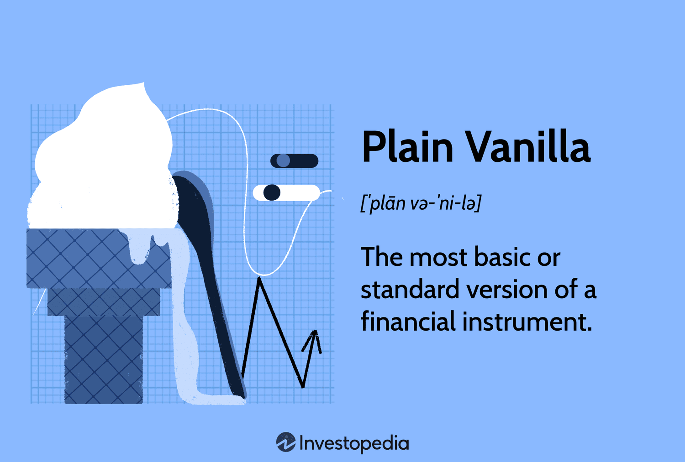

## Table of Contents

## What does 'Plain Vanilla' mean in the context of finance?

In finance, 'Plain Vanilla' is a term used to describe the simplest and most basic version of a financial instrument or product. This means it doesn't have any special features or complicated parts. For example, a plain vanilla bond is one that just pays interest regularly and returns the principal at the end. It's like the basic model of a car - no extra gadgets or fancy options.

People often use plain vanilla products because they are easy to understand and less risky than more complex options. They are a good choice for someone who wants something straightforward and reliable. In trading, a plain vanilla option is one that gives the buyer the right to buy or sell an asset at a set price before a certain date, without any additional conditions.

## How does a plain vanilla option differ from other types of options?

A plain vanilla option is the simplest kind of option you can buy or sell. It gives you the right, but not the obligation, to buy or sell an asset at a set price before a certain date. This is called the strike price and expiration date. There are two types: a call option, which lets you buy the asset, and a put option, which lets you sell it. That's all a plain vanilla option does - nothing fancy or complicated.

Other types of options have extra features that make them more complex. For example, a binary option pays out a fixed amount if a certain condition is met, like if a stock price reaches a certain level. An exotic option might have features like barriers or knock-outs, where the option becomes active or inactive if the asset price hits a certain level. These options can be more risky and harder to understand, but they can also offer different ways to make money or manage risk.

## Can you explain the basic structure of a plain vanilla bond?

A plain vanilla bond is the simplest type of bond you can buy. It's like a loan you give to a company or government. When you buy a plain vanilla bond, you are lending money to the issuer, and in return, they promise to pay you back the amount you lent, called the principal, at the end of the bond's term. They also pay you interest regularly, usually every six months or once a year, until the bond matures.

The [interest rate](/wiki/interest-rate-trading-strategies) on a plain vanilla bond is fixed, which means it stays the same for the whole time you own the bond. This makes it easy to know how much money you will get and when. Because plain vanilla bonds are simple and predictable, they are popular with people who want a steady income without taking too much risk.

## What are the advantages of investing in plain vanilla financial instruments?

Investing in plain vanilla financial instruments has several advantages. They are easy to understand because they don't have any complicated features. For example, a plain vanilla bond just pays you interest regularly and gives you your money back at the end. This simplicity makes them less risky than more complex products. If you're new to investing or just want something straightforward, plain vanilla instruments are a good choice.

Another advantage is that plain vanilla instruments are often more predictable. With a plain vanilla option, you know exactly what you're getting - the right to buy or sell an asset at a set price before a certain date. This predictability can help you plan your investments better. Plus, because they are so common, it's usually easier to buy and sell them, which means you can get in and out of your investment more easily.

## How do plain vanilla swaps work, and what are their common uses?

A plain vanilla swap is a simple type of financial agreement between two parties to exchange cash flows over a set period. Usually, one party agrees to pay a fixed interest rate, while the other pays a floating interest rate that changes with market conditions. This swap helps both parties manage their interest rate risk. For example, a company with a loan that has a floating interest rate might use a swap to switch to a fixed rate, making their payments more predictable.

Plain vanilla swaps are commonly used by businesses and financial institutions to manage their exposure to interest rate changes. A company might use a swap to turn a variable-rate loan into a fixed-rate loan, which can help them budget more effectively. Banks and other financial institutions use swaps to balance their portfolios, ensuring they are not too exposed to changes in interest rates. This type of swap is popular because it's straightforward and easy to understand, making it a reliable tool for managing financial risk.

## What are the risks associated with plain vanilla investments?

Even though plain vanilla investments are simple and easy to understand, they still come with some risks. One risk is interest rate risk. If you have a bond that pays a fixed interest rate, and interest rates go up, the value of your bond might go down. This is because new bonds will be issued with higher interest rates, making your bond less attractive to other investors. Another risk is credit risk, which means the chance that the company or government you lent money to might not be able to pay you back. If they run into financial trouble, you could lose some or all of your investment.

Another risk to consider is inflation risk. If inflation goes up, the money you get from your investment might not be worth as much as when you first invested. This can happen with bonds that pay a fixed interest rate. Over time, the purchasing power of the money you get back could be less than what you expected. While plain vanilla investments are generally safer than more complex ones, it's still important to understand these risks and think about how they might affect your investment goals.

## How do plain vanilla products fit into a diversified investment portfolio?

Plain vanilla products are a great fit for a diversified investment portfolio because they are simple and easy to understand. They can help balance out riskier investments. For example, if you have some money in stocks that can go up and down a lot, you might also want to put some money in plain vanilla bonds. These bonds pay you a steady interest and give your money back at the end, which can help keep your portfolio stable.

Adding plain vanilla products to your portfolio can also help you manage different kinds of risk. For instance, if you're worried about interest rates going up, you might use a plain vanilla swap to turn a variable interest rate into a fixed one. This can make your income more predictable. By mixing plain vanilla investments with other types, you can create a portfolio that is both safe and has the potential to grow.

## What is the impact of market conditions on plain vanilla financial instruments?

Market conditions can affect plain vanilla financial instruments in different ways. For example, if interest rates go up, the value of a plain vanilla bond that pays a fixed interest rate might go down. This happens because new bonds will be issued with higher interest rates, making your bond less attractive to other investors. On the other hand, if interest rates go down, the value of your bond might go up because it's paying a higher rate than new bonds.

Another way market conditions can impact plain vanilla instruments is through inflation. If inflation goes up, the money you get from your investment might not be worth as much as when you first invested. This is especially true for bonds that pay a fixed interest rate. Over time, the purchasing power of the money you get back could be less than what you expected. So, even though plain vanilla investments are simple, they are still affected by what's happening in the market.

## How can plain vanilla options be used for hedging purposes?

Plain vanilla options can be used for hedging to protect against price changes in an asset. For example, if you own a stock and you're worried its price might go down, you can buy a plain vanilla put option. This gives you the right to sell the stock at a set price, even if the market price drops lower. By doing this, you limit your potential loss because you can still sell the stock at the higher price you set with the option.

Another way to use plain vanilla options for hedging is with a call option. If you need to buy a certain asset in the future and you're worried its price might go up, you can buy a call option. This gives you the right to buy the asset at a set price, even if the market price goes higher. This way, you can protect yourself from having to pay more for the asset if prices rise. Both put and call options help you manage risk by setting a price you're comfortable with, no matter what the market does.

## What are some advanced strategies involving plain vanilla derivatives?

One advanced strategy involving plain vanilla derivatives is called a covered call. This is when you own a stock and sell a call option on that stock. You get money from selling the option, which can help you earn extra income. But, if the stock price goes up a lot, you might have to sell your stock at the price set in the option, which could mean missing out on bigger gains. This strategy is good if you think the stock price will stay the same or go up a little, but not too much.

Another strategy is called a protective put. This is when you own a stock and buy a put option on that stock. The put option gives you the right to sell the stock at a set price, which can protect you if the stock price goes down. It's like buying insurance for your stock. This strategy is useful if you want to keep your stock but are worried about losing money if the price drops. Both of these strategies use plain vanilla options to help manage risk and potentially make more money.

## How do regulatory frameworks affect the trading of plain vanilla securities?

Regulatory frameworks play a big role in how plain vanilla securities are traded. They set rules that everyone has to follow to make sure the market is fair and safe. For example, regulators might require companies to share important information about their bonds or stocks so that investors can make smart choices. They also keep an eye on how these securities are bought and sold to stop any cheating or fraud. This helps keep the market honest and protects people who invest their money.

These rules can also affect how easy or hard it is to trade plain vanilla securities. Sometimes, regulations might make it more expensive or complicated to buy and sell these securities. For instance, there might be rules about how much money you need to have or what kind of information you need to give before you can trade. But, these rules are there to make sure that everyone plays by the same rules and that the market stays stable and trustworthy.

## What future trends might influence the use of plain vanilla financial products?

In the future, technology might change how people use plain vanilla financial products. More people might use apps and online platforms to buy and sell these simple investments. This could make it easier for everyone to invest, even if they don't know a lot about finance. Also, new technology like blockchain might make trading these products faster and safer. This could make plain vanilla securities even more popular because they are easy to understand and now even easier to use.

Another trend that might affect plain vanilla financial products is changes in interest rates and inflation. If interest rates go up, people might want to buy more plain vanilla bonds to get a higher fixed interest rate. But if inflation goes up a lot, people might look for other investments that can keep up with rising prices. Governments and regulators might also change the rules about these products, which could make them more or less attractive to investors. Keeping an eye on these trends can help people decide if plain vanilla investments are right for them.

## References & Further Reading

[1]: Hull, J. C. (2017). ["Options, Futures, and Other Derivatives"](https://www.semanticscholar.org/paper/Options%2C-Futures%2C-and-Other-Derivatives-Hull/89bdee500c8623864fc9eb7a471546aa713acc44). Pearson Education Limited.

[2]: Lopez de Prado, M. (2018). ["Advances in Financial Machine Learning"](https://www.amazon.com/Advances-Financial-Machine-Learning-Marcos/dp/1119482089). John Wiley & Sons.

[3]: Chan, E. P. (2009). ["Quantitative Trading: How to Build Your Own Algorithmic Trading Business"](https://github.com/ftvision/quant_trading_echan_book). John Wiley & Sons.

[4]: Aronson, D. R. (2007). ["Evidence-Based Technical Analysis: Applying the Scientific Method and Statistical Inference to Trading Signals"](https://www.amazon.com/Evidence-Based-Technical-Analysis-Scientific-Statistical/dp/0470008741). John Wiley & Sons.

[5]: Jansen, S. (2020). ["Machine Learning for Algorithmic Trading"](https://github.com/stefan-jansen/machine-learning-for-trading). Packt Publishing.

[6]: Fabozzi, F. J., & Mann, S. V. (2005). ["The Handbook of Fixed Income Securities"](https://www.mhebooklibrary.com/doi/book/10.1036/9781260473902?contentTab=true). McGraw-Hill Education.