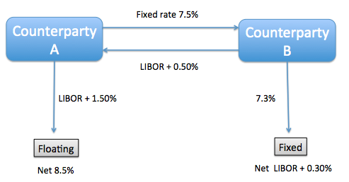

## Table of Contents

## What is a Plain Vanilla Swap?

A Plain Vanilla Swap is a type of financial agreement between two parties to exchange cash flows over a set period. It's the most basic and common form of interest rate swap. In a Plain Vanilla Swap, one party agrees to pay a fixed interest rate on a notional principal amount, while the other party agrees to pay a floating interest rate on the same notional principal amount. The notional principal is just a reference amount used to calculate the interest payments, and it's not actually exchanged between the parties.

These swaps are often used by companies and investors to manage their exposure to interest rate fluctuations. For example, a company with a loan that has a floating interest rate might use a Plain Vanilla Swap to switch to a fixed rate, giving them more certainty about their future interest payments. On the other hand, an investor who expects interest rates to rise might use a swap to switch from a fixed rate to a floating rate, hoping to benefit from the increase. Plain Vanilla Swaps are popular because they are straightforward and can be customized to meet the specific needs of the parties involved.

## What are the key components of a Plain Vanilla Swap?

The key components of a Plain Vanilla Swap include the notional principal, the fixed interest rate, and the floating interest rate. The notional principal is the amount used to calculate the interest payments, but it's not actually exchanged between the parties. One party agrees to pay a fixed interest rate on this notional amount, which means the interest rate stays the same throughout the swap's term. The other party agrees to pay a floating interest rate, which means the interest rate can change over time, usually based on a benchmark like LIBOR or the federal funds rate.

The swap also has a start date and an end date, which define the period over which the cash flows are exchanged. The frequency of the payments is another important component, as the parties need to agree on how often they will exchange payments, such as monthly, quarterly, or annually. Finally, the swap agreement will include details on how the floating rate is determined and any other terms and conditions that the parties agree upon. These components together make up the structure of a Plain Vanilla Swap, allowing both parties to manage their interest rate exposure effectively.

## How does a Plain Vanilla Swap work?

A Plain Vanilla Swap is a deal between two people or companies where they agree to swap money based on interest rates. One person pays a fixed interest rate on a big number called the notional principal, and the other person pays a floating interest rate on the same big number. The notional principal is just used to figure out how much money to swap, but they don't actually give each other that big number. They only swap the interest payments.

For example, let's say Company A has a loan with a floating interest rate, but they want to know exactly how much they'll pay each time. They can use a Plain Vanilla Swap to switch to a fixed rate. They'll find Company B, who agrees to pay the floating rate to Company A's bank, while Company A pays Company B a fixed rate. This way, Company A knows exactly what they'll pay, and Company B might be betting that the floating rate will go down, so they'll pay less than they get from Company A. They keep doing this until the swap ends, which could be years later.

## What are the typical uses of Plain Vanilla Swaps?

Plain Vanilla Swaps are often used by companies and investors to manage their money better. A company might have a loan with a floating interest rate, which means the interest they pay can go up or down. If they want to know exactly how much they'll pay each time, they can use a Plain Vanilla Swap to switch to a fixed rate. This way, they can plan their budget better because they know what their interest payments will be. It's like turning a surprise into something predictable.

Investors also use Plain Vanilla Swaps to make money or protect their investments. If an investor thinks that interest rates will go up, they might use a swap to switch from a fixed rate to a floating rate. This way, if rates do go up, they'll pay less interest and might make more money. It's a way for them to bet on what they think will happen with interest rates, and it can help them make smarter choices with their money.

## Who are the typical participants in a Plain Vanilla Swap?

The typical participants in a Plain Vanilla Swap are companies and financial institutions. Companies often use these swaps to manage their debt. For example, a company might have a loan with a floating interest rate, but they want to know exactly how much they'll pay each time. They can use a Plain Vanilla Swap to switch to a fixed rate, which helps them plan their budget better. Financial institutions, like banks, also participate in these swaps. They might use them to help their clients manage interest rate risk or to make money by betting on interest rate movements.

Investors are another group that often participates in Plain Vanilla Swaps. They might use these swaps to protect their investments or to make money. For instance, if an investor thinks that interest rates will go up, they might use a swap to switch from a fixed rate to a floating rate. This way, if rates do go up, they'll pay less interest and might make more money. It's a way for them to bet on what they think will happen with interest rates, and it can help them make smarter choices with their money.

## What are the benefits of using a Plain Vanilla Swap?

Using a Plain Vanilla Swap can help companies and investors manage their money better. For a company with a loan that has a floating interest rate, a swap can turn that into a fixed rate. This means they know exactly how much they'll pay each time, which helps them plan their budget without surprises. It's like turning a roller coaster into a straight line, making it easier to manage their money.

Investors also find Plain Vanilla Swaps useful. If an investor thinks that interest rates will go up, they can use a swap to switch from a fixed rate to a floating rate. This way, if rates do go up, they'll pay less interest and might make more money. It's a way for them to bet on what they think will happen with interest rates, and it can help them make smarter choices with their money.

## What are the risks associated with Plain Vanilla Swaps?

Using Plain Vanilla Swaps can be risky. One big risk is that interest rates might not move the way you expect. If you switch to a fixed rate thinking rates will go up, but they actually go down, you'll end up paying more than you would have. It's like betting on a horse race and picking the wrong horse. Another risk is that the other person in the swap might not be able to pay what they owe. If they go bankrupt or have money problems, you might not get the money you were expecting.

There's also the risk of not understanding the swap fully. If you don't know all the details and how it works, you might make a bad decision. It's like trying to play a game without knowing the rules. Lastly, there can be costs involved, like fees for setting up the swap or taxes. These costs can add up and make the swap less beneficial than you thought. It's important to think about all these risks before deciding to use a Plain Vanilla Swap.

## How is the interest rate determined in a Plain Vanilla Swap?

In a Plain Vanilla Swap, there are two kinds of interest rates: a fixed rate and a floating rate. The fixed rate is set at the beginning of the swap and stays the same for the whole time. It's like agreeing to pay the same amount every month on a bill. The floating rate, on the other hand, can change over time. It's usually based on a benchmark like LIBOR or the federal funds rate, which means it goes up or down depending on what's happening in the economy.

The floating rate is figured out at set times during the swap, like every month or every three months. When it's time to make a payment, the floating rate is looked up and used to calculate how much money needs to be swapped. This means that one person might pay more or less than they did last time, depending on what the benchmark rate is doing. It's like having a bill that changes every month based on something you can't control.

## What is the difference between a fixed rate and a floating rate in a Plain Vanilla Swap?

In a Plain Vanilla Swap, a fixed rate is an interest rate that stays the same for the whole time of the swap. It's like agreeing to pay the same amount every month on a bill. When you choose a fixed rate, you know exactly how much you'll pay, which can help you plan your budget without any surprises. This is good if you want to avoid the ups and downs of interest rates.

A floating rate, on the other hand, can change over time. It's usually based on a benchmark like LIBOR or the federal funds rate, which means it goes up or down depending on what's happening in the economy. When it's time to make a payment, the floating rate is looked up and used to calculate how much money needs to be swapped. This means that one person might pay more or less than they did last time, depending on what the benchmark rate is doing. It's like having a bill that changes every month based on something you can't control.

## How are Plain Vanilla Swaps priced and valued?

Pricing and valuing a Plain Vanilla Swap involves figuring out what it's worth today and how much it should cost to set up. The value of a swap is based on the difference between the fixed rate and the expected future floating rates. If the fixed rate is higher than what people think the floating rate will be, the swap has a negative value for the person paying the fixed rate. If the fixed rate is lower, it has a positive value for them. To find this out, people use something called a discount factor, which is a way to figure out what future money is worth today. They also look at the yield curve, which shows what interest rates are expected to be in the future.

To price a Plain Vanilla Swap, you need to know the notional principal, the fixed rate, the floating rate benchmark, and how often payments will be made. The price is usually the present value of the expected future cash flows. This means you take all the payments that will happen in the future and figure out what they're worth today. If the swap is just starting, the price is usually set so that the value is zero for both sides. This is called the swap rate, and it's the fixed rate that makes the swap fair for both people. As time goes on and interest rates change, the value of the swap can go up or down, and that's how it's valued later on.

## What are the legal and regulatory considerations for Plain Vanilla Swaps?

When using Plain Vanilla Swaps, there are important legal and regulatory things to think about. Different countries have their own rules about swaps, and you need to follow them. In the United States, for example, the Dodd-Frank Act put in place rules to make swaps safer and more transparent. This means that swaps have to be reported to special places called swap data repositories, and some swaps need to be traded on special platforms called swap execution facilities. It's important to know these rules so you don't get in trouble and so your swap works the way you want it to.

There are also legal documents that need to be in place for a Plain Vanilla Swap. The most common one is the ISDA Master Agreement, which is made by the International Swaps and Derivatives Association. This agreement sets out the terms and conditions for the swap, like what happens if one person can't pay or if there's a disagreement. It's like a rulebook for the swap that both people agree to follow. Making sure you have the right legal documents and follow the right regulations is key to using Plain Vanilla Swaps safely and effectively.

## How do Plain Vanilla Swaps compare to other types of swaps?

Plain Vanilla Swaps are the simplest and most common type of interest rate swap. They involve one party paying a fixed interest rate and the other paying a floating interest rate on a notional principal amount. This type of swap is straightforward and widely used by companies and investors to manage their interest rate exposure. For example, a company might use a Plain Vanilla Swap to turn a floating rate loan into a fixed rate loan, giving them more certainty about their future payments. Investors might use it to bet on interest rate movements, hoping to make money if rates go up or down as they expect.

Other types of swaps, like currency swaps and commodity swaps, are more complex and serve different purposes. A currency swap involves exchanging principal and interest payments in one currency for those in another currency, which can be useful for companies doing business in different countries. Commodity swaps, on the other hand, involve exchanging a fixed price for a commodity for a floating price, which can help companies manage the risk of price changes in things like oil or wheat. While Plain Vanilla Swaps focus on interest rates, these other swaps deal with different kinds of financial risks, making them useful in different situations.

## References & Further Reading

[1]: Hull, J. C. (2018). ["Options, Futures, and Other Derivatives"](https://www.semanticscholar.org/paper/Options%2C-Futures%2C-and-Other-Derivatives-Hull/89bdee500c8623864fc9eb7a471546aa713acc44) (9th Edition). Pearson.

[2]: Lopez de Prado, M. (2018). ["Advances in Financial Machine Learning"](https://www.amazon.com/Advances-Financial-Machine-Learning-Marcos/dp/1119482089) Wiley.

[3]: Aronson, D. R. (2006). ["Evidence-Based Technical Analysis: Applying the Scientific Method and Statistical Inference to Trading Signals"](https://www.amazon.com/Evidence-Based-Technical-Analysis-Scientific-Statistical/dp/0470008741). Wiley.

[4]: Jansen, S. (2020). ["Machine Learning for Algorithmic Trading - Second Edition"](https://github.com/stefan-jansen/machine-learning-for-trading). Packt Publishing.

[5]: Chan, E. P. (2009). ["Quantitative Trading: How to Build Your Own Algorithmic Trading Business"](https://github.com/ftvision/quant_trading_echan_book). Wiley.

[6]: Fabozzi, F. J., Skinner, D. J., & Racca, P. D. (2011). ["Interest Rate Swaps and Their Derivatives: A Practitioner's Guide"](https://onlinelibrary.wiley.com/doi/book/10.1002/9781118267028). Wiley Finance.

[7]: Treynor, J. L. (1995). "Algorithmic Trading Systems," Journal of Portfolio Management, 21(2), 15-21.