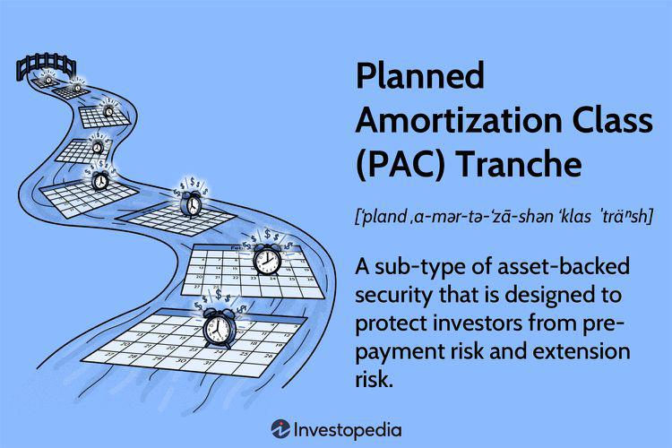

In the complex world of structured finance, Planned Amortization Class (PAC) tranches play a significant role in offering stability to investors. As a crucial component of collateralized mortgage obligations (CMOs), PAC tranches are designed to provide more predictable cash flows by mitigating risks such as prepayment and extension issues commonly associated with asset-backed securities.

PAC tranches achieve this stability through a defined repayment schedule and the use of mechanisms that prioritize cash flows, thereby shielding investors from the volatility of underlying asset repayments. By setting specific upper and lower bands, known as the PAC collar, these structures can accommodate varying interest rate environments and fluctuating prepayment rates while maintaining consistent repayment patterns. This ability to offer stable returns in uncertain market conditions makes them an attractive option for conservative investors, especially those seeking to hedge against interest rate risks.



The integration of PAC tranches within the broader framework of structured finance also highlights their significance. They serve as buffers, improving the resilience of portfolios by minimizing the exposure to unpredictable prepayment speeds. As a result, they are integral to creating structured finance strategies that prioritize risk management over maximal yields.

Beyond traditional finance, PAC tranches have assumed importance in algorithmic trading, where they are evaluated for their risk-adjusted returns. Modern trading algorithms, deploying sophisticated financial models, utilize these securities to develop and adjust dynamic portfolio strategies. The inherent predictability of PAC tranches makes them a favorable choice for algorithms that balance risk with yield enhancement by diversifying within complex portfolios.

Furthermore, understanding PAC tranches is essential for investors and institutions aiming to navigate the modern financial environment effectively. As technology continues to advance, the methods for managing and optimizing PAC tranches have evolved, allowing for more precise alignment with market conditions and investment objectives. The ongoing development in this space underscores the importance of PAC tranches in achieving stable investment outcomes. As such, a comprehensive grasp of how PAC tranches function and their applications in structured finance and algorithmic trading is vital in the pursuit of sustainable and profitable investments.

## Table of Contents

## Understanding PAC Tranches

Planned Amortization Class (PAC) tranches are integral components of asset-backed securities (ABS) structures, specifically designed to mitigate prepayment and extension risks for investors. These tranches offer predictability in terms of cash flow distribution, catering to investors' needs for stability, especially in fluctuating market conditions.

The primary feature that defines a PAC tranche is its structured payment schedule. This schedule is determined based on a set of assumptions referred to as the PAC collar. The PAC collar establishes the range of possible prepayment speeds, typically measured in Conditional Prepayment Rates (CPR), within which the tranche is expected to perform optimally. The PAC collar ensures that the cash flows remain stable, provided the actual prepayment rate of the underlying assets stays within this defined range.

Mathematically, this can be represented by the formula for expected cash flows $CF(t)$ for a PAC tranche at time $t$:

$$
CF(t) = \sum_{i=1}^{n} (P_i \times S(t,i))
$$

Where:
- $CF(t)$ is the cash flow at time $t$
- $P_i$ represents the principal amount for the $i$-th installment
- $S(t,i)$ is the scheduled payment for the $i$-th installment at time $t$
- $n$ is the number of scheduled installments

Within these parameters, PAC tranches offer a blend of security and predictability, serving as a buffer against the unknowns of prepayment behavior. This characteristic makes them particularly appealing to investors looking for reliable returns, even when broader market conditions exhibit significant [volatility](/wiki/volatility-trading-strategies). Consequently, PAC tranches find favor among conservative investors who prioritize risk-adjusted, consistent income streams over higher yields subject to greater uncertainty.

The inherent stability of PAC tranches is pivotal in markets characterized by erratic movements, as these securities aim to keep cash flow disturbances to a minimum. Thus, they play crucial roles in structured asset-backed products, ensuring a disciplined and predictable outflow of payments to investors.

## Role and Function in Structured Finance

Planned Amortization Class (PAC) tranches serve as a crucial component of structured finance, which is a framework designed to pool financial assets to mitigate risk and improve [liquidity](/wiki/liquidity-risk-premium). PAC tranches specifically grapple with managing prepayment risks associated with asset-backed securities (ABS). These tranches are engineered to stabilize cash flows within the ABS structure, offering a robust mechanism to handle the uncertainty of prepayment speeds by operating through predetermined amortization schedules.

PAC tranches are meticulously structured to deliver the most stable cash flow available among different tranches in an ABS structure. This stability is achieved through a mechanism known as the PAC collar, which is a range of prepayment speeds within which the payments to the PAC tranche can be maintained according to a schedule. By adhering to this disciplined payment schedule, despite fluctuations in actual prepayment speeds, PACs provide predictability and stability, benefiting investors seeking lower-risk investment opportunities.

Although PAC tranches offer lower yields compared to other tranches within the same ABS pool, their ability to mitigate risk makes them indispensable in structured finance strategies. They absorb the volatility associated with actual prepayment rates differing from expectations, redistributing that risk to companion tranches. This redistribution adds value to the investment strategy by promising investors a more secure cash flow stream, albeit at a lower potential return.

The position of PAC tranches in structured finance is akin to that of a buffer, absorbing the irregularities and unpredictabilities of prepayment patterns while maintaining scheduled payments. This characteristic fortifies the overall structure against performance volatility, thereby stabilizing the asset-backed security portfolios. With these risk management capabilities, PAC tranches become an integral part of investment strategies within the structured finance landscape, offering crucial stability and predictability.

## Algorithmic Trading and PAC Tranches

Algorithmic trading algorithms utilize PAC tranches by assessing their risk-adjusted returns under diverse market conditions. These tranches are engineered to deliver stable cash flows, benefiting algorithmic traders who seek to construct portfolios with optimal risk-reward profiles. By incorporating PAC tranches, traders can leverage their predictability to counterbalance more volatile investments, potentially enhancing overall portfolio stability.

The integration of PAC tranches into trading strategies involves the use of sophisticated models that account for their unique characteristics. These models analyze prepayment risk, [interest rate](/wiki/interest-rate-trading-strategies) changes, and extension risks, allowing traders to predict and manage cash flow variability. This predictability enables the creation of strategies that exploit [arbitrage](/wiki/arbitrage) opportunities and adjust dynamically to market shifts, thereby optimizing the yield of the investment portfolio.

Traders employ quantitative tools and techniques to model the performance of PAC tranches within a portfolio. Techniques such as Monte Carlo simulations and Value at Risk (VaR) calculations are commonly used to forecast potential market scenarios and assess the impact on PAC tranche holdings. For instance, a Monte Carlo simulation might be used to generate a wide range of potential future interest rate scenarios, which can help in understanding how PAC tranches will behave under varying conditions.

The ability to forecast cash flows accurately is further bolstered by the predictable nature of PAC tranches. This predictability makes them appealing for automated trading strategies that rely on [statistical arbitrage](/wiki/statistical-arbitrage). Additionally, high-frequency trading systems often incorporate PAC tranches due to their stable cash flows, which can be used to hedge against more unpredictable investments.

Furthermore, [machine learning](/wiki/machine-learning) algorithms can enhance the management of PAC tranches by providing deeper insights into market behavior and identifying subtle patterns that might not be obvious through traditional analysis. These insights can aid in continuously refining trading strategies, ensuring that they adapt to both current and anticipated market conditions.

In summary, PAC tranches are integral to [algorithmic trading](/wiki/algorithmic-trading) strategies due to their stability and predictability. Traders leverage these characteristics to build robust portfolios that effectively balance risk and potential yield, using advanced quantitative models and [artificial intelligence](/wiki/ai-artificial-intelligence) to optimize trading performance in structured finance markets.

## Challenges and Risks

Planned Amortization Class (PAC) tranches, while offering distinct advantages in structured finance due to their predictable cash flows, are nonetheless susceptible to several challenges and risks. One prominent risk is the possibility of experiencing a "busted PAC" scenario. This occurs when actual prepayment rates, which represent the speed at which underlying loans are repaid, deviate significantly from forecasted assumptions. If these prepayment speeds are faster than anticipated, it can result in a shortage of companion tranches whose primary role is to absorb fluctuations. Consequently, PAC tranches face potential early amortization, altering their anticipated cash flow structure.

Furthermore, a premature depletion of companion tranches is a critical issue. These companion tranches act as a buffer, maintaining the cash flow consistency for the PAC tranches. When these are exhausted, PAC tranches may confront maturity adjustments, thus compromising their structure's integrity. This can lead to unpredictability in cash flows, impacting the investment portfolios that hold these securities.

To mitigate these risks, financial institutions require dynamic risk management strategies. This involves deploying sensitivity analyses and scenario testing to predict cash flow variability under various conditions. For example, a Monte Carlo simulation can be utilized to model numerous prepayment scenarios and assess the impact on PAC tranches. Implementing Python code for such simulations might involve:

```python
import numpy as np

def monte_carlo_simulation(num_simulations, initial_balance, prepayment_rate):
    results = []
    for _ in range(num_simulations):
        balance = initial_balance
        cash_flow = 0
        while balance > 0:
            cash_flow += prepayment_rate * balance
            balance -= prepayment_rate * balance
        results.append(cash_flow)
    return np.mean(results), np.std(results)

mean_cash_flow, std_dev = monte_carlo_simulation(10000, 1000000, 0.05)
```

Risk management also includes the constant monitoring of market conditions and adjusting investment strategies in real-time. Financial institutions benefit by incorporating sophisticated algorithms and analytical tools to recalibrate their exposure to PAC tranches dynamically, aiming to align with shifting market realities and investor objectives effectively. These adaptations are crucial for maintaining the stability and profitability that investors seek from PAC tranches, despite the inherent uncertainties in prepayment behaviors and market movements.

## Technological Innovations in Managing PAC Tranches

Advanced financial modeling and artificial intelligence (AI) technologies play a pivotal role in managing Planned Amortization Class (PAC) tranches. These technologies are designed to enhance risk prediction and management capabilities, ensuring that these tranches remain a stable component of structured finance portfolios.

The utilization of sophisticated analytics and predictive modeling allows financial institutions to refine their strategies concerning PAC tranches. AI-driven models can process vast amounts of market data to identify patterns and forecast changes in prepayment and interest rates. This enables institutions to adjust their strategies in real-time, aligning investment objectives closely with prevailing market conditions. For instance, machine learning algorithms can be trained to recognize signals that suggest shifts in prepayment speeds, thereby enabling quicker, data-informed decision-making.

Real-time strategy adjustment is facilitated by technology through dynamic data processing and algorithmic assessment tools. Such tools allow portfolio managers to respond to market fluctuations seamlessly, ensuring that the allocation of PAC tranches remains optimized for both risk mitigation and yield enhancement. By continuously monitoring market indicators, these systems can rebalance portfolios to maintain desired risk/reward profiles.

The integration of robust analytical tools utilizes technology to optimize PAC tranche allocations. For instance, the construction of a PAC tranche portfolio might involve the following Python code snippet for calculating adjusted returns based on varying prepayment scenarios:

```python
import numpy as np

def calculate_adjusted_returns(cash_flows, prepayment_rate, interest_rate):
    adjusted_returns = []
    for cf in cash_flows:
        adjusted_cf = cf * (1 + interest_rate - prepayment_rate)
        adjusted_returns.append(adjusted_cf)
    return np.sum(adjusted_returns) / len(adjusted_returns)

cash_flows = [1000, 1000, 1000, 1000]  # Sample cash flows
prepayment_rate = 0.02  # 2% prepayment rate
interest_rate = 0.05  # 5% interest rate

adjusted_returns = calculate_adjusted_returns(cash_flows, prepayment_rate, interest_rate)
print("Adjusted Returns:", adjusted_returns)
```

This script adjusts cash flows according to specified prepayment and interest rates, providing insights into potential returns under different scenarios—a crucial aspect of risk management in PAC tranches.

The synergy of technological innovations and financial strategies offers a robust framework for handling the complexities of PAC tranches within structured finance. Enhanced predictive capabilities and real-time data processing ensure that investment strategies remain agile and aligned to deliver optimal risk-adjusted returns.

## Conclusion

Planned Amortization Class (PAC) tranches play an essential role within structured finance, offering distinct benefits alongside inherent risks. These securities are designed to provide stability and predictability in cash flows, which is highly valued by investors navigating volatile market conditions. The ability of PAC tranches to mitigate prepayment and extension risks makes them a reliable investment option within asset-backed securities.

The integration of PAC tranches with algorithmic trading strategies has been significantly enhanced by technological advancements. As sophisticated models and tools emerge, traders leverage these technologies to more accurately assess the risk-adjusted returns of PAC tranches. This technological synergy allows for the development of more balanced and diversified portfolios, maximizing the efficiency and effectiveness of investment strategies involving PAC tranches.

Looking forward, the financial market is continuously evolving with emerging trends and new challenges. In such a dynamic environment, understanding PAC tranches' unique properties and managing their associated risks will remain crucial. Financial institutions and investors must stay informed about advancements in technology and risk management techniques to continue securing stable and profitable investments. Appropriately leveraging these tools and strategies ensures that PAC tranches maintain their valuable position within the structured finance ecosystem, contributing to overall market stability.

## References & Further Reading

[1]: Fabozzi, F. J., Bhattacharya, A., & Berliner, W. S. (2011). ["Mortgage-Backed Securities: Products, Structuring, and Analytical Techniques"](https://archive.org/details/mortgagebackedse0000fabo). John Wiley & Sons.

[2]: Investopedia. ["Planned Amortization Class Tranche - PAC Tranche."](https://www.investopedia.com/terms/p/pactranche.asp) 

[3]: Hayre, L. S. (2001). ["Salomon Smith Barney Guide to Mortgage-Backed and Asset-Backed Securities"](https://archive.org/details/isbn_0471385875). John Wiley & Sons.

[4]: Goodman, L. S., Li, J., Lucas, D., Zimmerman, T., & Fabozzi, F. J. (2008). ["Subprime Mortgage Credit Derivatives."](https://onlinelibrary.wiley.com/doi/book/10.1002/9781118267165) John Wiley & Sons.

[5]: Choudhry, M. (2012). ["The Mechanics of Securitization: A Practical Guide to Structuring and Closing Asset-Backed Security Transactions."](https://www.wiley.com/en-us/The+Mechanics+of+Securitization:+A+Practical+Guide+to+Structuring+and+Closing+Asset+Backed+Security+Transactions-p-978111817953