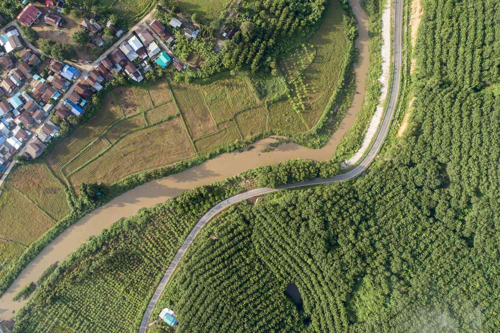

Urban development and urban planning are integral to the creation and evolution of communities, significantly impacting how infrastructure is organized and how people experience daily life. As urban areas continue to grow, particularly in the context of increasing global populations and migration to cities, the necessity for innovative approaches becomes critical. Planned communities and algorithms represent forefront methodologies in addressing these urban challenges. Planned communities are carefully designed settlements, integrating residential and commercial spaces with public amenities and green areas to maximize space efficiency and community benefits. These communities are increasingly valued for their potential to foster self-sufficiency and sustainability.

In parallel, technological advancements like algorithmic trading (algo trading), traditionally associated with financial markets, are influencing urban planning and development. These technologies bring algorithmic precision to urban design, suggesting that the methods used to predict market trends can be applied to forecast urban growth patterns and optimize resource allocation. This integration of technology in planning aims to create smarter, more adaptive urban environments, where data-driven insights guide decisions about where resources are most needed.



This article explores how urban development is being reshaped by the emergence of planned communities, in conjunction with technological advancements like algo trading. It highlights the evolving role of planned spaces within urban landscapes and underscores the potential for algorithmic technologies to transform both economic and community planning paradigms, ultimately redefining urban living standards and economic frameworks.

## Table of Contents

## The Rise of Planned Communities

Planned communities, often represented by Planned Urban Developments (PUDs), are comprehensive developments designed to harmonize various land uses within a unified community. These developments are characterized by the strategic integration of residential, commercial, and natural spaces, aimed at achieving sustainability and efficiency. The collaborative efforts between developers and local governments are pivotal in the realization of these communities, ensuring that land use is optimized to serve both communal and environmental needs.

The primary design philosophy behind planned communities is to create self-contained environments where residents can live, work, and play without requiring extensive travel. This becomes possible through a carefully curated balance of spaces that include housing, workplaces, recreational areas, and green spaces. These mixed-use designs often incorporate infrastructure and amenities that cater to everyday needs, promoting a balanced and sustainable lifestyle.

A crucial benefit of planned communities is their ability to utilize land efficiently, reducing urban sprawl and its associated impacts. By concentrating development within a dedicated area, PUDs contribute to the preservation of surrounding natural landscapes and resources. Furthermore, these areas are often equipped with advanced infrastructure in terms of utilities, public transportation, and pedestrian pathways, enhancing accessibility and reducing reliance on automobiles.

The popularity of planned communities is largely driven by their potential to offer sustainable living solutions. Residents in these areas can enjoy the advantages of proximity to essential services, lower environmental footprints due to reduced travel needs, and well-planned civic amenities. As urbanization accelerates globally, the appeal of such communities continues to grow, presenting a compelling model for future urban development.

These developments exemplify a new wave of urban planning where economic, social, and environmental objectives are addressed in tandem. By fostering a sense of community and providing a high quality of life, planned communities represent an innovative approach to managing urban growth sustainably.

## Urban Planning: Past, Present, and Future

Urban planning has witnessed substantial evolution over the decades, beginning with traditional single-use zoning, where land areas were designated solely for one purpose such as residential, commercial, or industrial use. This approach often led to urban sprawl, inefficiency, and increased reliance on automobiles, as people needed to travel longer distances for work, shopping, or recreation. 

In response to these challenges, there has been a shift towards mixed-use developments. These developments combine residential, commercial, and industrial spaces within close proximity, fostering community interaction and reducing travel times. Mixed-use planning supports vibrant neighborhoods where living, working, and leisure coexist more naturally, promoting social engagement and economic vitality.

A contemporary model gaining traction is the 15-minute city concept, which seeks to maximize convenience and accessibility. This model envisions urban environments where residents can fulfill most of their daily needs within a 15-minute walk or bicycle ride from their homes. Cities like Paris and Melbourne are pioneers in this area, rethinking urban layouts to enhance quality of life, reduce carbon footprints, and foster local economies.

The integration of technology in urban planning is another transformative [factor](/wiki/factor-investing). Modern tools like Artificial Intelligence (AI) and Machine Learning are increasingly employed to design more efficient and sustainable urban landscapes. AI models assess complex datasets to optimize land use, plan transportation networks, and predict urban growth patterns. These technologies assist urban planners in making data-driven decisions that align with both current and future needs of urban populations.

For instance, Geographic Information Systems (GIS) and urban simulation models are extensively used to visualize spatial data, enabling planners to understand and anticipate urban dynamics. Python applications in GIS empower planners to automate data analysis and model diverse scenarios, revealing insights that guide infrastructure development.

In conclusion, urban planning's evolution from single-use zoning to mixed-use and sustainable development models highlights a commitment to creating livable, efficient, and resilient cities. The ongoing integration of advanced technologies signifies a future where urban planning is even more responsive and adaptable to the complexities of modern urban life.

## Algorithmic Trading and its Urban Connections

Algorithmic trading employs advanced mathematical models and algorithms to automate the process of buying and selling financial instruments, enabling traders to execute orders at speeds unattainable by human traders. This technology-driven approach is significantly impacting urban economic dynamics, particularly in the domain of real estate and property investment.

The complexity of financial markets associated with urban developments necessitates sophisticated trading strategies to maximize returns and minimize risks. Algorithmic trading facilitates the analysis of voluminous datasets, identifying trends and patterns that might not be immediately apparent through traditional trading methods. For instance, algorithms can evaluate market conditions in real-time, adapting strategies based on fluctuations in property prices or interest rates.

In the context of property investments and real estate portfolios, the interplay between urban development and [algorithmic trading](/wiki/algorithmic-trading) becomes evident. Algorithms can assess numerous variables, such as geographic location, demographic trends, and economic indicators, to forecast property values and potential investment opportunities. These analyses help investors make informed decisions, optimizing their portfolios to align with urban growth and economic shifts.

Moreover, algorithmic trading systems can incorporate [machine learning](/wiki/machine-learning) models to predict future market trends based on historical data and current market conditions. For example, a machine learning algorithm can be trained to recognize patterns that precede a rise in property values, enabling investors to act preemptively on lucrative opportunities.

Additionally, the integration of algorithmic trading with urban development strategies can enhance the management of real estate assets. By utilizing algorithms to predict real estate market movements, urban planners and developers can adjust their strategies to ensure optimal development pacing, manage resource allocation, and balance supply with demand.

Overall, the convergence of algorithmic trading and urban development reflects a sophisticated approach to economic planning, leveraging cutting-edge technology to harness market efficiencies and foster sustainable growth within urban environments. This synergy is poised to redefine investment strategies, underpinning the financial foundations of modern cities.

## Technological Innovations in Urban Planning

Technological advancements are playing a pivotal role in transforming urban planning by introducing tools and models that enhance efficiency in spatial design and resource management. Geographic Information Systems (GIS) are among the most influential technologies in urban planning, enabling planners to gather, manage, and analyze spatial and geographic data. GIS technology facilitates the visualization of urban geographies, aiding in the assessment of land suitability, environmental impact analysis, and resource allocation decisions. The ability to overlay various data layers allows planners to comprehensively evaluate urban areas and make informed decisions about land use and infrastructure development.

Deep [reinforcement learning](/wiki/reinforcement-learning), a subset of [artificial intelligence](/wiki/ai-artificial-intelligence) (AI), is also proving instrumental in urban planning processes. This technology involves training models to make sequences of decisions through trial and error to maximize a specific reward. In urban planning, deep reinforcement learning can be used to optimize traffic flow, energy distribution, and the allocation of public resources. Algorithms learn from complex environments and adapt to changing conditions, providing planners with dynamic solutions for evolving urban challenges.

AI-driven models, including machine learning algorithms, are increasingly utilized to analyze large datasets related to urban environments, such as population density, transportation patterns, and economic activity. These models help in identifying trends, predicting future urban development scenarios, and optimizing land use. For instance, machine learning can be employed to forecast traffic congestions or to simulate the impact of new transportation projects on existing road networks.

The integration of these technologies fosters a collaborative workflow among urban designers, engineers, and stakeholders. Software platforms that incorporate AI and GIS can facilitate real-time data sharing and visualization, which allows for collaborative decision-making processes. This collaborative approach enhances productivity by enabling different parties to work simultaneously on various elements of urban design, thus reducing project timelines and costs.

In summary, the incorporation of GIS, AI, and machine learning technologies into urban planning significantly enhances the capability to manage and develop urban spaces efficiently. These tools not only provide sophisticated analytical capabilities but also promote an integrated approach to urban design, ultimately leading to more resilient and sustainable cities.

## Challenges in Planned Urban Development

Planned urban developments present several challenges that can impede their implementation and long-term success. One of the primary obstacles is the extended planning periods required to design and execute these projects. Such developments often necessitate comprehensive planning processes encompassing regulatory approvals, environmental assessments, and community consultations. These processes can be time-intensive, sometimes spanning several years before actual construction begins. Additionally, high implementation costs pose a significant challenge. Planned communities require substantial financial investments in infrastructure, utilities, and amenities, making them expensive endeavors.

Another challenge lies in maintaining diversity within these communities. Planned developments risk becoming homogenous spaces, lacking the social and cultural variety inherent in established urban areas. A diverse population enhances the vibrancy and resilience of a community, making it essential to incorporate affordable housing and inclusive policies that attract residents from varied backgrounds.

Integrating planned communities into existing urban fabrics also presents challenges. These new developments must be carefully coordinated with surrounding areas to prevent disruptions and ensure resource sharing. Seamless integration requires aligning infrastructure, such as roads and public services, with those of neighboring regions.

Furthermore, the dependence on automobiles in many planned communities continues to be a pressing issue. While these developments often prioritize walkability and mixed-use spaces, they frequently remain dependent on car travel due to inadequate public transportation options. Enhancing public transportation networks is crucial to reducing this dependence, promoting environmental sustainability, and improving accessibility for all residents.

Overcoming these challenges requires strategic planning and innovative approaches, such as developing robust public transit systems and incorporating sustainable design principles to ensure that planned urban developments are both functional and inclusive.

## The Future of Urban Development and Trading

As urban environments continue to evolve, smart technologies and agile economic models are becoming integral to urban planning strategies. The evolution of cities is increasingly characterized by the emergence of smart cities. These cities are designed to integrate cutting-edge technological solutions, enabling more efficient urban management and higher quality of life for their residents. Key technologies include the Internet of Things (IoT), artificial intelligence (AI), and big data analytics, which together help manage resources, optimize traffic flow, reduce energy consumption, and improve service delivery in real time.

The development of smart cities is underpinned by a strong focus on sustainability. This includes the creation of energy-efficient buildings, the use of renewable energy sources, and the implementation of smart grids. Digital platforms within these cities facilitate the seamless integration of transportation, infrastructure, and services, creating environments that respond dynamically to the changing needs of urban populations.

In tandem with the evolution of smart cities, algorithmic trading is having a noticeable impact on city economies, particularly concerning real estate sector growth and investment opportunities. Algorithmic trading, which uses complex algorithms to automate trading decisions, offers improved efficiency and speed in executing trades. This technology enables investors to respond rapidly to market fluctuations, optimize investment portfolios, and ultimately improve returns on real estate investments.

The intersection of urban development and algorithmic trading is particularly evident in the data-driven analysis of property markets. Sophisticated algorithms can process vast quantities of real estate data, including historical property prices, economic indicators, and demographic trends, to predict future market movements. This capability allows investors to make informed decisions, mitigate risks, and capitalize on investment opportunities more effectively.

Moreover, the increasing digitization of urban infrastructures and the proliferation of data from smart cities feed into algorithmic trading models. For instance, real-time data on traffic patterns, air quality, and energy usage can be used to assess the desirability and value of properties, thus affecting investment decisions. A Python example for analyzing real estate data might include:

```python
import pandas as pd
from sklearn.ensemble import RandomForestRegressor

# Load real estate data
data = pd.read_csv('real_estate_data.csv')

# Select features and target variable
features = data[['Historical_Prices', 'Economic_Indicators', 'Demographic_Trends']]
target = data['Future_Prices']

# Train a Random Forest model
model = RandomForestRegressor(n_estimators=100, random_state=42)
model.fit(features, target)

# Predict future property prices
predictions = model.predict(features)
print(predictions)
```

In the future, as urban areas become more interconnected and dependent on technology, the synergy between urban development and algorithmic trading will likely deepen, offering new opportunities for economic growth and urban prosperity. This dynamic environment will require stakeholders in both fields to adopt flexible, innovative approaches to harness these technologies' full potential and address the accompanying challenges.

## Conclusion

Urban development and planning are pivotal in sculpting communities that emphasize sustainability and efficiency. As urban areas continue to evolve, the convergence of planned communities with advancements in algorithmic trading offers a host of new economic opportunities and challenges. This amalgamation creates a dynamic landscape where technological progress and urban strategies intertwine, presenting innovative paths forward.

Planned communities have gained traction as they offer the promise of self-sustaining environments, carefully designed to balance residential, commercial, and natural spaces. By fostering such integrated living spaces, these communities enable a healthier lifestyle and contribute positively to the environment. As the complexity of urban environments increases, the [momentum](/wiki/momentum) toward sustainability requires forward-thinking approaches and the adoption of emerging technologies.

Simultaneously, algorithmic trading impacts urban development by influencing financial markets related to real estate and property investments. The precision and speed offered by advanced trading algorithms bring about new paradigms in economic models, enhancing [liquidity](/wiki/liquidity-risk-premium) and efficiency in real estate transactions. The interplay of technology-driven market strategies with urban infrastructure development opens avenues for refined investment strategies.

These innovations serve as catalysts for reshaping urban environments, setting the stage for the proliferation of smart cities. Smart city initiatives aim to fuse cutting-edge technological solutions with urban planning, leading to improved public services, optimized resource use, and an elevated quality of life. As we look to the future, the synthesis of planned urban development and advanced trading systems offers significant potential to redefine both the economic and social fabric of urban living, paving the way for communities that thrive on innovation and resilience.

## References & Further Reading

[1]: ["Advances in Financial Machine Learning"](https://www.amazon.com/Advances-Financial-Machine-Learning-Marcos/dp/1119482089) by Marcos Lopez de Prado

[2]: Batty, M. (2013). ["The New Science of Cities"](https://direct.mit.edu/books/monograph/3422/The-New-Science-of-Cities). MIT Press.

[3]: Blais, P. (2011). ["Perverse Cities: Hidden Subsidies, Wonky Policy, and Urban Sprawl"](https://archive.org/details/perversecitieshi0000blai). UBC Press.

[4]: Jane Jacobs. (1961). ["The Death and Life of Great American Cities"](https://en.wikipedia.org/wiki/The_Death_and_Life_of_Great_American_Cities). Random House.

[5]: Stefan, J. (2020). ["Machine Learning for Algorithmic Trading - Second Edition"](https://www.amazon.com/Machine-Learning-Algorithmic-Trading-alternative-ebook/dp/B08D9SP6MB). Packt Publishing.

[6]: Wheeler, S., & Beatley, T. (2014). ["Sustainable Urban Development Reader"](https://www.taylorfrancis.com/books/edit/10.4324/9781315770369/sustainable-urban-development-reader-stephen-wheeler-timothy-beatley). Routledge.