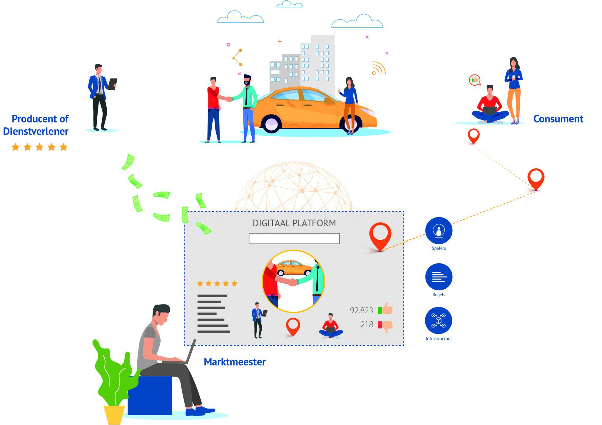

## Table of Contents

## What is platformization in the context of financial trading?

Platformization in financial trading refers to the process of using digital platforms to conduct trading activities. These platforms, often accessible via the internet, allow traders to buy and sell financial instruments like stocks, bonds, and currencies from anywhere in the world. They provide tools and features that make trading easier and more efficient, such as real-time data, charts, and automated trading systems. This shift to digital platforms has made trading more accessible to a wider audience, including individual investors who previously might not have had the resources or knowledge to participate in financial markets.

The rise of platformization has also led to increased competition among trading platforms, pushing them to offer more innovative features and better user experiences. For example, some platforms now include social trading features, where users can follow and copy the trades of experienced traders. Additionally, platformization has facilitated the growth of mobile trading, allowing people to trade on their smartphones or tablets. This convenience has further democratized trading, making it possible for anyone with an internet connection to participate in the financial markets.

## How does platformization differ from traditional financial trading systems?

Platformization in financial trading is different from traditional systems because it uses digital platforms that you can access online. In the old days, trading was done through phone calls or in person at a stock exchange. Now, with platformization, you can trade from anywhere using your computer or phone. This makes trading easier and faster because you don't have to go to a specific place or wait for someone to help you.

Traditional trading systems often needed big offices and lots of people to work. They were slower and more expensive because you had to pay for all those things. With platformization, the platforms do a lot of the work automatically. They give you tools like charts and real-time data to help you make better decisions. This means more people can trade, even if they don't have a lot of money or experience, because the platforms make it simpler and cheaper.

## What are the key benefits of platformization for retail traders?

Platformization makes trading easier for retail traders. They can use digital platforms to buy and sell stocks, bonds, and other financial stuff from anywhere. This means they don't need to go to a special place or call someone to trade. It's all done on a computer or phone, which makes it quick and simple.

Another big benefit is that these platforms are often cheaper to use than traditional trading systems. They don't need big offices or lots of people, so they can charge less money. This means retail traders can start trading with less money and still get good tools like charts and real-time data to help them make smart choices.

Also, platformization opens up trading to more people. Before, only people with a lot of money or knowledge could trade. Now, anyone can try it because the platforms are easy to use and have features like copying what good traders do. This makes trading less scary and more fun for people who are just starting out.

## Can you explain the role of APIs in platformized financial trading?

APIs, or Application Programming Interfaces, play a big role in platformized financial trading. They help different software systems talk to each other. In trading, APIs let trading platforms connect with other services like banks, data providers, and even other trading platforms. This means traders can get real-time information and make trades quickly and easily. For example, a trading platform might use an API to pull in the latest stock prices from a data provider, so traders can see what's happening right now.

APIs also make it easier for traders to automate their trading. With an API, traders can set up their trading platform to automatically buy or sell when certain conditions are met, without needing to do it themselves. This can save a lot of time and help traders make decisions based on the latest data. For example, if a trader wants to buy a stock when it reaches a certain price, they can use an API to tell the trading platform to do that automatically. This way, they don't have to watch the market all the time.

## What are some popular platforms used for financial trading today?

Some popular platforms for financial trading today include Robinhood, eToro, and [Interactive Brokers](/wiki/interactive-brokers-api). Robinhood is known for its user-friendly interface and commission-free trading, making it a favorite among beginners. eToro stands out because it lets you copy what other successful traders are doing, which is great if you're new to trading. Interactive Brokers is popular with more experienced traders because it offers a lot of tools and lets you trade many different kinds of financial products.

These platforms make trading easier and more accessible. They let you trade from your phone or computer, so you don't need to go to a special place or call someone to make a trade. They also give you tools like charts and real-time data to help you make better decisions. This means more people can try trading, even if they don't have a lot of money or experience.

## How has platformization impacted the accessibility of financial markets?

Platformization has made financial markets much easier to access for everyone. Before, trading was something only people with a lot of money or special knowledge could do. They had to go to a stock exchange or call a broker to make trades. Now, with trading platforms, anyone can trade from their phone or computer. This means you don't need a lot of money to start, and you can learn as you go because the platforms are easy to use.

These platforms also make trading cheaper. They don't need big offices or lots of people to work, so they can charge less money for their services. This is good for people who want to try trading but don't have a lot to spend. Plus, the platforms give you tools like charts and real-time data, which help you make better decisions. This has opened up financial markets to more people, making trading something anyone can try.

## What are the security concerns associated with platformized trading?

Platformized trading brings some security worries. One big concern is hacking. Since trading platforms are online, hackers might try to break in and steal your money or personal information. It's important for these platforms to have strong security measures like encryption and two-[factor](/wiki/factor-investing) authentication to keep your data safe. Another worry is phishing, where scammers trick you into giving away your login details. Always be careful with emails or messages asking for your information and make sure you're on the real trading platform website.

Another security issue is the risk of data breaches. If a trading platform gets hacked, your personal and financial information could be exposed. This is why it's good to choose platforms that are known for their security and have a good track record. Also, there's the problem of insider trading or market manipulation. Some people might use the platform to share false information or try to influence the market unfairly. Trading platforms need to watch out for this and have rules to stop it from happening.

## How do regulations affect platformized financial trading?

Regulations play a big role in platformized financial trading. They help keep the markets fair and safe for everyone. Governments and financial authorities make rules that trading platforms have to follow. These rules can be about things like how much information the platforms need to share with users, how they handle money, and how they protect users' data. For example, in the United States, the Securities and Exchange Commission (SEC) makes sure that trading platforms follow the law and don't do anything that could hurt investors.

These regulations can also affect how easy it is to use trading platforms. Sometimes, rules can make it harder for new platforms to start up because they have to spend a lot of time and money to make sure they're following all the laws. But, these rules are important because they help stop fraud and make sure that everyone is playing by the same rules. This can make people feel more confident about using trading platforms, knowing that there are laws in place to protect them.

## What advanced features do platformized trading systems offer to experienced traders?

Platformized trading systems offer many advanced features that experienced traders find useful. One big feature is [algorithmic trading](/wiki/algorithmic-trading), where traders can use computer programs to buy and sell automatically based on certain rules. This can help them make trades faster and without emotions getting in the way. Another feature is advanced charting tools, which let traders look at detailed graphs and data to make better decisions. They can also use technical indicators to predict how prices might move in the future.

Another important feature is the ability to trade many different kinds of financial products all in one place. Experienced traders can switch between stocks, bonds, [forex](/wiki/forex-system), and even cryptocurrencies without needing to use different platforms. This makes it easier to manage their investments. Also, these platforms often have risk management tools, like stop-loss orders, which help traders limit their losses if the market moves against them. These features make platformized trading systems very powerful for experienced traders who want to take their trading to the next level.

## How can platformization be used to implement algorithmic trading strategies?

Platformization makes it easier to use algorithmic trading strategies because it lets traders use computer programs to buy and sell automatically. These programs, or algorithms, follow rules set by the trader. For example, a trader might tell the algorithm to buy a stock when its price goes below a certain level and sell it when the price goes above another level. This can happen very quickly, much faster than a person could do it. Trading platforms have special tools that let traders write these algorithms and connect them to the market, so the trades can happen automatically.

These platforms also give traders a lot of data to work with. They can use this data to make their algorithms smarter. For instance, they might use past price information to predict how prices might move in the future. This helps them set better rules for their algorithms. Plus, the platforms often have features like [backtesting](/wiki/backtesting), where traders can test their algorithms on old data to see how well they would have worked. This way, they can improve their strategies before using them with real money.

## What are the future trends in platformization for financial trading?

In the future, platformization for financial trading is likely to become even more advanced and user-friendly. One big trend will be the use of [artificial intelligence](/wiki/ai-artificial-intelligence) (AI) and [machine learning](/wiki/machine-learning). These technologies can help trading platforms make better predictions and give traders more personalized advice. For example, AI could look at a trader's past trades and suggest new strategies that might work well for them. This could make trading easier for everyone, even people who are just starting out.

Another trend will be the growth of mobile trading. More and more people will use their phones to trade, so platforms will need to be fast and easy to use on small screens. They might also add more features like voice commands, so traders can make trades just by talking to their phones. This will make trading even more convenient and accessible. Overall, these trends will make platformized trading more powerful and easier to use, helping more people get involved in financial markets.

## How do platform ecosystems influence competition in financial trading?

Platform ecosystems have a big impact on competition in financial trading. They bring together many different services and tools in one place, making it easier for traders to do everything they need without switching between different platforms. This means that platforms with strong ecosystems can attract more users because they offer a complete trading experience. For example, a platform might include not just trading tools but also educational resources, community features, and even banking services. This makes it harder for new platforms to compete because they have to offer something just as good or better to draw users away from established ecosystems.

At the same time, platform ecosystems can also increase competition. Because they make it easier for more people to trade, they bring in new users who might try different platforms to see which one they like best. This pushes existing platforms to keep improving their services and adding new features to stay ahead. Also, some platforms might focus on specific parts of the ecosystem, like offering the best data analysis tools or the lowest fees, to stand out from the competition. This constant push for improvement can lead to better services for traders overall.

## References & Further Reading

[1]: ["Advances in Financial Machine Learning"](https://www.amazon.com/Advances-Financial-Machine-Learning-Marcos/dp/1119482089) by Marcos Lopez de Prado

[2]: ["Machine Learning for Algorithmic Trading"](https://github.com/stefan-jansen/machine-learning-for-trading) by Stefan Jansen

[3]: Biais, B., Foucault, T., & Moinas, S. (2014). ["Equilibrium High-Frequency Trading."](http://idei.fr/sites/default/files/medias/doc/by/moinas/Equilibrium_fast_trading_March_2014.pdf) Review of Economic Studies.

[4]: Gomber, P., Arndt, B., Lutat, M., & Uhle, T. (2011). ["High-Frequency Trading."](https://papers.ssrn.com/sol3/papers.cfm?abstract_id=1858626) Business & Information Systems Engineering.

[5]: Hagströmer, B., & Nordén, L. (2013). ["The Diversity of High-Frequency Traders."](https://www.sciencedirect.com/science/article/pii/S1386418113000256) Journal of Financial Markets.

[6]: Mackintosh, J. (2014). ["High-Frequency Trading: How it Works."](https://www.jstor.org/stable/24465658) Financial Times. 

[7]: ["Quantitative Trading: How to Build Your Own Algorithmic Trading Business"](https://www.amazon.com/Quantitative-Trading-Build-Algorithmic-Business/dp/1119800064) by Ernest P. Chan

[8]: Thavapalan, S., & Beek, P. V. (2015). ["The Impact of Algorithmic Trading in Foreign Exchange Markets."](https://research.vu.nl/en/persons/shiyanthi-thavapalan) Handbook of Exchange Rates.