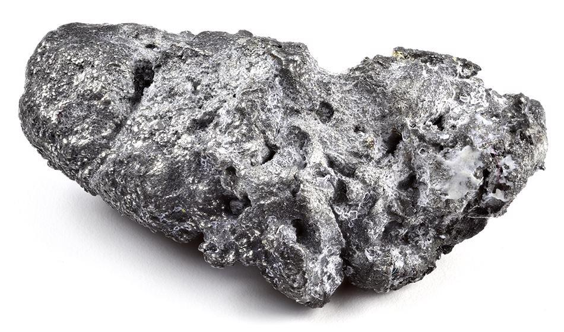

## Table of Contents

## What is platinum and where does it come from?

Platinum is a heavy, silvery-white metal that is very strong and does not rust or tarnish easily. It is one of the rarest metals on Earth and is often used in jewelry because it looks beautiful and lasts a long time. Platinum is also used in many other things, like car parts and medical equipment, because it can handle high temperatures and does not react with many chemicals.

Platinum comes from the Earth's crust, but it is very hard to find. It is usually found mixed with other metals in places called ore deposits. The biggest amounts of platinum are found in South Africa and Russia. To get platinum, miners have to dig deep into the ground and then use special methods to separate it from the other metals it is mixed with. This process can be difficult and expensive, which is why platinum is so valuable.

## What are the basic physical properties of platinum?

Platinum is a heavy metal that feels very solid when you hold it. It is silvery-white and shiny, like a mirror. It is also very strong and hard, which means it can be difficult to bend or scratch. Platinum does not rust or tarnish, so it stays looking new for a long time. It is also a good conductor of electricity, which means it can help move electricity from one place to another easily.

Another important property of platinum is that it can handle very high temperatures without melting. Its melting point is around 1,768 degrees Celsius, which is much hotter than most metals. Platinum also does not react easily with air, water, or many chemicals, which makes it useful in many different situations. These properties make platinum valuable for use in things like jewelry, car parts, and medical equipment.

## How does platinum compare to other precious metals like gold and silver?

Platinum, gold, and silver are all precious metals, but they have some important differences. Platinum is much rarer than both gold and silver, which makes it more valuable. It is also heavier and stronger than gold and silver. While gold and silver can be scratched or bent more easily, platinum is very hard and keeps its shape well. Platinum also does not tarnish or rust like silver can, so it stays shiny and new-looking for a long time. Gold and silver are softer and can be shaped into different forms more easily, but they are not as durable as platinum.

In terms of color, platinum has a silvery-white shine, while gold is usually yellow and silver is a lighter gray. When it comes to how they are used, gold and silver have been used for money and jewelry for thousands of years because they are easier to find and work with. Platinum, on the other hand, is often used in more specialized ways, like in car parts and medical equipment, because of its strength and ability to handle high temperatures. So, while all three metals are valuable and beautiful, they each have their own special qualities and uses.

## What are the chemical properties of platinum?

Platinum is a very special metal because it does not react easily with many things. It does not rust or tarnish like some other metals, so it stays shiny and new-looking for a long time. This is because platinum does not react with air, water, or many chemicals. It can even handle strong acids like hydrochloric and sulfuric acid without being damaged. This makes platinum very useful in places where other metals might get damaged or change.

Another important chemical property of platinum is that it can help speed up chemical reactions without being used up itself. This is called being a catalyst. For example, platinum is used in car exhaust systems to help turn harmful gases into less harmful ones. It can also be used in making other chemicals because it helps the reactions happen faster. This ability to act as a catalyst, along with its resistance to many chemicals, makes platinum very valuable in many industries.

## What are the common uses of platinum in jewelry?

Platinum is very popular in jewelry because it is strong and does not tarnish. It is often used to make engagement and wedding rings because it lasts a long time and keeps its shine. Platinum can hold diamonds and other precious stones securely because it is so strong. This means the stones won't fall out easily, which is important for something you wear every day.

People also like platinum for other types of jewelry, like necklaces, bracelets, and earrings. Because platinum is heavy, it feels solid and valuable when you wear it. It is also hypoallergenic, which means it is good for people with sensitive skin. The natural white color of platinum looks beautiful next to diamonds and other white stones, making it a favorite choice for many kinds of jewelry.

## How is platinum used in the automotive industry?

Platinum is very important in the automotive industry because it helps make the air cleaner. It is used in car exhaust systems, in something called a catalytic converter. The catalytic converter uses platinum to change harmful gases from the engine into less harmful ones before they go out into the air. This is good for the environment because it helps reduce pollution from cars.

Because platinum can handle very high temperatures and does not react easily with chemicals, it is perfect for this job. It helps the chemical reactions happen faster without getting used up itself. This means that the catalytic converter can work well for a long time, making cars more eco-friendly.

## What role does platinum play in the electronics industry?

Platinum is used in the electronics industry because it is a good conductor of electricity and can handle high temperatures. It is often used in making parts for computers and other electronic devices. For example, platinum is used in hard disk drives to help them work better and last longer. It is also used in sensors and other small parts where it is important for the metal to be strong and reliable.

In addition to its use in regular electronics, platinum is also important in making special kinds of electronic devices. For example, it is used in fuel cells, which are a type of battery that can power things like cars and even some buildings. Platinum helps the fuel cell work by speeding up the chemical reactions that make electricity. Because platinum can handle the tough conditions inside a fuel cell, it helps make these devices more efficient and long-lasting.

## How is platinum utilized in the medical field?

Platinum is very important in the medical field because it helps doctors treat people and keep them healthy. It is used in making medical equipment like pacemakers, which help people's hearts beat properly. Platinum is perfect for this because it is strong and does not react with the body's chemicals. It can also handle being inside the body for a long time without causing problems. This makes it a safe choice for things that need to stay in the body, like stents that keep blood vessels open.

Platinum is also used in cancer treatment. Doctors use a special kind of platinum called cisplatin to help fight cancer cells. Cisplatin works by stopping cancer cells from growing and spreading. Because platinum can handle strong chemicals and high temperatures, it is very useful in making these medicines. This helps doctors treat cancer more effectively and helps patients get better.

## What are the environmental impacts of platinum mining and usage?

Mining platinum can harm the environment. When people dig for platinum, they often have to move a lot of earth and rock. This can destroy the land and make it hard for plants and animals to live there. The mining process can also create dust and noise, which can bother people and wildlife nearby. Another problem is that mining can pollute water. The chemicals used to separate platinum from other metals can get into rivers and lakes, making the water unsafe for fish and other animals. This pollution can also affect the people who live near the mines and use the water.

Using platinum can also have environmental impacts, but some of these can be good. For example, platinum is used in car exhaust systems to clean up the air. It helps turn harmful gases into less harmful ones, which makes the air cleaner and healthier to breathe. However, making these car parts uses a lot of energy, and that can lead to more pollution. Also, when old cars are thrown away, the platinum in them can be hard to recycle. If it is not recycled properly, it can be wasted, and that is not good for the environment. So, while platinum can help in some ways, it is important to think about how we mine and use it to make sure we are not harming the environment too much.

## What advanced technologies rely on platinum, and why is it essential for them?

Platinum is very important for advanced technologies like fuel cells. Fuel cells are like special batteries that can power things like cars and even buildings. They work by turning hydrogen and oxygen into electricity, and platinum helps make this happen faster. It does this by speeding up the chemical reactions inside the fuel cell without getting used up itself. Because platinum can handle high temperatures and tough conditions, it makes fuel cells more efficient and long-lasting. This is important for making cars and buildings that don't pollute the air as much.

Another advanced technology that relies on platinum is the production of high-purity silicon for solar panels. Platinum is used as a catalyst in the process that makes the silicon very pure. Pure silicon is needed to make solar panels work well, and platinum helps make sure the silicon is clean enough. This is important because solar panels help us use the sun's energy instead of burning fossil fuels, which is better for the environment. So, platinum helps make technologies that can help save the planet by making them work better and last longer.

## How does the recycling of platinum work, and why is it important?

Recycling platinum is important because it helps save the environment and keeps this rare metal from being wasted. When people recycle platinum, they take old things like jewelry, car parts, and electronics that have platinum in them and turn them back into pure platinum. This means we don't have to dig up as much new platinum from the ground, which is good because mining can harm the land and water. Recycling also uses less energy than mining new platinum, so it's better for the planet.

The process of recycling platinum starts with collecting items that have platinum in them. These items are then melted down to separate the platinum from other metals. Special chemicals are used to make sure the platinum is very pure. Once it's pure, the platinum can be used to make new things, like more jewelry or parts for cars and electronics. Recycling platinum is important because it helps us use this valuable metal over and over again, instead of using it up and throwing it away.

## What are the current research trends and future prospects for platinum applications?

Scientists are always looking for new ways to use platinum because it is so special and useful. One big area of research is making better fuel cells. Fuel cells can power cars and even buildings without making the air dirty. Platinum helps these fuel cells work better and last longer. Researchers are trying to find ways to use less platinum in fuel cells, so they can be cheaper and easier to make. They are also looking at using platinum in new kinds of batteries that can store more energy and last longer.

Another exciting area of research is using platinum in medicine. Doctors already use a type of platinum called cisplatin to fight cancer, but scientists are working on new platinum-based medicines that might be even better. They are also looking at using platinum in tiny machines called nanobots that can go inside the body to help fix problems or deliver medicine right where it's needed. In the future, platinum could help make many new technologies that can make our lives better and help the environment.

## References & Further Reading

[1]: ["Platinum 2019"](https://www.amazon.com/Nero-NER912800F076-Platinum-2019/dp/B07GTDBMJS) by International Platinum Group Metals Association (IPA).

[2]: ["Professional Stock Trading: System Design and Automation"](https://www.amazon.com/Professional-Stock-Trading-System-Automation/dp/0971853649) by Mark Conway and Aaron Behle.

[3]: ["The Chemistry of the Platinum Group Metals: Recent Developments"](https://searchworks.stanford.edu/view/2024600) by Frank Anishia.

[4]: ["Investing in Platinum: Understanding the Market Essentials"](https://learn.apmex.com/investing-guide/platinum/investing-in-platinum/) available on Investopedia.

[5]: ["Fundamentals of Algorithmic Trading: Understanding the Making of Market Algorithms"](https://www.wallstreetzen.com/blog/what-is-algorithmic-trading/) available on Coursera.

[6]: ["Platinum for the Future: Industrial Applications and Market Insights"](https://matthey.com/documents/161599/3452828/PGM+market+report+final+version+25Apr24.pdf/4fbba3f4-26d2-1a06-b84a-64a979b1b2ed?t=1715242765121) by the National Academies of Sciences, Engineering, and Medicine.