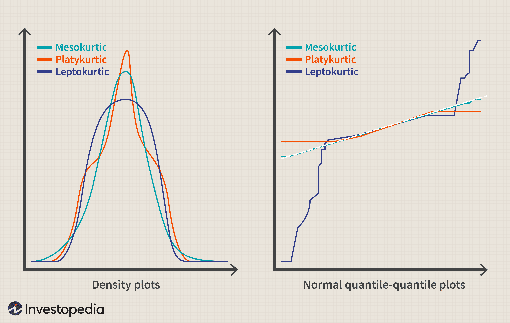

Understanding statistical distributions is essential for gaining a strategic advantage in both statistical analysis and trading. Distributions describe how the values of a dataset are spread and can significantly influence investment decisions. Among the various types of distributions, the platykurtic distribution is notable for its distinct features, having thinner tails and a flatter peak compared to a normal distribution.

A platykurtic distribution is identified by its negative excess kurtosis. Kurtosis is a statistical measure that describes the distribution of data points relative to the mean, particularly reflecting the likelihood of extreme outcomes. When a distribution is platykurtic, it suggests a lower probability of extreme values or outliers within the dataset. As such, it represents a distribution where data points are more evenly spread, reducing the possibility of experiencing dramatic fluctuations.



For investors, understanding platykurtic distributions can be particularly advantageous in algorithmic trading. These distributions indicate markets with lower volatility, which may appeal to risk-averse investors. Such markets are less prone to extreme deviations from the average, providing a stable environment that is conducive to the development of consistent trading strategies. In practical terms, recognizing the characteristics of platykurtic distributions enables traders to better anticipate future market behavior, potentially leading to improved decision-making and enhanced portfolio management.

## Table of Contents

## What Does Platykurtic Mean?

The term 'platykurtic' is used in [statistics](/wiki/bayesian-statistics) to describe a distribution with negative excess kurtosis. Kurtosis is a statistical measure that describes the tail density of a probability distribution. For a normal distribution, the excess kurtosis is zero. A platykurtic distribution, by contrast, has an excess kurtosis of less than zero, indicating that it has thinner tails and a flatter peak compared to a normal distribution.

Mathematically, excess kurtosis can be calculated using the formula:

$$
\text{Excess Kurtosis} = \frac{1}{n} \sum_{i=1}^{n} \left( \frac{x_i - \bar{x}}{s} \right)^4 - 3
$$

where $n$ is the number of data points, $x_i$ is each individual data point, $\bar{x}$ is the mean of the data, and $s$ is the standard deviation.

A key implication of a platykurtic distribution is the reduced likelihood of extreme positive or negative events compared to a normal distribution. This characteristic is particularly appealing to risk-averse investors as it suggests a lower probability of dramatic price swings and deviations from the mean.

For investors, the reduced risk of significant outliers in platykurtic markets can translate into a more predictable investment environment, which is conducive to achieving consistent returns with lower [volatility](/wiki/volatility-trading-strategies). As a result, such distributions might be preferred by investors who prioritize stability and risk management in their investment strategies.

## Understanding Platykurtic Distributions

Statistical distributions play a crucial role in understanding the behavior of data in various fields, including finance and trading. Among the important characteristics of a distribution is its kurtosis, which measures the "tailedness" or the propensity for a distribution to produce extreme values. Distributions are commonly categorized into three types based on kurtosis: leptokurtic, mesokurtic, and platykurtic.

Leptokurtic distributions exhibit positive excess kurtosis, indicating that they have fatter tails and a sharper peak than a normal distribution. This implies a higher likelihood of extreme events or outliers. Mesokurtic distributions, exemplified by the normal distribution, have a kurtosis of three and are considered standard in terms of tail thickness and peak height.

Platykurtic distributions, on the other hand, are identified by a negative excess kurtosis—meaning their kurtosis is less than three. This characteristic translates to a distribution having thinner tails and a flatter peak relative to a normal distribution. Consequently, platykurtic distributions are associated with fewer and less severe outliers, making them appealing for analyses where stability and reduced risk of extreme deviations are desired.

For example, consider a dataset with a sample kurtosis calculated using the formula:

$$
\text{Kurtosis} = \frac{n(n+1)}{(n-1)(n-2)(n-3)} \sum \left( \frac{x_i - \bar{x}}{s} \right)^4 - \frac{3(n-1)^2}{(n-2)(n-3)}
$$

where $n$ is the number of data points, $x_i$ are the individual data points, $\bar{x}$ is the sample mean, and $s$ is the sample standard deviation. 

Suppose this computation yields a result significantly less than three; the dataset can be considered platykurtic. This implies a statistical environment with reduced probabilities of extreme price swings, making such distributions attractive in risk-averse financial strategies.

Identifying and understanding platykurtic distributions supports risk management decisions in market analysis, especially for investors seeking to minimize exposure to extreme volatilities.

## Real-World Examples of Platykurtic Distributions

Platykurtic distributions, known for their negative excess kurtosis, manifest in various financial instruments. These distributions, characterized by their thinner tails and flatter peaks compared to a normal distribution, are observed in certain market conditions. For instance, cash holdings and international bonds can exhibit platykurtic behavior during specific periods, offering a more stable investment prospect relative to those instruments with leptokurtic or mesokurtic distributions.

An examination of financial markets highlights instances where cash, typically considered the least risky asset, demonstrates platykurtic characteristics. Morningstar's research provides empirical evidence of this, noting that cash has displayed an excess kurtosis of -1.43. This negative kurtosis signifies that cash investments generally experience fewer extreme deviations from the mean, making them appealing to conservative investors focused on minimizing risk.

Similarly, international bonds have been observed to adopt platykurtic profiles under certain economic conditions. These scenarios often arise when global markets are stable, interest rates are relatively constant, and geopolitical tensions are low. In such times, international bonds might exhibit less variability, with fewer abrupt changes in valuation, thus presenting a platykurtic distribution.

To illustrate a platykurtic distribution, consider the following Python code snippet:

```python
import numpy as np
import matplotlib.pyplot as plt
from scipy.stats import kurtosis

# Simulate a platykurtic distribution
data = np.random.uniform(-1, 1, 1000)

# Calculate excess kurtosis
excess_kurtosis = kurtosis(data, fisher=True)

# Plot the distribution
plt.hist(data, bins=30, density=True, alpha=0.6, color='g')
plt.title('Platykurtic Distribution Example')
plt.xlabel('Value')
plt.ylabel('Frequency')
plt.show()

print(f'Excess Kurtosis: {excess_kurtosis}')
```

This code simulates a uniform distribution, a classical representation of platykurtic behavior, and calculates its excess kurtosis, illustrating its properties visually.

The observation of platykurtic patterns in financial data aids investors in understanding market stability and managing their strategies accordingly. Recognizing periods when cash or bonds present platykurtic distributions can inform safer investment decisions, especially for those emphasizing stability and risk aversion.

## Platykurtic Distributions in Algorithmic Trading

In [algorithmic trading](/wiki/algorithmic-trading), quantifying and understanding the distribution of returns, particularly through measures like kurtosis, is paramount for assessing the risk associated with extreme price movements. Platykurtic distributions, characterized by negative excess kurtosis, indicate a lower probability of extreme deviations from the mean. This trait can be beneficial in mitigating the risk of sudden market shifts, which is a key consideration for traders who aim to achieve consistent performance with stable exposure to volatility.

Algorithmic trading strategies can be optimized for platykurtic markets due to the reduced likelihood of sharp price swings. The refinement of these strategies involves modeling the return distributions and incorporating risk management protocols that emphasize stability over the allure of high but volatile gains. For instance, a trading algorithm can employ moving averages or volatility [breakout](/wiki/breakout-trading) systems that are adapted to the characteristics of a platykurtic distribution. These systems prioritize gradual gains over time, rather than capitalizing on extreme price shifts that may not occur frequently in platykurtic markets.

Consider a Python-based algorithm that uses the Adaptive Moving Average (AMA) to navigate platykurtic markets:

```python
import numpy as np

# Historical price data
prices = np.array([100, 101, 102, 101, 100, 98, 97, 99, 100])

# Function to calculate the Adaptive Moving Average
def adaptive_moving_average(prices, lookback=5):
    ama = []
    for i in range(len(prices) - lookback + 1):
        window = prices[i:i+lookback]
        k = min(1, 2 / (len(window) + 1))  # Adaptivity factor
        ama.append((window[-1] * k) + (window[-2] * (1 - k)))
    return np.array(ama)

ama_values = adaptive_moving_average(prices)
print("Adaptive Moving Average values:", ama_values)
```

This type of algorithm is structured to adjust to prevailing market conditions by employing shorter-term period indices, thus maintaining agility while honoring the fact that extreme price movements are less probable in platykurtic distributions.

Furthermore, volatility control mechanisms like dynamic stop-loss orders can complement such algorithms by automatically restricting losses during unexpected market deviations. These mechanisms enhance the strategy's robustness against unforeseen fluctuations, reinforcing the trader's capacity to maintain performance consistency in platykurtic market conditions.

Ultimately, the comprehension and anticipation of platykurtic behavior in financial markets drive the evolution of algorithmic strategies towards risk-adjusted returns that suit both short-term and long-term trading objectives.

## Strategies for Mitigating Risk in Platykurtic Markets

In platykurtic markets, where the distribution of returns exhibits thinner tails and a flatter peak, managing risk effectively requires specific strategies due to the reduced likelihood of extreme price movements. Utilizing stop-loss orders is a prudent approach in such markets, allowing investors to set predefined levels at which their positions will be sold automatically if prices move against them. This tool is essential in guarding against potential losses, providing a safety net that maintains portfolio stability even in low-volatility environments.

Automated trading systems further enhance risk management in platykurtic markets by systematically executing trades according to predetermined criteria. These systems can be programmed to exploit the stability and predictability associated with platykurtic distributions, adjusting trading algorithms to focus on consistent, smaller gains rather than targeting large, volatile price swings that are less common in these markets.

Implementing these strategies helps traders not only protect capital but also optimize performance by engaging in steadier trading patterns. Given the fewer dramatic price changes, traders can concentrate on capitalizing on smaller, yet more predictable gains, ultimately minimizing the chances of unforeseen losses while stabilizing returns.

By leveraging these tools and approaches, investors can effectively navigate the subdued volatility typical of platykurtic environments, ensuring that their trading strategy aligns with the market's probabilistic characteristics.

## Conclusion

Understanding and identifying platykurtic distributions can greatly benefit investors seeking a more stable and less volatile portfolio. These distributions are marked by their thinner tails and flatter peaks compared to the normal distribution, indicating a smaller likelihood of extreme positive or negative events. This characteristic of stability and predictability can be particularly attractive to risk-averse investors.

Integrating the knowledge of platykurtic distributions into trading algorithms allows investors to refine their strategies, aiming for consistent performance while managing risks effectively. By recognizing the lower probability of drastic market movements, traders can design algorithms that prioritize steady returns over potential high-risk, high-reward opportunities. This approach can involve leveraging models to assess the distribution of returns and implementing techniques that optimize for portfolios typified by less dramatic fluctuations.

Moreover, in algorithmic trading, acknowledging the nature of a platykurtic market can simplify risk management. Traders can set parameters that exploit the relative predictability of such distributions, making it easier to forecast and respond to market movements. This involves developing automated systems that adapt to the characteristic stability of platykurtic environments, potentially employing statistical measures of kurtosis to continuously monitor and adjust trading strategies.

Ultimately, the strategic application of knowledge about platykurtic distributions helps investors manage exposure to volatility and aids in the pursuit of stable, long-term portfolio growth. By concentrating on the inherent characteristics of these distributions in their algorithmic frameworks, investors can capitalize on their stability, aligning their investment goals with their risk tolerance preferences.

## FAQs

### FAQs

**What is kurtosis and why is it important in trading?**

Kurtosis is a statistical measure used to describe the tailedness of a probability distribution. It specifically measures the extent to which data points are extreme and deviated from the mean. Kurtosis is divided into three types based on the shape and characteristics of the distribution: platykurtic (negative excess kurtosis), mesokurtic (zero excess kurtosis), and leptokurtic (positive excess kurtosis). 

In trading, kurtosis is important because it helps traders assess the risk of extreme price movements. A leptokurtic distribution, for example, suggests a higher probability of extreme events, which indicates potential risk but also opportunities for greater profit. Conversely, platykurtic distributions imply less variability and are preferred by risk-averse investors aiming for stability and lower potential for unexpected large losses. Understanding kurtosis aids traders in tailoring their strategies and risk management practices to the characteristics of the market.

**How can traders identify platykurtic distributions in market data?**

Traders can identify platykurtic distributions by calculating the excess kurtosis of the returns of a financial instrument. The formula for kurtosis ($K$) is as follows:

$$
K = \frac{n \sum (x_i - \bar{x})^4}{\left( \sum (x_i - \bar{x})^2 \right)^2} - 3
$$

where $x_i$ are the data points, $\bar{x}$ is the mean, and $n$ is the number of data points. A negative excess kurtosis value indicates a platykurtic distribution. 

In Python, traders can use libraries like NumPy or SciPy to compute kurtosis:

```python
import scipy.stats as stats
import numpy as np

# Assuming 'data' is a list or array of market returns
kurtosis = stats.kurtosis(data, fisher=True)
if kurtosis < 0:
    print("The distribution is platykurtic.")
```

By applying this calculation to historical market data, traders can identify the type of distribution and make informed decisions based on the risk profile of the market.

**What are some common strategies used in platykurtic markets to manage risk?**

In platykurtic markets, where the likelihood of extreme movements is lower, traders often seek strategies that capitalize on stability and reduced volatility. Some common strategies include:

1. **Stop-Loss Orders**: These help mitigate risk by automatically selling a security when it reaches a certain price, protecting investors from potential losses caused by unforeseen market downturns.

2. **Diversification**: Spread investments across various financial instruments or asset classes to reduce dependency on any single market's performance, thus mitigating potential risks in a platykurtic distribution.

3. **Algorithmic Trading**: Utilize algorithms that account for the statistical characteristics of the market, ensuring they are optimized for reduced volatility and consistent returns rather than large swings.

4. **Volatility Targeting**: Adjust the size of positions based on predetermined volatility thresholds, keeping losses in check and managing exposure based on current market conditions.

These techniques allow traders to better prepare for the nature of platykurtic markets, focusing on risk management to secure consistent performance without significant risks of large-scale volatility.

## References & Further Reading

[1]: ["Statistics for Business and Economics"](https://www.amazon.com/Statistics-Business-Economics-David-Anderson/dp/1337901067) by Paul Newbold, William L. Carlson, and Betty Thorne

[2]: ["Quantitative Financial Risk Management: Theory and Practice"](https://onlinelibrary.wiley.com/doi/book/10.1002/9781119080305) by Desmond Higham

[3]: ["The Art of Statistics: How to Learn from Data"](https://www.amazon.com/Art-Statistics-How-Learn-Data/dp/1541618513) by David Spiegelhalter

[4]: ["An Introduction to Statistical Learning"](https://www.statlearning.com/) by Gareth James, Daniela Witten, Trevor Hastie, and Robert Tibshirani

[5]: ["Risk Management and Financial Institutions"](https://books.google.com/books/about/Risk_Management_and_Financial_Institutio.html?id=1J1QDwAAQBAJ) by John C. Hull