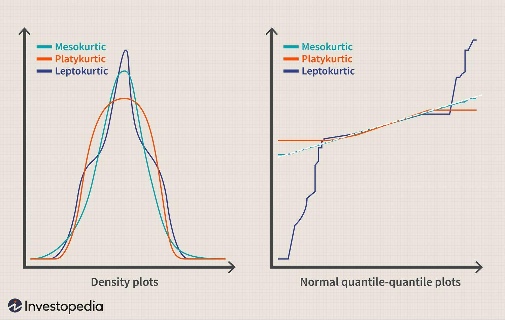

## Table of Contents

## What is a platykurtic distribution?

A platykurtic distribution is a type of statistical distribution where the data is more spread out than in a normal distribution. Imagine a bell-shaped curve, which is what a normal distribution looks like. In a platykurtic distribution, the curve is flatter and wider. This means that there are more values that are far away from the average, and fewer values that are close to the average.

Because of this, platykurtic distributions have what we call "fat tails." This means that extreme values, or outliers, are more common than they would be in a normal distribution. For example, if you were looking at the heights of people, a platykurtic distribution might show more very tall or very short people than you would expect in a normal distribution. This can be important in fields like finance or insurance, where understanding the likelihood of extreme events is crucial.

## How does a platykurtic distribution differ from a normal distribution?

A platykurtic distribution is different from a normal distribution because it is flatter and wider. Imagine a normal distribution as a bell-shaped curve. In a platykurtic distribution, this bell is not as tall and is spread out more. This means that the data in a platykurtic distribution is more spread out than in a normal distribution.

Because of this spread, platykurtic distributions have what we call "fat tails." This means that there are more extreme values, or outliers, than you would find in a normal distribution. For example, if you were measuring the weights of a group of people, a platykurtic distribution might show more people who are either very heavy or very light compared to what you would expect in a normal distribution. This can be important in areas like finance or insurance, where understanding the chances of extreme events is crucial.

## What does the term 'kurtosis' mean in the context of platykurtic distributions?

Kurtosis is a measure that tells us how data is spread out compared to a normal distribution. In the context of platykurtic distributions, kurtosis helps us understand if the data is more spread out than a normal distribution. A normal distribution has a kurtosis value of 3. If a distribution has a kurtosis less than 3, it is called platykurtic, which means the data is more spread out and the curve is flatter.

Think of kurtosis as a way to describe the "tailedness" of a distribution. In a platykurtic distribution, the tails are fatter, meaning there are more extreme values or outliers than in a normal distribution. This is important because it can affect how we analyze and interpret data, especially in fields where extreme events are critical, like finance or insurance.

## Can you provide examples of real-world data that follow a platykurtic distribution?

One example of real-world data that follows a platykurtic distribution is the income of people in a country. In many countries, most people earn around the average income, but there are also a lot of people who earn much more or much less than average. This makes the data spread out more than a normal distribution, with more extreme values, like very high or very low incomes.

Another example is the amount of rainfall in different areas. Some places might get a normal amount of rain most of the time, but there can be years with a lot more or a lot less rain than usual. This creates a platykurtic distribution because the data is more spread out, with more extreme values than you would see in a normal distribution.

## How is kurtosis calculated for a platykurtic distribution?

Kurtosis is a way to measure how spread out data is compared to a normal distribution. For a platykurtic distribution, the kurtosis value is less than 3. To calculate kurtosis, you first find the fourth moment of the data, which means you look at how much each data point differs from the average, raise those differences to the fourth power, and then find the average of those values. After that, you divide this average by the fourth power of the standard deviation of the data. This gives you a number that tells you about the shape of the distribution.

Once you have this number, you subtract 3 from it to get what is called the "excess kurtosis." If the excess kurtosis is negative, the distribution is platykurtic. This means the data is more spread out than a normal distribution, with more extreme values or outliers. So, if you do all these steps and end up with a number less than zero, you know your data follows a platykurtic distribution.

## What are the implications of a platykurtic distribution for statistical analysis?

When data follows a platykurtic distribution, it means the data is more spread out than in a normal distribution. This can affect how we do statistical analysis because we might see more extreme values or outliers than we expect. For example, if we are trying to predict something based on this data, those extreme values can throw off our predictions. We need to be careful and use methods that can handle these outliers well, otherwise our results might not be accurate.

In fields like finance or insurance, understanding a platykurtic distribution is really important. These industries often deal with risks and need to know the chances of extreme events happening. If the data is platykurtic, it means there are more chances of these extreme events, like a big stock market drop or a huge insurance claim. This can change how they plan and manage risks, making sure they are ready for those extreme possibilities.

## How do platykurtic distributions affect the interpretation of standard deviation?

When data follows a platykurtic distribution, it means the data is more spread out than in a normal distribution. This affects how we understand the standard deviation. Standard deviation is a measure that tells us how much the data varies from the average. In a platykurtic distribution, because the data is more spread out, the standard deviation might be larger than in a normal distribution. This means we might see more numbers that are far away from the average, and the standard deviation will show that.

This larger standard deviation in a platykurtic distribution tells us that there are more extreme values or outliers in the data. For example, if we are looking at the heights of people and the data is platykurtic, the standard deviation might be bigger because there are more people who are very tall or very short. This can make it harder to predict things based on the average because those extreme values can change our predictions a lot. So, when working with platykurtic data, we need to pay more attention to the standard deviation and what it tells us about the spread of the data.

## What are the common methods to identify if a dataset is platykurtic?

One way to find out if a dataset is platykurtic is by calculating its kurtosis. Kurtosis tells us how spread out the data is compared to a normal distribution. If the kurtosis is less than 3, the dataset is platykurtic. This means the data is more spread out and has more extreme values than a normal distribution. You can use software like Excel or Python to calculate kurtosis easily.

Another method is by looking at a histogram or a density plot of the data. If the graph looks flatter and wider than a normal bell-shaped curve, it might be platykurtic. This visual check can help you see if there are more values far away from the average, which is a sign of a platykurtic distribution. It's a good idea to use both the kurtosis calculation and the visual check to be sure about the shape of your data.

## How does the shape of a platykurtic distribution impact hypothesis testing?

When you do hypothesis testing with data that follows a platykurtic distribution, you might find that the results are different from what you would expect with a normal distribution. This is because platykurtic distributions have more extreme values or outliers, which can affect the tests. For example, if you are testing if the average of your data is different from a certain number, those extreme values might make it seem like the average is further away from that number than it really is. This could lead you to think there is a big difference when there isn't one, or vice versa.

Because of this, you might need to use different methods for hypothesis testing when working with platykurtic data. Some tests assume that the data follows a normal distribution, and if it doesn't, these tests might not be accurate. You could use tests that are better at handling data with outliers, or you might need to adjust your data in some way before doing the test. It's important to know the shape of your data so you can choose the right way to test your hypotheses and get results you can trust.

## What are the challenges in modeling data with a platykurtic distribution?

Modeling data with a platykurtic distribution can be tricky because it is more spread out than a normal distribution. This means there are more extreme values, or outliers, which can make it hard to predict things accurately. When you build a model, you want it to work well for most of the data, but with platykurtic data, those extreme values can throw off your predictions. For example, if you are trying to guess how much it will rain based on past data, and the data is platykurtic, the model might not be ready for the years with a lot more or a lot less rain than usual.

To handle these challenges, you might need to use special methods that can deal with the extra spread and outliers. Some models are better at this than others, so you might have to try different ones to see which works best. It's also important to understand that your model might not be as accurate as you want it to be because of the nature of the data. In fields like finance or insurance, where knowing about extreme events is crucial, using the right model for platykurtic data can make a big difference in how well you can plan and manage risks.

## How can one transform a platykurtic distribution to better fit a normal distribution?

If you have data that follows a platykurtic distribution and you want it to look more like a normal distribution, you can try transforming it. One way to do this is by using a transformation like the Box-Cox transformation. This method changes the data to make it less spread out and more like a normal distribution. You might also try taking the logarithm of your data, which can help if your data has a lot of big numbers that are making it spread out.

Another way to make your data more normal is by removing or adjusting the extreme values, or outliers. These are the numbers that are far away from the average and can make your data look more spread out. By getting rid of or changing these outliers, you can make your data fit a normal distribution better. Remember, though, that changing your data like this can affect what you learn from it, so you need to be careful and think about why you are making these changes.

## What advanced statistical techniques are used to handle platykurtic distributions in research?

When researchers work with data that follows a platykurtic distribution, they often use special statistical methods to handle the extra spread and outliers. One common technique is using robust statistical methods. These methods are good at dealing with data that has a lot of extreme values. For example, instead of using the regular mean, which can be affected a lot by outliers, researchers might use the median, which is not as sensitive to those extreme numbers. Another method is using trimmed means, where you take out the highest and lowest values before calculating the average. This can help make the data look more like a normal distribution.

Another advanced technique is using different types of regression models that can handle platykurtic data better. For example, researchers might use quantile regression, which looks at how different parts of the data behave, not just the average. This can be really helpful when you want to understand how the extreme values affect your results. Also, using generalized linear models or other non-parametric methods can be good choices because they do not assume the data follows a normal distribution. These methods can give you a better picture of what is happening with your data, even if it is spread out more than usual.

## What does platykurtic mean?

The term 'platykurtic' is used in [statistics](/wiki/bayesian-statistics) to describe a distribution with negative excess kurtosis. Kurtosis is a statistical measure that describes the tail density of a probability distribution. For a normal distribution, the excess kurtosis is zero. A platykurtic distribution, by contrast, has an excess kurtosis of less than zero, indicating that it has thinner tails and a flatter peak compared to a normal distribution.

Mathematically, excess kurtosis can be calculated using the formula:

$$
\text{Excess Kurtosis} = \frac{1}{n} \sum_{i=1}^{n} \left( \frac{x_i - \bar{x}}{s} \right)^4 - 3
$$

where $n$ is the number of data points, $x_i$ is each individual data point, $\bar{x}$ is the mean of the data, and $s$ is the standard deviation.

A key implication of a platykurtic distribution is the reduced likelihood of extreme positive or negative events compared to a normal distribution. This characteristic is particularly appealing to risk-averse investors as it suggests a lower probability of dramatic price swings and deviations from the mean.

For investors, the reduced risk of significant outliers in platykurtic markets can translate into a more predictable investment environment, which is conducive to achieving consistent returns with lower [volatility](/wiki/volatility-trading-strategies). As a result, such distributions might be preferred by investors who prioritize stability and risk management in their investment strategies.

## What is the understanding of Platykurtic Distributions?

Statistical distributions play a crucial role in understanding the behavior of data in various fields, including finance and trading. Among the important characteristics of a distribution is its kurtosis, which measures the "tailedness" or the propensity for a distribution to produce extreme values. Distributions are commonly categorized into three types based on kurtosis: leptokurtic, mesokurtic, and platykurtic.

Leptokurtic distributions exhibit positive excess kurtosis, indicating that they have fatter tails and a sharper peak than a normal distribution. This implies a higher likelihood of extreme events or outliers. Mesokurtic distributions, exemplified by the normal distribution, have a kurtosis of three and are considered standard in terms of tail thickness and peak height.

Platykurtic distributions, on the other hand, are identified by a negative excess kurtosis—meaning their kurtosis is less than three. This characteristic translates to a distribution having thinner tails and a flatter peak relative to a normal distribution. Consequently, platykurtic distributions are associated with fewer and less severe outliers, making them appealing for analyses where stability and reduced risk of extreme deviations are desired.

For example, consider a dataset with a sample kurtosis calculated using the formula:

$$
\text{Kurtosis} = \frac{n(n+1)}{(n-1)(n-2)(n-3)} \sum \left( \frac{x_i - \bar{x}}{s} \right)^4 - \frac{3(n-1)^2}{(n-2)(n-3)}
$$

where $n$ is the number of data points, $x_i$ are the individual data points, $\bar{x}$ is the sample mean, and $s$ is the sample standard deviation. 

Suppose this computation yields a result significantly less than three; the dataset can be considered platykurtic. This implies a statistical environment with reduced probabilities of extreme price swings, making such distributions attractive in risk-averse financial strategies.

Identifying and understanding platykurtic distributions supports risk management decisions in market analysis, especially for investors seeking to minimize exposure to extreme volatilities.

## What are the Frequently Asked Questions?

### FAQs

**What is kurtosis and why is it important in trading?**

Kurtosis is a statistical measure used to describe the tailedness of a probability distribution. It specifically measures the extent to which data points are extreme and deviated from the mean. Kurtosis is divided into three types based on the shape and characteristics of the distribution: platykurtic (negative excess kurtosis), mesokurtic (zero excess kurtosis), and leptokurtic (positive excess kurtosis). 

In trading, kurtosis is important because it helps traders assess the risk of extreme price movements. A leptokurtic distribution, for example, suggests a higher probability of extreme events, which indicates potential risk but also opportunities for greater profit. Conversely, platykurtic distributions imply less variability and are preferred by risk-averse investors aiming for stability and lower potential for unexpected large losses. Understanding kurtosis aids traders in tailoring their strategies and risk management practices to the characteristics of the market.

**How can traders identify platykurtic distributions in market data?**

Traders can identify platykurtic distributions by calculating the excess kurtosis of the returns of a financial instrument. The formula for kurtosis ($K$) is as follows:

$$
K = \frac{n \sum (x_i - \bar{x})^4}{\left( \sum (x_i - \bar{x})^2 \right)^2} - 3
$$

where $x_i$ are the data points, $\bar{x}$ is the mean, and $n$ is the number of data points. A negative excess kurtosis value indicates a platykurtic distribution. 

In Python, traders can use libraries like NumPy or SciPy to compute kurtosis:

```python
import scipy.stats as stats
import numpy as np

# Assuming 'data' is a list or array of market returns
kurtosis = stats.kurtosis(data, fisher=True)
if kurtosis < 0:
    print("The distribution is platykurtic.")
```

By applying this calculation to historical market data, traders can identify the type of distribution and make informed decisions based on the risk profile of the market.

**What are some common strategies used in platykurtic markets to manage risk?**

In platykurtic markets, where the likelihood of extreme movements is lower, traders often seek strategies that capitalize on stability and reduced volatility. Some common strategies include:

1. **Stop-Loss Orders**: These help mitigate risk by automatically selling a security when it reaches a certain price, protecting investors from potential losses caused by unforeseen market downturns.

2. **Diversification**: Spread investments across various financial instruments or asset classes to reduce dependency on any single market's performance, thus mitigating potential risks in a platykurtic distribution.

3. **Algorithmic Trading**: Utilize algorithms that account for the statistical characteristics of the market, ensuring they are optimized for reduced volatility and consistent returns rather than large swings.

4. **Volatility Targeting**: Adjust the size of positions based on predetermined volatility thresholds, keeping losses in check and managing exposure based on current market conditions.

These techniques allow traders to better prepare for the nature of platykurtic markets, focusing on risk management to secure consistent performance without significant risks of large-scale volatility.

## References & Further Reading

[1]: ["Statistics for Business and Economics"](https://www.amazon.com/Statistics-Business-Economics-David-Anderson/dp/1337901067) by Paul Newbold, William L. Carlson, and Betty Thorne

[2]: ["Quantitative Financial Risk Management: Theory and Practice"](https://onlinelibrary.wiley.com/doi/book/10.1002/9781119080305) by Desmond Higham

[3]: ["The Art of Statistics: How to Learn from Data"](https://www.amazon.com/Art-Statistics-How-Learn-Data/dp/1541618513) by David Spiegelhalter

[4]: ["An Introduction to Statistical Learning"](https://www.statlearning.com/) by Gareth James, Daniela Witten, Trevor Hastie, and Robert Tibshirani

[5]: ["Risk Management and Financial Institutions"](https://books.google.com/books/about/Risk_Management_and_Financial_Institutio.html?id=1J1QDwAAQBAJ) by John C. Hull