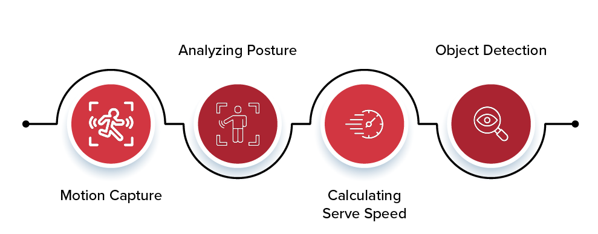

## Table of Contents

## What is Playstyle in the context of Machine Learning?

In the context of machine learning, "playstyle" refers to the unique way a model or an algorithm approaches and solves a problem. It's like the personality of the model, which can be influenced by the choices made during the design and training process, such as the type of algorithm used, the hyperparameters set, and the data it is trained on. For example, one model might be aggressive in making predictions, while another might be more conservative, depending on how it has been tuned.

Understanding the playstyle of a machine learning model is important because it helps in choosing the right model for a specific task. For instance, if you need a model that makes quick decisions, you might choose one with a more aggressive playstyle. On the other hand, if accuracy is more important than speed, you might opt for a model with a more cautious approach. By knowing the playstyle, developers can better match models to their needs, leading to more effective and efficient solutions.

## How does Playstyle Distance contribute to understanding player behavior?

Playstyle Distance is a way to measure how different or similar two players are in how they play a game. It looks at things like how they move, what choices they make, and how they interact with the game. By calculating the distance between playstyles, we can see how unique each player is. For example, if two players have a small playstyle distance, it means they play the game in a very similar way. If the distance is large, their ways of playing are very different.

Understanding player behavior through Playstyle Distance can help game developers and researchers. They can use this information to make games more fun by matching players with similar playstyles or by creating challenges that suit different playstyles. It also helps in studying how people learn and improve in games. By knowing the playstyle distance, developers can see trends and patterns in how players behave, which can lead to better game design and more personalized gaming experiences.

## What are the basic components of a Playstyle model?

A Playstyle model is made up of a few key parts that help us understand how someone plays a game. The first part is the data we collect from players. This can include things like how long they play, what choices they make, and how they move in the game. We use this data to figure out patterns and habits in their play. The second part is the way we analyze this data. We use special math and computer methods to turn the data into something we can understand. This helps us see the different ways people play the game.

The third part of a Playstyle model is how we group players into different playstyles. We do this by looking at how similar or different players are to each other. We might use a formula like $$ \text{Playstyle Distance} = \sqrt{\sum_{i=1}^{n} (x_i - y_i)^2} $$ to find out how far apart two players' playstyles are. If the distance is small, the players play similarly. If it's big, they play differently. The last part is how we use this information. We can use it to make the game better for each player, like giving them challenges that match their way of playing or putting them in groups with others who play the same way.

## Can you explain how Playstyle is used in video games?

In video games, Playstyle is used to understand how players play the game. It looks at things like how they move, what choices they make, and how they interact with the game. By studying these things, game makers can see patterns in how people play. They use this information to make the game better for each player. For example, if a player likes to explore a lot, the game might give them more areas to explore. If a player likes to fight, the game might give them more battles.

Game makers also use Playstyle to match players with others who play the same way. This can make the game more fun because players can play with others who like the same things. They might use a formula like $$ \text{Playstyle Distance} = \sqrt{\sum_{i=1}^{n} (x_i - y_i)^2} $$ to see how similar two players are. If the distance is small, the players play similarly. If it's big, they play differently. This helps in creating teams or groups where everyone enjoys the game in the same way.

## What are the common data sources used to analyze Playstyle?

To analyze Playstyle in video games, game developers use different kinds of data. They look at how long players play, what choices they make, and how they move in the game. This data comes from things like game logs, which keep track of everything players do, and player profiles, which show personal information like age and skill level. They also use data from surveys and feedback forms where players tell them what they like and don't like about the game.

Another important source of data is in-game analytics. These are special tools that watch what players do in real-time. They can see how players move, what they click on, and how they solve problems in the game. By using this data, developers can see patterns and habits in how people play. They might use a formula like $$ \text{Playstyle Distance} = \sqrt{\sum_{i=1}^{n} (x_i - y_i)^2} $$ to find out how similar or different two players' playstyles are. This helps them understand and group players based on how they play.

## How can beginners start implementing a Playstyle analysis?

To start implementing a Playstyle analysis, beginners should first collect data on how players interact with the game. This means keeping track of things like how long they play, what choices they make, and how they move. You can do this by using game logs, which record everything players do, and player profiles, which show personal details like age and skill level. Another good way to get data is by using in-game analytics tools that watch what players do in real-time. These tools can help you see patterns in how players play, like if they like to explore or fight a lot.

Once you have the data, you can start analyzing it to understand different playstyles. A simple way to do this is by calculating the Playstyle Distance between players. You can use a formula like $$ \text{Playstyle Distance} = \sqrt{\sum_{i=1}^{n} (x_i - y_i)^2} $$ to find out how similar or different two players' playstyles are. If the distance is small, the players play similarly. If it's big, they play differently. To make this easier, you can use a programming language like Python. Here's a simple example of how you might calculate Playstyle Distance in Python:

```python
import numpy as np

def playstyle_distance(player1, player2):
    return np.sqrt(np.sum((player1 - player2) ** 2))

# Example usage
player1 = np.array([1, 2, 3])  # Represents player 1's playstyle data
player2 = np.array([4, 5, 6])  # Represents player 2's playstyle data
distance = playstyle_distance(player1, player2)
print(f"Playstyle Distance: {distance}")
```

By following these steps, beginners can start to understand and group players based on how they play, which can help make the game more fun for everyone.

## What machine learning algorithms are typically used for Playstyle classification?

Machine learning algorithms used for Playstyle classification often include clustering and classification techniques. Clustering algorithms like K-means are popular because they help group players based on how similar their playstyles are. For example, if you want to see how different players play a game, you can use K-means to put them into groups where each group has players with similar habits. Another clustering method is hierarchical clustering, which can show how different playstyles relate to each other in a tree-like structure. These algorithms look at the data from how players play and try to find patterns that show different playstyles.

Classification algorithms like decision trees, random forests, and support vector machines (SVMs) are also used for Playstyle classification. Decision trees are good because they are easy to understand and can show how different choices in the game lead to different playstyles. Random forests, which use many decision trees, can be even better at predicting playstyles because they combine the results of many trees to make more accurate guesses. SVMs work by finding the best way to separate different playstyles in the data. They can be very powerful for classifying playstyles, especially when the data is complex.

To use these algorithms, you need to turn the data from how players play into numbers that the algorithms can work with. For example, you might use $$ \text{Playstyle Distance} = \sqrt{\sum_{i=1}^{n} (x_i - y_i)^2} $$ to find out how similar or different two players' playstyles are. Then, you can use a programming language like Python to apply these algorithms. Here's a simple example of how you might use K-means clustering in Python:

```python
import numpy as np
from sklearn.cluster import KMeans

# Example playstyle data for 5 players
playstyle_data = np.array([
    [1, 2, 3],  # Player 1
    [4, 5, 6],  # Player 2
    [7, 8, 9],  # Player 3
    [10, 11, 12],  # Player 4
    [13, 14, 15]  # Player 5
])

# Create and fit the K-means model
kmeans = KMeans(n_clusters=2, random_state=0).fit(playstyle_data)

# Print the cluster labels for each player
print("Cluster labels:", kmeans.labels_)
```

This code shows how to group players into two different playstyle clusters using their playstyle data.

## How does clustering help in identifying different Playstyles?

Clustering helps in identifying different Playstyles by grouping players who play the game in similar ways. It looks at the data from how players play, like how long they play, what choices they make, and how they move in the game. By using clustering algorithms like K-means, we can find patterns in this data and put players into groups where each group has a similar playstyle. For example, if we want to see if some players like to explore a lot while others like to fight, clustering can help us find these groups. We can use a formula like $$ \text{Playstyle Distance} = \sqrt{\sum_{i=1}^{n} (x_i - y_i)^2} $$ to see how similar or different two players' playstyles are. If the distance is small, the players play similarly, and if it's big, they play differently.

Once we have these groups, we can understand the different Playstyles better. For example, one group might be players who play fast and make quick decisions, while another group might be players who take their time and think carefully before making a move. By knowing these different playstyles, game makers can make the game better for each group of players. They can give players challenges that match their way of playing, or they can put players in groups with others who play the same way. This makes the game more fun for everyone because they can play with others who like the same things.

## What are the challenges in accurately measuring Playstyle Distance?

Measuring Playstyle Distance accurately can be tricky because it depends a lot on the data you collect and how you analyze it. If the data is not good or if you don't have enough of it, it can be hard to see the real differences between players. For example, if you only look at how long players play but not what they do in the game, you might miss important details about their playstyle. Also, different games need different ways to measure Playstyle Distance. What works for one game might not work for another, so you need to be careful to pick the right way to measure it.

Another challenge is that playstyles can change over time. A player might start playing one way and then switch to another way as they get better or try new things. This means you need to keep updating your measurements to make sure they stay accurate. If you use a formula like $$ \text{Playstyle Distance} = \sqrt{\sum_{i=1}^{n} (x_i - y_i)^2} $$, you have to think about which parts of the player's data to include in the calculation. If you miss important parts or include things that don't matter, your measurement might not be right. So, it's important to keep checking and improving how you measure Playstyle Distance to make sure it really shows how players play the game.

## How can advanced techniques like deep learning improve Playstyle analysis?

Deep learning can make Playstyle analysis better by looking at a lot of data and finding patterns that are hard to see with simpler methods. It can use neural networks to learn from how players play the game, like how they move, what choices they make, and how long they play. This means [deep learning](/wiki/deep-learning) can find out things about playstyles that other methods might miss. For example, it can see if a player likes to explore a lot or if they like to fight, even if they don't do it all the time. By using deep learning, game makers can understand playstyles in a more detailed way and make the game more fun for each player.

One way deep learning can help is by using a special kind of [neural network](/wiki/neural-network) called a [convolutional neural network](/wiki/convolutional-neural-network) (CNN). CNNs are good at looking at data that has a pattern, like how players move in the game. They can see if players move in a certain way that shows their playstyle. Another way is by using recurrent neural networks (RNNs), which are good at looking at data that changes over time. RNNs can see how a player's playstyle changes as they play more. By using these advanced techniques, game makers can measure Playstyle Distance more accurately. They can use a formula like $$ \text{Playstyle Distance} = \sqrt{\sum_{i=1}^{n} (x_i - y_i)^2} $$ to see how similar or different two players' playstyles are, but with deep learning, they can make sure the numbers they get are more correct and useful.

## What ethical considerations should be taken into account when analyzing Playstyle?

When analyzing Playstyle, it's important to think about privacy. Player data, like how long they play or what choices they make in the game, can be personal. Game makers need to make sure they ask players if it's okay to use their data. They should also keep the data safe and not share it with others without permission. If they don't, players might feel their privacy is being invaded, and they might not want to play the game anymore.

Another thing to consider is fairness. When game makers use Playstyle analysis to match players or give them challenges, they need to make sure everyone has a fair chance. If the game puts players into groups based on their playstyle, it should not make some players feel left out or treated unfairly. Using a formula like $$ \text{Playstyle Distance} = \sqrt{\sum_{i=1}^{n} (x_i - y_i)^2} $$ to measure how similar or different playstyles are can help, but game makers need to use it in a way that is fair to all players.

## How can experts refine Playstyle models to enhance game personalization?

Experts can refine Playstyle models to make games more personal by looking at more kinds of data from how players play. They can use deep learning, which is a smart way to find patterns in data, to see more details about playstyles. For example, they can use a special kind of deep learning called a convolutional neural network (CNN) to look at how players move in the game. This can help them understand if a player likes to explore or fight. They can also use recurrent neural networks (RNNs) to see how a player's playstyle changes over time. By using these advanced methods, experts can make the game match each player's way of playing better, making the game more fun and interesting.

Another way to refine Playstyle models is by using a formula like $$ \text{Playstyle Distance} = \sqrt{\sum_{i=1}^{n} (x_i - y_i)^2} $$ to measure how similar or different two players' playstyles are. Experts can use this formula to group players into different playstyles more accurately. They can then use this information to give players challenges that fit their way of playing or to put them in groups with others who play the same way. This makes the game feel more personal because players get to play with others who like the same things and face challenges that are just right for them. By constantly updating and improving these models, experts can keep the game fresh and exciting for everyone.

## References & Further Reading

[1]: Bakkes, S., Spronck, P., & van Lankveld, G. (2012). ["Player Behavioral Modelling for Video Games."](https://www.spronck.net/pubs/BakkesEC2011.pdf) Entertainment Computing, 3(3), 71-79.

[2]: Drachen, A., Canossa, A., & Yannakakis, G. N. (2009). ["Player Modeling using Self-Organization in Tomb Raider: Underworld."](https://ieeexplore.ieee.org/abstract/document/5286500) In Proceedings of the IEEE Symposium on Computational Intelligence and Games.

[3]: Shaker, N., Yannakakis, G. N., & Togelius, J. (2010). ["Towards Automatic Personalized Content Generation for Platform Games."](https://ojs.aaai.org/index.php/AIIDE/article/view/12399) In Proceedings of the Sixth AAAI Conference on Artificial Intelligence and Interactive Digital Entertainment.

[4]: Bostan, B. (2009). ["Player Motivations: A Psychological Perspective."](https://www.researchgate.net/publication/220686151_Player_motivations_A_psychological_perspective) In Handbook of Research on Computational Arts and Creative Informatics.

[5]: Yannakakis, G. N., & Hallam, J. (2007). ["Game and Player Feature Selection for Entertainment Capture."](https://www.semanticscholar.org/paper/Game-and-Player-Feature-Selection-for-Entertainment-Yannakakis-Hallam/13cf75756865788884b16d7eab7d1f6b316ecb6d) In 2007 IEEE Symposium on Computational Intelligence and Games.