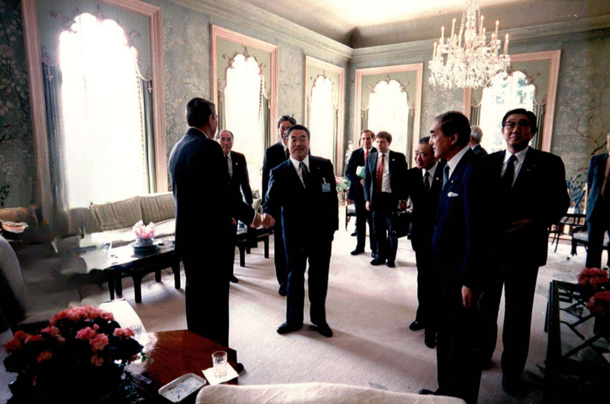

The Plaza Accord, signed on September 22, 1985, represented a landmark agreement in international currency management. Initiated by the Group of Five (G-5) nations—the United States, France, Germany, the United Kingdom, and Japan—the Accord sought to address significant global economic imbalances exacerbated by the dramatic appreciation of the U.S. dollar in the early 1980s. This event marked a sustained effort by major economies to coordinate exchange rate adjustments with the explicit aim of depreciating the U.S. dollar relative to key currencies such as the Japanese yen and the German Deutschmark.

The strengthening of the dollar during this period had wide-ranging implications, notably contributing to sizable trade imbalances and adversely affecting industries in the United States. In response to escalating pressures from domestic manufacturers and policymakers, it became evident that a coordinated international approach was necessary to stabilize currencies and bolster the global economy. The Plaza Accord thus emerged as a pivotal moment in economic history, setting a precedent for subsequent currency interventions and multinational cooperation in managing foreign exchange markets.



By facilitating a strategic devaluation of the dollar, the Accord helped recalibrate trade relations, although its effects were not uniform across regions. The agreement also underscored the complexities inherent in regulating international currency markets, paving the way for modern strategies that integrate technological advancements like algorithmic trading. As such, understanding the Accord's framework and implications is crucial for grasping the dynamics at play in current financial systems and predicting future trends in currency policy and economic collaboration.

## Table of Contents

## Historical Context

In the early 1980s, the U.S. dollar underwent a significant appreciation, primarily fueled by the Federal Reserve's stringent monetary policy. Under the leadership of Chairman Paul Volcker, the Federal Reserve aimed to tackle stagflation—characterized by stagnant economic growth and high inflation—by implementing a series of interest rate hikes. This policy dramatically increased the attractiveness of dollar-denominated assets, leading to an influx of foreign capital and subsequently driving up the value of the dollar.

The appreciation of the dollar had pronounced repercussions on international trade dynamics, leading to considerable imbalances, especially with major economies like Japan and Germany. As the dollar strengthened, American exports became more expensive on the global market, reducing their competitiveness. This shift significantly impacted American industries, particularly manufacturing sectors reliant on exporting goods overseas.

The growing trade imbalances and the consequent negative effects on U.S. industries intensified the pressure on American policymakers from domestic manufacturers. They sought relief through government intervention to address the competitive disadvantage caused by the strong dollar. The situation underscored the necessity for a collaborative approach to rectify these economic disparities and prompted discussions among the Group of Five (G-5) industrial nations—the United States, France, Germany, the United Kingdom, and Japan.

Recognizing the interconnected nature of global economies, these nations acknowledged the need for a coordinated international response. The collaboration aimed to realign exchange rates and mitigate the adverse effects of the dollar's appreciation. This realization ultimately paved the way for the formulation and signing of the Plaza Accord in 1985, where the G-5 countries agreed to intervene in currency markets to devalue the dollar relative to the Japanese yen and the German Deutschmark. The accord represented a pivotal consensus to collaboratively manage exchange rate policies and stabilize the global economy.

## The Plaza Accord Agreement

The Plaza Accord was signed at New York City's Plaza Hotel on September 22, 1985, involving the participation of the G-5 nations: the United States, France, Germany, the United Kingdom, and Japan. This accord was primarily aimed at addressing the significant overvaluation of the U.S. dollar, which had appreciated dramatically in the early 1980s. The strong dollar was causing severe trade imbalances, with American exports becoming excessively expensive for foreign buyers, thereby exacerbating the U.S. trade deficit.

The key objective of the Plaza Accord was to strategically depreciate the U.S. dollar to make American exports more competitive. By agreeing to coordinate interventions in global currency markets, the G-5 nations aimed to achieve this depreciation collectively. Each member nation committed to selling the U.S. dollar and buying their own currencies in a coordinated manner, aiming to influence exchange rates effectively.

The immediate result of the Plaza Accord was a notable weakening of the U.S. dollar. Economically, this achieved some of its intended effects; it enhanced the competitiveness of American products in international markets and started to restore balance in trade figures. However, the outcomes were not uniformly beneficial across different economies. While the U.S. saw improvements in its trade deficit with European countries, the trade imbalance with Japan was more resistant to correction. This was partly due to structural economic differences and varying responses to currency fluctuations.

Overall, the Plaza Accord marked an innovative approach to international monetary policy, demonstrating the potential for coordinated action to influence currency values. Despite achieving some of its stated goals, the accord also underlined the complexities involved in manipulating exchange rates and the varied repercussions such actions can have on global trade balances.

## Impact on Global Economics

The Plaza Accord of 1985 significantly impacted global economic dynamics, particularly affecting currency markets. Initially, the agreement achieved its primary goal: the U.S. dollar's value decreased considerably against major currencies, particularly the Japanese yen and the German Deutschmark. This reduction made U.S. exports more competitively priced on the global market, thus improving the trade balance with European nations. However, the effect on Japan was less pronounced, partly due to structural economic factors and differences in trade relations.

A notable unintended consequence of the Plaza Accord was its contribution to Japan's asset price bubble. The sharp appreciation of the yen following the Accord led to rapid increases in Japanese asset prices as investors sought to capitalize on favorable returns. This bubble peaked in the late 1980s, with soaring real estate and stock values eventually collapsing in the early 1990s, ushering in what is often referred to as Japan's "Lost Decade". During this period, Japan faced prolonged economic stagnation and deflation, which had broader implications for the global economy.

In response to the currency fluctuations following the Plaza Accord, the major economic powers convened again in 1987 to form the Louvre Accord. This subsequent agreement aimed to stabilize currency markets that had become volatile after the Plaza Accord-induced adjustments. The Louvre Accord sought to halt the further decline of the U.S. dollar, restore stability, and prevent similar destabilizing bubbles in other economies.

Overall, while the Plaza Accord achieved some immediate goals in adjusting currency valuations and trade balances, it also highlighted the challenges and complexities of global economic coordination. The experience underscored the need for careful consideration of potential second-order effects, such as asset bubbles, which can have long-lasting impacts on economic stability.

## Algorithmic Trading and Currency Interventions

Today’s technology, particularly [algorithmic trading](/wiki/algorithmic-trading), plays a crucial role in analyzing and predicting currency market movements. Building on principles from historical currency agreements like the Plaza Accord, algorithmic trading systems are designed to process large datasets, swiftly responding to market fluctuations and interventions. These systems utilize complex algorithms to identify patterns, forecast price movements, and execute trades at speeds unattainable by human traders.

The influence of the Plaza Accord can be observed in modern algorithmic strategies that manage currency [volatility](/wiki/volatility-trading-strategies). The coordinated approach to currency interventions established by the Plaza Accord is mirrored in the systematic and automated responses integrated into algorithmic trading systems. These systems use quantitative models that incorporate historical data and market indicators, aiming to stabilize or capitalize on currency value fluctuations.

Algorithmic trading has brought both opportunities and challenges to the foreign exchange ([forex](/wiki/forex-system)) markets. On the one hand, these systems enhance market efficiency by providing [liquidity](/wiki/liquidity-risk-premium) and narrowing bid-ask spreads. They enable more accurate pricing and help mitigate extreme volatility by adjusting positions rapidly in response to economic news or policy interventions. On the other hand, the complexity and speed of algorithmic trades contribute to risks such as flash crashes, where sudden price swings can destabilize markets.

Algorithmic trading strategies often involve [arbitrage](/wiki/arbitrage), statistical analysis, and [machine learning](/wiki/machine-learning) techniques. For instance, a simple algorithmic model can be expressed in Python as follows:

```python
import pandas as pd
import numpy as np

# Load currency data
data = pd.read_csv('currency_data.csv')

# Calculate moving average
data['Moving_Average'] = data['Exchange_Rate'].rolling(window=10).mean()

# Define trading signal
data['Signal'] = np.where(data['Exchange_Rate'] > data['Moving_Average'], 1, -1)

# Execute trades based on the signal
def execute_trades(data):
    positions = []
    for i in range(len(data)):
        if data['Signal'][i] == 1:
            positions.append('Buy')
        else:
            positions.append('Sell')
    return positions

data['Positions'] = execute_trades(data)
```

This basic example demonstrates how an algorithm might use moving averages to generate buy and sell signals, automating the decision-making process.

In summary, algorithmic trading, influenced by historical currency interventions like the Plaza Accord, has become a backbone of modern forex strategies. It provides a framework for managing currency risks and opportunities in an increasingly interconnected global financial system, while also highlighting the challenges associated with high-speed automated trading environments.

## The Plaza Accord’s Legacy

The Plaza Accord, agreed upon in 1985, occupies a critical place in the discourse surrounding currency manipulation and international financial cooperation. As an example of successful multilateral coordination, the accord underscored the effectiveness of joint policy actions in managing global economic challenges. By bringing together major economic powers — the United States, Japan, Germany, France, and the United Kingdom — it showcased the necessity for unified regulatory frameworks to stabilize currencies and facilitate global trade.

The Accord's enduring relevance is evident in the way it encapsulates the intricacies and interdependencies inherent in global financial systems. By orchestrating a managed depreciation of the U.S. dollar, the agreement highlighted how interconnected economies require a finesse in policy-making, balancing national interests with international duties and obligations. This cooperative effort aimed to rectify trade imbalances also served to emphasize the considerable influence of macroeconomic policy decisions on global financial stability.

As technology advances, notably with the rise of algorithmic trading, the historical lessons of the Plaza Accord continue to resonate. Algorithmic trading systems have added layers of complexity to currency management, given their ability to process vast amounts of data and execute trades at unparalleled speeds. The accord's principles guide contemporary policy decisions amidst this technological evolution, offering insights into how coordinated interventions might be structured today. Algorithms can model scenarios involving currency interventions, drawing from historical precedents established by agreements like the Plaza Accord, to better anticipate and mitigate potential disruptions in currency markets.

The legacy of the Plaza Accord is reflected in the frameworks it has provided for contemporary economic policies. As global markets have grown more interlinked and technologically driven, the Accord serves as a crucial reference for understanding the dynamics of currency management and policy coordination. It highlights the importance of collaborative actions and transparent communication among nations to address economic disparities effectively, ensuring the stability and equilibrium of international financial ecosystems.

## Conclusion

The Plaza Accord was a pivotal moment in global economic history, significantly influencing how nations approach currency policies. By agreeing to coordinate intervention in exchange markets, the G-5 nations successfully depreciated the U.S. dollar, setting a precedent for future international financial cooperation. This coordination demonstrated the intricate relationships and dependencies within global finance, highlighting the complexity of balancing national economic interests with international stability. 

The effects of the Plaza Accord extended far beyond its immediate objective of economic stabilization. It underscored the necessity for nations to work collaboratively in addressing shared economic challenges. The Accord's impact also served as a precursor to subsequent agreements, such as the Louvre Accord, emphasizing the importance of continuous dialogue among countries to manage currency values effectively.

In contemporary financial markets, the lessons of the Plaza Accord are reflected in the evolution of algorithmic trading. Today's algorithmic systems, leveraging sophisticated data analytics and high-speed computing, have adapted these historical strategies to respond more effectively to currency market fluctuations. These systems continuously process vast amounts of data, enabling traders and policymakers to identify potential opportunities and risks with unprecedented precision.

Understanding the Plaza Accord provides valuable insights into the intricacies of global trade, currency policy, and the integration of cutting-edge technology in financial markets. As algorithmic trading continues to evolve, it reaffirms the enduring relevance of the Accord's principles in shaping modern economic environments. This confluence of historical strategies and technological advancements underscores the dynamic nature of international finance and the ongoing need for innovative approaches to navigate its complexities.

## References & Further Reading

[1]: Feldstein, M. (1988). ["Thinking About International Economic Coordination."](https://www.jstor.org/stable/1942846) Journal of Economic Perspectives, 2(2), 3-13.

[2]: Funabashi, Y. (1989). ["Managing the Dollar: From the Plaza to the Louvre."](https://archive.org/details/managingdollarfr0000funa) Institute for International Economics.

[3]: Baker, J. C. (1998). ["International Financial Markets: International Edition."](https://www.cambridge.org/highereducation/books/international-financial-management/B7138AAA17C384543182C3AA48892984) South-Western College Pub.

[4]: ["The Plaza Accord: 30 Years Later."](https://www.nber.org/system/files/working_papers/w21813/w21813.pdf) Nippon.com.

[5]: Eichengreen, B. (2001). ["International Financial Crises: Causes, Prevention, and Cures."](https://www.cambridge.org/core/books/imf-and-global-financial-crises/70175FD7FDF8988D113939F34507D0F6) NBER Chapters.

[6]: The Committee for the History of Central Banking Records. ["The Plaza Accord and Japan: Reflections of a Diplomat"](https://www.hoover.org/research/evolution-central-banks).

[7]: Moosa, I. A. (2006). ["Exchange Rate Regimes: Fixed, Flexible or Something in Between?"](https://link.springer.com/book/10.1057/9780230504424) Palgrave Macmillan.

[8]: Krugman, P. (1991). ["Has the Adjustment Process Worked?"](https://archive.org/details/hasadjustmentpro00krug) International Adjustment and Financing: The Lessons of 1985-1991.