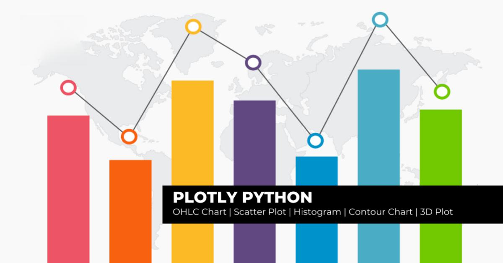

Python has become an increasingly favored language for algorithmic trading, thanks to its simplicity, adaptability, and extensive library ecosystem that supports in-depth financial analytics. Python's ability to handle complex computations efficiently and its large collection of libraries make it exceptionally suited for financial applications, where precise handling of large datasets is crucial. Libraries such as NumPy and Pandas provide powerful tools for data manipulation and statistical analysis, while others like Scikit-learn enable advanced machine learning tasks, all of which are essential for developing sophisticated trading strategies.

Among Python's array of libraries, Plotly is noteworthy for its superior data visualization features. It offers traders the ability to create interactive and dynamic graphs that transform raw data into insightful graphical representations. These advanced visual analytics are invaluable in algorithmic trading, where understanding and interpreting data quickly can significantly impact decision-making and trading outcomes. Plotly supports an extensive range of chart types, including candlesticks and scatter diagrams, that are particularly beneficial for spotting market trends and signals.



This article investigates how the integration of Python and Plotly streamlines the development and visualization of trading strategies. By enhancing the representation of financial data, traders can gain a clearer perspective on market dynamics, improving their ability to design and refine strategies based on visual insights. Through the course of this discussion, we will cover how Python, in conjunction with Plotly, forms a robust framework that not only aids in strategy formulation but also supports real-time, data-driven decision-making processes in algorithmic trading.

## Table of Contents

## Understanding Plotly for Data Visualization

Plotly is a versatile library designed for the creation of interactive and dynamic visualizations. Unlike static graphs, Plotly's interactive charts enable users to explore data points, zoom in for greater details, and filter results in real-time, enhancing the user's ability to analyze complex datasets. This capability is particularly beneficial in fields like finance and trading, where understanding the nuances of data trends and patterns is crucial.

Plotly supports an extensive array of chart types, ranging from basic line and scatter plots to more advanced visualizations such as 3D plots, geographical maps, and candlestick charts. For financial data representation, this diversity allows analysts and traders to select the most effective format to convey their insights, whether it's through a simple line graph mapping price changes over time or a candlestick chart that captures market sentiment and [volatility](/wiki/volatility-trading-strategies).

The utility of visualizations in algorithmic trading cannot be overstated. Charts provide an intuitive means to identify and interpret complex datasets, highlighting trends and anomalies that might not be immediately apparent from raw numerical data. For instance, trend lines on a time series graph can help identify support and resistance levels, while bar charts can illustrate volume shifts corresponding with price changes, aiding in the recognition of bullish or bearish sentiments.

Incorporating Plotly into [algorithmic trading](/wiki/algorithmic-trading) workflows enhances these analytical capabilities. Not only does it allow for the visual inspection of trading strategies, but it also facilitates real-time adjustments to algorithms based on visual feedback from the data. With the ability to render complex, multi-dimensional datasets in a user-friendly format, Plotly serves as an indispensable tool for financial analysts aiming to make informed and timely trading decisions.

## Setting Up Plotly in Python

Installation of Plotly in Python is straightforward and can be achieved using the pip package manager with the command `pip install plotly`. This command will download and install the latest version of Plotly, along with its dependencies, enabling you to leverage its powerful data visualization capabilities for trading strategy analysis.

For rendering charts and graphs, Plotly offers flexible options based on your working environment:

1. **Plotly Offline Plotting in Web Browsers**: By utilizing `plotly.offline.plot`, you can generate static or interactive graphs that render directly in your default web browser. This method is beneficial for cases where you need to share visualizations with colleagues or stakeholders who may not have access to a coding environment.

   Example:
   ```python
   import plotly.graph_objs as go
   from plotly.offline import plot

   # Sample plot
   trace = go.Scatter(x=[1, 2, 3, 4], y=[10, 11, 12, 13])
   plot([trace], filename='simple_plot.html')
   ```

2. **Inline Display in Jupyter Notebooks**: When using Plotly in Jupyter Notebooks, `plotly.offline.iplot` provides an optimal experience for inline displays. This feature is particularly useful for iterative development and analysis, allowing you to interact with the plots directly within the notebook.

   Example:
   ```python
   import plotly.graph_objs as go
   import plotly.offline as py

   py.init_notebook_mode(connected=True)  # Initializes Plotly offline mode for notebooks

   # Sample plot
   trace = go.Bar(x=['A', 'B', 'C'], y=[4, 7, 2])
   py.iplot([trace], filename='simple_bar_chart')
   ```

Plotly's excellent integration with Jupyter Notebooks makes it an ideal tool for prototyping and analyzing trading strategies in an interactive environment. The ability to adjust and update visualizations dynamically helps traders and analysts to explore financial data thoroughly and gain precise insights.

By setting up Plotly in Python, you equip yourself with a robust toolset for visual storytelling that can inform and enhance algorithmic trading decisions.

## Creating Financial Charts with Plotly

To create financial charts with Plotly, the first step involves importing necessary libraries and acquiring financial data. In Python, Pandas is commonly used to handle and manipulate data, and sources such as Yahoo Finance can be utilized to fetch financial datasets. The following Python code snippet demonstrates how to import these libraries and retrieve data:

```python
import pandas as pd
import yfinance as yf  # For more datasets, visit: https://paperswithbacktest.com/datasets

# Fetch historical data for a specific stock from Yahoo Finance
data = yf.download("AAPL", start="2022-01-01", end="2023-01-01")
```

Once the data is acquired, Plotly can be used to visualize it in various formats such as OHLC (open-high-low-close) charts, candlestick patterns, scatter plots, and moving averages. These visualizations play a crucial role in analyzing trading strategies.

An OHLC chart displays the opening, high, low, and closing prices of an asset over a specific timeframe. Similarly, candlestick charts provide a detailed view of price movements, where the body of the candlestick represents the price range between opening and closing, while the wicks represent highs and lows.

Here's an example of creating a candlestick chart using Plotly:

```python
import plotly.graph_objects as go

fig = go.Figure(data=[go.Candlestick(x=data.index,
                open=data['Open'],
                high=data['High'],
                low=data['Low'],
                close=data['Close'])])

fig.update_layout(title='AAPL Candlestick Chart')
fig.show()
```

Scatter plots offer another effective way to visualize relationships between different financial variables. For instance, a scatter plot can be used to observe correlations between stock prices and [volume](/wiki/volume-trading-strategy) traded over time.

Moreover, with Plotly's capabilities, moving averages can be added to charts to help identify trends. The moving average is calculated by taking the average of a subset of data points and is often used to smooth out short-term fluctuations, thereby highlighting longer-term trends.

The following code demonstrates how to add moving averages to a chart:

```python
# Calculate moving averages
data['MA20'] = data['Close'].rolling(window=20).mean()
data['MA50'] = data['Close'].rolling(window=50).mean()

# Plot closing prices and moving averages
fig = go.Figure()
fig.add_trace(go.Scatter(x=data.index, y=data['Close'], mode='lines', name='Close'))
fig.add_trace(go.Scatter(x=data.index, y=data['MA20'], mode='lines', name='MA20'))
fig.add_trace(go.Scatter(x=data.index, y=data['MA50'], mode='lines', name='MA50'))

fig.update_layout(title='AAPL Closing Prices and Moving Averages')
fig.show()
```

Plotly also offers advanced functionality for creating 3D graphs that can illustrate the relationships between multiple financial variables. These graphs can provide deeper insights into the dynamics of financial markets, although they are used less frequently in standard strategy analysis compared to 2D visualizations.

By effectively leveraging Plotly's graphing capabilities, traders and analysts can create comprehensive visualizations that help interpret complex financial data, identify trends, and enhance trading decision-making processes.

## Applying Plotly to Enhance Trading Strategies

In the context of algorithmic trading, visualizations serve as an essential tool for comprehending complex data and automating decision-making processes. One of the primary benefits of using Plotly for visualization is its ability to create interactive charts that facilitate in-depth technical analysis, enabling traders to identify and capitalize on market patterns. Charts such as candlesticks and scatter plots are particularly invaluable as they allow traders to discern prevalent patterns, including but not limited to bull flags and bear trends. 

Candlestick charts are widely used in the financial markets for technical analysis. These charts present each trading session with significant information such as opening, closing, high, and low prices, effectively summarizing the price action and market trends. By visually representing the movement of prices, traders can quickly ascertain market sentiment and potential reversal points. Plotly provides robust tools to create highly customizable candlestick charts, which can dynamically update and reflect real-time trading data.

Scatter plots, another powerful visualization tool, enable traders to plot and examine the relationship between two distinct variables. For instance, plotting the relationship between trading volume and time might reveal patterns not easily observable through raw data analysis. These plots facilitate the recognition of correlations and outliers, which could be critical for refining trading strategies.

Plotly's interactive features elevate its utility further. Traders can zoom in to explore specific data points, employ hover tools to retrieve detailed information, and even filter the visual data according to various parameters. This level of interactivity aids traders in conducting thorough investigations of data, leading to insights that inform and enhance automated trading strategies.

```python
import plotly.graph_objects as go

# Example of creating a candlestick chart
data = go.Candlestick(x=df['Date'],
                      open=df['Open'],
                      high=df['High'],
                      low=df['Low'],
                      close=df['Close'])

layout = go.Layout(title='Candlestick Pattern Example',
                   xaxis_title='Date',
                   yaxis_title='Price',
                   showlegend=True)

fig = go.Figure(data=[data], layout=layout)
fig.show()
```

In summary, by visualizing financial data with Plotly, traders gain a potent means to analyze market conditions, identify patterns, and ultimately enhance their trading strategies. The ability to interact directly with data allows for a deeper comprehension and the development of data-driven strategies that can adapt in real-time, providing a distinct advantage in the fast-paced world of trading.

## Integrating Plotly with Algorithmic Trading Platforms

Platforms like AlgoBulls and [backtesting](/wiki/backtesting) libraries such as Backtrader can effectively leverage Plotly to enhance the visualization and reporting aspects of algorithmic trading strategies. Plotly's flexibility allows it to be seamlessly integrated into these trading platforms, where it can be employed to display both real-time trading activities and historical data crucial for evaluating performance.

By incorporating Plotly in algorithmic trading platforms, traders can visualize real-time trades, facilitating immediate analysis and adjustment of trading strategies. This dynamic capability is vital for traders who need to respond quickly to market fluctuations. For instance, in Python, using a streaming API or WebSocket, you can update graphs in real-time:

```python
import plotly.graph_objects as go
import asyncio

async def update_chart():
    while True:
        # Fetch real-time data
        data = get_real_time_data()  # pseudocode for fetching data
        fig = go.Figure(data=[go.Scatter(x=data['time'], y=data['price'])])
        fig.update_layout(title='Real-time Trading Data')
        fig.show()
        await asyncio.sleep(1)

asyncio.run(update_chart())
```

In backtesting scenarios, Plotly can render historical data, allowing for a thorough examination of past trades and market conditions. This retrospective analysis is instrumental for performance evaluation and strategy improvement. For example, traders can use moving averages or Bollinger Bands plotted over historical price data to assess how their strategies would have performed under various market scenarios.

Furthermore, Plotly's interactive features enhance the exploration of multiple trading scenarios. By enabling the visualization of different market conditions and strategies, traders can conduct a comparative analysis and iteratively optimize their strategies. This process is essential for refining trading algorithms to achieve better performance metrics, such as improved return on investment or minimized drawdown. Through Plotly's capabilities, such as sliders and dropdowns, users can easily adjust parameters and instantly observe the effects on the visualized strategy outcomes, thus facilitating a more informed decision-making process.

Overall, Plotly's integration with algorithmic trading platforms empowers traders with advanced visualization tools, thereby providing valuable insights into their trading strategies and market data. This integration not only aids in the comprehension of complex data sets but also enhances the predictive power of algorithmic models by allowing for detailed, scenario-based analysis.

## Conclusion

Utilizing Python in conjunction with Plotly for algorithmic trading constructs a robust analytical framework that places a strong emphasis on visual-based analysis. The incorporation of Plotly's powerful visualization capabilities facilitates a more profound understanding of trading strategies, enabling traders to interpret and analyze complex financial data with greater clarity. By converting abstract data into intuitive visuals, Plotly allows traders to decipher market patterns and trends quickly, facilitating more informed decision-making processes based on data-driven insights.

Moreover, embracing visualization tools such as Plotly significantly enriches the trading practice by enabling traders to interact with data dynamically, exploring various scenarios and outcomes. This interactivity is crucial in developing adaptive and responsive trading strategies that can be optimized iteratively. With the ability to visualize both real-time trades and historical data, traders can assess performance with precision, identify potential areas for improvement, and ultimately gain a competitive advantage.

Plotly's integration into algorithmic trading workflows complements the analytical power of Python, providing a seamless experience for traders to transform raw data into actionable insights. The combination of Python's computational strength and Plotly's advanced visualization tools offers a comprehensive approach to building algorithmic trading strategies, resulting in enhanced decision-making processes and potentially greater trading success.

## References & Further Reading

[1]: Bergstra, J., Bardenet, R., Bengio, Y., & Kégl, B. (2011). ["Algorithms for Hyper-Parameter Optimization."](https://papers.nips.cc/paper/4443-algorithms-for-hyper-parameter-optimization) Advances in Neural Information Processing Systems 24.

[2]: ["Advances in Financial Machine Learning"](https://www.amazon.com/Advances-Financial-Machine-Learning-Marcos/dp/1119482089) by Marcos Lopez de Prado

[3]: ["Evidence-Based Technical Analysis: Applying the Scientific Method and Statistical Inference to Trading Signals"](https://www.amazon.com/Evidence-Based-Technical-Analysis-Scientific-Statistical/dp/0470008741) by David Aronson

[4]: ["Machine Learning for Algorithmic Trading"](https://github.com/stefan-jansen/machine-learning-for-trading) by Stefan Jansen

[5]: ["Quantitative Trading: How to Build Your Own Algorithmic Trading Business"](https://books.google.com/books/about/Quantitative_Trading.html?id=j70yEAAAQBAJ) by Ernest P. Chan

[6]: Oliphant, T. E. (2006). ["A Guide to NumPy"](http://web.mit.edu/dvp/Public/numpybook.pdf)

[7]: Van Rossum, G., & Drake, F. L. (2009). ["Python 3 Reference Manual"](https://dl.acm.org/doi/book/10.5555/1593511) Python Software Foundation

[8]: McKinney, W. (2010). ["Data Structures for Statistical Computing in Python"](http://conference.scipy.org.s3-website-us-east-1.amazonaws.com/proceedings/scipy2010/pdfs/mckinney.pdf), Proceedings of the 9th Python in Science Conference

[9]: Hunter, J. D. (2007). ["Matplotlib: A 2D Graphics Environment."](https://ieeexplore.ieee.org/document/4160265) Computing in Science & Engineering

[10]: Sheppard, K. (2023). ["Introduction to Python for Econometrics, Statistics and Data Analysis"](https://www.kevinsheppard.com/files/teaching/python/notes/python_introduction_2021.pdf)