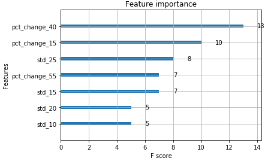

Understanding feature importance is an essential component in the development and optimization of trading models within algorithmic trading. It enables traders and data scientists to pinpoint the factors that exert the most significant influence on the predictions generated by trading algorithms. This article offers a comprehensive examination of plotting feature importance for algorithms used in trading, consequently aiding traders and data scientists in refining and enhancing their models.

Feature importance techniques provide a window into the inner workings of a model, thereby facilitating the refinement of predictive strategies. By dissecting which features contribute the most to a model's decisions, one can gain insights into improving the model's accuracy and efficiency. This understanding is particularly valuable in trading scenarios, where the ability to swiftly adapt predictions based on the moxt relevant indicators is crucial.



Visualizing feature importance allows traders to efficiently evaluate the significance and relevance of a variety of indicators and data inputs. This visualization process is not merely for aesthetic or presentation purposes; it is a critical aspect of examining model performance. Through effective visualization, traders can ascertain which features carry the most weight in their models, leading to informed decision-making and potential modifications to their trading strategies.

Our guide aims to explore various methods for plotting feature importance, each offering unique perspectives and insights into trading model performance. By the end of this article, readers will have a better grasp of how feature importance visualization can significantly enhance their trading decision-making processes. The techniques discussed will be crucial for optimizing predictive strategies, ensuring that models are as effective and efficient as possible.

## Table of Contents

## Importance of Feature Importance in Algorithmic Trading

Feature importance is a critical concept in [algorithmic trading](/wiki/algorithmic-trading), offering a range of benefits that enhance the efficiency and accuracy of trading models. By identifying which inputs have the most significant impact on model predictions, traders can reduce the complexity of their models. This reduction in complexity aids in the creation of more streamlined models that execute faster and are easier to maintain. It also allows traders to focus only on the most impactful variables, thereby optimizing their predictive strategies.

Understanding which features are most relevant is essential for refining trading strategies. With better insight into influential variables, traders can tailor their strategies to leverage these key features, potentially leading to an improvement in prediction accuracy. This optimization results from a heightened focus on the data that matters most, making the trading model more effective and precise.

Feature importance plays a vital role in preventing overfitting, a common issue where models become highly adapted to training data but perform poorly on new, unseen data. By identifying and removing less pertinent features, a model can generalize better to new data, resulting in improved performance across various market conditions. This pruning of irrelevant features contributes to a more robust trading model that is capable of adapting to diverse data scenarios.

Transparency and interpretability are increasingly demanded in modern trading systems, owing to stringent regulatory requirements and risk management policies. Feature importance supports these needs by elucidating how different inputs contribute to a trading model’s decisions. This level of understanding is crucial for aligning models with regulatory standards and for building trust with stakeholders who need clarity on decision-making processes.

Moreover, feature importance assists traders in adapting their models to evolving market conditions by highlighting relevant data signals. Markets are dynamic, and the significance of certain features can shift due to economic events, policy changes, or other factors. By continuously monitoring feature importance, traders can adjust their models to focus on the most relevant features at any given time, thus maintaining their competitive edge.

In summary, the application of feature importance in algorithmic trading contributes significantly to model simplification, enhances predictive accuracy, prevents overfitting, and ensures compliance with regulatory standards. It equips traders with the necessary insights to adapt to rapidly changing market landscapes, thereby supporting robust and sustainable trading strategies.

## Techniques for Calculating Feature Importance

Feature importance is a fundamental concept in [machine learning](/wiki/machine-learning) and [statistics](/wiki/bayesian-statistics), crucial for understanding and optimizing predictive models, especially within algorithmic trading. Understanding which features significantly impact model predictions allows traders to refine their strategies more effectively. Below are prominent techniques employed for calculating feature importance:

### Mean Decrease Impurity (MDI)
MDI is commonly used with decision tree-based algorithms. It calculates the importance of a feature by assessing its contribution to impurity reduction in the model. When a feature is used to split a node, it contributes to reducing the impurity, such as Gini impurity or entropy. The formula for Gini impurity is:

$$
\text{Gini}(A) = 1 - \sum_{i=1}^{n} p_i^2
$$

where $p_i$ is the probability of class $i$ at a node. The decrease in impurity is summed over all trees in the model (if using ensembles like Random Forest), providing an aggregated importance score for each feature. MDI effectively highlights features that frequently contribute to model splits, offering insights into feature relevance.

### Mean Decrease Accuracy (MDA)
MDA evaluates feature importance by observing the change in model accuracy when a feature's values are permuted. This technique involves the following steps:
1. Measure the baseline accuracy of the model.
2. Randomly shuffle the values of a specific feature.
3. Calculate the accuracy of the modified model.
4. The decrease in accuracy indicates the importance of the feature.

MDA is beneficial for gauging the dependency of the model's output on individual features. However, it tends to be more computationally intensive as it requires several permutations and evaluations.

### Single Feature Importance (SFI)
SFI focuses on analyzing each feature independently. It involves constructing a model for each feature in isolation and evaluating its performance in predicting the target variable. The importance score is derived from the individual model's predictive accuracy. This method provides a direct measure of a feature's standalone contribution but may not capture interactions between features. 

### Interpretational Considerations
While these methods provide valuable insights, they necessitate careful interpretation. MDI can be biased towards features with more split potential, whereas MDA and SFI might overlook interactions between features. It is crucial to consider the domain context and utilize a combination of these techniques to gain a comprehensive understanding of feature importance. Additionally, ensuring the reliability of importance assessments involves validating outcomes with real-world data and scenarios, encompassing trading models' dynamic nature.

Incorporating these methods in trading algorithms enables traders to pinpoint critical data inputs, optimize feature selection, and adapt strategies to market fluctuations, ultimately enhancing predictive accuracy and trade performance.

## Visualizing Feature Importance

Visual representation of feature importance is essential in understanding the hierarchy of variables within trading models. Employing methods such as bar charts, scatter plots, and heat maps allows for a clear depiction of how individual features contribute to model predictions. For instance, bar charts can display the relative importance of each variable, often providing an immediate sense of which features drive the trading model's decisions.

Tools like XGBoost facilitate this visualization process significantly by offering built-in functionalities for plotting feature importance. XGBoost's `plot_importance` function ranks features based on their contribution to model accuracy, making it easier to identify which factors are pivotal. This attribute of XGBoost underscores how integrated visualization capacities simplify the analysis phase.

Visualizing feature importance not only clarifies the roles of different variables but also supports quick modifications and strategic adjustments to trading models. For traders aiming to optimize their algorithmic strategies, understanding which variables have the most impact allows for targeted improvements, enhancing model validity and robustness.

Python libraries such as Matplotlib, Seaborn, and Plotly are powerful tools for generating intuitive plots that effectively communicate feature significance. Here's a basic example using Python to create a bar chart of feature importance with XGBoost:

```python
import xgboost as xgb
from matplotlib import pyplot as plt

# Assume `dtrain` is the xgb.DMatrix with the training data
bst = xgb.train(param, dtrain, num_round)
xgb.plot_importance(bst)
plt.show()
```

This snippet demonstrates how simply feature importance can be plotted following a model training process using XGBoost. By engaging such techniques, traders and data scientists can gain actionable insights into which features are truly influencing the output of their algorithms. Consequently, this clarity allows for refining trading strategies to capitalize on the most pertinent data inputs, contributing to superior decision-making and competitiveness in algorithmic trading.

## Implementing Feature Importance in Trading Models

Implementing feature importance in trading models involves leveraging the insights gained from feature importance analysis to optimize predictive strategies and improve trading decisions. The application of these insights focuses on refining trading algorithms to be more efficient, robust, and adaptable to market changes.

### Feature Selection and Resource Optimization

Feature selection is a critical step in enhancing the efficiency and speed of trading algorithms. By identifying and focusing on the most impactful features, traders can reduce the computational resources required for model training and execution. Removing redundant or irrelevant features can lead to faster processing times and lower operational costs, especially in high-frequency trading environments where time is a critical [factor](/wiki/factor-investing).

#### Example Code for Feature Selection

```python
from sklearn.ensemble import RandomForestClassifier
from sklearn.feature_selection import SelectFromModel

# Assume X_train and y_train are the training data and labels
model = RandomForestClassifier(n_estimators=100)
model.fit(X_train, y_train)

# Use feature importances to select features
selector = SelectFromModel(model, prefit=True)
X_train_selected = selector.transform(X_train)

# Print selected feature indices
print(selector.get_support(indices=True))
```

### Continuous Monitoring and Adaptation

Markets are dynamic, with conditions changing due to a multitude of factors such as economic data releases, geopolitical events, and shifts in investor sentiment. As such, the relevance of features used in trading models can vary over time. Continuous monitoring of feature importance is crucial to maintaining model robustness. This involves re-evaluating feature importance at regular intervals or when significant market changes happen, ensuring that trading models remain aligned with the most relevant market signals.

### Practical Implementation in Trading Systems

Real-world trading systems benefit significantly from the integration of feature importance analysis. By continuously updating models based on the latest feature importance metrics, traders can adapt their strategies more effectively. This not only aids in capturing emerging trends but also mitigates risks associated with outdated or irrelevant data inputs. The following steps outline a systematic approach to implementing feature importance:

1. **Regular Recalculation:** Schedule periodic recalculations of feature importance to maintain model relevance.
2. **Automated Feature Updates:** Develop automated systems to update model parameters based on new feature importance assessments.
3. **Scenario Analysis:** Utilize historical data to simulate different market conditions and assess how feature importance metrics shift, guiding adjustments to the model.

### Case Studies

Empirical evidence supports the importance of feature importance in achieving superior returns and managing risks. For instance, model adjustments informed by periodic feature importance analysis have shown improved predictive accuracy and reduced drawdowns. One study demonstrated that by focusing on a select group of macroeconomic indicators—chosen based on their importance ratings—trading systems achieved a notable increase in profitability while exhibiting lower [volatility](/wiki/volatility-trading-strategies).

In conclusion, applying feature importance analysis offers strategic advantages in trading model development. By focusing on the most significant predictors, resource efficiency and model performance improve, providing a competitive edge in the ever-evolving financial markets.

## Conclusion

Plotting feature importance is critical in developing and refining trading models, offering strategic insights that can significantly enhance analytical precision. By visualizing and analyzing which features wield the most influence within a model, traders and data scientists can calibrate their strategies with greater accuracy. This fine-tuning leads to improved model performance, allowing for more precise predictions and informed decision-making in the fast-paced world of trading.

Adopting contemporary computational tools to assess feature importance provides a tangible competitive advantage in algorithmic trading. Tools such as XGBoost, with its built-in feature importance plotting functions, streamline the analysis process, making it easier to incorporate these insights into trading strategies. These technological advancements facilitate a deeper understanding of complex models and the dynamics of financial markets.

The ever-evolving market landscapes and shifting trading data necessitate continuous learning and adaptation. Traders who regularly update their models to reflect new data signals and market trends maintain a strategic edge. The ability to discern and respond to these changes ensures that models remain relevant and effective over time.

Incorporating feature importance strategies fosters the creation of robust and interpretable trading systems. By emphasizing relevant data signals and discarding inconsequential ones, these methodologies help mitigate risks associated with overfitting and improve generalization. The integration of feature importance into trading models ultimately leads to superior returns and a more sustainable approach to managing financial risks.

## References & Further Reading

[1]: Bergstra, J., Bardenet, R., Bengio, Y., & Kégl, B. (2011). ["Algorithms for Hyper-Parameter Optimization."](https://dl.acm.org/doi/10.5555/2986459.2986743) Advances in Neural Information Processing Systems 24.

[2]: ["Advances in Financial Machine Learning"](https://www.amazon.com/Advances-Financial-Machine-Learning-Marcos/dp/1119482089) by Marcos Lopez de Prado

[3]: ["Evidence-Based Technical Analysis: Applying the Scientific Method and Statistical Inference to Trading Signals"](https://www.amazon.com/Evidence-Based-Technical-Analysis-Scientific-Statistical/dp/0470008741) by David Aronson

[4]: ["Machine Learning for Algorithmic Trading"](https://github.com/stefan-jansen/machine-learning-for-trading) by Stefan Jansen

[5]: ["Quantitative Trading: How to Build Your Own Algorithmic Trading Business"](https://books.google.com/books/about/Quantitative_Trading.html?id=j70yEAAAQBAJ) by Ernest P. Chan

[6]: Chen, T., & Guestrin, C. (2016). ["XGBoost: A Scalable Tree Boosting System."](https://arxiv.org/abs/1603.02754) Proceedings of the 22nd ACM SIGKDD International Conference on Knowledge Discovery and Data Mining.

[7]: Breiman, L. (2001). ["Random Forests."](https://link.springer.com/article/10.1023/A:1010933404324) Machine Learning, 45(1), 5-32.