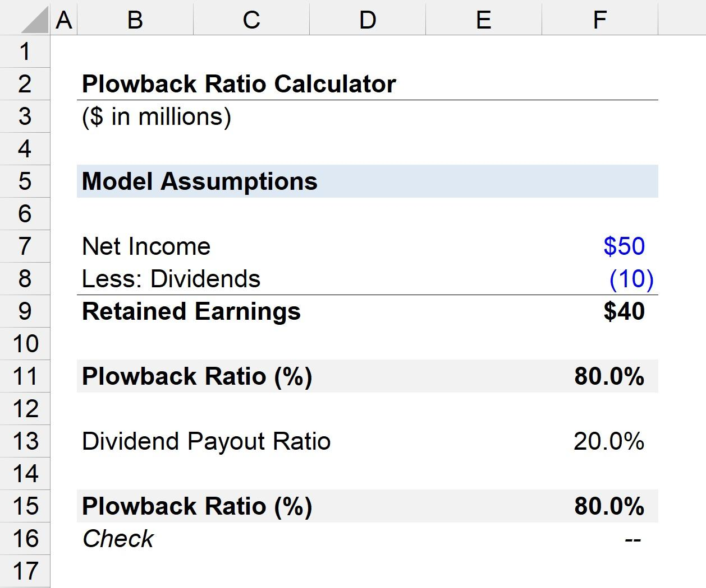

The financial world is filled with numerous metrics that help in evaluating a company's financial health and growth prospects. Among these metrics, the retention ratio and plowback ratio are particularly significant. These terms are often used interchangeably and refer to the proportion of earnings that a company retains for reinvestment rather than distributing as dividends to shareholders. Understanding these ratios is crucial as they provide insight into a company's strategic decisions regarding earnings retention and reinvestment.

The retention ratio and plowback ratio play a vital role for investors and analysts in assessing a company's growth potential and strategic priorities. Companies with high retention or plowback ratios often indicate a focus on expansion and developing new capabilities, aiming for long-term growth. On the other hand, lower ratios may suggest an emphasis on returning profits to shareholders through dividends, often seen in more mature industries.



Furthermore, these metrics are not just limited to traditional financial analysis. They are increasingly being integrated into algorithmic trading strategies. In algorithmic trading, where data-driven decisions are paramount, understanding a company's retention and plowback ratios can help create more sophisticated trading strategies. These ratios are utilized to gauge a company's future performance, enhancing the decision-making process and enabling real-time investment actions.

As we explore these concepts further, the application of retention and plowback ratios in both classical financial analysis and modern algorithmic trading will be highlighted, showcasing their importance as tools for informed investment decisions.

## Table of Contents

## Understanding Retention and Plowback Ratios

The retention ratio serves as a fundamental financial metric to assess a company's strategy of earnings reinvestment. This ratio is calculated to indicate the proportion of net earnings that are not distributed to shareholders as dividends but are instead retained for reinvestment purposes. The computation of the retention ratio may be expressed mathematically as:

$$
\text{Retention Ratio} = \frac{\text{Net Income} - \text{Dividends Paid}}{\text{Net Income}}
$$

Alternatively, it could also be articulated in terms of the dividend payout ratio as:

$$
\text{Retention Ratio} = 1 - \text{Dividend Payout Ratio}
$$

Closely related to this concept is the plowback ratio, often used interchangeably with the retention ratio. The plowback ratio provides a quantifiable measure of the earnings the company decides to keep back for reinvestment after allocating dividends. Both metrics are pivotal in evaluating a company's reinvestment strategy and determining its growth potential. They offer insights into how earnings are managed to fuel future expansions or development projects.

Companies exhibiting high retention or plowback ratios typically emphasize reinvestment strategies, focusing on avenues for growth and expansion. This can often be observed in rapidly growing sectors or companies prioritizing innovation where retained earnings are allocated towards Research and Development (R&D), acquisitions, or scaling production capabilities. Conversely, a lower ratio might suggest that the company favors distributing profits back to shareholders, which can often be seen in mature industries where growth opportunities might be limited. Understanding these ratios helps analysts and investors gauge a company's strategic focus regarding growth and reinvestment priorities.

## Calculation and Interpretation of the Ratios

The retention ratio is a crucial financial metric that measures the portion of a company's net income retained for reinvestment rather than distributed as dividends to shareholders. It is calculated using the formula:

$$
\text{Retention Ratio} = \frac{\text{Net Income} - \text{Dividends}}{\text{Net Income}}
$$

Alternatively, the retention ratio can also be expressed as:

$$
\text{Retention Ratio} = 1 - \text{Dividend Payout Ratio}
$$

Where the Dividend Payout Ratio is the portion of net income paid out as dividends:

$$
\text{Dividend Payout Ratio} = \frac{\text{Dividends}}{\text{Net Income}}
$$

A high retention ratio indicates that a company is prioritizing reinvestment in its operations, which often signals potential growth opportunities and expansion strategies. Companies with high retention ratios are generally focusing on future development, innovation, and increasing operational capacity. This strategy is typical of companies in growth or emerging stages that have opportunities to invest in projects likely to generate higher returns on equity.

Conversely, a low retention ratio suggests that a company is directing a significant portion of net income towards dividends. This approach might reflect a focus on providing steady income to shareholders, which is often characteristic of mature companies operating in stable and saturated markets. These companies opt to reward investors with dividends instead of retaining earnings for growth projects.

The interpretation of retention ratios is nuanced and varies significantly across industries and life cycle stages of companies. For instance, technology companies might exhibit high retention ratios as they reinvest in research and development to sustain rapid innovation cycles. In contrast, utility companies may maintain low retention ratios, as their growth potential is limited, and they instead prioritize stable dividend payouts to satisfy income-focused investors. Thus, evaluating retention ratios requires an understanding of the industry context and the strategic financial goals of the company.

## Significance in Financial Analysis

Retention and plowback ratios serve as critical metrics in financial analysis for determining a company's strategic priorities and potential for growth. A higher retention or plowback ratio typically signals that a company is aggressively reinvesting its earnings into new projects, research and development, or expanding operational capacities. This strategy is often adopted by companies in growing industries or those focusing on scaling quickly.

A high retention ratio suggests that a significant portion of earnings is being put back into the company rather than distributed to shareholders in the form of dividends. For instance, tech companies frequently maintain high retention ratios to fund innovation and capture greater market shares. This reinvestment can lead to enhanced competitive positioning and contribute to substantial long-term growth.

Conversely, a low retention ratio might indicate an emphasis on returning profits directly to shareholders. This approach is characteristic of mature industries and companies with stable cash flows, such as utilities or consumer goods firms. These companies often prioritize dividends to attract investors seeking steady income over capital gains, reflecting a conservative growth strategy focused on maintaining existing operations.

The interpretation of retention and plowback ratios requires consideration of the industry context and the company's life cycle stage. In industries with rapid technological change or significant growth potential, high retention ratios are generally perceived positively. Conversely, in more established sectors where growth opportunities are limited, a lower ratio can be more appropriate.

Overall, these ratios provide investors with insights into a company’s long-term aspirations and strategic focus. They are particularly valuable in assessing how a company plans to allocate its resources, whether towards exploring new opportunities or enhancing shareholder value through dividends. By evaluating these ratios alongside other financial metrics, analysts and investors can gain a comprehensive understanding of a company's future prospects and strategic direction.

## Application in Algorithmic Trading

In [algorithmic trading](/wiki/algorithmic-trading), the retention and plowback ratios are critical indicators of a company's growth potential and financial strategy. These metrics are seamlessly integrated into trading algorithms to identify stocks that are more likely to experience capital appreciation due to strategic reinvestment. 

### Trading Algorithms and Retention Ratios

Trading algorithms often prioritize stocks with high retention ratios as these suggest that a company is directing a substantial portion of its earnings back into the business for expansion and development. High retention ratios can signal robust future growth prospects, making these stocks attractive for traders seeking capital gains. The calculation of retention ratios within algorithms is often automated as follows:

```python
def calculate_retention_ratio(net_income, dividends):
    return (net_income - dividends) / net_income

# Example usage
net_income = 500000  # Example net income
dividends = 50000    # Example dividends paid
retention_ratio = calculate_retention_ratio(net_income, dividends)
```

This formula allows algorithms to quickly assess whether a company's financial actions support growth.

### Adapting to Market Dynamics

These metrics are employed in complex trading strategies that adapt to dynamic market conditions. By continuously evaluating a company's financial data, algorithms can adjust investment strategies to capitalize on emerging opportunities. For instance, a sudden increase in a company's retention ratio may trigger a buy signal within the algorithm, reflecting a shift toward more aggressive growth tactics.

### Real-Time Investment Decisions

The integration of retention and plowback ratios into trading systems enhances real-time decision-making capabilities. Algorithms use these financial metrics as part of a broader data set, combining them with market trends, historical performance, and other economic indicators to refine stock selection. This comprehensive analysis facilitates informed decision-making, aligning investment strategies with companies poised for future growth.

In conclusion, embedding retention and plowback ratios in algorithmic trading systems offers a strategic advantage, enabling algorithms to efficiently identify and exploit growth-oriented investment opportunities.

## Real-World Examples

Tech companies like Meta (formerly Facebook) exemplify how high retention ratios can be integral to a company's strategic approach. Meta invests significantly in research and development, continually channeling retained earnings into projects that drive innovation and expand its market presence. This strategy reflects Meta's emphasis on growth and its commitment to maintaining its competitive edge in the fast-paced tech industry. The constant reinvestment in cutting-edge technologies and new ventures like virtual reality and [artificial intelligence](/wiki/ai-artificial-intelligence) highlights the company's focus on long-term value creation rather than immediate shareholder returns.

On the other hand, utility firms typically exhibit lower retention ratios. These companies, operating in mature industries with stable cash flows, often prioritize returning profits to shareholders through dividends. The focus here is on providing consistent income to shareholders rather than pursuing aggressive expansion. For instance, companies in the utility sector may not require significant reinvestments for growth given the mature nature of their industry, leading to a greater distribution of profits as dividends. This approach aligns with the sector's business model, which emphasizes reliability and shareholder value over rapid growth and reinvestment.

These contrasting examples demonstrate how industry-specific dynamics influence a company’s strategic use of retention and plowback ratios. While tech companies may opt for high retention ratios to fuel innovation and expansion, utility firms might prioritize shareholder returns, illustrating different applications of these financial metrics based on strategic objectives.

## Conclusion

Retention and plowback ratios are essential tools for evaluating a company's growth and financial strategies. These ratios provide vital insights into how a company allocates its earnings, offering a view into its reinvestment strategies and future growth potential. By indicating what portion of earnings is reinvested back into the company, these ratios help assess whether a company is prioritizing expansion or returning profits to shareholders.

However, while retention and plowback ratios offer valuable information, they should not be viewed in isolation. A comprehensive financial analysis requires consideration of other metrics such as cash flow, debt levels, and industry-specific factors. This holistic approach ensures that investors and analysts gain a well-rounded understanding of a company's financial health and strategic focus.

In algorithmic trading, these ratios play a critical role by enhancing decision-making capabilities when combined with other market data and analyses. Trading algorithms, which rely on quantitative measures to make investment decisions, can integrate retention and plowback ratios to refine stock selection and timing strategies. The ability to process and analyze these ratios in real time facilitates adaptive trading strategies that can respond effectively to market dynamics.

The critical takeaway is the significant role retention and plowback ratios play in informing investors and shaping strategic financial decisions. Whether used individually or as part of an integrated set of analyses, these ratios provide meaningful insights that can influence investment choices and strategic planning.

## References & Further Reading

[1]: ["Principles of Financial Economics"](https://assets.cambridge.org/97811070/24120/frontmatter/9781107024120_frontmatter.pdf) by Stephen F. LeRoy and Jan Werner

[2]: Fama, E. F., & French, K. R. (2001). ["Disappearing dividends: Changing firm characteristics or lower propensity to pay?"](https://www.sciencedirect.com/science/article/pii/S0304405X01000381) Journal of Financial Economics, 60(1), 3-43.

[3]: Damodaran, A. (2012). ["Investment Valuation: Tools and Techniques for Determining the Value of Any Asset."](https://books.google.com/books/about/Investment_Valuation.html?id=5SRHAAAAQBAJ) Wiley Finance.

[4]: ["Security Analysis"](https://isecjobs.com/insights/security-analysis-explained/) by Benjamin Graham and David L. Dodd

[5]: He, W., & Calderon, T. G. (2015). ["Quantitative Risk Management and Algorithmic Trading in Financial Markets."](https://onlinelibrary.wiley.com/doi/book/10.1002/9781119080305) IEEE Journal of Selected Topics in Signal Processing, 9(6), 988-1001.