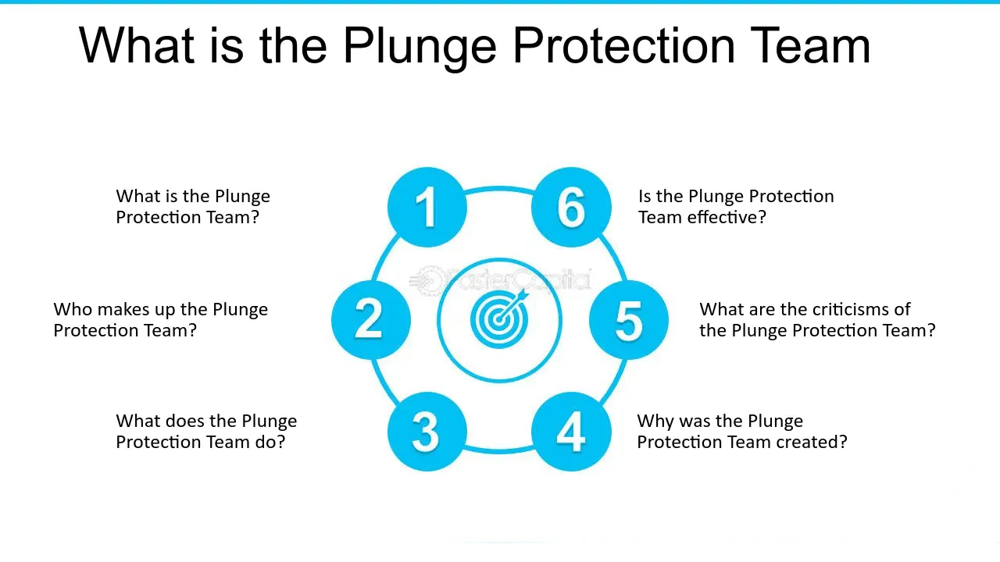

## Table of Contents

## What is the Plunge Protection Team?

The Plunge Protection Team, officially known as the President's Working Group on Financial Markets, is a group set up by the U.S. government to help keep the financial markets stable. It was created after a big stock market crash in 1987. The team includes important people from different parts of the government, like the Treasury Secretary and the heads of the Federal Reserve and the Securities and Exchange Commission. Their main job is to watch the markets and come up with plans to stop big drops in stock prices that could hurt the economy.

Some people think the Plunge Protection Team can step in and buy stocks to stop prices from falling too much. But the team doesn't talk a lot about what they do, so it's not clear if they actually do this. What is clear is that they meet regularly to talk about what's happening in the markets and what they can do to keep things stable. Their goal is to make sure the financial system works well and doesn't cause big problems for people and businesses.

## When was the Plunge Protection Team established?

The Plunge Protection Team, officially called the President's Working Group on Financial Markets, was set up in 1988. This was right after a big stock market crash in 1987 that scared a lot of people. The U.S. government wanted to make sure something like that didn't happen again, so they created this team to watch over the markets and keep them stable.

The team includes important people like the Treasury Secretary, the head of the Federal Reserve, and the head of the Securities and Exchange Commission. They meet regularly to talk about what's going on in the markets and come up with plans to stop big drops in stock prices. Their main goal is to keep the financial system working well so it doesn't cause big problems for people and businesses.

## What is the official name of the Plunge Protection Team?

The official name of the Plunge Protection Team is the President's Working Group on Financial Markets. It was created in 1988 after a big stock market crash in 1987. The U.S. government wanted to make sure the markets stayed stable and didn't cause big problems for people and businesses.

The team includes important people like the Treasury Secretary, the head of the Federal Reserve, and the head of the Securities and Exchange Commission. They meet regularly to talk about what's happening in the markets and come up with plans to stop big drops in stock prices. Their main goal is to keep the financial system working well.

## What is the primary goal of the Plunge Protection Team?

The main goal of the Plunge Protection Team, officially known as the President's Working Group on Financial Markets, is to keep the financial markets stable. They want to stop big drops in stock prices that could hurt the economy. The team was set up after a big stock market crash in 1987, and they work to make sure something like that doesn't happen again.

The team includes important people from the government, like the Treasury Secretary, the head of the Federal Reserve, and the head of the Securities and Exchange Commission. They meet regularly to talk about what's happening in the markets and come up with plans to keep things stable. Their goal is to make sure the financial system works well and doesn't cause big problems for people and businesses.

## Who are the members of the Plunge Protection Team?

The Plunge Protection Team, officially called the President's Working Group on Financial Markets, has some important members. The team is led by the Secretary of the Treasury. This person is in charge of the country's money and works closely with the President. Another key member is the Chair of the Federal Reserve. The Federal Reserve is like the country's central bank, and the Chair helps control things like interest rates and the money supply.

The team also includes the Chair of the Securities and Exchange Commission, or SEC. The SEC makes sure that the stock market is fair and that companies follow the rules. Another member is the Chair of the Commodity Futures Trading Commission, or CFTC. The CFTC looks after markets for things like oil and wheat. These members all work together to watch the markets and come up with plans to keep them stable.

The Plunge Protection Team was set up after a big stock market crash in 1987. Their main job is to stop big drops in stock prices that could hurt the economy. They meet regularly to talk about what's happening in the markets and what they can do to keep things stable. Their goal is to make sure the financial system works well and doesn't cause big problems for people and businesses.

## How does the Plunge Protection Team operate during market crises?

During market crises, the Plunge Protection Team, officially known as the President's Working Group on Financial Markets, works to keep the financial markets stable. They meet more often to talk about what's happening and come up with plans to stop big drops in stock prices. The team includes important people like the Treasury Secretary, the head of the Federal Reserve, and the heads of the Securities and Exchange Commission and the Commodity Futures Trading Commission. They use their knowledge and power to watch the markets closely and figure out what to do to keep things from getting worse.

The team might suggest that the government take steps to calm the markets. For example, they could ask the Federal Reserve to change interest rates or buy bonds to help the economy. They might also work with other countries to make sure everyone is doing what they can to keep the markets stable. The main goal is to stop a crisis from getting out of control and hurting people and businesses. By working together and using their tools, the Plunge Protection Team tries to keep the financial system working well, even during tough times.

## What are some historical examples of the Plunge Protection Team's interventions?

One big example of when the Plunge Protection Team stepped in was during the 2008 financial crisis. The markets were falling fast, and people were really worried. The team, led by the Treasury Secretary and the head of the Federal Reserve, worked hard to stop the crisis from getting worse. They came up with plans to help banks and businesses, like the Troubled Asset Relief Program (TARP), which let the government buy bad loans from banks. This helped calm the markets and stop the big drops in stock prices.

Another time the Plunge Protection Team got involved was during the stock market drop in March 2020, when the COVID-19 pandemic started. The markets were falling because people were scared about the virus and what it would do to the economy. The team met a lot to talk about what to do. They worked with the Federal Reserve to lower interest rates and start buying bonds. This helped put more money into the economy and made people feel a bit better about the markets. By doing these things, the team helped stop the big drops in stock prices and kept the financial system from falling apart.

## How does the Plunge Protection Team's activities impact the stock market?

The Plunge Protection Team, officially called the President's Working Group on Financial Markets, works to keep the stock market stable. When the market starts to fall a lot, the team steps in to stop it from getting worse. They do this by working with the Federal Reserve to change interest rates or buy bonds. This puts more money into the economy and can help calm people down. By doing these things, the team helps stop big drops in stock prices and keeps the market from crashing.

During big crises, like the 2008 financial crisis and the start of the COVID-19 pandemic in 2020, the Plunge Protection Team's actions have been really important. In 2008, they helped create programs like the Troubled Asset Relief Program (TARP) to help banks and businesses. This stopped the market from falling even more. In 2020, they worked to lower interest rates and buy bonds to put more money into the economy. These actions helped people feel better about the market and stopped it from crashing. By stepping in during these tough times, the Plunge Protection Team helps keep the stock market stable and protects people's money.

## What are the criticisms and controversies surrounding the Plunge Protection Team?

Some people don't like the Plunge Protection Team because they think it's not fair. They say the team can step in and buy stocks to stop prices from falling too much, which helps rich people and big investors more than regular people. Critics worry that this makes the market less honest and stops it from working the way it should. They think the team's actions can hide real problems in the economy and make people think everything is okay when it's not.

Another big worry is that the Plunge Protection Team doesn't talk a lot about what they do. This makes people think they might be doing things in secret that could affect the market. Some people believe the team has too much power and that it's not right for the government to step in and control the market like this. They think it's better to let the market go up and down on its own, even if it means there might be big drops sometimes.

## How transparent is the Plunge Protection Team about its operations?

The Plunge Protection Team, officially called the President's Working Group on Financial Markets, is not very open about what they do. They don't share a lot of details about their meetings or the plans they come up with. This makes people think they might be doing things in secret that could affect the market. Because they don't talk much about their work, it's hard for people to know exactly what the team is doing to keep the markets stable.

Some people worry that this lack of openness means the team has too much power. They think it's not fair for the government to step in and control the market without telling everyone what they're doing. Critics believe that if the Plunge Protection Team was more open about their actions, people would trust them more and feel better about the market. But because the team keeps things quiet, it leads to a lot of questions and doubts about what they're really up to.

## What is the legal framework that governs the Plunge Protection Team's actions?

The Plunge Protection Team, officially known as the President's Working Group on Financial Markets, was created by an executive order from President Ronald Reagan in 1988. This order set up the team to help keep the financial markets stable after a big stock market crash in 1987. The team is made up of important people from the government, like the Treasury Secretary and the heads of the Federal Reserve, the Securities and Exchange Commission, and the Commodity Futures Trading Commission. They work together to watch the markets and come up with plans to stop big drops in stock prices that could hurt the economy.

The legal framework that governs the Plunge Protection Team's actions comes from this executive order and the powers of the different agencies involved. For example, the Federal Reserve can change interest rates or buy bonds to help the economy, and the Securities and Exchange Commission can make rules to keep the stock market fair. The team doesn't have its own special laws, but they use the powers of the different agencies to do their job. This means they have to follow the rules and laws that apply to each agency when they take action to keep the markets stable.

## How does the Plunge Protection Team coordinate with other financial regulatory bodies?

The Plunge Protection Team works closely with other financial regulatory bodies to keep the markets stable. They meet regularly with people from the Federal Reserve, the Securities and Exchange Commission, and the Commodity Futures Trading Commission. These meetings help them share information and come up with plans to stop big drops in stock prices. The team uses the powers of these different agencies to do their job. For example, the Federal Reserve can change interest rates or buy bonds, and the Securities and Exchange Commission can make rules to keep the stock market fair.

By working together, the Plunge Protection Team and these other bodies can take quick action during market crises. They talk about what's happening in the markets and what they can do to keep things from getting worse. This teamwork helps them use their different tools and powers to calm the markets and stop big problems. The main goal is to make sure the financial system works well and doesn't cause big issues for people and businesses.

## References & Further Reading

[1]: Blinder, A. S. (2013). ["After the Music Stopped: The Financial Crisis, the Response, and the Work Ahead."](https://www.tandfonline.com/doi/full/10.1080/14697688.2014.949836) Penguin Books.

[2]: ["Too Big to Fail: The Inside Story of How Wall Street and Washington Fought to Save the Financial System—and Themselves"](https://www.amazon.com/Too-Big-Fail-Washington-System/dp/0143118242) by Andrew Ross Sorkin

[3]: Presidential Executive Order 12631: ["Working Group on Financial Markets"](https://www.archives.gov/federal-register/codification/executive-order/12631.html)

[4]: Bernanke, B. S. (2015). ["The Courage to Act: A Memoir of a Crisis and its Aftermath"](https://archive.org/details/couragetoactmemo0000bern) W. W. Norton & Company.

[5]: ["Lords of Finance: The Bankers Who Broke the World"](https://en.wikipedia.org/wiki/Lords_of_Finance) by Liaquat Ahamed

[6]: Platt, E. (2010). ["The Crash That Launched Algorithmic Trading: Lessons from 1987."](https://www.sciencedirect.com/science/article/pii/S2214845013000082) Financial Times.