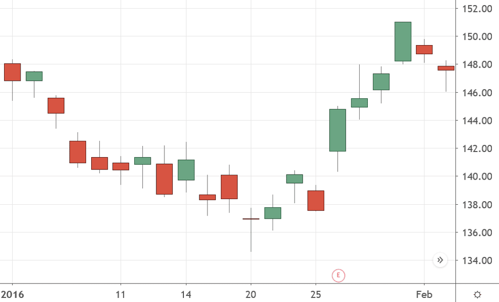

In the fast-evolving world of financial markets, trading regulations are pivotal in ensuring stability and fairness. These regulations encompass a comprehensive framework that governs the operations and behaviors within markets, particularly focusing on stock trading, the plus tick rule, and algorithmic trading. As stock trading forms the backbone of capital markets, specific regulations aim to protect investors and maintain market integrity. The plus tick rule, although historically linked to short-selling limitations, continues to bear significance through its evolved forms, promoting orderly market conditions.

Algorithmic trading, characterized by the use of automated and high-frequency trading strategies, presents unique challenges to traditional regulatory paradigms. The rapid pace of technological advancements compels regulatory bodies to adapt swiftly, addressing issues such as market manipulation and flash crashes. Agencies like the Securities and Exchange Commission (SEC) in the U.S. play a critical role in formulating and enforcing regulations that reflect current market dynamics.

The interaction of these regulatory measures shapes the trading environment by introducing checks and balances while fostering innovation. Traders, investors, and financial professionals must navigate these regulations diligently to succeed in the markets. Understanding the historical context and current practices of trading rules, as well as staying abreast of new developments, is essential for effective market participation. The constant evolution of regulations, driven by technological advancements, underscores the need for ongoing collaboration between regulators and market participants to preemptively address emerging challenges and ensure a robust and transparent trading landscape.

## Table of Contents

## Understanding Stock Trading Regulations

Stock trading operates under a robust regulatory framework designed to safeguard investor interests and uphold market integrity. These regulations are implemented to ensure fair trading practices, enhance transparency, and prevent malpractices such as market manipulation and fraud. In the United States, the Securities and Exchange Commission (SEC) stands as a pivotal authority in enforcing these regulations. Established to protect investors, the SEC oversees the fair operation of securities markets, requiring transparency from public companies through stringent reporting and disclosure requirements.

Additionally, stock exchanges play a crucial role in regulating the trading environment by imposing specific rules that both members and traders must follow. These regulations often cover diverse aspects of trading activities, including listing requirements for companies, trading conduct for brokers, and protocols during times of market volatility.

One of the fundamental components of these regulations involves registration obligations. Companies wishing to trade their stocks on public exchanges must register with relevant securities authorities and adhere to disclosure norms that provide investors with accurate and timely information. This can include financial statements, details of significant shareholders, and executives’ compensation, helping investors make informed decisions.

Furthermore, there are specific trading practices that aim to enhance market fairness. Regulations such as the prohibition of insider trading and rules against deceptive trading practices are examples of efforts to maintain an equitable marketplace. The SEC and other regulators often monitor trading activities to detect suspicious movements, employing advanced technology and data analysis techniques.

Transparency is another critical focus area within stock trading regulations. Regulated firms are required to uphold high standards of disclosure, ensuring that pertinent information is made available to the public. This transparency is crucial in maintaining investor confidence and fostering a stable market environment.

Compliance with these regulations is mandatory for all stakeholders in the stock trading ecosystem, including firms, brokers, and individual traders. Non-compliance can result in substantial penalties, sanctions, and loss of trading privileges, emphasizing the importance of adherence. This regulatory landscape is dynamic, with bodies like the SEC continuously updating and refining rules to address emerging challenges and new financial instruments.

In summary, understanding and conforming to stock trading regulations is essential for the protection of investors and the integrity of financial markets. These rules establish a level playing field, promoting trust and stability in the securities industry.

## The Plus Tick Rule and Its Significance

The plus tick rule, commonly referred to as the uptick rule, was implemented as a regulatory measure to curb short-selling activities in stock markets. Historically, this rule mandated that short sales could only be executed at a price higher than the last sale price, effectively requiring a sequence of positive price movements—or "upticks"—before permitting short-selling transactions. The primary objective of this rule was to prevent short sellers from exacerbating downward pressure on a declining stock, thereby helping to stabilize market conditions.

The original uptick rule was abolished in 2007, based on the premise that markets had evolved and the rule no longer conferred the same protective benefits. However, its legacy continues to be felt in market dynamics, especially in periods of heightened [volatility](/wiki/volatility-trading-strategies). The absence of the rule coincided with increased market instability, particularly during the 2008 financial crisis, leading to renewed discussions about its relevance.

In response to such concerns, the Securities and Exchange Commission (SEC) introduced the alternative uptick rule in 2010. This rule, officially known as Rule 201, activates a short-sale restriction once a stock's price declines by more than 10% from the previous day's closing price. Under this regulation, short sales can only be executed at a price above the current best bid for the remainder of the day and the entire next day. This variant of the uptick rule serves to mitigate excessive volatility and provides a buffer against sharp downward spirals in stock prices, preserving market confidence during tumultuous periods.

The significance of these rules lies in their ability to temper panic-selling and to instill a degree of discipline among market participants, thus contributing to market stability. Although technology and market structures have transformed since the inception of the original uptick rule, the underlying principle of curbing unchecked short-selling remains relevant in modern financial markets.

## Algorithmic Trading: Rules and Regulations

Algorithmic trading has significantly transformed global stock markets, offering efficiency and speed that were previously unimaginable. However, this transformation has introduced complex challenges for regulators, particularly concerning fairness, transparency, and systemic risk management. Key regulatory bodies such as the Financial Industry Regulatory Authority (FINRA) and the Securities and Exchange Commission (SEC) have developed specific rules to address these challenges.

To ensure fairness and transparency, firms engaged in [algorithmic trading](/wiki/algorithmic-trading) are required to implement comprehensive risk management and compliance protocols. These protocols are designed to monitor trading activities proactively and address potential issues before they escalate into systemic risks. Regulations mandate the establishment of supervisory controls, which involve continuous oversight and analysis of algorithmic decisions to ensure that they align with market regulations.

System testing and regular audits are crucial components of these protocols. Firms must conduct rigorous testing of their algorithms under various market conditions to assess their performance and impact. This involves back-testing using historical data to identify possible points of failure or unexpected behavior. Regular audits are mandated to verify compliance with established regulations, ensuring that all practices adhere to the legal framework and do not introduce undue risks to the market.

High-frequency trading ([HFT](/wiki/high-frequency-trading-strategies)), a subset of algorithmic trading characterized by extremely high speeds and large volumes of order executions, presents additional regulatory challenges. The rapid pace and scale of HFT have the potential to disrupt market stability. Consequently, regulatory frameworks require constant updates to address the evolving techniques and strategies employed by HFT firms. This includes implementing circuit breakers and other market controls to prevent flash crashes and other forms of market abuse.

In response to these challenges, the SEC has implemented the Market Access Rule, which requires brokers and dealers to establish risk management controls before providing market access. Additionally, the Consolidated Audit Trail (CAT) is being developed to enhance transparency in the US markets by tracking all transactions, providing regulators with a comprehensive view of market activities.

In summary, while algorithmic trading offers significant advantages in speed and efficiency, it necessitates robust regulatory measures to preserve market integrity. Through rigorous risk management protocols, system testing, audits, and continuous updates to regulatory frameworks, market authorities aim to mitigate the inherent risks and protect investors. This collaborative effort between regulators and financial institutions is crucial to maintaining a fair and stable trading environment.

## The Intersection of Regulations and Technological Advancements

Technological advancements continuously reshape the landscape of financial markets, necessitating adaptive regulations to maintain fairness, transparency, and stability. The rapid evolution of trading technologies, such as algorithmic trading and [artificial intelligence](/wiki/ai-artificial-intelligence) (AI), has not only increased market efficiency but also introduced complex challenges for regulatory bodies. These entities, such as the U.S. Securities and Exchange Commission (SEC) and the Financial Industry Regulatory Authority (FINRA), must strike a balance between fostering innovation and safeguarding investor protection.

Algorithmic trading systems leverage sophisticated mathematical models and high-speed data processing to execute trades at speeds and frequencies far exceeding human capabilities. This technological leap, while enhancing [liquidity](/wiki/liquidity-risk-premium) and reducing spreads, can also exacerbate market volatility and lead to systemic risks, as evidenced by events like the 2010 Flash Crash. Consequently, regulatory frameworks need to incorporate measures that ensure these systems are subject to rigorous testing, real-time monitoring, and fail-safes to prevent runaway trading scenarios.

Regulatory bodies face the challenge of designing rules that accommodate the nuances of AI-driven trading strategies. These rules must address the transparency of algorithmic decision-making processes and incorporate robust risk management and compliance checks. For instance, algorithms that include [machine learning](/wiki/machine-learning) components require ongoing evaluation to ensure they do not inadvertently perpetuate biases or engage in manipulative trading practices.

The pressing need for modernized regulatory frameworks extends to high-frequency trading (HFT), a subset of algorithmic trading characterized by extremely high trading volumes and rapid execution times. HFT has faced scrutiny for potentially destabilizing markets due to its ability to execute vast numbers of orders in fractions of a second, creating a competitive advantage for technologically advanced firms. As such, regulatory oversight is crucial to prevent market manipulation and ensure a level playing field.

To keep pace with technological progress, regulators and financial institutions must collaborate closely. This partnership entails sharing information, conducting joint research on emerging trading technologies, and developing unified strategies to address potential threats. Educational initiatives and consultations with industry experts can also facilitate a more informed regulatory approach, enabling stakeholders to anticipate future challenges and opportunities.

Traders and firms are encouraged to stay abreast of regulatory developments to ensure compliance and mitigate risks associated with non-compliance. Regulatory bodies frequently update guidelines and frameworks in response to technological innovations, and staying informed can prevent legal repercussions and financial losses.

In conclusion, the intersection of regulations and technological advancements in financial markets presents both opportunities and challenges. As technology evolves, so too must the rules that govern market behavior, underscoring the importance of vigilance, cooperation, and continuous adaptation in the regulatory landscape.

## Conclusion

Trading regulations across various domains, including stock trading, the plus tick rule, and algorithmic trading, serve as the fundamental elements that uphold a stable and fair financial market. These regulatory frameworks are crafted to safeguard market participants and ensure integrity throughout the trading processes. It is imperative for traders and investors, irrespective of their level of expertise, to understand and adhere to these regulations. Compliance is not merely a legal obligation but also a critical [factor](/wiki/factor-investing) in minimizing risks associated with trading activities.

As we witness rapid technological advancements, the trading landscape is continually evolving. This progression presents both opportunities and challenges, necessitating a corresponding evolution in regulatory measures to address emerging risks effectively. Maintaining market integrity requires an agile regulatory approach that can proactively adapt to these changes. This dynamic environment underscores the importance of the collaboration between regulatory bodies and financial institutions, allowing for the development and implementation of innovative yet secure trading practices.

Moreover, staying well-informed about regulatory updates is essential for market participants to navigate the complexities that characterize today's financial markets. Engagement with these developments not only aids in ensuring compliance but also provides a strategic advantage in understanding market trends and potential shifts in regulatory policies. By fostering a culture of vigilance and adaptability, both regulators and market participants can contribute to a more transparent and robust financial ecosystem.

## References & Further Reading

[1]: ["Regulation NMS"](https://www.sec.gov/rules-regulations/2005/06/regulation-nms) (2005) by the U.S. Securities and Exchange Commission.

[2]: Kirilenko, Andrei A., Kyle, Albert S., Samadi, Mehrdad, & Tuzun, Tugkan. (2017). ["The Flash Crash: High‐Frequency Trading in an Electronic Market."](https://papers.ssrn.com/sol3/papers.cfm?abstract_id=1686004) The Review of Financial Studies, 30(11), 2221–2222.

[3]: Hasbrouck, Joel. (2007). ["Empirical Market Microstructure: The Institutions, Economics, and Econometrics of Securities Trading"](https://academic.oup.com/book/52241) by Oxford University Press.

[4]: Hendershott, Terrence, & Riordan, Ryan. (2013). ["Algorithmic Trading and the Market for Liquidity."](https://www.jstor.org/stable/43303831) The Review of Financial Studies, 26(3), 715-760.

[5]: Jones, Charles M. (2013). ["What Do We Know About High-Frequency Trading?"](https://www.wsj.com/public/resources/documents/HFT0324.pdf) Columbia Business School Research Paper.